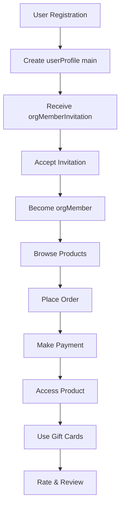
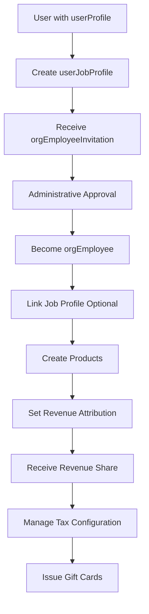
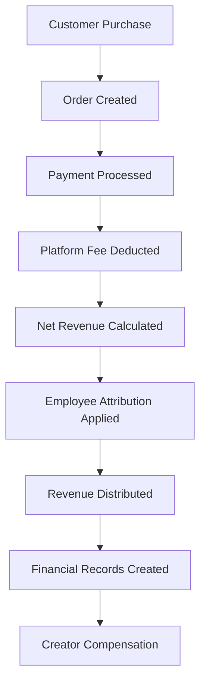
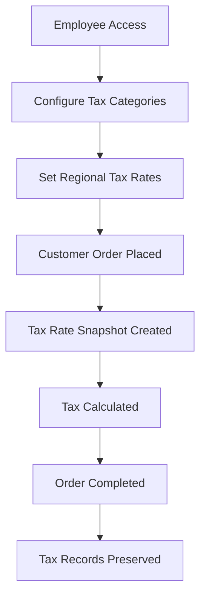

# **📚 Volmify Database Schema Architecture**

## **🎯 What Volmify Is**

### **Platform Vision**
Volmify is a **multi-tenant creator economy platform** that enables organizations to build comprehensive digital businesses combining:
- **Learning Management System (LMS)**: Course creation, enrollment, progress tracking
- **E-commerce Platform**: Product sales, subscriptions, payments, tax management
- **Creator Economy**: Revenue attribution, professional profiles, cross-organizational reputation
- **Enterprise Features**: Employee management, departments, teams, budget authority
- **Professional Marketplace**: Cross-organizational job profiles and skill attribution

### **Core Value Proposition**
Organizations can create, sell, and manage educational content while providing sophisticated employee management and revenue attribution systems that scale from single-creator businesses to enterprise marketplaces.

## **🏗️ Core Architecture Principles**

### **1. Multi-Tenant Foundation**
Every business entity is scoped to an organization (`orgId`) ensuring complete data isolation:
```javascript
// Every table includes orgId for tenant separation
orgProduct.orgId    // Product belongs to specific organization
orgMember.orgId     // Member belongs to specific organization  
orgEmployee.orgId   // Employee belongs to specific organization
```

### **2. Clear Identity Hierarchy**
```
User (platform-wide identity)
├── userProfile (customer identity)
├── userJobProfile (professional identity extending userProfile)
└── userLocale (language preferences)

Organization-Scoped Roles:
├── orgMember (customer/learner role)
└── orgEmployee (staff/creator role, optional job profile link)
```

### **3. Authority Separation Pattern**
- **Members**: Customers and learners (purchase, learn, participate)
- **Employees**: Staff and creators (create content, manage operations, receive attribution)
- **Dual Roles**: Same user can be both member AND employee with separated permissions

### **4. Professional Attribution System**
- Revenue flows to **employees** (creators/staff) based on contribution
- Attribution calculated on **post-platform-fee** amounts for accuracy
- Optional **job profile** integration for cross-organizational reputation

### **5. Sophisticated Constraint Management**
- **Deterministic constraint naming** with PostgreSQL 63-character limit compliance
- **Automated FK helper system** for consistency and maintainability
- **Multi-index and multi-foreign-key utilities** for complex relationships

## **👤 User Management System**

### **Platform Identity (`user`)**
Global user identity that works across all organizations:
```javascript
export const user = table("user", {
  id: textCols.idPk(),
  email: varchar("email", { length: 254 }).unique().notNull(),
  passwordHash: varchar("password_hash", { length: 255 }),
  emailVerifiedAt: timestamp("email_verified_at"),
  lastLoginAt: timestamp("last_login_at"),
  twoFactorEnabledAt: timestamp("two_factor_enabled_at"),
  // ... audit fields
});
```

### **User Profiles (`userProfile`)**
Contextual user profiles supporting multiple professional identities:
```javascript
export const userProfile = table("user_profile", {
  id: textCols.idPk(),
  userId: userIdFkCol().notNull(),
  type: userProfileTypeEnum("type").default("main"), // "main" | "job"
  displayName: varchar("display_name", { length: 100 }).notNull(),
  // ... profile data
});
```

**Profile Types:**
- **`main`**: Primary customer profile (one per user)
- **`job`**: Professional profiles for creator economy (multiple allowed)

### **Professional Profiles (`userJobProfile`)**
Extended professional profiles for creator economy features:
```javascript
export const userJobProfile = table("user_job_profile", {
  id: textCols.idPk(),
  userProfileId: userProfileIdFkCol().notNull(), // Must be type="job"
  title: varchar("title", { length: 100 }).notNull(),
  yearsOfExperience: integer("years_of_experience"),
  hourlyRate: numeric("hourly_rate", { precision: 10, scale: 2 }),
  // ... professional data
});
```

### **Localization (`userLocale`)**
User language preferences with proficiency tracking:
```javascript
export const userLocale = table("user_locale", {
  userId: userIdFkCol().notNull(),
  localeKey: localeKeyFkCol().notNull(),
  proficiency: userLocaleProficiencyEnum("proficiency").notNull(),
  isDefault: boolean("is_default").default(false),
  // ... composite primary key: [userId, localeKey]
});
```

## **🏢 Organization Management**

### **Core Organization (`org`)**
Central organization entity with comprehensive configuration:
```javascript
export const org = table("org", {
  id: textCols.idPk(),
  name: varchar("name", { length: 100 }).notNull(),
  slug: varchar("slug", { length: 50 }).unique().notNull(),
  description: text("description"),
  isActive: boolean("is_active").default(true),
  settings: jsonb("settings"),
  // ... audit fields
});
```

### **Organization Membership (`orgMember`)**
Customer/learner presence within an organization:
```javascript
export const orgMember = table("org_member", {
  id: textCols.idPk(),
  orgId: orgIdFkCol().notNull(),
  userProfileId: userProfileIdFkCol().notNull(), // Must be type="main"
  membershipType: orgMembershipTypeEnum("membership_type").default("learner"),
  joinedAt: timestamp("joined_at").defaultNow(),
  // ... member data
});
```

**Member Types:**
- **`learner`**: Course students and community participants
- **`customer`**: Product purchasers and service users
- **`community_member`**: Free community participants

### **Organization Employees (`orgEmployee`)**
Staff and creator roles with administrative authority:
```javascript
export const orgEmployee = table("org_employee", {
  id: textCols.idPk(),
  orgId: orgIdFkCol().notNull(),
  memberId: memberIdFkCol().notNull(), // Extends member role
  jobProfileId: userJobProfileIdFkCol(), // Optional professional identity
  role: orgEmployeeRoleEnum("role").notNull(),
  hiredAt: timestamp("hired_at").defaultNow(),
  // ... employee data
});
```

**Employee Roles:**
- **`admin`**: Full organizational authority
- **`manager`**: Department/team management
- **`creator`**: Content creation and revenue attribution
- **`staff`**: General operational duties

### **Localization & Regions**
Organization-specific locale and regional configuration:
```javascript
export const orgLocale = table("org_locale", {
  orgId: orgIdFkCol().notNull(),
  localeKey: localeKeyFkCol().notNull(),
  isDefault: boolean("is_default").default(false),
  // ... composite primary key: [orgId, localeKey]
});

export const orgRegion = table("org_region", {
  id: textCols.idPk(),
  orgId: orgIdFkCol().notNull(),
  name: varchar("name", { length: 100 }).notNull(),
  countryCode: varchar("country_code", { length: 2 }).notNull(),
  // ... regional configuration
});
```

## **📚 Product & Content Management**

### **Core Products (`orgProduct`)**
Central product catalog with comprehensive metadata:
```javascript
export const orgProduct = table("org_product", {
  id: textCols.idPk(),
  orgId: orgIdFkCol().notNull(),
  seoMetadataId: seoMetadataIdFkCol().notNull(),
  name: varchar("name", { length: 200 }).notNull(),
  description: text("description"),
  type: orgProductTypeEnum("type").notNull(),
  status: orgProductStatusEnum("status").default("draft"),
  // ... product configuration
});
```

**Product Types:**
- **`course`**: Educational content with lessons and assessments
- **`digital_download`**: Downloadable digital products
- **`service`**: Professional services and consulting
- **`physical`**: Physical products requiring shipping

### **Product Variants (`orgProductVariant`)**
Product variations with pricing and access configurations:
```javascript
export const orgProductVariant = table("org_product_variant", {
  id: textCols.idPk(),
  productId: textCols.idFk("product_id").references(() => orgProduct.id).notNull(),
  name: varchar("name", { length: 100 }).notNull(),
  basePrice: numeric("base_price", { precision: 12, scale: 4 }),
  accessTier: numericCols.accessTier("access_tier"),
  // ... variant configuration
});
```

### **Course Structure**
Hierarchical course organization with modules, sections, and lessons:
```javascript
// Course-specific configuration
export const orgProductCourse = table("org_product_course", {
  productId: textCols.idFk("product_id").references(() => orgProduct.id).primaryKey(),
  duration: integer("duration"), // minutes
  difficulty: orgCourseDifficultyEnum("difficulty"),
  prerequisites: jsonb("prerequisites"),
  // ... course metadata
});

// Course modules (top-level organization)
export const orgProductCourseModule = table("org_product_course_module", {
  id: textCols.idPk(),
  courseProductId: textCols.idFk("course_product_id").references(() => orgProductCourse.productId).notNull(),
  title: varchar("title", { length: 200 }).notNull(),
  description: text("description"),
  sortOrder: integer("sort_order").notNull(),
  // ... module data
});

// Module sections (chapters within modules)
export const orgProductCourseModuleSection = table("org_product_course_module_section", {
  id: textCols.idPk(),
  moduleId: textCols.idFk("module_id").references(() => orgProductCourseModule.id).notNull(),
  title: varchar("title", { length: 200 }).notNull(),
  description: text("description"),
  sortOrder: integer("sort_order").notNull(),
  // ... section data
});

// Section lessons (individual learning units)
export const orgProductCourseModuleSectionLesson = table("org_product_course_module_section_lesson", {
  id: textCols.idPk(),
  sectionId: textCols.idFk("section_id").references(() => orgProductCourseModuleSection.id).notNull(),
  lessonId: textCols.idFk("lesson_id").references(() => orgLesson.id).notNull(),
  sortOrder: integer("sort_order").notNull(),
  requiredAccessTier: numericCols.accessTier("required_access_tier"),
  // ... lesson configuration
});
```

### **Payment Plans**
Sophisticated payment plan system supporting multiple monetization strategies:
```javascript
// Base payment plan
export const orgProductVariantPaymentPlan = table("org_product_variant_payment_plan", {
  id: textCols.idPk(),
  variantId: textCols.idFk("variant_id").references(() => orgProductVariant.id).notNull(),
  type: orgProductVariantPaymentTypeEnum("type").notNull(),
  name: varchar("name", { length: 100 }).notNull(),
  isActive: boolean("is_active").default(true),
  // ... plan configuration
});

// One-time payment configuration
export const orgProductVariantPaymentPlanOneTime = table("org_product_variant_payment_plan_one_time", {
  planId: textCols.idFk("plan_id").references(() => orgProductVariantPaymentPlan.id).primaryKey(),
  price: numeric("price", { precision: 12, scale: 4 }).notNull(),
  allowGiftCards: boolean("allow_gift_cards").default(true),
  // ... one-time payment settings
});

// Subscription payment configuration
export const orgProductVariantPaymentPlanSubscription = table("org_product_variant_payment_plan_subscription", {
  planId: textCols.idFk("plan_id").references(() => orgProductVariantPaymentPlan.id).primaryKey(),
  basePrice: numeric("base_price", { precision: 12, scale: 4 }).notNull(),
  interval: orgSubscriptionIntervalEnum("interval").notNull(),
  intervalCount: integer("interval_count").default(1),
  trialPeriodDays: integer("trial_period_days"),
  // ... subscription settings
});

// Usage-based payment configuration
export const orgProductVariantPaymentPlanUsageBased = table("org_product_variant_payment_plan_usage_based", {
  planId: textCols.idFk("plan_id").references(() => orgProductVariantPaymentPlan.id).primaryKey(),
  basePrice: numeric("base_price", { precision: 12, scale: 4 }),
  usageUnit: varchar("usage_unit", { length: 50 }).notNull(),
  pricePerUnit: numeric("price_per_unit", { precision: 12, scale: 4 }).notNull(),
  includedUnits: integer("included_units").default(0),
  // ... usage-based settings
});
```

**Payment Plan Types:**
- **`one_time`**: Traditional purchase model
- **`subscription`**: Recurring billing model
- **`usage_based`**: Pay-per-consumption model

## **💰 E-commerce & Order Management**

### **Order System (`orgMemberOrder`)**
Comprehensive order management with multi-item support:
```javascript
export const orgMemberOrder = table("org_member_order", {
  id: textCols.idPk(),
  orgId: orgIdFkCol().notNull(),
  memberId: memberIdFkCol().notNull(),
  orderNumber: varchar("order_number", { length: 20 }).unique().notNull(),
  status: orgOrderStatusEnum("status").default("pending"),
  totalAmount: numeric("total_amount", { precision: 12, scale: 4 }).notNull(),
  taxAmount: numeric("tax_amount", { precision: 12, scale: 4 }),
  currencyCode: currencyCodeFkCol().notNull(),
  // ... order data
});

export const orgMemberOrderItem = table("org_member_order_item", {
  id: textCols.idPk(),
  orderId: textCols.idFk("order_id").references(() => orgMemberOrder.id).notNull(),
  variantId: textCols.idFk("variant_id").references(() => orgProductVariant.id).notNull(),
  paymentPlanId: textCols.idFk("payment_plan_id").references(() => orgProductVariantPaymentPlan.id).notNull(),
  quantity: integer("quantity").default(1),
  unitPrice: numeric("unit_price", { precision: 12, scale: 4 }).notNull(),
  lineTotal: numeric("line_total", { precision: 12, scale: 4 }).notNull(),
  // ... item configuration
});
```

**Order Statuses:**
- **`pending`**: Order created, awaiting payment
- **`paid`**: Payment received, processing
- **`fulfilled`**: Order completed, access granted
- **`cancelled`**: Order cancelled
- **`refunded`**: Order refunded

### **Gift Card System**
Employee-managed gift card issuance with member usage tracking:
```javascript
export const orgGiftCard = table("org_gift_card", {
  id: textCols.idPk(),
  orgId: orgIdFkCol().notNull(),
  code: varchar("code", { length: 20 }).unique().notNull(),
  initialAmount: numeric("initial_amount", { precision: 12, scale: 4 }).notNull(),
  currentBalance: numeric("current_balance", { precision: 12, scale: 4 }).notNull(),
  issuedByEmployeeId: employeeIdFkCol().notNull(),
  expiresAt: timestamp("expires_at"),
  // ... gift card data
});

export const orgMemberGiftCardUsage = table("org_member_gift_card_usage", {
  id: textCols.idPk(),
  giftCardId: textCols.idFk("gift_card_id").references(() => orgGiftCard.id).notNull(),
  memberId: memberIdFkCol().notNull(),
  orderId: textCols.idFk("order_id").references(() => orgMemberOrder.id).notNull(),
  amountUsed: numeric("amount_used", { precision: 12, scale: 4 }).notNull(),
  usedAt: timestamp("used_at").defaultNow(),
  // ... usage tracking
});
```

## **💼 Creator Economy & Revenue Attribution**

### **Employee Product Attribution**
Revenue attribution system linking employees to products they create or manage:
```javascript
export const orgEmployeeProductAttribution = table("org_employee_product_attribution", {
  id: textCols.idPk(),
  orgId: orgIdFkCol().notNull(),
  employeeId: employeeIdFkCol().notNull(),
  productId: textCols.idFk("product_id").references(() => orgProduct.id).notNull(),
  revenueSharePercentage: numeric("revenue_share_percentage", { precision: 5, scale: 2 }).notNull(),
  attributionType: orgAttributionTypeEnum("attribution_type").notNull(),
  effectiveFrom: timestamp("effective_from").defaultNow(),
  effectiveTo: timestamp("effective_to"),
  // ... attribution configuration
});
```

**Attribution Types:**
- **`creator`**: Primary content creator
- **`collaborator`**: Contributing team member
- **`manager`**: Project manager or supervisor
- **`reviewer`**: Quality assurance and review

### **Revenue Calculation & Distribution**
Post-platform-fee revenue distribution to attributed employees:
```javascript
export const orgEmployeeProductAttributionRevenue = table("org_employee_product_attribution_revenue", {
  id: textCols.idPk(),
  attributionId: textCols.idFk("attribution_id").references(() => orgEmployeeProductAttribution.id).notNull(),
  orderItemId: textCols.idFk("order_item_id").references(() => orgMemberOrderItem.id).notNull(),
  grossRevenue: numeric("gross_revenue", { precision: 12, scale: 4 }).notNull(),
  platformFee: numeric("platform_fee", { precision: 12, scale: 4 }).notNull(),
  netRevenue: numeric("net_revenue", { precision: 12, scale: 4 }).notNull(),
  attributedRevenue: numeric("attributed_revenue", { precision: 12, scale: 4 }).notNull(),
  calculatedAt: timestamp("calculated_at").defaultNow(),
  // ... revenue tracking
});
```

**Revenue Flow:**
```
Customer Payment ($100)
├── Platform Fee (5%): $5
├── Processing Fee (3%): $3
├── Tax (8%): $8
└── Net Revenue: $84

Attribution (70% of $84): $58.80 → Employee
Remaining (30% of $84): $25.20 → Organization
```

### **Product Revenue Pool**
Ensures 100% revenue allocation across all attributions:
```javascript
export const orgProductRevenuePool = table("org_product_revenue_pool", {
  id: textCols.idPk(),
  orgId: orgIdFkCol().notNull(),
  productId: textCols.idFk("product_id").references(() => orgProduct.id).notNull(),
  totalAllocationPercentage: numeric("total_allocation_percentage", { precision: 5, scale: 2 }).notNull(),
  lastAllocationByEmployeeId: employeeIdFkCol().notNull(),
  lastAllocationAt: timestamp("last_allocation_at").defaultNow(),
  // ... allocation tracking
});
```

## **🏛️ Tax Management System**

### **Tax Categories & Rates**
Employee-managed tax configuration with historical tracking:
```javascript
export const orgTaxCategory = table("org_tax_category", {
  id: textCols.idPk(),
  orgId: orgIdFkCol().notNull(),
  code: textCols.code().notNull(),
  name: varchar("name", { length: 100 }).notNull(),
  description: text("description"),
  // ... category configuration
});

export const orgTaxRate = table("org_tax_rate", {
  id: textCols.idPk(),
  orgId: orgIdFkCol().notNull(),
  taxCategoryId: textCols.idFk("tax_category_id").references(() => orgTaxCategory.id).notNull(),
  regionId: textCols.idFk("region_id").references(() => orgRegion.id).notNull(),
  type: orgTaxRateTypeEnum("type").notNull(),
  rate: numeric("rate", { precision: 5, scale: 4 }),
  amount: numeric("amount", { precision: 12, scale: 4 }),
  effectiveFrom: timestamp("effective_from").defaultNow(),
  effectiveTo: timestamp("effective_to"),
  // ... rate configuration
});
```

**Tax Rate Types:**
- **`percent`**: Percentage-based tax (rate field used)
- **`fixed`**: Fixed amount tax (amount field used)

### **Tax Rate Snapshots**
Point-in-time tax rate preservation for order compliance:
```javascript
export const orgTaxRateSnapshot = table("org_tax_rate_snapshot", {
  id: textCols.idPk(),
  orgId: orgIdFkCol().notNull(),
  originalTaxRateId: textCols.idFk("original_tax_rate_id").references(() => orgTaxRate.id).notNull(),
  orderId: textCols.idFk("order_id").references(() => orgMemberOrder.id).notNull(),
  byEmployeeId: employeeIdFkCol().notNull(),
  snapshotData: jsonb("snapshot_data").notNull(),
  createdAt: temporalCols.audit.createdAt(),
  // ... snapshot metadata
});
```

## **🔐 Invitation & Access Management**

### **Member Invitations**
Simple customer onboarding with direct acceptance:
```javascript
export const orgMemberInvitation = table("org_member_invitation", {
  id: textCols.idPk(),
  orgId: orgIdFkCol().notNull(),
  email: varchar("email", { length: 254 }).notNull(),
  type: invitationTypeEnum("type").default("learner"),
  status: orgMemberInvitationStatusEnum("status").default("pending"),
  token: varchar("token", { length: 64 }).unique().notNull(),
  expiresAt: timestamp("expires_at").notNull(),
  acceptedAt: timestamp("accepted_at"),
  // ... invitation data
});
```

### **Employee Invitations**
Staff recruitment with administrative approval workflow:
```javascript
export const orgEmployeeInvitation = table("org_employee_invitation", {
  id: textCols.idPk(),
  orgId: orgIdFkCol().notNull(),
  email: varchar("email", { length: 254 }).notNull(),
  role: orgEmployeeRoleEnum("role").notNull(),
  status: orgEmployeeInvitationStatusEnum("status").default("pending"),
  invitedByEmployeeId: employeeIdFkCol().notNull(),
  approvedByEmployeeId: employeeIdFkCol(),
  token: varchar("token", { length: 64 }).unique().notNull(),
  expiresAt: timestamp("expires_at").notNull(),
  // ... invitation data
});
```

**Invitation Statuses:**
- **`pending`**: Invitation sent, awaiting response
- **`accepted`**: Invitation accepted by recipient
- **`declined`**: Invitation declined by recipient
- **`expired`**: Invitation expired before response
- **`cancelled`**: Invitation cancelled by sender

## **💳 Financial System**

### **Account Management**
Chart of accounts for organizational financial tracking:
```javascript
export const account = table("account", {
  id: textCols.idPk(),
  orgId: orgIdFkCol().notNull(),
  employeeId: employeeIdFkCol(),
  name: varchar("name", { length: 256 }).notNull(),
  description: varchar("description", { length: 1536 }).notNull(),
  type: accountTypeEnum("type").notNull(),
  normalBalance: balanceTypeEnum("normal_balance").notNull(),
  currentBalance: numeric("current_balance", { precision: 12, scale: 4 }).default("0.00"),
  currencyCode: currencyCodeFkCol().notNull(),
  isSystem: boolean("is_system").default(false),
  isActive: boolean("is_active").default(true),
  // ... account configuration
});
```

**Account Types:**
- **`asset`**: Cash, receivables, inventory
- **`liability`**: Payables, loans, deferred revenue
- **`equity`**: Owner's equity, retained earnings
- **`revenue`**: Sales, service revenue
- **`expense`**: Operating costs, salaries

## **🌍 Internationalization & SEO**

### **Locale & Currency Management**
Platform-wide localization configuration:
```javascript
export const locale = table("locale", {
  key: varchar("key", { length: 10 }).primaryKey(),
  name: varchar("name", { length: 100 }).notNull(),
  nativeName: varchar("native_name", { length: 100 }).notNull(),
  languageCode: varchar("language_code", { length: 2 }).notNull(),
  countryCode: varchar("country_code", { length: 2 }),
  isActive: boolean("is_active").default(true),
  // ... locale configuration
});

export const currency = table("currency", {
  code: varchar("code", { length: 3 }).primaryKey(),
  name: varchar("name", { length: 50 }).notNull(),
  symbol: varchar("symbol", { length: 5 }).notNull(),
  decimalPlaces: integer("decimal_places").default(2),
  isActive: boolean("is_active").default(true),
  // ... currency configuration
});
```

### **SEO Metadata System**
Comprehensive SEO management for all content:
```javascript
export const seoMetadata = table("seo_metadata", {
  id: textCols.idPk(),
  title: varchar("title", { length: 60 }),
  description: varchar("description", { length: 160 }),
  keywords: varchar("keywords", { length: 255 }),
  canonicalUrl: varchar("canonical_url", { length: 255 }),
  robotsDirective: varchar("robots_directive", { length: 50 }).default("index,follow"),
  // ... SEO configuration
});

export const seoMetadataOpenGraph = table("seo_metadata_open_graph", {
  seoMetadataId: textCols.idFk("seo_metadata_id").references(() => seoMetadata.id).primaryKey(),
  title: varchar("title", { length: 95 }),
  description: varchar("description", { length: 300 }),
  imageUrl: varchar("image_url", { length: 255 }),
  imageAlt: varchar("image_alt", { length: 125 }),
  type: varchar("type", { length: 20 }).default("website"),
  // ... Open Graph configuration
});
```

## **🛠️ Schema Helper System**

### **Foreign Key Utilities**
Automated FK helper generation for consistency:
```javascript
// buildFkUtils creates consistent FK column and constraint helpers
export const { fkCol: orgIdFkCol, extraConfig: orgIdFkExtraConfig } = buildFkUtils({
  cacheKey: "org",
  defaultColKey: "orgId",
  defaultColName: "org_id",
  getTable: () => require("#db/schema/org/schema.js").org,
  getRefColumns: (table) => [table.id],
  defaultOnDelete: "cascade",
});

// Usage in table definitions:
export const orgProduct = table("org_product", {
  id: textCols.idPk(),
  orgId: orgIdFkCol().notNull(),
  // ... other columns
}, (cols) => [
  ...orgIdFkExtraConfig({ tName: "org_product", cols }),
  // ... other constraints
]);
```

### **Multi-Index & Multi-FK Helpers**
Simplified constraint definition for complex relationships:
```javascript
// Multi-index helper for consistent index creation
...multiIndexes({
  tName: "user_profile",
  colsGrps: [
    { cols: [cols.userId] },
    { cols: [cols.type] },
    { cols: [cols.createdAt] },
    { cols: [cols.lastUpdatedAt] },
  ],
}),

// Multi-foreign-key helper for relationship management
...multiForeignKeys({
  tName: "org_member_order_item",
  fkGroups: [
    {
      cols: [cols.orderId],
      foreignColumns: [orgMemberOrder.id],
      afterBuild: (fk) => fk.onDelete("cascade"),
    },
    {
      cols: [cols.variantId],
      foreignColumns: [orgProductVariant.id],
      afterBuild: (fk) => fk.onDelete("restrict"),
    },
  ],
}),
```

### **Constraint Naming Strategy**
Deterministic constraint naming with PostgreSQL compliance:
```javascript
// Automated constraint naming that handles 63-character limit
const buildConstraintName = (prefix, tableName, columns) => {
  const cleanTableName = toCamelCase(createAbbreviation(tableName));
  const cleanColumnNames = columns
    .map((col) => toCamelCase(createAbbreviation(col.name)))
    .join("_");
  return shortenConstraintName(`${prefix}_${cleanTableName}_${cleanColumnNames}`);
};

// Results in consistent, collision-free constraint names:
// fk_orgProd_orgId_12a34b56
// uq_orgMemOrder_orderNum_78c90d12
// idx_userProf_userId_ef34ab56
```

## **📊 Schema Organization Structure**

```
📂 apps/volmify-main-server/src/db/schema/
│
├── 📂 _utils/                     # Schema utilities and helpers
│   ├── build-fk-utils.js         # Automated FK helper generation
│   ├── helpers.js                # Core schema utilities
│   ├── shorten-str.js            # String shortening for constraints
│   └── 📂 cols/                  # Column type definitions
│       ├── 📂 shared/            # Shared column utilities
│       │   └── 📂 foreign-keys/  # FK column helpers
│       ├── 📂 temporal/          # Timestamp columns
│       ├── 📂 text/              # Text-based columns
│       └── 📂 numeric/           # Numeric columns
│
├── 📂 general/                    # Platform-wide entities
│   ├── 📂 locale-and-currency/   # Localization & currency
│   ├── 📂 seo/                   # SEO metadata system
│   ├── 📂 skill/                 # Platform skill taxonomy
│   └── 📂 contact-info/          # Contact management
│
├── 📂 user/                       # User domain (global identity)
│   ├── schema.js                 # Core user entity
│   ├── relations.js              # User relationships
│   ├── 📂 locale/                # User localization
│   │   ├── schema.js             # User locale preferences
│   │   └── relations.js          # Locale relationships
│   └── 📂 profile/               # User profiles
│       ├── schema.js             # User profile management
│       ├── relations.js          # Profile relationships
│       ├── 📂 contact-info/      # Profile contact info
│       └── 📂 job/               # Professional job profiles
│           ├── schema.js         # Job profile entities
│           └── relations.js      # Job relationships
│
├── 📂 org/                        # Organization domain
│   ├── schema.js                 # Core organization entity
│   ├── relations.js              # Organization relationships
│   ├── 📂 locale-region/         # Org localization
│   ├── 📂 tax/                   # Tax management
│   ├── 📂 funnel/                # Sales funnel management
│   ├── 📂 member/                # Organization membership
│   │   ├── schema.js             # Member management
│   │   ├── relations.js          # Member relationships
│   │   ├── 📂 invitation/        # Member invitations
│   │   └── 📂 employee/          # Employee management
│   │       ├── schema.js         # Employee entities
│   │       ├── relations.js      # Employee relationships
│   │       └── 📂 invitation/    # Employee invitations
│   └── 📂 product/               # Product catalog
│       ├── schema.js             # Core product entities
│       ├── relations.js          # Product relationships
│       ├── 📂 collection/        # Product collections
│       ├── 📂 payment/           # Payment plans
│       ├── 📂 orders/            # Order management
│       └── 📂 by-type/          # Product-type specific
│           └── 📂 course/        # Course products
│               ├── schema.js     # Course structure
│               └── relations.js  # Course relationships
│
├── 📂 account/                    # Financial system
│   ├── schema.js                 # Accounting entities
│   └── relations.js              # Financial relationships
│
└── 📂 index.js                   # Schema exports
```

## **🔄 Key Business Workflows**

### **Customer Journey (Member)**


### **Creator Journey (Employee)**


### **Revenue Attribution Flow**


### **Tax Management Workflow**


## **🎯 Key Architecture Benefits**

### **1. Clean Authority Separation**
- **Members**: Customer activities (purchase, learn, gift card usage)
- **Employees**: Administrative activities (create content, manage tax, issue gift cards)
- **Dual Roles**: Users can be both with clearly separated permissions

### **2. Professional Attribution System**
- **Post-platform-fee calculations** ensure accurate creator compensation
- **Optional job profile integration** enables cross-organizational reputation
- **Flexible attribution percentages** per product per employee
- **Complete audit trail** from gross revenue to final creator payment

### **3. Sophisticated Constraint Management**
- **Automated FK helpers** ensure consistency across schema
- **Deterministic naming** with PostgreSQL 63-character compliance
- **Multi-index utilities** simplify complex relationship definitions
- **Constraint registry** for debugging and maintenance

### **4. Multi-Tenant Foundation**
- **Complete data isolation** via `orgId` scoping
- **Scalable architecture** supports unlimited organizations
- **Professional identity spanning** multiple organizations via job profiles
- **Cross-organizational reputation** tracking for marketplace features

### **5. Comprehensive Financial System**
- **Double-entry accounting** principles for accuracy
- **Multi-currency support** for global operations
- **Tax compliance** with historical rate preservation
- **Revenue attribution** with platform fee handling

## **🚀 Development Quick Start**

### **Understanding the Schema Architecture**

1. **Identity Hierarchy**
   ```javascript
   user → userProfile (main) → orgMember → customer activities
   user → userProfile (job) → userJobProfile → orgEmployee → professional activities
   ```

2. **Authority Patterns**
   ```javascript
   // Customer activities (any member)
   orgMemberOrder → customer purchases
   orgMemberGiftCardUsage → gift card usage
   
   // Administrative activities (employees only)
   orgGiftCard.issuedByEmployeeId → gift card issuance
   orgTaxRateSnapshot.byEmployeeId → tax management
   orgEmployeeProductAttribution → revenue attribution
   ```

3. **Foreign Key Patterns**
   ```javascript
   // Use FK helpers for consistency
   orgId: orgIdFkCol().notNull(),
   // Apply FK constraints via extraConfig
   ...orgIdFkExtraConfig({ tName: tableName, cols }),
   ```

4. **Revenue Attribution Logic**
   ```javascript
   Customer Payment → Platform Fee → Net Revenue → Employee Attribution → Creator Compensation
   ```

### **Common Development Patterns**

```javascript
// Table definition with FK helpers
export const orgProduct = table("org_product", {
  id: textCols.idPk(),
  orgId: orgIdFkCol().notNull(),
  seoMetadataId: seoMetadataIdFkCol().notNull(),
  name: varchar("name", { length: 200 }).notNull(),
  // ... other columns
}, (cols) => [
  // Apply FK constraints and indexes
  ...orgIdFkExtraConfig({ tName: "org_product", cols }),
  ...seoMetadataIdFkExtraConfig({ tName: "org_product", cols }),
  
  // Add custom constraints
  uniqueIndex({ tName: "org_product", cols: [cols.orgId, cols.slug] }),
  
  // Add multiple indexes efficiently
  ...multiIndexes({
    tName: "org_product",
    colsGrps: [
      { cols: [cols.status] },
      { cols: [cols.type] },
      { cols: [cols.createdAt] },
    ],
  }),
]);
```

### **Key Development Guidelines**

1. **Always use FK helpers** for foreign key columns and constraints
2. **Apply extraConfig** for every foreign key relationship
3. **Use multiIndexes** for multiple single-column indexes
4. **Follow authority separation** between member and employee activities
5. **Calculate revenue attribution** on post-platform-fee amounts
6. **Preserve audit trails** with proper timestamp and employee attribution
7. **Ensure constraint names** stay under PostgreSQL's 63-character limit

## **📈 Future Extensibility**

### **Marketplace Evolution**
The architecture supports scaling into a comprehensive marketplace:
- **Cross-organizational job profiles** enable freelance and contract work
- **Professional reputation tracking** follows creators across organizations
- **Flexible revenue attribution** supports complex creator partnerships
- **Sophisticated tax management** handles multi-jurisdictional compliance

### **Enterprise Features**
Built for enterprise-scale deployment:
- **Department and team structures** with budget authority hierarchy
- **Approval workflows** for employee onboarding and content management
- **Financial compliance** with double-entry accounting and audit trails
- **Multi-currency operations** for global business requirements

### **Creator Economy Platform**
Designed for the modern creator economy:
- **Multiple revenue streams** (courses, consulting, digital products)
- **Professional attribution** with cross-organizational tracking
- **Sophisticated payment plans** (one-time, subscription, usage-based)
- **Gift card system** for customer acquisition and retention

This schema architecture transforms Volmify from a basic LMS into a comprehensive creator economy platform with enterprise-grade financial management, sophisticated revenue attribution, and scalable multi-tenant architecture that can grow from individual creators to large marketplace operations.
