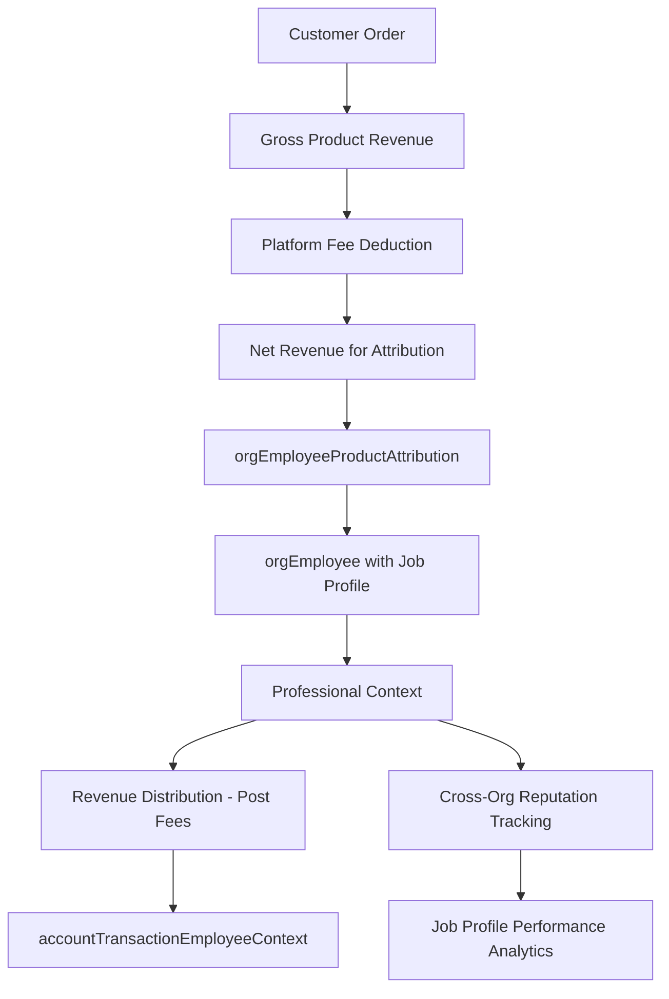
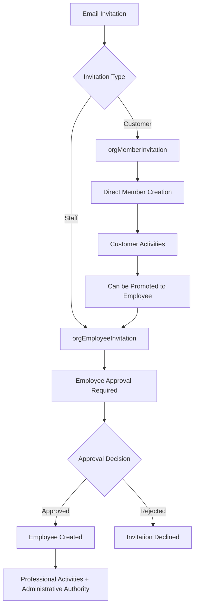
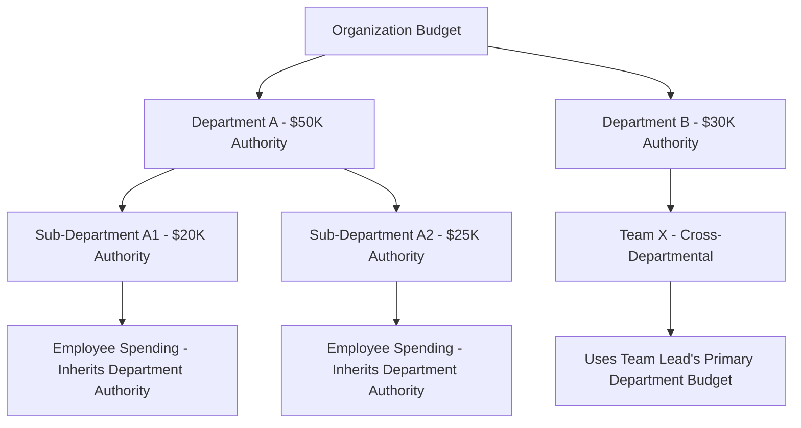

# **📚 Volmify Database Schema Overview**

## **🎓 What Volmify Is**

### **Primary Purpose**
Volmify is a comprehensive **creator economy platform** that combines learning management, e-commerce, and professional marketplace capabilities. It enables organizations to create, sell, and manage educational content while providing sophisticated employee management and revenue attribution systems.

### **Core Capabilities**
- **Learning Management System (LMS)**: Course creation, enrollment, progress tracking
- **E-commerce Platform**: Product sales, subscriptions, gift cards, payment processing  
- **Creator Economy**: Revenue attribution, professional profiles, compensation management
- **Employee Management**: Staff onboarding, department organization, approval workflows
- **Professional Marketplace**: Cross-organizational job profiles, skill attribution, reputation systems
- **Advanced Financial System**: Double-entry accounting with multi-context CTI access for marketplace-scale performance

## **🏗 Core Architecture Principles**

### **Multi-Tenant Foundation**
Every entity in Volmify is scoped to an organization (`orgId`), ensuring complete data isolation and supporting multiple independent tenants on the same platform.

### **User Identity Hierarchy**
```
User (platform identity)
├── userProfile (main) - base customer profile  
├── userProfile (job) - professional profiles extending main profile
└── userLocale - language preferences with proficiency levels

orgMember (tenant-scoped customer/learner)
└── orgEmployee (enhanced staff role with optional job profile link)
```

### **Role Separation & Authority Levels**
- **Members**: Customers and learners who place orders, enroll in courses, participate in community
- **Employees**: Staff and creators who create content, receive revenue attribution, manage operations
- **Same user can be both**: Member (customer) AND employee (creator) within the same organization
- **Authority Hierarchy**: Employees have administrative authority over organizational operations, while maintaining member privileges for customer activities

### **Class Table Inheritance (CTI)**
Financial transactions use CTI for multi-context access, enabling O(log n) performance with indexed lookups for user transaction queries regardless of organizational complexity.

### **Multi-Context Access**
Single transactions are accessible through multiple entity contexts (user, employee, member, organization) with appropriate permission scoping and O(log n) indexed performance.

## **👤 User Management System**

### **Platform Identity**
- **`user`**: Universal identity across the entire platform - cross-tenant, login-capable, globally unique
- **`userProfile`**: User's contextual profiles - one main profile (customer identity) and multiple job profiles (professional identities extending main profile)
- **`userJobProfile`**: Professional profiles that extend userProfile, work across organizations, enabling reputation and skill tracking

### **User Profile Architecture Logic**
```javascript
// Clear Identity Separation:
user → userProfile (main customer identity)
user → userProfile (job) → userJobProfile (professional extension of userProfile)

// Organizational Context:
orgMember.userProfileId → userProfile (main)     // Customer context
orgEmployee.jobProfileId → userJobProfile        // Professional context (extends userProfile)

// API-Level Enforcement:
// userJobProfile validation ensures it extends from userProfile of same user
// This maintains referential integrity while enabling professional context
```

### **Localization & Preferences**
- **`userLocale`**: User language preferences with proficiency levels
- **`userLocaleProficiency`**: Skill levels (native, fluent, conversational, basic)
- **Multi-Language Support**: Platform-wide internationalization framework

### **Tenant-Scoped Identity**
- **`orgMember`**: User's presence within a specific organization as customer/learner
- **`orgEmployee`**: Optional upgrade to staff role with organizational duties and professional attribution
- **`orgMemberInvitation`**: Customer onboarding workflow (simple acceptance)
- **`orgEmployeeInvitation`**: Staff recruitment with administrative approval processes

## **🏢 Organization Management**

### **Organizational Structure**
- **`org`**: Core organization entity with settings, branding, and configuration
- **`orgDepartment`**: Organizational divisions for employee structure with budget authority
- **`orgTeam`**: Project-based teams for collaboration across departments
- **`orgEmployeeDepartmentMembership`**: Employee assignment to departments with professional context
- **`orgEmployeeTeamMembership`**: Employee participation in teams with work roles

### **Budget Authority & Hierarchy**
```javascript
// Department Budget Hierarchy Rules:
orgDepartment.budgetAuthority       // Department-level budget control
orgDepartment.parentDepartmentId    // Hierarchical structure

// Budget Inheritance Logic:
// - Child departments cannot exceed parent department budget limits
// - Employee spending authority inherits from primary department assignment
// - Cross-departmental teams use team lead's primary department budget authority
// - Budget validation enforced at transaction creation time
```

### **Learning Community Structure**
- **`orgMemberLearningGroup`**: Study groups and learning communities for customers/learners
- **`orgMemberCohort`**: Learning cohorts and class sections for structured learning

## **📚 Content & Learning Management**

### **Course Structure**
- **`orgProduct`**: Core products including courses, with pricing and metadata
- **`orgProductCourse`**: Course-specific configuration, duration, difficulty
- **`orgProductCourseSection`**: Course sections and modules
- **`orgProductCourseLesson`**: Individual lessons with content and media
- **`orgProductCourseChallenge`**: Interactive challenges and assessments

### **Content Management**
- **`systemContentVersion`**: Version control for all content types
- **`orgContentApprovalChain`**: Content approval workflows (employee-managed)
- **`systemContentTranslation`**: Multi-language content support

### **Learning Experience**
- **`orgMemberProductCourseEnrollment`**: Student enrollment and progress tracking
- **`orgMemberLearningProfile`**: Personalized learning analytics and preferences
- **`orgMemberProductCourseChallengeRating`**: Student feedback and ratings

## **💰 E-commerce & Financial System**

### **Product Catalog**
- **`orgProductVariant`**: Product variations (pricing tiers, access levels)
- **`orgProductOffer`**: Time-limited promotions and discounts
- **`orgPriceBook`**: Tiered pricing strategies for different markets
- **`orgProductBundle`**: Package deals and course collections

### **Order Management**
- **`orgMemberOrder`**: Customer purchase orders (members can be employees acting as customers)
- **`orgMemberOrderItem`**: Individual items within orders
- **`orgMemberProductVariantPaymentPlanSubscription`**: Subscription management

### **Advanced Financial Operations - CTI SYSTEM**
- **`account`**: Chart of accounts for double-entry bookkeeping (managed by employees)
- **`accountTransaction`**: Transaction headers with business entity references
- **`accountTransactionLine`**: Double-entry accounting lines (debits/credits)

### **Multi-Context Transaction Access (CTI Pattern)**
- **`accountTransactionContext`**: Base context metadata for multi-role access
- **`accountTransactionUserContext`**: Cross-organizational user transaction access with O(log n) indexed performance
- **`accountTransactionEmployeeContext`**: Professional employee transaction access for attribution and earnings
- **`accountTransactionMemberContext`**: Customer member transaction access for purchase history
- **`accountTransactionOrgContext`**: Administrative organization transaction access for oversight

### **Business Entity Integration**
- **Business Entity References**: `businessEntityType` + `businessEntityId` link transactions to orders, payouts, refunds
- **Reference System**: Human-readable transaction references for audit trails
- **Multi-Context Visibility**: Same transaction accessible from user, employee, member, and org contexts with appropriate permissions

### **Gift Card System**
- **`orgGiftCard`**: Gift card issuance (employee authority to issue)
- **`orgMemberGiftCardUsage`**: Gift card usage tracking (any member including employees as customers)

### **Tax & Compliance**
- **`orgTaxRate`**: Tax rate configuration with historical tracking (employee-managed)
- **`orgTaxRateSnapshot`**: Point-in-time tax rate preservation with employee attribution for compliance

### **Revenue Calculation Flow**
```javascript
// Post-Platform Fee Attribution Logic:
Customer Payment: $100
├── Platform Fee (5%): $5
├── Processing Fee (3%): $3  
├── Tax Withholding (jurisdiction-dependent): $8
└── Net Revenue for Attribution: $84

// Revenue Attribution on Net Amount:
orgEmployeeProductAttribution: { revenueSharePercentage: 70 } // 70% of $84 = $58.80
orgProductRevenuePool: { totalAllocationPercentage: 100 }     // 100% of $84 allocated

// Cross-Product Attribution Validation:
// Each product maintains independent attribution (no cross-product limits)
// Same employee can have different attribution percentages across products
// Attribution based on effort/contribution per product, not total workload
```

### **Financial System Scalability**
The CTI (Class Table Inheritance) transaction system enables:
- **O(log n) Performance**: Indexed lookups regardless of user's role complexity
- **Multi-Context Access**: Same transaction visible from user, employee, member, org perspectives
- **Cross-Organizational Finance**: Users can view transactions across all organizations
- **Creator Economy Scale**: Supports marketplace scenarios with complex attribution
- **Enterprise Compliance**: Comprehensive audit trails with context-specific access controls

## **🎯 Creator Economy & Revenue Attribution**

### **Professional Attribution**
- **`orgEmployeeProductAttribution`**: Links employees to products they create or manage with revenue sharing percentages
- **`orgEmployeeProductAttributionRevenue`**: Revenue distribution to creators based on net revenue after platform fees
- **`orgProductRevenuePool`**: Revenue allocation tracking ensuring 100% allocation per product

### **Cross-Product Attribution Logic**
```javascript
// Independent Product Attribution:
Employee John:
├── Course A: 80% attribution of Course A net revenue
├── Course B: 90% attribution of Course B net revenue  
└── Course C: 50% attribution of Course C net revenue

// Validation Rules:
// ✅ Each product's attributions sum to 100%
// ✅ Same employee can have different percentages across products
// ✅ Attribution percentages based on contribution per product
// ✅ Revenue calculation always on post-platform-fee amounts
```

### **Compensation Models**
- **Revenue Share**: Percentage-based commission from product sales (post platform fees)
- **Flat Fee**: Fixed payment per product or milestone
- **Hourly Rate**: Time-based compensation
- **Salary**: Fixed organizational compensation separate from product revenue
- **Zero Attribution**: Volunteer roles or salary-only positions

### **Professional Context**
- **Employee-Job Profile Link**: Optional connection to professional identity for cross-organizational attribution tracking
- **Cross-Organizational Reputation**: Job profiles track professional work across multiple organizations
- **Skill Attribution**: Clear connection between professional work and skills/expertise for marketplace features

## **🔄 Invitation & Access Management**

### **Current Invitation Systems**
- **`orgMemberInvitation`**: Customer/learner onboarding (simple acceptance workflow)
- **`orgEmployeeInvitation`**: Staff recruitment (administrative approval required)

### **Future CTI Invitation System (Planned Enhancement)**
```javascript
// Unified CTI Invitation Architecture (Future):
orgInvitation                         // Base invitation entity
├── orgInvitationMemberContext       // Customer invitation context
├── orgInvitationEmployeeContext     // Staff invitation context  
└── orgInvitationRequestContext      // Join request context (for private orgs)

// Benefits of CTI Approach:
// ✅ Unified workflow for: invite, request-to-join, promote-member-to-employee
// ✅ Consistent approval processes across invitation types
// ✅ Private organization access control
// ✅ Role transition management (member → employee promotion)
```

### **Authority & Approval Logic**
```javascript
// Current Approval Hierarchy:
orgMemberInvitation                   // Direct acceptance (no approval needed)
orgEmployeeInvitation.approvedByEmployeeId // Employee approval required

// Business Rules:
// - Members can directly accept customer invitations
// - Employees require administrative approval from existing employees
// - Role-based approval hierarchy (department heads approve department employees)
// - First employee in organization approved by organization owner
```

## **🔐 Security & Compliance**

### **Data Governance**
- **`systemDataRetentionPolicy`**: GDPR/SOX compliant data retention
- **`systemAuditLog`**: Comprehensive audit trails for compliance
- **`systemApiRateLimit`**: API protection and throttling

### **Access Control & Authority Separation**
- **Row-Level Security**: All queries automatically scoped to tenant
- **Role-Based Permissions**: Clear separation between member (customer) and employee (administrative) capabilities
- **Authority Hierarchy**: Employees have administrative authority; members have customer privileges
- **Dual Role Management**: Users can be both member AND employee with combined but separated permissions
- **Feature Flags**: `orgFeatureFlag` for tenant-specific capability control

### **Financial Data Protection**
- **CTI Context Security**: Users access financial data appropriate to their context (customer vs professional vs administrative)
- **Cross-Organizational Privacy**: Professional financial data visible across organizations through job profiles with appropriate permissions
- **Attribution Audit Trails**: Complete traceability of revenue attribution and distribution decisions

## **🌍 Internationalization & Localization**

### **Multi-Language Support**
- **`systemContentTranslation`**: Professional translation workflows
- **`systemLanguage`** & **`systemCountry`**: Regional configuration
- **Tax Jurisdiction Support**: Location-based tax calculation with withholding rules

### **Cultural Adaptation**
- **Currency Support**: Multi-currency pricing and transactions
- **Regional Compliance**: Jurisdiction-specific data handling
- **Tax Withholding**: Automatic tax deduction for contractor payments where required by jurisdiction

## **📊 Analytics & Business Intelligence**

### **Dimensional Analytics**
- **`dimDate`**: Time dimension for analytics queries
- **`dimJobProfile`**: Job profile dimension with slowly changing attributes for cross-organizational analytics
- **`factJobProfilePerformance`**: Performance metrics and KPIs across organizations

### **Real-Time Insights**
- **Learning Analytics**: Student progress and engagement tracking
- **Revenue Analytics**: Creator compensation and product performance with attribution tracking
- **Organizational Analytics**: Employee productivity and department metrics with budget performance

## **🔄 Workflow Management**

### **Business Process Automation**
- **`systemWorkflowDefinition`**: Configurable workflow templates
- **`systemWorkflowInstance`**: Active workflow executions
- **Content Approval**: Multi-step review and approval processes (employee-managed)
- **Employee Onboarding**: Structured recruitment and setup workflows with approval chains

### **State Management**
- **Order Lifecycle**: From cart to fulfillment (member-initiated, employee-managed)
- **Content Lifecycle**: From draft to published (employee-managed)
- **Employee Lifecycle**: From invitation to active employment (approval-based)

## **🚀 Future Extensibility**

### **Marketplace Vision**
The architecture supports evolution into a comprehensive marketplace:
- **Job Marketplace**: Professional profiles enable freelance and contract work across organizations
- **Service Attribution**: Beyond courses to consulting, coaching, and services with cross-organizational tracking
- **Cross-Organizational Collaboration**: Job profiles work across multiple organizations with unified reputation
- **Reputation Systems**: Professional track record follows creators across organizations

### **Employee Management Platform**
- **HR Workflows**: Complete employee lifecycle management with department/team structures
- **Performance Management**: Goal setting, reviews, and professional development linked to job profiles
- **Compensation Management**: Complex salary and commission structures with attribution-based revenue sharing
- **Organizational Design**: Flexible department and team structures with budget authority hierarchy

### **Advanced Creator Economy**
- **Multi-Revenue Streams**: Courses, consulting, coaching, digital products with unified attribution
- **Creator Partnerships**: Revenue sharing between multiple creators with complex attribution models
- **Professional Development**: Skill tracking and certification programs linked to job profiles
- **Creator Analytics**: Comprehensive performance and earning insights across organizations

### **Professional Features (Future Phases)**

#### **Job Profile Integration Use Cases**
```javascript
// Professional Discovery (Marketplace Feature):
// Org seeks instructor for "Advanced React" course
userJobProfile.skills: ["React", "TypeScript", "Teaching"]
userJobProfile.experience: "Senior"  
userJobProfile.crossOrgRating: 4.5+
// → Auto-suggest qualified professionals across ALL organizations

// Skill-Based Product Assignment:
// New course creation workflow
orgProduct.requiredSkills: ["Python", "Data Science"]
orgProduct.difficultyLevel: "Intermediate"
// → Match against userJobProfile.skills + historical attribution success
// → Suggest best-fit employees for attribution

// Cross-Organizational Collaboration:
// Employee at Org A guest lectures at Org B
orgEmployee (Org A) + userJobProfile → temporary attribution at Org B
// → Revenue flows to professional identity, visible across both organizations
```

## **📋 Key Design Patterns**

### **Event Sourcing**
Financial transactions use event sourcing for audit compliance and state reconstruction.

### **Snapshot Pattern**
Tax rates and pricing use snapshots for historical accuracy and legal compliance.

### **Soft Deletes**
Critical business data uses soft deletes with audit trails rather than hard deletion.

### **Tenant Isolation**
Every table includes `orgId` for complete multi-tenant data separation.

### **Professional Attribution Chain**
Clear traceability: `Product → Employee → Job Profile → Revenue Distribution → Cross-Org Reputation`

### **Authority Separation Pattern**
Clear distinction between customer activities (members) and administrative activities (employees) with dual-role support.

### **CTI Multi-Context Pattern**
Single entities (transactions, invitations) accessible through multiple business contexts with appropriate permissions and O(log n) performance.

## **📊 Schema Organization**

### **Core Schema Domains**
```
📂 general/                    # Platform-wide shared resources
├── locale-currency-market/    # Global standards and market data
├── seo/                       # SEO and content discovery  
├── skill/                     # Platform-wide skill taxonomy
└── contact-info/              # Polymorphic contact management

📂 user/                       # User domain (global identity)
├── schema.js                  # User base identity
├── relations.js               # User relationship foundations
├── locale/                    # User localization preferences
│   ├── schema.js              # userLocale with proficiency tracking
│   └── relations.js           # Locale relationship management
└── profile/                   # Specialized user profiles
    ├── schema.js              # userProfile base with type differentiation
    ├── relations.js           # Profile relationship management
    ├── contact-info/           # Profile-based contact management
    └── job/                   # Professional job profiles for creator economy
        ├── schema.js          # userJobProfile extending userProfile
        └── relations.js       # Cross-organizational job relationships

📂 org/                        # Organization domain
├── schema.js                  # org + orgBrand + orgLocale + orgRegion
├── relations.js               # Multi-tenant boundaries and professional affiliations
├── product/                   # Organization products
│   ├── schema.js              # orgProduct + orgProductVariant
│   ├── relations.js           # Product relationships and attribution
│   ├── payment/               # Payment plans and subscriptions
│   ├── offers/                # Promotional campaigns
│   ├── collection/            # Product catalog organization
│   ├── orders/                # E-commerce order management
│   └── by-type/course/        # Course-specific product extensions
├── member/                    # Organization membership (customers/learners)
│   ├── schema.js              # orgMember + orgMemberLearningProfile + enrollment
│   ├── relations.js           # Member relationships and learning analytics
│   └── employee/              # Employee management (staff/creators)
│       ├── schema.js          # orgEmployee with job profile integration
│       └── relations.js       # Employee relationships and professional workflows
├── department/                # Organizational structure (employee-focused)
│   ├── schema.js              # orgDepartment with budget authority
│   ├── relations.js           # Department relationships and hierarchy
│   └── membership/            # Employee department assignments
│       ├── schema.js          # orgEmployeeDepartmentMembership
│       └── relations.js       # Department membership relationships
├── team/                      # Team structure (employee-focused)
│   ├── schema.js              # orgTeam with cross-departmental capability
│   ├── relations.js           # Team relationships
│   └── membership/            # Employee team assignments
│       ├── schema.js          # orgEmployeeTeamMembership
│       └── relations.js       # Team membership relationships
├── locale-region/             # Market strategy and localization
├── tax/                       # Organization tax configuration (employee-managed)
└── funnel/                    # Sales funnel management

📂 account/                    # Financial system (CTI ARCHITECTURE)
├── schema.js                  # account + accountTransaction + accountTransactionLine
├── relations.js               # Double-entry and CTI context relationships
├── cti-helpers.js             # Multi-context transaction creation utilities
└── context/                   # CTI multi-context access system
    ├── schema.js              # accountTransactionContext + all CTI context tables
    └── relations.js           # Context-specific relationship management
```

### **Updated Architecture Flows**

#### **Customer Journey (Member-Level)**
```mermaid
graph TD
    A[User] --> B[userProfile main]
    B --> C[orgMember - Customer/Learner]
    C --> D[Places Orders]
    C --> E[Enrolls in Courses]
    C --> F[Community Participation]
    C --> G[Uses Gift Cards]
    G --> H[accountTransactionMemberContext]
    H --> I[Customer Financial View - O(log n)]
```

#### **Creator Journey (Employee-Level)**
```mermaid
graph TD
    A[User] --> B[userProfile job → userJobProfile]
    B --> C[orgMember - Base membership]
    C --> D[orgEmployee - Staff upgrade]
    D --> E[Job Profile Integration]
    D --> F[Creates Content]
    F --> G[orgEmployeeProductAttribution]
    G --> H[Revenue Distribution - Post Platform Fees]
    H --> I[accountTransactionEmployeeContext]
    I --> J[Professional Financial View - O(log n)]
    D --> K[Department/Team Structure with Budget Authority]
```

#### **CTI Financial Access Flow**
```mermaid
graph TD
    A[Single Transaction] --> B[accountTransaction]
    B --> C[accountTransactionContext]
    C --> D[accountTransactionUserContext - Cross-org view]
    C --> E[accountTransactionEmployeeContext - Professional view]
    C --> F[accountTransactionMemberContext - Customer view]
    C --> G[accountTransactionOrgContext - Admin view]
    D --> H[O(log n) User Query Performance]
    E --> I[O(log n) Employee Query Performance]
    F --> J[O(log n) Member Query Performance]
    G --> K[O(log n) Org Query Performance]
```

#### **Professional Attribution Flow**


#### **Authority & Invitation Workflows**


#### **Budget Authority Hierarchy**


## **🎯 Key Architectural Benefits**

### **1. Clean Business Logic Separation**
- **Members** handle customer activities (purchases, learning, gift card usage)
- **Employees** handle professional activities (creation, attribution) AND administrative duties (tax management, approvals)
- **Same user** can be both member AND employee with clear authority separation

### **2. Professional Context Integration**
- **Employees** optionally link to **job profiles** for professional identity and cross-organizational reputation
- **Cross-organizational reputation** through job profiles enables marketplace features
- **Clear attribution path**: Product → Employee → Job Profile → Cross-Org Professional Context

### **3. CTI Financial Performance**
- **O(log n) indexed query performance** regardless of user's role complexity across organizations
- **Multi-context access** to same financial data from different business perspectives
- **Marketplace-scale performance** for complex creator economy scenarios with proper indexing

### **4. Revenue Attribution Clarity**
- **Post-platform-fee attribution** ensures accurate creator compensation
- **Independent product attribution** allows flexible revenue sharing per product
- **Complete audit trail** from gross revenue to final creator payment

### **5. Scalable Authority Management**
- **Member invitations** for customer onboarding (simple workflow)
- **Employee invitations** for staff recruitment with approval requirements
- **Budget authority hierarchy** with clear inheritance rules
- **Administrative vs customer permission separation**

### **6. Organizational Structure Clarity**
- **Department/Team membership** at employee level (work structure with budget authority)
- **Learning groups/cohorts** at member level (community structure)
- **Clear separation** of professional vs. learning organization

## **🚀 Migration from Current Schema**

### **Critical Changes Required**

#### **Revenue Attribution Migration**
```javascript
// ❌ OLD: Generic member attribution
orgMemberProductAttribution → orgEmployeeProductAttribution
orgMemberProductAttributionRevenue → orgEmployeeProductAttributionRevenue

// ✅ NEW: Employee-based professional attribution with job profile integration
// Links products to employees (who have optional job profiles)
// Clear separation: customers vs. creators
// Attribution calculated on post-platform-fee revenue
```

#### **Financial Operations Migration**
```javascript
// ❌ OLD: Member-level financial operations
orgTaxRateSnapshot.byMemberId → byEmployeeId
orgAccountingTransaction.postedByMemberId → postedByEmployeeId

// ✅ NEW: Employee-level professional operations
// Only staff should manage tax rates and post transactions
// Members retain customer financial activities (orders, gift cards)
```

#### **CTI Financial System Migration**
```javascript
// NEW: Multi-context transaction access system
accountTransaction → Enhanced with businessEntityType/businessEntityId
accountTransactionContext → Base context metadata
accountTransactionUserContext → Cross-org user access (O(log n))
accountTransactionEmployeeContext → Professional creator access (O(log n))
accountTransactionMemberContext → Customer purchase access (O(log n))
accountTransactionOrgContext → Administrative oversight access (O(log n))

// PERFORMANCE: O(log n) indexed user transaction queries vs complex polymorphic queries
// SCALABILITY: Supports marketplace-scale user activity across multiple organizations
```

#### **Organizational Structure Migration**
```javascript
// ❌ OLD: Generic member structure
orgDepartmentMembership.memberId → orgEmployeeDepartmentMembership.employeeId
orgTeamMembership.memberId → orgEmployeeTeamMembership.employeeId

// ✅ NEW: Employee-level professional structure with budget authority
// Departments and teams are work organization for staff with clear hierarchy
// Budget authority inheritance from department to employee level
```

#### **Administrative Operations Migration**
```javascript
// ❌ OLD: Generic member operations
orgMemberInvitation.approvedByMemberId → approvedByEmployeeId (but members self-approve)
orgProductRevenuePool.lastAllocationBy → lastAllocationByEmployeeId

// ✅ NEW: Employee-level administrative duties
// Only staff should manage revenue allocation and approve employee invitations
// Members handle customer invitations through direct acceptance
```

### **Implementation Priority**
1. **Revenue Attribution** (Critical) - Fix core business logic with post-fee calculation
2. **CTI Financial System** (Critical) - Enable marketplace-scale performance with indexed queries
3. **Financial Operations** (Critical) - Ensure compliance with proper authority separation
4. **Organizational Structure** (High) - Professional hierarchy with budget authority rules
5. **Administrative Operations** (Medium) - Staff workflow clarity with approval chains
6. **Invitation Systems** (Medium) - Proper onboarding separation (or future CTI unification)

## **🎯 Developer Quick Start**

### **Understanding the Updated Architecture**
1. **Member vs Employee Distinction**: Members are customers/learners, employees are staff/creators with administrative authority
2. **Professional Attribution**: Revenue flows to employees (with optional job profiles) based on post-platform-fee calculations
3. **CTI Financial System**: Multi-context access with O(log n) indexed performance for any entity type
4. **Authority Separation**: Clear separation between customer activities and administrative operations
5. **Budget Hierarchy**: Department-based budget authority with clear inheritance rules
6. **Gift Card Logic**: Employees can issue, members (including employees) can use
7. **Organizational Structure**: Departments/teams for employees with budget authority, learning groups for members

### **Key Development Patterns**
```javascript
// Customer Activities (Member-level)
orgMemberOrder → Customer purchases (members including employees as customers)
orgMemberProductCourseEnrollment → Learning participation
orgMemberLearningProfile → Learning analytics
orgMemberGiftCardUsage → Gift card usage (any member)
accountTransactionMemberContext → Customer financial view (O(log n))

// Professional Activities (Employee-level)
orgEmployeeProductAttribution → Content creation with post-fee revenue attribution
orgEmployeeProductAttributionRevenue → Creator compensation (net of platform fees)
orgEmployeeDepartmentMembership → Work organization with budget authority inheritance
orgEmployeeInvitation → Staff recruitment (requires approval)
orgGiftCard.issuedByEmployeeId → Administrative authority to issue gift cards
orgTaxRateSnapshot.byEmployeeId → Administrative tax management
accountTransactionEmployeeContext → Professional financial view (O(log n))

// Cross-Organizational User View
accountTransactionUserContext → All transactions across organizations (O(log n) indexed)

// Financial Operations (CTI Multi-Context)
accountTransaction → Double-entry transaction header
accountTransactionLine → Accounting debits/credits
accountTransactionUserContext → Cross-org user financial view
accountTransactionEmployeeContext → Professional creator earnings (post-fees)
accountTransactionMemberContext → Customer purchase history
accountTransactionOrgContext → Administrative financial oversight

// Performance-Optimized Queries (O(log n) with proper indexing)
getUserTransactionsCTI(userId) → Indexed lookup across all organizations
getEmployeeTransactionsCTI(employeeId) → Direct professional earnings access
getMemberTransactionsCTI(memberId) → Customer transaction history
getOrgTransactionsCTI(orgId) → Administrative financial oversight

// Revenue Attribution Flow (Post Platform Fees)
Customer Payment → Platform Fee Deduction → Net Revenue → 
Employee Attribution → Job Profile Context → Revenue Distribution →
CTI Context Creation → Multi-perspective Financial Access

// Authority & Budget Flow
Organization Budget → Department Budget Authority → Employee Spending Authority →
Transaction Validation → CTI Context Creation → Audit Trail
```

### **Business Logic Validation Examples**
```javascript
// Revenue Attribution Validation
function validateProductAttribution(productId) {
  const attributions = getEmployeeAttributions(productId);
  const totalPercentage = attributions.reduce((sum, attr) => sum + attr.percentage, 0);
  return totalPercentage === 100; // Must sum to exactly 100%
}

// Budget Authority Validation  
function validateEmployeeExpense(employeeId, amount) {
  const department = getEmployeePrimaryDepartment(employeeId);
  const budgetAuthority = calculateInheritedBudgetAuthority(department);
  return amount <= budgetAuthority.remaining;
}

// CTI Context Creation
function createTransactionWithContexts(transactionData, contextConfig) {
  // 1. Create main transaction with business entity reference
  // 2. Create double-entry accounting lines
  // 3. Create appropriate CTI contexts based on business logic
  // 4. Ensure O(log n) query performance with proper indexing
}
```

This architecture transforms Volmify from a generic LMS to a professional creator economy platform with clear customer/creator separation, cross-organizational professional identity, sophisticated employee management capabilities with budget authority hierarchy, and marketplace-scale financial performance through the CTI system with proper indexing that aligns perfectly with your platform vision.

The system now properly handles the authority separation where employees have administrative capabilities while retaining member privileges for customer activities, enables post-platform-fee revenue attribution for accurate creator compensation, and provides a scalable foundation for marketplace features through job profile integration and cross-organizational professional reputation tracking.
