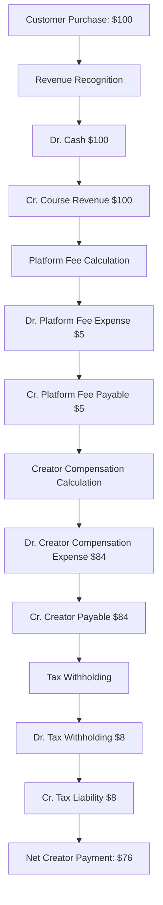
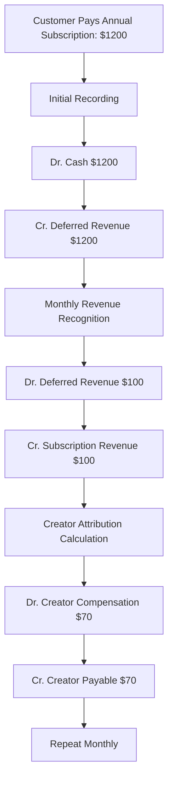
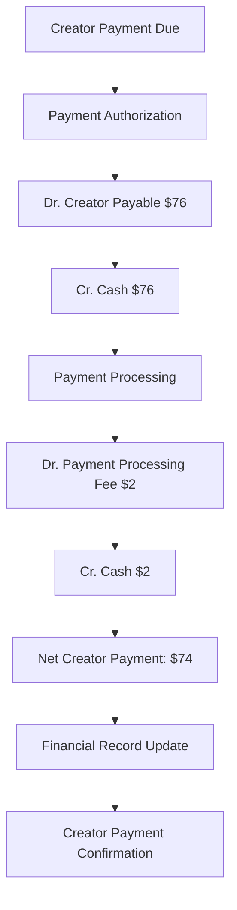
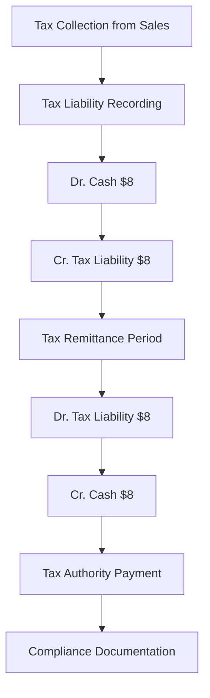

# **💳 Financial System & Double-Entry Accounting Architecture**

This README explains the comprehensive financial system architecture that enables accurate revenue attribution, organizational financial management, and creator economy transparency within the Volmify platform.

## **🎯 System Overview**

The account domain provides **enterprise-grade financial management** supporting:
- **Double-entry accounting system** with chart of accounts for accurate financial tracking
- **Multi-currency financial operations** enabling international business and creator compensation
- **Employee-managed account structure** with administrative authority for financial configuration
- **Revenue attribution integration** tracking creator compensation and organizational earnings
- **Transaction lifecycle management** with complete audit trails and compliance support
- **Organizational financial boundaries** maintaining multi-tenant financial isolation
- **Automated financial calculations** for complex creator economy revenue flows

## **🏗️ Core Architecture Principles**

### **1. Double-Entry Accounting Foundation**
```
Double-Entry Accounting Rules:
Every Transaction Has Two Sides:
├── Debit Entry (increases assets/expenses, decreases liabilities/equity/revenue)
├── Credit Entry (increases liabilities/equity/revenue, decreases assets/expenses)
└── Total Debits = Total Credits (accounting equation balance)

Account Types & Normal Balances:
├── Assets (Debit Normal): Cash, receivables, equipment
├── Liabilities (Credit Normal): Payables, loans, deferred revenue
├── Equity (Credit Normal): Owner's equity, retained earnings
├── Revenue (Credit Normal): Sales, service revenue, creator earnings
└── Expenses (Debit Normal): Operating costs, platform fees, processing fees
```

### **2. Creator Economy Financial Integration**
```
Revenue Attribution Financial Flow:
Customer Payment: $100
├── Revenue Account (Credit): $100 total customer payment
├── Platform Fee Account (Debit): $5 platform revenue
├── Processing Fee Account (Debit): $3 payment processing cost
├── Tax Liability Account (Credit): $8 tax collection
├── Creator Compensation Account (Debit): $84 net creator payment
└── Cash Account (Debit): $100 cash received

Creator Compensation Journal Entries:
├── Dr. Creator Compensation Expense: $84
├── Cr. Creator Accounts Payable: $84
└── Financial transparency with complete audit trail
```

### **3. Multi-Tenant Financial Architecture**
```
Organizational Financial Boundaries:
Each Organization Maintains:
├── Independent chart of accounts
├── Separate financial reporting
├── Isolated revenue and expense tracking
├── Organization-specific currency operations
└── Employee-managed account configuration

Cross-Organizational Financial Coordination:
├── Platform-level revenue aggregation
├── Creator compensation across organizations
├── Consolidated financial reporting capabilities
└── Multi-currency financial operations
```

### **4. Employee Financial Authority**
```
Financial Management Authority:
Employee Responsibilities:
├── Chart of accounts configuration and management
├── Account activation and deactivation
├── Financial transaction approval workflows
├── Revenue attribution setup and monitoring
└── Financial compliance oversight

Automated System Operations:
├── Transaction posting based on business events
├── Revenue attribution calculations
├── Account balance updates and reconciliation
├── Financial report generation
└── Audit trail maintenance
```

## **💰 Core Financial Entities & Business Purpose**

### **Chart of Accounts (`account`)**
**Business Purpose**: Comprehensive account structure for organizational financial management and creator economy tracking

```javascript
export const account = table("account", {
  id: textCols.idPk(),
  orgId: orgIdFkCol().notNull(), // Multi-tenant financial boundaries
  employeeId: employeeIdFkCol(), // Employee who manages this account
  name: varchar("name", { length: 256 }).notNull(),
  description: varchar("description", { length: 1536 }).notNull(),
  type: accountTypeEnum("type").notNull(),
  normalBalance: balanceTypeEnum("normal_balance").notNull(),
  currentBalance: numeric("current_balance", { precision: 12, scale: 4 }).default("0.00"),
  currencyCode: currencyCodeFkCol().notNull(),
  isSystem: boolean("is_system").default(false),
  isActive: boolean("is_active").default(true),
  // ... audit fields
});
```

**Account Types & Business Applications:**

#### **Asset Accounts (`asset` - Debit Normal Balance)**
Resources owned by the organization:
- **Cash Accounts**: Operating cash, payment processor balances, multi-currency cash holdings
- **Accounts Receivable**: Customer payment promises, subscription receivables, outstanding invoices
- **Digital Assets**: Content libraries, course materials, intellectual property
- **Equipment & Technology**: Servers, software licenses, development tools
- **Prepaid Expenses**: Prepaid subscriptions, insurance, marketing campaigns

#### **Liability Accounts (`liability` - Credit Normal Balance)**
Obligations owed by the organization:
- **Accounts Payable**: Creator compensation payable, vendor payments, operational expenses
- **Deferred Revenue**: Subscription payments received for future service delivery
- **Tax Liabilities**: Sales tax collected, income tax payable, payroll tax obligations
- **Accrued Expenses**: Accrued creator compensation, unpaid operational costs
- **Platform Fee Payables**: Amounts owed to platform for transaction processing

#### **Equity Accounts (`equity` - Credit Normal Balance)**
Ownership interest in the organization:
- **Owner's Equity**: Initial capital investment, ownership stakes
- **Retained Earnings**: Accumulated profits and losses over time
- **Additional Paid-in Capital**: Investment beyond initial capital
- **Creator Equity Stakes**: Revenue sharing arrangements with long-term creators

#### **Revenue Accounts (`revenue` - Credit Normal Balance)**
Income generated by the organization:
- **Course Sales Revenue**: Revenue from course and educational content sales
- **Subscription Revenue**: Recurring subscription and membership revenue
- **Digital Product Revenue**: Revenue from digital downloads and resources
- **Professional Service Revenue**: Revenue from consulting and coaching services
- **Affiliate Revenue**: Commission from affiliate marketing and partnerships

#### **Expense Accounts (`expense` - Debit Normal Balance)**
Costs incurred by the organization:
- **Creator Compensation**: Payments to creators based on revenue attribution
- **Platform Fees**: Transaction fees, subscription fees to platform services
- **Marketing Expenses**: Advertising, content marketing, promotional campaigns
- **Technology Expenses**: Software subscriptions, hosting, development tools
- **Administrative Expenses**: Legal, accounting, general administrative costs

### **Normal Balance & Transaction Rules**
Financial transaction rules based on account types:

```javascript
// Account balance calculation rules
Asset Accounts (Debit Normal):
├── Increases: Debit transactions (positive amounts)
├── Decreases: Credit transactions (negative amounts)
└── Current Balance = Opening Balance + Debits - Credits

Liability Accounts (Credit Normal):
├── Increases: Credit transactions (positive amounts)
├── Decreases: Debit transactions (negative amounts)
└── Current Balance = Opening Balance + Credits - Debits

Revenue Accounts (Credit Normal):
├── Increases: Credit transactions (revenue recognition)
├── Decreases: Debit transactions (refunds, adjustments)
└── Current Balance = Opening Balance + Credits - Debits

Expense Accounts (Debit Normal):
├── Increases: Debit transactions (expense recognition)
├── Decreases: Credit transactions (expense reversals)
└── Current Balance = Opening Balance + Debits - Credits
```

### **System vs Employee-Managed Accounts**
Account management authority and configuration:

**System Accounts (`isSystem: true`)**:
- **Automated creation**: Created by platform for essential financial operations
- **Platform management**: Updates and transactions managed by system processes
- **Standard naming**: Consistent account names across organizations
- **Core operations**: Essential for revenue attribution and financial compliance

**Employee-Managed Accounts (`isSystem: false`)**:
- **Employee creation**: Created and configured by authorized employees
- **Custom naming**: Organization-specific account names and descriptions
- **Business customization**: Tailored to specific organizational needs
- **Employee oversight**: Managed and monitored by financial administrators

## **🔄 Financial Transaction Workflows**

### **Creator Revenue Attribution Financial Flow**


### **Subscription Revenue Recognition Workflow**


### **Creator Payment Processing Workflow**


### **Tax Collection and Remittance Workflow**


## **📊 Financial Integration Points**

### **Product System Integration**
Financial system integrates with product sales and revenue attribution:

```javascript
// Revenue recognition from product sales
Product Sale → Financial Transaction Creation:
├── Revenue recognition in appropriate revenue account
├── Creator compensation calculation and recording
├── Platform fee allocation and expense recognition
├── Tax liability calculation and recording
└── Complete double-entry transaction posting

// Subscription billing integration
Subscription Billing → Financial Processing:
├── Deferred revenue recognition for advance payments
├── Monthly revenue recognition as service is delivered
├── Creator attribution based on content consumption
├── Subscription upgrade/downgrade financial adjustments
└── Subscription cancellation and refund processing
```

### **Tax System Integration**
Tax calculations integrate with financial recording:

```javascript
// Tax calculation and financial recording
Tax Calculation → Financial Transactions:
├── Tax liability recording for collected taxes
├── Tax expense recognition for business taxes
├── Creator tax withholding calculations and recording
├── Tax remittance processing and account updates
└── Tax compliance reporting and audit trails

// Multi-jurisdictional tax handling
Regional Tax Compliance → Financial Management:
├── Separate tax liability accounts per jurisdiction
├── Currency-specific tax calculations and recording
├── International tax treaty consideration
└── Cross-border tax compliance documentation
```

### **Member & Employee System Integration**
Financial system tracks organizational and creator financial activities:

```javascript
// Employee compensation and attribution
Employee Revenue Attribution → Financial Recording:
├── Creator compensation calculation based on attribution
├── Revenue sharing percentage application
├── Performance-based bonus calculations
├── Cross-organizational creator payment consolidation
└── Creator financial analytics and reporting

// Member purchase and payment processing
Member Orders → Financial Transaction Processing:
├── Payment processing and cash receipt recording
├── Revenue recognition based on product type
├── Gift card redemption and liability management
├── Refund processing and financial reversals
└── Customer financial history tracking
```

### **International Commerce Integration**
Multi-currency operations with currency conversion:

```javascript
// Multi-currency financial operations
International Transactions → Currency Management:
├── Currency conversion at transaction time
├── Foreign exchange gain/loss recognition
├── Multi-currency account balance maintenance
├── International payment processing
└── Cross-border financial compliance

// Creator compensation in multiple currencies
Global Creator Payments → Multi-Currency Processing:
├── Creator payment currency preferences
├── Currency conversion for international creators
├── Exchange rate fluctuation management
├── International banking integration
└── Global tax compliance coordination
```

## **💡 Financial Calculation Examples**

### **Creator Revenue Attribution Calculation**
```javascript
// Detailed revenue attribution financial calculation
Customer Purchase Example:
Course Sale: $100.00
├── Platform Fee (5%): $5.00
├── Payment Processing (3%): $3.00
├── Tax Collection (8%): $8.00
├── Net Revenue for Attribution: $84.00

Creator Attribution (70% of net):
├── Creator Compensation: $58.80
├── Organization Retention: $25.20
└── Total Attribution: $84.00

Financial Journal Entries:
├── Dr. Cash: $100.00
├── Cr. Course Revenue: $100.00
├── Dr. Platform Fee Expense: $5.00
├── Dr. Processing Fee Expense: $3.00
├── Dr. Tax Collection: $8.00
├── Dr. Creator Compensation: $58.80
├── Cr. Creator Payable: $58.80
└── Cr. Tax Liability: $8.00
```

### **Subscription Revenue Recognition**
```javascript
// Annual subscription revenue recognition example
Annual Subscription: $1,200.00
Monthly Recognition: $100.00

Initial Payment:
├── Dr. Cash: $1,200.00
├── Cr. Deferred Revenue: $1,200.00

Monthly Recognition (x12):
├── Dr. Deferred Revenue: $100.00
├── Cr. Subscription Revenue: $100.00
├── Creator Attribution: $70.00 (70% of $100)
├── Dr. Creator Compensation: $70.00
└── Cr. Creator Payable: $70.00
```

### **Multi-Currency Financial Operations**
```javascript
// International creator payment example
Creator in EU, Payment in USD:
USD Revenue: $1,000.00
EUR Exchange Rate: 0.85
EUR Creator Payment: €850.00

Financial Recording:
├── Dr. Creator Compensation (USD): $1,000.00
├── Cr. Creator Payable (EUR): €850.00
├── Dr./Cr. Foreign Exchange Gain/Loss: Currency difference
└── Currency conversion audit trail maintenance
```

## **🛡️ Financial Security & Compliance**

### **Employee Financial Authority**
- **Account management authorization**: Only employees can create and configure accounts
- **Financial transaction approval**: Employee oversight for significant financial operations
- **Chart of accounts control**: Employee authority over organizational account structure
- **Financial reporting access**: Employee-level financial data access and analysis

### **Audit Trail Compliance**
- **Complete transaction history**: Every financial transaction tracked with audit trail
- **Employee attribution**: Financial operations attributed to responsible employees
- **Balance reconciliation**: Automated balance verification and discrepancy detection
- **Compliance reporting**: Financial reports for regulatory and audit requirements

### **Multi-Tenant Financial Isolation**
- **Organizational boundaries**: Complete financial isolation between organizations
- **Currency separation**: Organization-specific currency operations and reporting
- **Account access control**: Financial data access restricted to organizational boundaries
- **Cross-organizational aggregation**: Platform-level financial consolidation capabilities

## **🚀 Development Patterns**

### **Account Management Operations**
```javascript
// Account creation and configuration
const createOrganizationAccount = (orgId, employeeId, accountData) => {
  // Validate employee authority for account creation
  // Create account with proper type and normal balance
  // Set up initial account balance and currency
  // Link account to organizational chart of accounts
  // Enable account for transaction processing
};

// Account balance inquiry and verification
const getAccountBalance = (accountId, asOfDate) => {
  // Calculate account balance based on normal balance type
  // Apply date-specific balance calculation
  // Include pending transactions if applicable
  // Return balance with currency information
};
```

### **Financial Transaction Processing**
```javascript
// Double-entry transaction creation
const createFinancialTransaction = (transactionData) => {
  // Validate transaction data and account types
  // Ensure debit and credit amounts balance
  // Create journal entries with proper account codes
  // Update account balances based on normal balance types
  // Generate audit trail with employee attribution
  // Process currency conversion if applicable
};

// Revenue attribution financial processing
const processRevenueAttribution = (orderData, attributionRules) => {
  // Calculate gross revenue and deductions
  // Apply creator attribution percentages
  // Create revenue recognition journal entries
  // Record creator compensation liability
  // Process tax calculations and recording
  // Generate creator payment authorization
};
```

### **Financial Reporting Operations**
```javascript
// Organizational financial statement generation
const generateFinancialStatements = (orgId, reportPeriod) => {
  // Aggregate account balances by type
  // Calculate income statement figures
  // Generate balance sheet with assets, liabilities, equity
  // Include cash flow statement analysis
  // Apply multi-currency consolidation if applicable
  // Format reports for stakeholder consumption
};

// Creator compensation reporting
const generateCreatorCompensationReport = (creatorId, period) => {
  // Aggregate creator attribution across products
  // Calculate total compensation earned
  // Include tax withholding and net payments
  // Show payment history and pending amounts
  // Generate tax documentation for creators
};
```

## **📈 Scalability & Future Enhancements**

### **Advanced Financial Analytics**
- **Predictive revenue modeling**: AI-driven revenue forecasting based on creator performance
- **Creator performance analytics**: Financial performance tracking and optimization recommendations
- **Cost allocation optimization**: Advanced cost allocation for multi-product organizations
- **Financial planning tools**: Budget planning and variance analysis capabilities

### **International Financial Expansion**
- **Multi-currency accounting**: Enhanced support for complex international operations
- **Foreign exchange management**: Automated currency hedging and risk management
- **International tax compliance**: Advanced international tax calculation and reporting
- **Global payment processing**: Integration with international payment providers

### **Creator Economy Financial Features**
- **Revenue sharing optimization**: Dynamic revenue sharing based on performance metrics
- **Creator financial services**: Banking and financial services for creators
- **Investment tracking**: Creator investment in content development and equipment
- **Financial planning assistance**: Creator financial planning and tax optimization tools

### **Enterprise Financial Integration**
- **ERP system integration**: Integration with enterprise resource planning systems
- **Advanced accounting automation**: Automated journal entry creation and posting
- **Financial compliance automation**: Automated regulatory reporting and compliance
- **Business intelligence integration**: Advanced financial analytics and dashboard reporting

## **🎯 Key Architecture Benefits**

### **1. Double-Entry Accounting Accuracy**
- **Financial integrity**: Complete double-entry accounting ensures balanced financial records
- **Audit compliance**: Enterprise-grade financial tracking for regulatory requirements
- **Error detection**: Automatic detection of unbalanced transactions and financial discrepancies
- **Professional standards**: Compliance with generally accepted accounting principles (GAAP)

### **2. Creator Economy Financial Transparency**
- **Revenue attribution clarity**: Clear tracking from customer payment to creator compensation
- **Financial performance visibility**: Comprehensive creator financial performance analytics
- **Payment transparency**: Complete audit trail for creator payment calculations
- **Cross-organizational coordination**: Creator compensation tracking across multiple organizations

### **3. Multi-Tenant Financial Management**
- **Organizational isolation**: Complete financial separation between organizations
- **Scalable architecture**: Support for organizations of all sizes with flexible account structures
- **Currency flexibility**: Multi-currency operations supporting international business
- **Employee financial authority**: Appropriate financial management authority for organizational staff

### **4. Integrated E-commerce Financial Operations**
- **Revenue recognition automation**: Automated revenue recognition for different product types
- **Subscription financial management**: Sophisticated deferred revenue and recognition handling
- **Tax compliance integration**: Seamless integration with tax calculation and remittance
- **Payment processing coordination**: Complete financial integration with payment processing systems

### **5. Financial Compliance & Reporting**
- **Regulatory compliance**: Financial records maintained in compliance with accounting standards
- **Audit trail completeness**: Complete transaction history for internal and external audits
- **Financial reporting capabilities**: Comprehensive financial statements and analytics
- **Multi-jurisdictional compliance**: Support for international financial compliance requirements

This financial system architecture provides the **essential accounting foundation** for a **sophisticated creator economy platform** with **enterprise-grade financial management**, **transparent revenue attribution**, **multi-currency operations**, and **comprehensive compliance capabilities**.

The architecture enables **accurate creator compensation**, **organizational financial transparency**, **international business operations**, and **scalable financial management** while maintaining **double-entry accounting accuracy** and **audit compliance**, perfectly supporting the Volmify creator economy platform's financial management requirements.
