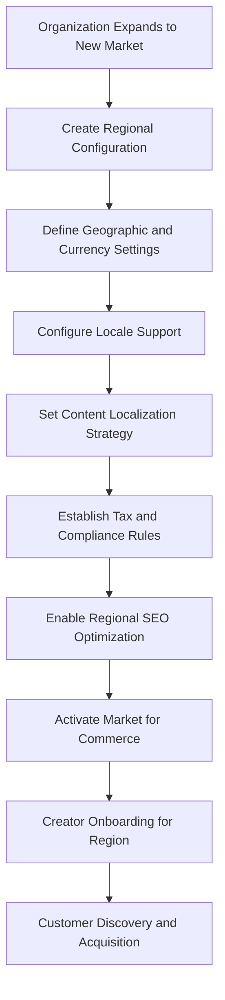
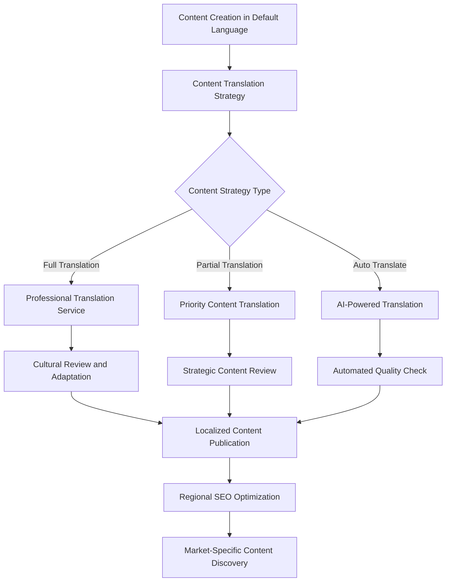
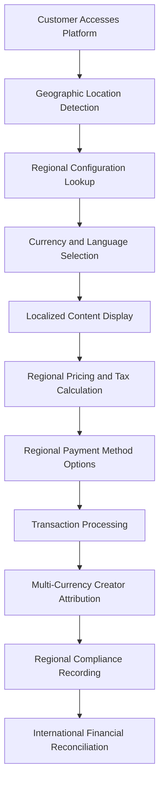
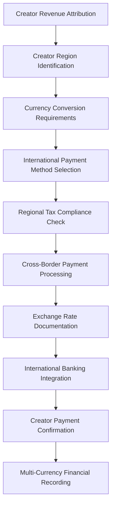

# **🌍 Organization Localization & Regional Management System**

This README explains the comprehensive organization-level localization and regional market configuration architecture that enables international commerce, multi-currency operations, and region-specific business rules within the Volmify creator economy platform.

## **🎯 System Overview**

The organization locale-region system provides **multi-market commerce foundation** supporting:
- **Organization-controlled localization** with language preferences and content strategy configuration
- **Regional market segmentation** enabling geographic pricing, currency, and tax zone management
- **International commerce enablement** through multi-currency support and regional business rules
- **Content localization strategy** with organization-specific language market prioritization
- **SEO optimization per region** with localized content discovery and regional search engine visibility
- **Creator economy international expansion** supporting global creator compensation and cross-border collaboration
- **Compliance framework** for regional business regulations and international commerce requirements

## **🏗️ Core Architecture Principles**

### **1. Organization-Centric Localization Control**
```
Organizational Localization Authority:
Organization Controls:
├── Supported language markets and content strategies
├── Regional market definition and currency configuration
├── Locale-specific content localization preferences
├── Default language and region for business operations
└── International market expansion strategies

Global Platform Foundation:
├── Platform-wide locale registry (standardized language-country codes)
├── Global currency framework (ISO 4217 compliance)
├── SEO metadata system (international content discoverability)
└── Contact information framework (international business communication)
```

### **2. Multi-Market Commerce Architecture**
```
Regional Commerce Strategy:
Market Segmentation:
├── Geographic regions with distinct business rules
├── Currency zones for pricing and payment processing
├── Tax jurisdictions with region-specific compliance
├── Content delivery regions with localized experiences
└── Creator compensation regions with local payment methods

International Operations:
├── Multi-currency product pricing and revenue attribution
├── Regional content adaptation and SEO optimization
├── Cross-border creator collaboration and compensation
├── International tax compliance and business regulation adherence
└── Regional customer service and business communication
```

### **3. Content Localization Strategy Framework**
```
Organizational Content Strategy:
Locale Management:
├── Primary market languages with full content translation
├── Secondary markets with partial content localization
├── Automated translation markets with AI content adaptation
├── Test markets with limited content for market validation
└── Content strategy evolution based on market performance

Creator Economy Localization:
├── Multi-language creator profiles and professional portfolios
├── Localized product descriptions and course content
├── Regional pricing strategies for creator products
├── International creator onboarding and compensation
└── Cross-cultural professional collaboration enablement
```

### **4. Regional Business Rules Integration**
```
Geographic Business Configuration:
Regional Customization:
├── Tax rates and compliance requirements per region
├── Payment methods and currency preferences
├── Business regulation compliance and legal requirements
├── Customer service standards and communication preferences
└── Marketing strategies and cultural adaptation

Cross-Regional Coordination:
├── Unified organizational brand identity across regions
├── Consistent creator experience across markets
├── Standardized product quality and professional standards
├── Coordinated international business development
└── Global financial reporting and business analytics
```

## **🌐 Core Localization Entities & Business Purpose**

### **Organization Locales (`orgLocale`)**
**Business Purpose**: Organization-controlled language market configuration with content strategy and business prioritization

```javascript
export const orgLocale = table("org_locale", {
  id: textCols.idPk(),
  orgId: orgIdFkCol().notNull(), // Multi-tenant locale management
  localeKey: localeKeyFkCol().notNull(), // References platform-wide locale registry
  
  // Organizational language market control
  isDefault: boolean("is_default").default(false), // Primary business language
  isActive: boolean("is_active").default(true), // Market activation status
  
  // Content localization strategy
  contentStrategy: text("content_strategy"), // "full_translation", "partial", "auto_translate"
  
  // ... audit fields
});
```

**Organizational Language Market Configuration:**

#### **Default Language Management**
- **Single default locale**: Only one locale can be marked as default per organization
- **Primary business language**: Default locale determines primary business communication
- **Fallback content**: Default locale content used when specific locale content unavailable
- **Administrative interface**: Default locale determines employee interface language

#### **Content Strategy Types**
- **`full_translation`**: Complete content translation with native speaker review
  - Professional translation of all content and educational materials
  - Native speaker content review and cultural adaptation
  - Complete localized customer experience and support
  - Full SEO optimization for regional search engines

- **`partial`**: Strategic content translation for key markets
  - Priority content translation (product descriptions, key pages)
  - Automated translation for secondary content
  - Localized customer support for business hours
  - Basic SEO optimization for market entry

- **`auto_translate`**: Automated translation with minimal human oversight
  - AI-powered content translation for market testing
  - Basic cultural adaptation and content review
  - Automated customer support with escalation options
  - Standard SEO optimization with automated content generation

### **Organization Regions (`orgRegion`)**
**Business Purpose**: Geographic market segmentation with currency, tax, and business rule configuration

```javascript
export const orgRegion = table("org_region", {
  id: textCols.idPk(),
  orgId: orgIdFkCol().notNull(),
  name: varchar("name", { length: 100 }).notNull(), // "North America", "European Union"
  description: text("description"),
  
  // Geographic and currency configuration
  countryCode: varchar("country_code", { length: 2 }).notNull(), // ISO 3166-1 alpha-2
  currencyCode: currencyCodeFkCol().notNull(), // Regional currency for commerce
  
  // Regional business configuration
  isActive: boolean("is_active").default(true),
  isDefaultShipping: boolean("is_default_shipping").default(false),
  
  // ... audit fields
});
```

**Regional Market Business Applications:**

#### **Geographic Market Segmentation**
- **Business regions**: Geographic areas with distinct business rules and operations
- **Currency zones**: Regions sharing currency for pricing and payment processing
- **Tax jurisdictions**: Geographic areas with specific tax compliance requirements
- **Shipping regions**: Areas with coordinated shipping and fulfillment operations

#### **Regional Configuration Examples**
```javascript
// Regional market configuration patterns
"North America": {
  countryCodes: ["US", "CA", "MX"],
  currencyCode: "USD",
  businessRules: "NAFTA commerce regulations",
  taxCompliance: "Multi-jurisdictional sales tax"
}

"European Union": {
  countryCodes: ["DE", "FR", "ES", "IT", "NL"],
  currencyCode: "EUR", 
  businessRules: "EU commerce directives",
  taxCompliance: "VAT compliance across member states"
}

"Asia Pacific": {
  countryCodes: ["JP", "AU", "SG", "KR"],
  currencyCode: "USD", // Multi-currency with USD base
  businessRules: "APAC regional commerce standards",
  taxCompliance: "Country-specific tax handling"
}
```

### **Region Internationalization (`orgRegionI18n`)**
**Business Purpose**: Localized regional descriptions and SEO optimization for international market presence

```javascript
export const orgRegionI18n = table("org_region_i18n", {
  regionId: textCols.idFk("region_id").references(() => orgRegion.id).notNull(),
  localeKey: localeKeyFkCol().notNull(), // Localized content language
  
  // Localized regional content
  name: varchar("name", { length: 100 }).notNull(), // Localized region name
  description: text("description"), // Localized region description
  seoMetadataId: seoMetadataIdFkCol(), // Regional SEO optimization
  
  // ... audit fields
});
```

**International Regional Content Benefits:**
- **Localized region names**: Regional market names in local languages for customer clarity
- **Cultural market positioning**: Region descriptions adapted for cultural context and business messaging
- **Regional SEO optimization**: Search engine optimization for regional market discovery
- **International business communication**: Professional regional descriptions for business development

## **🌍 International Commerce Integration**

### **Multi-Currency Commerce Operations**
Regional configuration enables sophisticated international commerce:

```javascript
// Multi-currency pricing and revenue attribution
Regional Commerce Flow:
Customer Location: Germany (EU Region)
├── Region: "European Union" 
├── Currency: EUR
├── Tax Zone: EU VAT compliance
├── Content Language: German (de-DE)
└── Payment Processing: European payment methods

Creator Compensation:
├── Product Sale: €100 EUR
├── Platform Fee: €5 EUR
├── Creator Attribution: €70 EUR (post-tax, post-fees)
├── Currency Conversion: USD equivalent for cross-border creators
└── International Payment: Wire transfer or digital payment
```

### **Regional Tax Integration**
Regional configuration provides foundation for tax compliance:

```javascript
// Regional tax jurisdiction mapping
Tax Compliance Framework:
org → orgRegion → tax jurisdiction → tax rates
├── North America → US/CA tax compliance
├── European Union → VAT compliance
├── Asia Pacific → Country-specific tax rules
└── Latin America → Regional tax harmonization

// Tax calculation based on customer region
Customer Purchase Flow:
├── Determine customer location and applicable region
├── Apply regional tax rates and compliance rules
├── Calculate post-tax creator attribution
├── Process region-appropriate payment methods
└── Generate region-compliant financial records
```

### **Content Localization Integration**
Locale and region coordination for content delivery:

```javascript
// Content delivery strategy
Content Localization Flow:
Customer: German customer in EU region
├── Region Detection: "European Union" (orgRegion)
├── Locale Selection: "de-DE" (orgLocale) 
├── Content Strategy: "full_translation"
├── Currency Display: EUR pricing
├── Tax Calculation: EU VAT compliance
└── Payment Processing: European payment methods

// SEO optimization per region and locale
Regional SEO Strategy:
├── German content for EU market (de-DE locale)
├── Euro pricing display for regional context
├── German search engine optimization
├── Regional business contact information
└── EU-compliant privacy and legal information
```

## **🎨 Creator Economy International Features**

### **Global Creator Onboarding**
Regional configuration supports international creator participation:

```javascript
// International creator onboarding workflow
Creator Registration Process:
├── Creator Location Detection → Applicable Region
├── Regional Business Rules → Compliance Requirements
├── Local Currency Preferences → Payment Configuration
├── Language Preferences → Content Creation Languages
├── Tax Compliance Setup → Regional Tax Requirements
└── Payment Method Configuration → Local Banking Integration

// Cross-regional creator collaboration
Creator Collaboration Features:
├── Multi-language professional profiles
├── Cross-border revenue attribution
├── International payment processing
├── Cultural collaboration tools
└── Global professional reputation building
```

### **International Revenue Attribution**
Regional configuration enables global creator compensation:

```javascript
// Cross-border creator compensation
International Revenue Flow:
Customer Purchase: UK customer buying from US creator
├── Customer Region: "United Kingdom" (GBP)
├── Creator Region: "North America" (USD)
├── Currency Conversion: GBP → USD at transaction time
├── Tax Compliance: UK VAT + US income tax considerations
├── Payment Processing: International wire transfer or digital payment
└── Financial Records: Multi-currency accounting with exchange rates

// Regional creator compensation optimization
Creator Payment Optimization:
├── Preferred payment currency per creator
├── Regional banking integration and optimization
├── Tax-optimized compensation structures
├── International financial compliance
└── Creator financial analytics across regions
```

## **🔄 Key Integration Workflows**

### **International Market Expansion Workflow**


### **Multi-Language Content Management Workflow**


### **International Commerce Transaction Workflow**


### **Creator International Payment Workflow**


## **📊 Integration Points**

### **Platform Foundation Integration**
Regional and locale configuration integrates with platform-wide systems:

```javascript
// Platform locale and currency foundation
Platform Integration:
├── Global locale registry → orgLocale (organization language markets)
├── Global currency system → orgRegion (regional currency configuration)
├── Platform SEO framework → orgRegionI18n (regional content optimization)
├── Contact management → orgRegion (international business communication)
└── User preferences → orgLocale (customer language experience)

// Cross-domain integration patterns
Multi-Domain Coordination:
├── User locale preferences → Organization locale support
├── Product pricing → Regional currency and tax configuration
├── Creator profiles → Multi-language professional portfolios
├── Tax calculations → Regional compliance requirements
└── Financial reporting → Multi-currency organizational analytics
```

### **Tax System Integration**
Regional configuration provides foundation for tax compliance:

```javascript
// Regional tax jurisdiction mapping
Tax Integration Framework:
orgRegion → Tax Jurisdictions:
├── Regional tax rate configuration and compliance
├── Multi-jurisdictional tax calculation coordination
├── International tax treaty consideration
├── Cross-border tax compliance documentation
└── Regional tax authority reporting requirements

// Tax calculation workflow integration
Tax Processing Flow:
├── Customer region identification → Applicable tax jurisdiction
├── Regional tax rates → Tax calculation and compliance
├── Creator region identification → Tax withholding requirements
├── Multi-currency tax processing → International compliance
└── Regional financial reporting → Tax authority submissions
```

### **Product & Creator Integration**
Regional configuration enables international product and creator management:

```javascript
// International product management
Product Regional Integration:
├── Multi-currency product pricing per region
├── Regional product availability and compliance
├── Localized product descriptions and marketing
├── Regional shipping and fulfillment coordination
└── Cross-border product discovery and SEO

// Creator international participation
Creator Regional Features:
├── Multi-language creator profiles and portfolios
├── Regional creator compensation and payment methods
├── Cross-border creator collaboration tools
├── International professional reputation building
└── Regional creator onboarding and support
```

### **Financial System Integration**
Regional configuration supports multi-currency financial operations:

```javascript
// Multi-currency financial management
Financial Regional Integration:
├── Regional currency configuration → Multi-currency accounting
├── International revenue attribution → Cross-border creator compensation
├── Currency conversion → Real-time exchange rate management
├── Regional financial compliance → International business regulations
└── Multi-currency reporting → Organizational international analytics

// International business financial flows
Cross-Border Financial Operations:
├── Customer payments in regional currencies
├── Creator compensation in preferred currencies
├── Platform fee collection in base currency
├── Tax remittance in local currencies
└── Financial reporting in organizational reporting currency
```

## **🛡️ Security & Compliance Architecture**

### **Regional Business Compliance**
- **Regulatory adherence**: Regional business regulation compliance and legal requirements
- **Data protection**: International data protection regulation compliance (GDPR, CCPA)
- **Tax compliance**: Multi-jurisdictional tax compliance and reporting requirements
- **Financial regulations**: International financial transaction and banking compliance

### **Content Localization Security**
- **Cultural sensitivity**: Content review and cultural adaptation for international markets
- **Translation quality**: Professional translation quality assurance and brand consistency
- **SEO compliance**: Search engine optimization compliance with regional regulations
- **Brand protection**: Consistent brand identity across international markets

### **Multi-Currency Financial Security**
- **Exchange rate management**: Secure currency conversion with rate transparency
- **International payment security**: Secure cross-border payment processing and fraud protection
- **Financial compliance**: Multi-currency financial reporting and audit compliance
- **Creator payment security**: Secure international creator compensation and tax compliance

## **🚀 Development Patterns**

### **Regional Configuration Management**
```javascript
// Regional market setup and configuration
const setupRegionalMarket = (orgId, regionConfig) => {
  // Create regional market configuration with currency and geographic settings
  // Configure regional business rules and compliance requirements
  // Set up regional tax jurisdiction and payment method integration
  // Enable regional content localization and SEO optimization
  // Activate region for commerce and creator participation
};

// Multi-currency pricing configuration
const configureRegionalPricing = (productId, regionPricingStrategy) => {
  // Calculate regional pricing based on currency and market conditions
  // Apply regional tax rates and compliance requirements
  // Configure regional payment methods and processing options
  // Set up currency conversion and exchange rate management
  // Enable regional pricing for customer experience
};
```

### **Content Localization Operations**
```javascript
// Organizational locale management
const manageOrganizationLocales = (orgId, localeStrategy) => {
  // Configure organization language market preferences
  // Set up content localization strategy per locale
  // Establish default locale and fallback content rules
  // Enable locale-specific SEO optimization
  // Coordinate multi-language content creation workflows
};

// Content translation and adaptation workflow
const processContentLocalization = (contentId, targetLocales, strategy) => {
  // Determine content translation requirements based on strategy
  // Coordinate professional translation or automated translation
  // Apply cultural adaptation and content review processes
  // Generate localized SEO metadata for regional discovery
  // Publish localized content with regional optimization
};
```

### **International Commerce Processing**
```javascript
// Multi-region transaction processing
const processInternationalTransaction = (customerData, productData) => {
  // Identify customer region and applicable business rules
  // Calculate regional pricing, tax, and currency conversion
  // Process payment using regional payment methods
  // Apply multi-currency creator revenue attribution
  // Generate region-compliant financial records and documentation
};

// Cross-border creator compensation
const processInternationalCreatorPayment = (creatorId, compensationData) => {
  // Determine creator region and payment preferences
  // Calculate currency conversion and international transfer requirements
  // Apply regional tax compliance and withholding requirements
  // Process international payment using appropriate banking integration
  // Generate multi-currency financial records and creator documentation
};
```

## **📈 Scalability & Future Enhancements**

### **Advanced International Market Features**
- **AI-powered market analysis**: Automated market opportunity identification and regional expansion recommendations
- **Dynamic currency optimization**: Real-time currency conversion optimization and exchange rate hedging
- **Regional performance analytics**: Advanced analytics for international market performance and optimization
- **Cultural adaptation automation**: AI-powered cultural content adaptation and sensitivity analysis

### **Enhanced Creator International Support**
- **Global creator marketplace**: International creator discovery and collaboration platform
- **Multi-currency creator analytics**: Creator performance analytics across international markets
- **Cross-border creator services**: International creator banking, tax, and business services
- **Global creator community**: International creator networking and professional development

### **Advanced Localization Features**
- **Real-time translation**: Live translation for real-time international collaboration
- **Cultural content optimization**: AI-powered cultural content adaptation and optimization
- **Regional SEO automation**: Automated SEO optimization for regional search engines
- **Multi-language customer support**: Automated multi-language customer service and support

### **International Business Expansion**
- **Regional partnership integration**: Integration with regional business partners and service providers
- **International compliance automation**: Automated international business regulation compliance
- **Global supply chain integration**: International shipping and fulfillment coordination
- **Cross-border business analytics**: Advanced international business performance analytics

## **🎯 Key Architecture Benefits**

### **1. Organization-Controlled International Expansion**
- **Market entry strategy**: Strategic control over international market entry and expansion
- **Content localization flexibility**: Flexible content localization strategies based on market priorities
- **Regional business customization**: Customizable business rules and compliance per geographic region
- **Brand consistency**: Consistent organizational brand identity across international markets

### **2. Multi-Currency Commerce Excellence**
- **Regional currency optimization**: Currency configuration optimized for regional customer experience
- **International payment processing**: Seamless cross-border payment processing and creator compensation
- **Exchange rate management**: Transparent currency conversion with proper financial documentation
- **Multi-currency financial reporting**: Comprehensive financial analytics across international operations

### **3. Creator Economy International Enablement**
- **Global creator participation**: International creator onboarding and cross-border collaboration
- **Multi-currency creator compensation**: Creator compensation in preferred currencies with compliance
- **International professional profiles**: Multi-language creator profiles for global professional reputation
- **Cross-border revenue attribution**: Accurate revenue attribution across international organizational boundaries

### **4. Scalable International Architecture**
- **Regional business rule flexibility**: Configurable business rules supporting diverse international markets
- **Content strategy adaptation**: Flexible content localization strategies for different market maturity levels
- **Compliance framework**: Comprehensive compliance framework for international business regulations
- **Performance optimization**: Optimized international content delivery and business operations

### **5. Comprehensive SEO & Content Discovery**
- **Regional SEO optimization**: Search engine optimization tailored for regional markets
- **Multi-language content discovery**: Enhanced content discoverability across international markets
- **Cultural content adaptation**: Content adaptation for cultural relevance and market effectiveness
- **International brand presence**: Strong international brand presence through optimized regional content

This organization locale-region system provides the **essential international commerce foundation** for a **sophisticated creator economy platform** with **multi-market operations**, **comprehensive localization capabilities**, **multi-currency commerce**, and **international creator collaboration**.

The architecture enables **strategic international expansion**, **cultural content adaptation**, **multi-currency operations**, and **global creator economy participation** while maintaining **organizational control**, **regional compliance**, and **brand consistency**, perfectly supporting the Volmify creator economy platform's international growth requirements.
