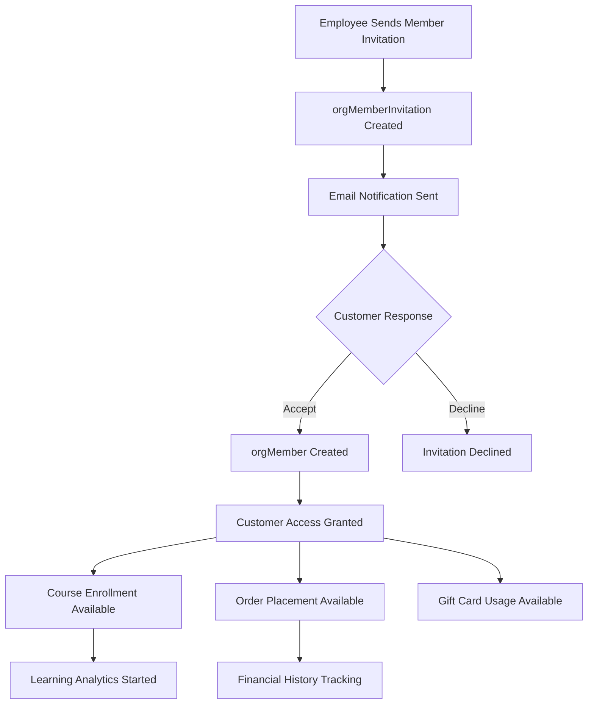
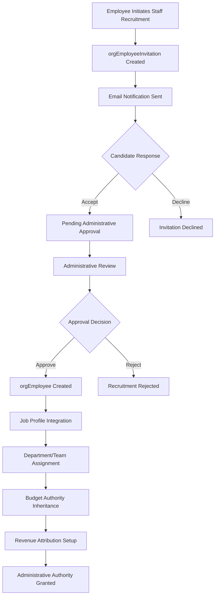
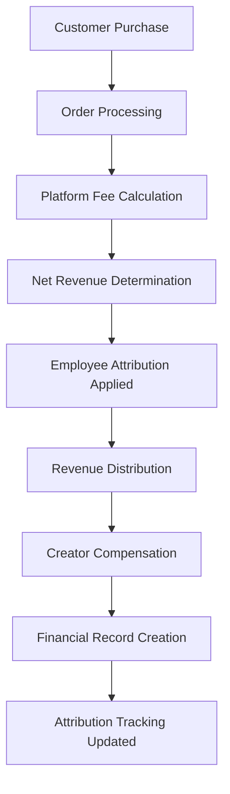
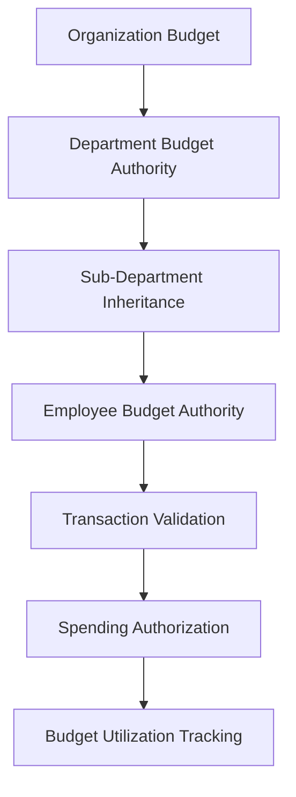

# **🏢 Organization Member & Employee Management System**

This README explains the comprehensive organization member and employee management system architecture and implementation guide for the Volmify creator economy platform.

## **🎯 System Overview**

The member and employee management system provides a sophisticated organizational structure supporting:
- **Member lifecycle management** (invitation → active → suspended/left) for customers/learners
- **Employee management system** (invitation → approval → hiring → active) for staff/creators  
- **Professional attribution** through job profile integration for cross-organizational reputation
- **Revenue attribution system** with post-platform-fee calculations for accurate creator compensation
- **Hierarchical departments** with nested structures and budget authority for professional organization
- **Flexible team collaboration** across departments for project-based work
- **Dual invitation workflows** with separate customer vs staff onboarding processes
- **Authority separation** between customer activities and administrative operations
- **Gift card ecosystem** with employee issuance and member usage capabilities

## **🔄 Core Architecture Principles**

### **1. Clear Authority Separation**
```
Member = Customer/Learner Authority
├── Place orders and make purchases
├── Enroll in courses and learning activities
├── Use gift cards (issued by employees)
├── Participate in learning communities
└── Access customer financial history

Employee = Professional/Administrative Authority
├── Create and manage content
├── Receive revenue attribution (post-platform fees)
├── Issue gift cards to customers
├── Manage tax rates and compliance
├── Approve content and workflows
├── Access professional financial context
└── Inherit budget authority from departments
```

### **2. Professional Identity Integration**
```
User Identity Flow:
user → userProfile (main) → orgMember → Customer Activities
user → userProfile (job) → userJobProfile → orgEmployee → Professional Activities

Cross-Organizational Professional Reputation:
userJobProfile spans multiple organizations
├── Professional skills and experience
├── Revenue attribution across organizations  
├── Cross-org collaboration history
└── Marketplace reputation building
```

### **3. Revenue Attribution Model**
```
Revenue Attribution Flow:
Customer Payment ($100)
├── Platform Fee (5%): $5
├── Processing Fee (3%): $3
├── Tax Withholding: $8
└── Net Revenue for Attribution: $84

Employee Attribution (70% of net): $58.80 → Creator
Organization Retention (30% of net): $25.20 → Company
```

### **4. Budget Authority Inheritance**
```
Budget Authority Hierarchy:
Organization Budget Authority
├── Department Budget (≤ Organization Limit)
│   ├── Sub-Department Budget (≤ Parent Department)
│   └── Employee Spending Authority (≤ Department Limit)
└── Team Budget (≤ Team Lead's Primary Department)
```

## **👥 Core Entities & Their Purpose**

### **Organization Members (`orgMember`)**
**Business Purpose**: Customer/learner identity within organization boundaries

```javascript
export const orgMember = table("org_member", {
  id: textCols.idPk(),
  orgId: orgIdFkCol().notNull(),
  userProfileId: userProfileIdFkCol().notNull(), // Links to userProfile (type="main")
  displayName: varchar("display_name", { length: 100 }).notNull(),
  status: orgMemberStatusEnum("status").default("active"),
  joinedAt: timestamp("joined_at").defaultNow(),
  leftAt: timestamp("left_at"),
  suspendedAt: timestamp("suspended_at"),
  suspendedReason: text("suspended_reason"),
  // ... audit fields
});
```

**Key Capabilities:**
- **Multi-tenant customer identity**: Same user can be customer across multiple organizations
- **Learning activities**: Course enrollment, progress tracking, community participation
- **Purchase authority**: Order placement, payment processing, gift card usage
- **Financial history**: Customer transaction tracking and refund management
- **Status management**: Active, suspended, left lifecycle with audit trails

**Member Status Workflow:**
- **`invited`**: Initial invitation sent, awaiting acceptance
- **`active`**: Full customer access and capabilities
- **`suspended`**: Temporary access restriction with reason tracking
- **`left`**: Voluntary departure with historical data preservation
- **`removed`**: Administrative removal with compliance logging

### **Organization Employees (`orgEmployee`)**
**Business Purpose**: Staff/creator identity with professional responsibilities and administrative authority

```javascript
export const orgEmployee = table("org_employee", {
  id: textCols.idPk(),
  orgId: orgIdFkCol().notNull(),
  memberId: memberIdFkCol().notNull(), // Extends member capabilities
  jobProfileId: userJobProfileIdFkCol(), // Optional professional identity
  role: orgEmployeeRoleEnum("role").notNull(),
  professionalDisplayName: varchar("professional_display_name", { length: 100 }).notNull(),
  compensationType: compensationTypeEnum("compensation_type").notNull(),
  salary: numeric("salary", { precision: 12, scale: 2 }),
  hiredAt: timestamp("hired_at").defaultNow(),
  terminatedAt: timestamp("terminated_at"),
  status: orgEmployeeStatusEnum("status").default("active"),
  // ... audit fields
});
```

**Key Capabilities:**
- **Professional upgrade**: Enhanced member with additional administrative authority
- **Revenue attribution**: Product creation compensation with post-platform-fee calculations
- **Administrative operations**: Gift card issuance, tax management, content approval
- **Job profile integration**: Cross-organizational professional reputation building
- **Budget authority**: Inherited spending limits from department assignments
- **Dual role support**: Maintains member privileges for customer activities

**Employee Roles & Authority:**
- **`admin`**: Full organizational management and financial authority
- **`manager`**: Department/team leadership with budget oversight
- **`creator`**: Content creation with revenue attribution rights
- **`instructor`**: Educational content delivery and student management
- **`staff`**: General operational duties with limited administrative access

**Compensation Types:**
- **`salaried`**: Fixed salary payments with optional attribution bonuses
- **`commission`**: Pure revenue-sharing based on product attribution
- **`mixed`**: Combination of base salary plus revenue attribution

### **Member Invitations (`orgMemberInvitation`)**
**Business Purpose**: Customer/learner onboarding with streamlined acceptance

```javascript
export const orgMemberInvitation = table("org_member_invitation", {
  id: textCols.idPk(),
  orgId: orgIdFkCol().notNull(),
  email: varchar("email", { length: 254 }).notNull(),
  displayName: varchar("display_name", { length: 100 }).notNull(),
  invitedByEmployeeId: employeeIdFkCol().notNull(),
  token: varchar("token", { length: 64 }).unique().notNull(),
  status: invitationStatusEnum("status").default("pending"),
  expiresAt: timestamp("expires_at").notNull(),
  acceptedAt: timestamp("accepted_at"),
  declinedAt: timestamp("declined_at"),
  // ... audit fields
});
```

**Invitation Workflow:**
1. **Employee sends invitation** with customer email and display name
2. **Email notification** sent with secure acceptance link
3. **Direct acceptance** creates orgMember without approval workflow
4. **Immediate access** to customer capabilities and learning resources

### **Employee Invitations (`orgEmployeeInvitation`)**
**Business Purpose**: Staff recruitment with administrative approval workflow

```javascript
export const orgEmployeeInvitation = table("org_employee_invitation", {
  id: textCols.idPk(),
  orgId: orgIdFkCol().notNull(),
  email: varchar("email", { length: 254 }).notNull(),
  role: orgEmployeeRoleEnum("role").notNull(),
  proposedSalary: numeric("proposed_salary", { precision: 12, scale: 2 }),
  startDate: date("start_date"),
  jobProfileId: userJobProfileIdFkCol(), // Optional professional identity link
  invitedByEmployeeId: employeeIdFkCol().notNull(),
  approvedByEmployeeId: employeeIdFkCol(),
  token: varchar("token", { length: 64 }).unique().notNull(),
  status: employeeInvitationStatusEnum("status").default("pending"),
  expiresAt: timestamp("expires_at").notNull(),
  acceptedAt: timestamp("accepted_at"),
  approvedAt: timestamp("approved_at"),
  // ... audit fields
});
```

**Staff Recruitment Workflow:**
1. **Employee initiates recruitment** with professional details and proposed terms
2. **Administrative review** by existing employees with approval authority
3. **Candidate acceptance** after administrative approval
4. **Employee creation** with professional capabilities and budget authority
5. **Job profile integration** for cross-organizational reputation building

### **Departments (`orgDepartment`)**
**Business Purpose**: Professional organizational structure with budget authority

```javascript
export const orgDepartment = table("org_department", {
  id: textCols.idPk(),
  orgId: orgIdFkCol().notNull(),
  name: varchar("name", { length: 100 }).notNull(),
  description: text("description"),
  parentDepartmentId: textCols.idFk("parent_department_id").references(() => orgDepartment.id),
  type: departmentTypeEnum("type").notNull(),
  budgetAuthority: numeric("budget_authority", { precision: 15, scale: 2 }),
  isActive: boolean("is_active").default(true),
  // ... audit fields
});
```

**Department Types & Structure:**
- **`department`**: Primary organizational units with budget authority
- **`division`**: Large-scale business divisions spanning multiple departments
- **`business_unit`**: Semi-autonomous units with independent P&L
- **`office`**: Geographic office locations with regional management
- **`region`**: Geographic regions spanning multiple offices

**Budget Authority Rules:**
- **Child departments cannot exceed parent budget limits**
- **Employee spending authority inherits from primary department**
- **Budget validation enforced at transaction creation**
- **Historical budget tracking for compliance and analytics**

### **Teams (`orgTeam`)**
**Business Purpose**: Cross-functional collaboration units for project-based work

```javascript
export const orgTeam = table("org_team", {
  id: textCols.idPk(),
  orgId: orgIdFkCol().notNull(),
  name: varchar("name", { length: 100 }).notNull(),
  description: text("description"),
  type: teamTypeEnum("type").notNull(),
  leadEmployeeId: employeeIdFkCol().notNull(),
  isActive: boolean("is_active").default(true),
  // ... audit fields
});
```

**Team Types & Budget Context:**
- **`departmental`**: Teams within single department using department budget
- **`cross_functional`**: Multi-department teams using team lead's department budget
- **`project`**: Temporary teams for specific initiatives with defined budget
- **`permanent`**: Ongoing teams with dedicated budget allocation

### **Department Memberships (`orgEmployeeDepartmentMembership`)**
**Business Purpose**: Employee assignment to departments with budget context

```javascript
export const orgEmployeeDepartmentMembership = table("org_employee_department_membership", {
  id: textCols.idPk(),
  employeeId: employeeIdFkCol().notNull(),
  departmentId: textCols.idFk("department_id").references(() => orgDepartment.id).notNull(),
  role: departmentRoleEnum("role").default("member"),
  isPrimary: boolean("is_primary").default(false),
  assignedAt: timestamp("assigned_at").defaultNow(),
  removedAt: timestamp("removed_at"),
  // ... audit fields
});
```

**Department Roles:**
- **`head`**: Department leadership with full budget authority
- **`manager`**: Management role with delegated budget authority
- **`lead`**: Team leadership within department context
- **`member`**: Standard department participation

### **Team Memberships (`orgEmployeeTeamMembership`)**
**Business Purpose**: Employee participation in teams with collaborative roles

```javascript
export const orgEmployeeTeamMembership = table("org_employee_team_membership", {
  id: textCols.idPk(),
  employeeId: employeeIdFkCol().notNull(),
  teamId: textCols.idFk("team_id").references(() => orgTeam.id).notNull(),
  role: teamRoleEnum("role").default("member"),
  joinedAt: timestamp("joined_at").defaultNow(),
  leftAt: timestamp("left_at"),
  // ... audit fields
});
```

**Team Roles:**
- **`lead`**: Team leadership and coordination
- **`admin`**: Administrative team management
- **`member`**: Standard team participation
- **`contributor`**: Project-specific contribution role

## **💰 Revenue Attribution System**

### **Employee Product Attribution**
Revenue sharing system linking creators to their products with transparent compensation:

```javascript
export const orgEmployeeProductAttribution = table("org_employee_product_attribution", {
  id: textCols.idPk(),
  orgId: orgIdFkCol().notNull(),
  employeeId: employeeIdFkCol().notNull(),
  productId: textCols.idFk("product_id").references(() => orgProduct.id).notNull(),
  revenueSharePercentage: numeric("revenue_share_percentage", { precision: 5, scale: 2 }).notNull(),
  attributionType: attributionTypeEnum("attribution_type").notNull(),
  effectiveFrom: timestamp("effective_from").defaultNow(),
  effectiveTo: timestamp("effective_to"),
  // ... attribution configuration
});
```

**Attribution Types & Revenue Impact:**
- **`creator`**: Primary content creator (typically 60-80% revenue share)
- **`collaborator`**: Contributing team member (typically 10-30% revenue share)
- **`manager`**: Project manager or supervisor (typically 5-15% revenue share)
- **`reviewer`**: Quality assurance and review (typically 3-10% revenue share)

### **Revenue Calculation Flow**
Post-platform-fee revenue distribution ensuring accurate creator compensation:

```javascript
// Revenue Attribution Business Logic:
const calculateAttributionRevenue = (customerPayment, attributionPercentage) => {
  const grossRevenue = customerPayment.total;
  const platformFee = grossRevenue * PLATFORM_FEE_RATE;
  const processingFee = grossRevenue * PROCESSING_FEE_RATE;
  const taxWithholding = calculateTaxWithholding(jurisdiction, grossRevenue);
  
  const netRevenue = grossRevenue - platformFee - processingFee - taxWithholding;
  const attributedRevenue = netRevenue * (attributionPercentage / 100);
  
  return {
    grossRevenue,
    platformFee,
    processingFee,
    taxWithholding,
    netRevenue,
    attributedRevenue
  };
};
```

### **Revenue Attribution Tracking**
Historical revenue tracking with complete audit trails:

```javascript
export const orgEmployeeProductAttributionRevenue = table("org_employee_product_attribution_revenue", {
  id: textCols.idPk(),
  attributionId: textCols.idFk("attribution_id").references(() => orgEmployeeProductAttribution.id).notNull(),
  orderItemId: textCols.idFk("order_item_id").references(() => orgMemberOrderItem.id).notNull(),
  grossRevenue: numeric("gross_revenue", { precision: 12, scale: 4 }).notNull(),
  platformFee: numeric("platform_fee", { precision: 12, scale: 4 }).notNull(),
  processingFee: numeric("processing_fee", { precision: 12, scale: 4 }).notNull(),
  taxWithholding: numeric("tax_withholding", { precision: 12, scale: 4 }).notNull(),
  netRevenue: numeric("net_revenue", { precision: 12, scale: 4 }).notNull(),
  attributedRevenue: numeric("attributed_revenue", { precision: 12, scale: 4 }).notNull(),
  calculatedAt: timestamp("calculated_at").defaultNow(),
  // ... revenue tracking
});
```

## **🎁 Gift Card System**

### **Gift Card Issuance (Employee Authority)**
Employees can issue gift cards for customer acquisition and retention:

```javascript
export const orgGiftCard = table("org_gift_card", {
  id: textCols.idPk(),
  orgId: orgIdFkCol().notNull(),
  code: varchar("code", { length: 20 }).unique().notNull(),
  initialAmount: numeric("initial_amount", { precision: 12, scale: 4 }).notNull(),
  currentBalance: numeric("current_balance", { precision: 12, scale: 4 }).notNull(),
  issuedByEmployeeId: employeeIdFkCol().notNull(), // Only employees can issue
  currencyCode: currencyCodeFkCol().notNull(),
  expiresAt: timestamp("expires_at"),
  isActive: boolean("is_active").default(true),
  // ... gift card configuration
});
```

### **Gift Card Usage (Member Activity)**
Any member (including employees as customers) can use gift cards:

```javascript
export const orgMemberGiftCardUsage = table("org_member_gift_card_usage", {
  id: textCols.idPk(),
  giftCardId: textCols.idFk("gift_card_id").references(() => orgGiftCard.id).notNull(),
  memberId: memberIdFkCol().notNull(), // Any member can use
  orderId: textCols.idFk("order_id").references(() => orgMemberOrder.id).notNull(),
  amountUsed: numeric("amount_used", { precision: 12, scale: 4 }).notNull(),
  usedAt: timestamp("used_at").defaultNow(),
  // ... usage tracking
});
```

**Gift Card Business Logic:**
- **Employee Authority**: Only employees can create and issue gift cards
- **Member Usage**: All members (including employees) can use gift cards for purchases
- **Balance Tracking**: Real-time balance updates with usage history
- **Expiration Management**: Optional expiration dates with automated notifications
- **Fraud Prevention**: Secure code generation with usage validation

## **🔄 Key Business Workflows**

### **Customer Onboarding Workflow**


### **Staff Recruitment Workflow**


### **Revenue Attribution Workflow**


### **Budget Authority Inheritance**


## **🛡️ Security & Permissions**

### **Authority Level Security**
- **Member Permissions**: Customer activities (orders, courses, gift card usage)
- **Employee Permissions**: Professional activities + administrative authority
- **Dual Role Management**: Combined permissions with clear context separation
- **Budget Validation**: Real-time spending authority enforcement

### **Administrative Authority Controls**
- **Gift Card Issuance**: Restricted to employees only
- **Tax Management**: Employee-only authority for tax rate configuration
- **Content Approval**: Employee authority for quality assurance workflows
- **Revenue Attribution**: Employee authority for creator compensation setup

### **Financial Data Protection**
- **Transaction Context**: Appropriate financial data access based on role
- **Cross-Organizational Privacy**: Secure handling of multi-tenant financial data
- **Revenue Transparency**: Clear visibility into post-platform-fee calculations
- **Audit Compliance**: Complete transaction trails for regulatory requirements

## **📊 Integration Points**

### **Product System Integration**
- **Revenue Attribution**: Employee compensation linked to product sales
- **Content Creation**: Employee authority for product creation and management
- **Gift Card Usage**: Member gift card application to product purchases

### **Financial System Integration**
- **Revenue Tracking**: Post-platform-fee attribution calculations
- **Budget Management**: Department budget authority enforcement
- **Transaction Processing**: Member order processing and employee compensation

### **Professional Identity Integration**
- **Job Profile Linking**: Cross-organizational professional reputation
- **Skill Attribution**: Professional skills connected to revenue attribution
- **Career Development**: Professional growth tracking across organizations

### **Tax System Integration**
- **Employee Tax Management**: Staff authority for tax rate configuration
- **Transaction Tax Calculation**: Automated tax withholding for attribution
- **Compliance Tracking**: Tax compliance audit trails and reporting

## **🚀 Development Patterns**

### **Member Management Example**
```javascript
// Create member invitation
const createMemberInvitation = async (orgId, email, displayName, invitedByEmployeeId) => {
  return await db.insert(orgMemberInvitation).values({
    orgId,
    email,
    displayName,
    invitedByEmployeeId,
    token: generateSecureToken(),
    expiresAt: addDays(new Date(), 7)
  });
};

// Accept member invitation
const acceptMemberInvitation = async (token, userProfileId) => {
  const invitation = await db.select().from(orgMemberInvitation)
    .where(and(
      eq(orgMemberInvitation.token, token),
      eq(orgMemberInvitation.status, "pending"),
      gt(orgMemberInvitation.expiresAt, new Date())
    ));
    
  if (!invitation) throw new Error("Invalid or expired invitation");
  
  // Create member
  const member = await db.insert(orgMember).values({
    orgId: invitation.orgId,
    userProfileId,
    displayName: invitation.displayName,
    status: "active"
  });
  
  // Update invitation status
  await db.update(orgMemberInvitation)
    .set({ status: "accepted", acceptedAt: new Date() })
    .where(eq(orgMemberInvitation.id, invitation.id));
    
  return member;
};
```

### **Employee Revenue Attribution**
```javascript
// Create product attribution
const createProductAttribution = async (employeeId, productId, revenueSharePercentage, attributionType) => {
  // Validate employee authority
  const employee = await validateEmployeeAuthority(employeeId);
  
  return await db.insert(orgEmployeeProductAttribution).values({
    orgId: employee.orgId,
    employeeId,
    productId,
    revenueSharePercentage,
    attributionType,
    effectiveFrom: new Date()
  });
};

// Calculate attribution revenue
const calculateAttributionRevenue = async (orderItemId) => {
  const orderItem = await db.select().from(orgMemberOrderItem)
    .where(eq(orgMemberOrderItem.id, orderItemId));
    
  const attributions = await db.select().from(orgEmployeeProductAttribution)
    .where(eq(orgEmployeeProductAttribution.productId, orderItem.variantId));
    
  for (const attribution of attributions) {
    const revenueCalculation = calculatePostPlatformFeeRevenue(
      orderItem.lineTotal,
      attribution.revenueSharePercentage
    );
    
    await db.insert(orgEmployeeProductAttributionRevenue).values({
      attributionId: attribution.id,
      orderItemId,
      ...revenueCalculation,
      calculatedAt: new Date()
    });
  }
};
```

### **Gift Card Management**
```javascript
// Issue gift card (employee authority)
const issueGiftCard = async (orgId, amount, issuedByEmployeeId, currencyCode) => {
  // Validate employee authority
  await validateEmployeeAuthority(issuedByEmployeeId);
  
  return await db.insert(orgGiftCard).values({
    orgId,
    code: generateGiftCardCode(),
    initialAmount: amount,
    currentBalance: amount,
    issuedByEmployeeId,
    currencyCode,
    isActive: true
  });
};

// Use gift card (member activity)
const useGiftCard = async (giftCardCode, memberId, orderId, amountToUse) => {
  const giftCard = await db.select().from(orgGiftCard)
    .where(and(
      eq(orgGiftCard.code, giftCardCode),
      eq(orgGiftCard.isActive, true),
      gte(orgGiftCard.currentBalance, amountToUse)
    ));
    
  if (!giftCard) throw new Error("Invalid or insufficient gift card");
  
  // Record usage
  await db.insert(orgMemberGiftCardUsage).values({
    giftCardId: giftCard.id,
    memberId,
    orderId,
    amountUsed: amountToUse,
    usedAt: new Date()
  });
  
  // Update balance
  await db.update(orgGiftCard)
    .set({ currentBalance: giftCard.currentBalance - amountToUse })
    .where(eq(orgGiftCard.id, giftCard.id));
};
```

## **📈 Scalability & Future Enhancements**

### **Cross-Organizational Professional Growth**
- **Unified Job Profiles**: Professional identity spanning multiple organizations
- **Reputation Systems**: Performance tracking across organizational boundaries
- **Marketplace Integration**: Freelance and contract work opportunities

### **Advanced Budget Management**
- **Dynamic Budget Allocation**: AI-driven budget optimization based on performance
- **Project-Based Budgeting**: Temporary budget allocation for specific initiatives
- **Budget Analytics**: Predictive budget utilization and optimization recommendations

### **Enhanced Revenue Attribution**
- **Multi-Creator Collaborations**: Complex attribution models for team-based content
- **Performance-Based Attribution**: Dynamic attribution based on content performance
- **Attribution Analytics**: Revenue prediction and optimization insights

This member and employee management system provides the foundation for a sophisticated creator economy platform with clear authority separation, transparent revenue attribution, professional identity integration, and scalable organizational structure that grows from individual creators to enterprise marketplace operations.

The architecture enables **professional creator compensation**, **cross-organizational reputation building**, **sophisticated organizational management**, and **transparent financial operations** while maintaining clear boundaries between customer activities and administrative authority, perfectly aligning with the Volmify creator economy vision.
