# **🏢 Organization Member & Employee Management System**

This README explains the comprehensive organization member and employee management system architecture and implementation guide for the Volmify creator economy platform.

## **🎯 System Overview**

The member and employee management system provides a sophisticated organizational structure supporting:
- **Member lifecycle management** (invitation → active → suspended/left) for customers/learners
- **Employee management system** (invitation → approval → hiring → active) for staff/creators  
- **Professional attribution** through job profile integration for cross-organizational reputation
- **CTI financial transaction access** with O(log n) indexed performance for marketplace-scale operations
- **Hierarchical departments** with nested structures and budget authority for professional organization
- **Flexible team collaboration** across departments for project-based work
- **Dual invitation workflows** with separate customer vs staff onboarding processes
- **Authority separation** between customer activities and administrative operations

## **👥 Core Entities & Their Purpose**

### **1. Organization Members (`orgMember`)**
**Purpose**: Customer/learner identity within an organization context

**Key Features**:
- **Multi-tenant user identity**: Same user can be member of multiple organizations
- **Customer role**: Primary focus on learning, purchasing, and community participation
- **Status lifecycle**: `invited` → `active` → `suspended`/`left`/`removed`
- **Display customization**: Custom display name per organization
- **Learning profile integration**: Connected to learning analytics and progress tracking
- **Financial context**: Access to customer purchase history via `accountTransactionMemberContext`
- **Gift card usage**: Members (including employees as customers) can use gift cards

**Schema Reference**:
```javascript
orgMember: {
  id, userId, orgId, displayName, status, joinedAt, leftAt, 
  suspendedAt, suspendedReason, userProfileId
}
```

### **2. Organization Employees (`orgEmployee`)**
**Purpose**: Staff/creator identity with professional responsibilities and administrative authority

**Key Features**:
- **Professional upgrade**: Optional enhancement from member to employee status
- **Job profile integration**: Links to cross-organizational professional identity (`userJobProfile`)
- **Employment lifecycle**: `pending` → `approved` → `active` → `terminated`
- **Revenue attribution**: Product creation and compensation tracking with post-platform-fee calculations
- **Administrative authority**: Tax management, gift card issuance, financial operations
- **Organizational duties**: Department/team assignments with budget authority inheritance
- **Compensation management**: Salary tracking separate from product attribution
- **CTI financial access**: Professional earnings via `accountTransactionEmployeeContext`

**Schema Reference**:
```javascript
orgEmployee: {
  id, memberId, jobProfileId, role, professionalDisplayName,
  isSalaried, salary, hiredAt, terminatedAt, status
}
```

### **3. Member Invitations (`orgMemberInvitation`)**
**Purpose**: Customer/learner onboarding workflow

**Key Features**:
- **Email-based invitations** for customer access
- **Learning-focused**: Course access grants and learning community participation
- **Community integration**: Study groups, learning cohorts, forum access
- **Direct acceptance**: Simple workflow without complex approval requirements
- **Customer-specific permissions**: Focus on purchasing and learning activities

**Schema Reference**:
```javascript
orgMemberInvitation: {
  id, orgId, email, displayName, invitedByEmployeeId,
  acceptedAt, declinedAt, status, invitationType
}
```

### **4. Employee Invitations (`orgEmployeeInvitation`)**
**Purpose**: Staff recruitment and professional onboarding workflow

**Key Features**:
- **Professional recruitment**: Staff roles with job profile context
- **Administrative approval workflow**: Review and approval required by existing employees
- **Employment details**: Proposed salary, start date, department assignment
- **Role specification**: Professional roles (instructor, admin, manager, creator)
- **Job profile linking**: Optional connection to professional identity for cross-organizational reputation
- **Admin approval tracking**: `approvedByEmployeeId` for compliance and audit trails

**Schema Reference**:
```javascript
orgEmployeeInvitation: {
  id, orgId, email, role, proposedSalary, startDate, jobProfileId,
  invitedByEmployeeId, approvedByEmployeeId, acceptedAt, status
}
```

### **5. Departments (`orgDepartment`)**
**Purpose**: Professional organizational structure for employees with budget authority

**Key Features**:
- **Employee-focused**: Work organization and reporting structure
- **Nested hierarchy**: Parent-child department relationships with budget inheritance
- **Department types**: `department`, `division`, `business_unit`, `office`, `region`
- **Professional context**: Linked to job profiles and career development
- **Budget authority**: Financial responsibility with inheritance rules (child departments cannot exceed parent limits)

**Budget Authority Logic**:
```javascript
// Budget Inheritance Rules:
// - Child departments cannot exceed parent department budget limits
// - Employee spending authority inherits from primary department assignment
// - Cross-departmental teams use team lead's primary department budget authority
// - Budget validation enforced at transaction creation time
```

**Schema Reference**:
```javascript
orgDepartment: {
  id, orgId, name, description, parentDepartmentId, departmentType,
  budgetAuthority, createdAt
}
```

### **6. Teams (`orgTeam`)**
**Purpose**: Employee collaboration units for project-based work

**Key Features**:
- **Cross-functional teams**: Employees from multiple departments
- **Project-based**: Temporary or permanent collaboration units
- **Team types**: `departmental`, `cross_functional`, `project`, `permanent`
- **Professional collaboration**: Work-focused team structure
- **Budget context**: Teams inherit budget authority from team lead's primary department

**Schema Reference**:
```javascript
orgTeam: {
  id, orgId, name, description, type, leadEmployeeId,
  isActive, createdAt
}
```

### **7. Employee Department Memberships (`orgEmployeeDepartmentMembership`)**
**Purpose**: Employee assignment to departments with professional context

**Key Features**:
- **Professional assignment**: Work-based department structure
- **Job profile context**: Connected to professional identity
- **Career development**: Department-based professional growth
- **Budget authority inheritance**: Employee spending limits derived from department authority
- **Multiple assignments**: Employees can belong to multiple departments with primary designation

**Schema Reference**:
```javascript
orgEmployeeDepartmentMembership: {
  employeeId, departmentId, assignedAt, removedAt, 
  jobProfileContext, isPrimary
}
```

### **8. Employee Team Memberships (`orgEmployeeTeamMembership`)**
**Purpose**: Employee participation in teams with work roles

**Key Features**:
- **Team-scoped roles**: `admin` (team management) vs `member`
- **Professional collaboration**: Work-focused team participation
- **Project assignments**: Temporary or permanent team assignments
- **Cross-departmental coordination**: Teams can span multiple departments

**Schema Reference**:
```javascript
orgEmployeeTeamMembership: {
  employeeId, teamId, role, joinedAt, leftAt
}
```

## **🔄 Architecture Separation: Members vs Employees**

### **Member Activities (Customer/Learner Focus)**
```javascript
// Customer/Learning Activities
orgMemberOrder                           // Purchase products/courses
orgMemberOrderItem                       // Individual order items
orgMemberProductCourseEnrollment        // Learn and take courses
orgMemberLearningProfile                // Learning analytics and progress
orgMemberGiftCardUsage                  // Gift card usage (any member including employees as customers)
orgMemberProductCourseChallengeRating   // Course feedback and ratings
orgMemberLearningGroup                  // Study groups and learning communities
orgMemberCohort                         // Learning cohorts and class sections

// CTI Financial Context
accountTransactionMemberContext         // Customer purchase and refund history (O(log n) indexed access)
```

### **Employee Activities (Professional/Work Focus)**
```javascript
// Professional/Work Activities
orgEmployeeProductAttribution           // Content creation and professional work
orgEmployeeProductAttributionRevenue    // Creator compensation and revenue sharing (post-platform fees)
orgEmployeeDepartmentMembership         // Professional organizational structure with budget authority
orgEmployeeTeamMembership               // Work-based team collaboration
orgEmployeeInvitation                   // Staff recruitment and onboarding (approval-based)

// Administrative Authority Activities
orgTaxRateSnapshot.byEmployeeId         // Tax rate management (employee authority)
orgGiftCard.issuedByEmployeeId          // Gift card issuance (employee authority)
account.managedByEmployeeId             // Chart of accounts management (employee authority)
orgProductApproval.reviewedByEmployeeId // Content approval workflows (employee authority)

// CTI Financial Context
accountTransactionEmployeeContext       // Professional earnings and attribution (O(log n) indexed access)
```

### **User Identity Architecture**
```javascript
// Clear Identity Separation:
user → userProfile (main customer identity)
user → userProfile (job) → userJobProfile (professional extension of userProfile)

// Organizational Context:
orgMember.userProfileId → userProfile (main)     // Customer context
orgEmployee.jobProfileId → userJobProfile        // Professional context (extends userProfile)

// API-Level Enforcement:
// userJobProfile validation ensures it extends from userProfile of same user
// This maintains referential integrity while enabling professional context
```

### **Authority & Permission Logic**
```javascript
// Authority Levels:
Member = Customer (places orders, learns, participates, uses gift cards)
Employee = Staff (administrative authority + customer capabilities)

// Administrative vs Customer Activities:
// ✅ Employees can: issue gift cards, manage taxes, approve content, post transactions
// ✅ Members can: use gift cards, place orders, enroll in courses, participate in communities
// ✅ Employees as customers: maintain member privileges for customer activities (dual role)

// Gift Card Logic:
orgGiftCard.issuedByEmployeeId          // Only employees can ISSUE gift cards
orgMemberGiftCardUsage.memberId         // Any member can USE gift cards (including employees)
```

### **Revenue Attribution Logic**
```javascript
// Post-Platform Fee Attribution:
Customer Payment: $100
├── Platform Fee (5%): $5
├── Processing Fee (3%): $3  
├── Tax Withholding (jurisdiction-dependent): $8
└── Net Revenue for Attribution: $84

// Employee Attribution on Net Amount:
orgEmployeeProductAttribution: { revenueSharePercentage: 70 } // 70% of $84 = $58.80
orgProductRevenuePool: { totalAllocationPercentage: 100 }     // 100% of $84 allocated

// Cross-Product Attribution:
// Each product maintains independent attribution (no cross-product limits)
// Same employee can have different attribution percentages across products
// Attribution based on effort/contribution per product, not total workload
```

### **Workflow Separation**
```mermaid
graph TD
    A[User] --> B[userProfile main - Customer identity]
    A --> C[userProfile job - Professional identity]
    
    B --> D[orgMember - Customer/Learner]
    D --> E[Customer Activities]
    E --> F[Place Orders - accountTransactionMemberContext]
    E --> G[Enroll in Courses]
    E --> H[Use Gift Cards]
    E --> I[Join Learning Groups]
    
    C --> J[orgEmployee - Staff/Creator]
    J --> K[Professional Activities]  
    K --> L[Create Content - Attribution]
    K --> M[Receive Revenue - accountTransactionEmployeeContext]
    K --> N[Department/Team Work]
    K --> O[Administrative Duties - Issue Gift Cards, Manage Taxes]
    
    D --> J[Can be upgraded to Employee]
    
    P[accountTransactionUserContext] --> Q[Cross-org Financial View - O(log n)]
    F --> P
    M --> P
```

## **🖥️ Dashboard Implementation Guide**

### **📋 Member Management Dashboard**

#### **Member List View**
```javascript
// Dashboard: /org/members
const MemberListView = {
  displayColumns: [
    'displayName',
    'user.email', 
    'status',
    'joinedAt',
    'enrollments',       // Active course enrollments
    'totalPurchases',    // Financial summary from CTI member context
    'isEmployee',        // Indicator if also an employee
    'learningProgress',  // Overall learning completion %
    'giftCardUsage',     // Gift card activity
    'actions'
  ],
  
  filterOptions: [
    'status',           // active, invited, suspended
    'enrollmentStatus', // Course enrollment status
    'customerType',     // Regular, premium, enterprise
    'isEmployee',       // Show members who are also employees
    'purchaseActivity', // Recent purchase activity
    'learningActivity', // Recent learning activity
    'giftCardActivity'  // Gift card usage activity
  ],
  
  quickActions: [
    'inviteMember',
    'suspendMember', 
    'promoteToEmployee',  // Upgrade to employee status
    'grantCourseAccess',
    'viewFinancialHistory', // CTI member transaction context (O(log n))
    'manageGiftCards'     // View gift card usage
  ],
  
  performanceMetrics: {
    // CTI-powered O(log n) queries for dashboard metrics
    totalRevenue: 'accountTransactionMemberContext.sum(amount)',
    activeEnrollments: 'orgMemberProductCourseEnrollment.active.count',
    completionRate: 'orgMemberLearningProfile.avgCompletionRate',
    giftCardRedemption: 'orgMemberGiftCardUsage.totalUsage'
  }
}
```

#### **Member Profile View**
```javascript
// Dashboard: /org/members/:memberId  
const MemberProfileView = {
  sections: [
    'basicInfo',        // Name, email, status, customer since
    'learningProfile',  // Learning analytics and progress
    'enrollments',      // Course enrollments and progress
    'financialHistory', // CTI member transaction context (O(log n) access)
    'orders',          // Purchase history with order details
    'giftCards',       // Gift card usage history
    'learningGroups',  // Study groups and community participation
    'employeeStatus',   // If also an employee, link to employee profile
    'activityTimeline', // Recent learning and purchase activity
    'auditLog'         // Status changes, enrollment history
  ],
  
  editableFields: [
    'displayName',     // Org-specific display name
    'status',         // Change status (active/suspended)
    'learningPreferences', // Learning customization
    'accessPermissions'    // Course and content access
  ],
  
  ctiFinancialIntegration: {
    // O(log n) financial queries via CTI system
    memberTransactions: 'accountTransactionMemberContext.findMany({ memberId })',
    refundHistory: 'accountTransactionMemberContext.refunds',
    giftCardUsage: 'orgMemberGiftCardUsage.history',
    crossOrgActivity: 'accountTransactionUserContext.findMany({ userId })'
  }
}
```

### **👔 Employee Management Dashboard**

#### **Employee List View**
```javascript
// Dashboard: /org/employees
const EmployeeListView = {
  displayColumns: [
    'professionalDisplayName',
    'jobProfile.title',      // Professional title from job profile
    'role',                  // Employee role (instructor, admin, manager)
    'departments',           // Department assignments with budget authority
    'teams',                // Team memberships
    'compensationType',     // Salaried, commission, mixed
    'totalEarnings',        // CTI employee transaction context summary
    'attributionCount',     // Number of product attributions
    'budgetAuthority',      // Inherited budget authority from departments
    'hiredAt',
    'status',
    'actions'
  ],
  
  filterOptions: [
    'role',               // instructor, admin, manager, creator
    'status',             // pending, approved, active, terminated
    'department',         // Filter by department
    'team',              // Filter by team
    'compensationType',   // salaried, commission, mixed
    'jobProfile',         // Filter by job profile type
    'budgetAuthority',    // Filter by budget authority level
    'earningsRange',      // CTI-powered earnings filter
    'attributionActivity' // Recent attribution activity
  ],
  
  quickActions: [
    'inviteEmployee',
    'approveEmployee',
    'assignToDepartment',
    'assignToTeam',
    'manageCompensation',
    'linkJobProfile',
    'setBudgetAuthority',
    'viewEarningsReport', // CTI employee transaction context
    'createAttribution',
    'issueGiftCard'       // Administrative authority
  ],
  
  performanceMetrics: {
    // CTI-powered O(log n) queries for employee metrics
    totalPayouts: 'accountTransactionEmployeeContext.sum(amount)',
    activeAttributions: 'orgEmployeeProductAttribution.active.count',
    avgRevenuePerEmployee: 'accountTransactionEmployeeContext.avgRevenue',
    budgetUtilization: 'orgDepartment.budgetUsage.percentage'
  }
}
```

#### **Employee Profile View**
```javascript
// Dashboard: /org/employees/:employeeId
const EmployeeProfileView = {
  sections: [
    'basicInfo',           // Name, role, status, hire date
    'jobProfile',          // Linked professional identity with cross-org context
    'memberProfile',       // Link to member profile (if applicable)
    'departments',         // Department assignments with budget authority hierarchy
    'teams',              // Team memberships with roles
    'budgetAuthority',     // Inherited and delegated budget authority
    'compensation',        // Salary and commission tracking
    'productAttribution',  // Products created/attributed with revenue (post-fees)
    'earningsHistory',     // CTI employee transaction context (O(log n) access)
    'administrativeActions', // Gift card issuance, tax management, approvals
    'crossOrgReputation',  // Job profile performance across organizations
    'professionalActivity', // Work-related activity log
    'auditLog'            // Employment changes, approvals, authority grants
  ],
  
  editableFields: [
    'professionalDisplayName', // Professional name
    'role',                   // Employee role
    'jobProfileId',           // Link to job profile
    'compensationType',       // Salary vs commission
    'salary',                // Salary amount
    'status',                // Employment status
    'departmentAssignments',  // Department memberships with budget context
    'teamAssignments'        // Team memberships
  ],
  
  ctiFinancialIntegration: {
    // O(log n) professional financial queries via CTI system
    employeeEarnings: 'accountTransactionEmployeeContext.findMany({ employeeId })',
    attributionRevenue: 'orgEmployeeProductAttributionRevenue.totalEarnings',
    crossOrgFinancials: 'accountTransactionUserContext.findMany({ userId })',
    budgetActivity: 'accountTransaction.employeeBudgetUsage'
  },
  
  professionalContext: {
    // Job profile integration for cross-org professional identity
    jobProfilePerformance: 'dimJobProfile.performanceMetrics',
    skillAttribution: 'userJobProfile.skillContext',
    reputationScore: 'factJobProfilePerformance.reputationMetrics',
    crossOrgCollaboration: 'userJobProfile.organizationActivity'
  },
  
  administrativeCapabilities: {
    // Employee administrative authority tracking
    giftCardsIssued: 'orgGiftCard.issuedByEmployeeId.count',
    taxManagementActivity: 'orgTaxRateSnapshot.byEmployeeId.history',
    contentApprovalsGiven: 'orgProductApproval.reviewedByEmployeeId.count',
    accountsManaged: 'account.managedByEmployeeId.list'
  }
}
```

### **🏢 Department Management Dashboard** (Employee-Focused)

#### **Department Hierarchy View**
```javascript
// Dashboard: /org/departments
const DepartmentHierarchyView = {
  displayType: 'tree',
  
  nodeData: [
    'name',
    'departmentType',
    'employeeCount',       // Number of employees (not members)
    'teamCount',
    'budgetAuthority',     // Department budget authority
    'budgetUtilization',   // Current budget usage percentage
    'avgJobProfileLevel',  // Professional level indicator
    'totalDepartmentRevenue', // CTI-powered department earnings
    'attributionCount',    // Product attributions by department
    'parentBudgetRelation' // Budget relationship to parent department
  ],
  
  actions: [
    'createDepartment',
    'editDepartment', 
    'assignEmployees',     // Assign employees to department
    'manageBudget',       // Set and monitor budget authority
    'createTeam',
    'viewDepartmentFinancials', // CTI department context
    'trackAttribution',    // Department-level attribution tracking
    'auditBudgetUsage'    // Budget authority audit trail
  ],
  
  budgetValidation: {
    // Budget authority inheritance validation
    parentChildLimits: 'child.budgetAuthority <= parent.budgetAuthority',
    employeeSpendingLimits: 'employee.spending <= department.budgetAuthority',
    teamBudgetInheritance: 'team.budget <= teamLead.department.budgetAuthority'
  },
  
  ctiIntegration: {
    // Department-level financial metrics via CTI system
    departmentRevenue: 'accountTransactionEmployeeContext.departmentAggregation',
    departmentExpenses: 'accountTransactionOrgContext.departmentScope',
    budgetPerformance: 'orgDepartment.budgetUsage.analytics'
  }
}
```

### **👥 Team Management Dashboard** (Employee-Focused)

#### **Team List View**
```javascript
// Dashboard: /org/teams
const TeamListView = {
  displayColumns: [
    'name',
    'type',
    'employeeCount',           // Number of employees (not members)
    'departmentSpread',        // Departments represented
    'projectStatus',           // If project-based team
    'leadEmployee',            // Team lead with job profile context
    'budgetSource',            // Budget authority source (lead's primary department)
    'teamProductivity',        // Attribution-based productivity metrics
    'createdAt',
    'actions'
  ],
  
  filterOptions: [
    'type',                   // Team type filter
    'department',             // Teams associated with department
    'projectStatus',          // Active, completed, planned
    'jobProfileType',         // Teams by professional skill type
    'budgetRange',            // Teams by budget authority range
    'productivityLevel',      // High/medium/low performing teams
    'attributionActivity'     // Teams with recent attributions
  ],
  
  performanceMetrics: {
    // Team-level performance via attribution and CTI systems
    teamRevenue: 'orgEmployeeProductAttributionRevenue.teamAggregation',
    teamProductivity: 'orgEmployeeProductAttribution.teamMetrics',
    crossFunctionalIndex: 'orgEmployeeTeamMembership.departmentDiversity',
    budgetEfficiency: 'team.budgetUsage.productivity'
  }
}
```

### **💰 CTI Financial Dashboard Integration**

#### **Cross-Context Financial Views**
```javascript
// Dashboard: /org/finances/multi-context
const CTIFinancialDashboard = {
  contextViews: [
    {
      name: 'User Financial Summary',
      query: 'accountTransactionUserContext.userAggregation',
      metrics: ['totalEarnings', 'totalSpending', 'netPosition'],
      scope: 'cross-organizational',
      performance: 'O(log n) indexed lookup'
    },
    {
      name: 'Employee Professional Earnings',
      query: 'accountTransactionEmployeeContext.professionalAggregation', 
      metrics: ['attributionRevenue', 'salaryPayments', 'bonuses', 'postPlatformFeeEarnings'],
      scope: 'professional-context',
      performance: 'O(log n) indexed lookup'
    },
    {
      name: 'Member Customer Activity',
      query: 'accountTransactionMemberContext.customerAggregation',
      metrics: ['totalPurchases', 'refundsReceived', 'giftCardUsage'],
      scope: 'customer-context',
      performance: 'O(log n) indexed lookup'
    },
    {
      name: 'Organization Financial Overview',
      query: 'accountTransactionOrgContext.organizationalAggregation',
      metrics: ['totalRevenue', 'employeePayouts', 'operationalExpenses', 'budgetUtilization'],
      scope: 'administrative-context',
      performance: 'O(log n) indexed lookup'
    }
  ],
  
  revenueAttributionFlow: {
    grossRevenue: 'customer.payment.total',
    platformFees: 'customer.payment.total * platformFeeRate',
    processingFees: 'customer.payment.total * processingFeeRate',
    taxWithholding: 'calculateTaxWithholding(jurisdiction, amount)',
    netRevenueForAttribution: 'grossRevenue - platformFees - processingFees - taxWithholding',
    employeeAttribution: 'netRevenueForAttribution * attributionPercentage'
  },
  
  performanceBenefits: {
    querySpeed: 'O(log n) for all context views regardless of user activity scale',
    scalability: 'Supports marketplace-level user complexity',
    auditCompliance: 'Complete transaction traceability across contexts',
    budgetTracking: 'Real-time budget authority monitoring'
  }
}
```

## **🔄 Updated User Workflows & Interactions**

### **👤 Member Onboarding Workflow** (Customer/Learner)

```mermaid
graph TD
    A[Employee Sends Member Invitation] --> B[orgMemberInvitation Created]
    B --> C[Email Sent to Customer/Learner]
    C --> D{User Response}
    D -->|Accept| E[orgMember Created with userProfileId]
    D -->|Decline| F[Invitation Declined]
    E --> G[Customer Access Granted]
    G --> H[Can Enroll in Courses]
    G --> I[Can Place Orders]
    G --> J[Can Use Gift Cards]
    I --> K[accountTransactionMemberContext Created]
    K --> L[Customer Financial History Tracking - O(log n)]
    H --> M[Learning Analytics Started]
```

### **👔 Employee Recruitment Workflow** (Staff/Creator)

```mermaid
graph TD
    A[Employee Sends Staff Invitation] --> B[orgEmployeeInvitation Created]
    B --> C[Email Sent to Professional]
    C --> D{User Response}
    D -->|Accept| E[Pending Approval Status]
    E --> F[Administrative Review by Existing Employee]
    F --> G{Approval Decision}
    G -->|Approve| H[orgEmployee Created with jobProfileId]
    G -->|Reject| I[Invitation Rejected]
    H --> J[Employee Access Granted]
    J --> K[Job Profile Linking for Cross-Org Reputation]
    K --> L[Department/Team Assignment with Budget Authority]
    L --> M[Professional Attribution Setup]
    M --> N[accountTransactionEmployeeContext Access]
    N --> O[Professional Financial Tracking - O(log n)]
    N --> P[Administrative Authority Granted - Gift Cards, Tax Management]
```

### **🔄 Member to Employee Promotion Workflow**

```mermaid
graph TD
    A[Existing orgMember] --> B[Promotion Request]
    B --> C[Employee Invitation Created]
    C --> D[Administrative Approval Process]
    D --> E[orgEmployee Created]
    E --> F[Link to Existing Member Profile]
    F --> G[Job Profile Integration]
    G --> H[Professional Capabilities Added]
    H --> I[Department/Team Assignment with Budget Authority]
    I --> J[CTI Context Enhancement]
    J --> K[accountTransactionEmployeeContext Created]
    K --> L[Professional Financial Access Added - O(log n)]
    L --> M[Administrative Authority Granted]
```

### **💰 CTI Multi-Context Transaction Flow**

```mermaid
graph TD
    A[Business Event] --> B[Revenue Calculation]
    B --> C[Platform Fee Deduction]
    C --> D[Net Revenue for Attribution]
    D --> E[accountTransaction Created]
    E --> F[Double-Entry Lines Created]
    F --> G[CTI Context Creation]
    
    G --> H[accountTransactionUserContext]
    G --> I[accountTransactionEmployeeContext]
    G --> J[accountTransactionMemberContext]
    G --> K[accountTransactionOrgContext]
    
    H --> L[Cross-Org User View - O(log n)]
    I --> M[Professional Earnings View - O(log n)]
    J --> N[Customer Purchase View - O(log n)]
    K --> O[Admin Financial View - O(log n)]
    
    L --> P[Unified Financial Dashboard]
    M --> P
    N --> P
    O --> P
```

### **🏢 Budget Authority Inheritance Flow**

```mermaid
graph TD
    A[Organization Budget] --> B[Department A - $50K Authority]
    A --> C[Department B - $30K Authority]
    B --> D[Sub-Department A1 - $20K Authority ≤ $50K]
    B --> E[Sub-Department A2 - $25K Authority ≤ $50K]
    C --> F[Team X - Cross-Departmental]
    F --> G[Uses Team Lead's Primary Department Budget]
    D --> H[Employee Spending - Inherits $20K Authority]
    E --> I[Employee Spending - Inherits $25K Authority]
    H --> J[Transaction Validation Against Budget]
    I --> J
    J --> K[CTI Financial Context Creation]
```



## **📊 Updated System Interactions & API Patterns**

### **Member Management APIs** (Customer/Learner Focus)

```javascript
// Member CRUD Operations
GET    /api/org/:orgId/members                    // List customers/learners
GET    /api/org/:orgId/members/:memberId          // Get member details
PUT    /api/org/:orgId/members/:memberId          // Update member
DELETE /api/org/:orgId/members/:memberId          // Remove member

// Member Invitation Management (Customer Onboarding)
POST   /api/org/:orgId/member-invitations         // Send customer invitation
GET    /api/org/:orgId/member-invitations         // List member invitations
PUT    /api/org/:orgId/member-invitations/:inviteId/accept // Accept invitation

// Learning Activities
GET    /api/org/:orgId/members/:memberId/enrollments     // Course enrollments
POST   /api/org/:orgId/members/:memberId/enroll          // Enroll in course
GET    /api/org/:orgId/members/:memberId/learning-groups // Learning groups
GET    /api/org/:orgId/members/:memberId/cohorts         // Learning cohorts

// CTI Financial Integration (Customer Context)
GET    /api/org/:orgId/members/:memberId/transactions    // Customer purchase history (O(log n))
GET    /api/org/:orgId/members/:memberId/orders          // Order history with financial details
GET    /api/org/:orgId/members/:memberId/refunds         // Refund history via CTI context
GET    /api/org/:orgId/members/:memberId/gift-cards      // Gift card usage history

// Cross-Organizational Customer Activity
GET    /api/user/:userId/customer-activity               // Customer activity across all orgs (O(log n))
```

### **Employee Management APIs** (Staff/Creator Focus)

```javascript
// Employee CRUD Operations
GET    /api/org/:orgId/employees                  // List employees
GET    /api/org/:orgId/employees/:employeeId      // Get employee details
PUT    /api/org/:orgId/employees/:employeeId      // Update employee
DELETE /api/org/:orgId/employees/:employeeId      // Terminate employee

// Employee Invitation Management (Staff Recruitment)
POST   /api/org/:orgId/employee-invitations       // Send staff invitation
GET    /api/org/:orgId/employee-invitations       // List employee invitations
PUT    /api/org/:orgId/employee-invitations/:inviteId/approve // Approve invitation (employee authority)
PUT    /api/org/:orgId/employee-invitations/:inviteId/accept  // Accept invitation

// Professional Activities
GET    /api/org/:orgId/employees/:employeeId/attributions     // Product attributions
POST   /api/org/:orgId/employees/:employeeId/attributions     // Create attribution
GET    /api/org/:orgId/employees/:employeeId/revenue          // Revenue tracking (post-fees)
PUT    /api/org/:orgId/employees/:employeeId/job-profile      // Link job profile

// Department/Team Management with Budget Authority
GET    /api/org/:orgId/employees/:employeeId/departments      // Department assignments
POST   /api/org/:orgId/employees/:employeeId/departments      // Assign to department
GET    /api/org/:orgId/employees/:employeeId/teams            // Team memberships
POST   /api/org/:orgId/employees/:employeeId/teams            // Add to team
GET    /api/org/:orgId/employees/:employeeId/budget-authority // Current budget authority

// Administrative Activities (Employee Authority)
POST   /api/org/:orgId/employees/:employeeId/gift-cards       // Issue gift cards
GET    /api/org/:orgId/employees/:employeeId/tax-management   // Tax rate management
POST   /api/org/:orgId/employees/:employeeId/content-approval // Content approval workflow

// CTI Financial Integration (Professional Context)
GET    /api/org/:orgId/employees/:employeeId/earnings         // Professional earnings (O(log n))
GET    /api/org/:orgId/employees/:employeeId/transactions     // Employee transaction history
GET    /api/org/:orgId/employees/:employeeId/attribution-revenue // Attribution-based revenue (post-fees)

// Cross-Organizational Professional Activity
GET    /api/user/:userId/professional-activity               // Professional activity across orgs (O(log n))
```

### **Department Management APIs** (Employee-Focused with Budget Authority)

```javascript
// Department CRUD (Employee Context)
GET    /api/org/:orgId/departments                      // List departments
POST   /api/org/:orgId/departments                      // Create department
PUT    /api/org/:orgId/departments/:deptId               // Update department

// Employee Department Management
GET    /api/org/:orgId/departments/:deptId/employees     // Get department employees
POST   /api/org/:orgId/departments/:deptId/employees     // Assign employee
DELETE /api/org/:orgId/departments/:deptId/employees/:employeeId // Remove assignment

// Budget Authority Management
GET    /api/org/:orgId/departments/:deptId/budget        // Department budget authority
PUT    /api/org/:orgId/departments/:deptId/budget        // Update budget authority
GET    /api/org/:orgId/departments/:deptId/budget-usage  // Budget utilization analytics

// Professional Context
GET    /api/org/:orgId/departments/:deptId/job-profiles  // Job profiles in department
GET    /api/org/:orgId/departments/:deptId/attributions  // Product attributions by dept
GET    /api/org/:orgId/departments/:deptId/financials    // Department financial metrics (CTI)

// Budget Hierarchy Validation
GET    /api/org/:orgId/departments/budget-hierarchy      // Full budget hierarchy
POST   /api/org/:orgId/departments/validate-budget       // Validate budget authority changes
```

### **Team Management APIs** (Employee-Focused with Budget Context)

```javascript
// Team CRUD (Employee Context)
GET    /api/org/:orgId/teams                       // List teams
POST   /api/org/:orgId/teams                       // Create team
PUT    /api/org/:orgId/teams/:teamId                // Update team

// Employee Team Management
GET    /api/org/:orgId/teams/:teamId/employees      // List team employees
POST   /api/org/:orgId/teams/:teamId/employees      // Add employee to team
PUT    /api/org/:orgId/teams/:teamId/employees/:employeeId // Update team role
DELETE /api/org/:orgId/teams/:teamId/employees/:employeeId // Remove from team

// Team Performance & Budget (Attribution & CTI Integration)
GET    /api/org/:orgId/teams/:teamId/attributions   // Team product attributions
GET    /api/org/:orgId/teams/:teamId/revenue        // Team revenue via CTI system
GET    /api/org/:orgId/teams/:teamId/performance    // Team performance metrics
GET    /api/org/:orgId/teams/:teamId/budget-source  // Budget authority source (team lead's department)
```

### **CTI Multi-Context Financial APIs**

```javascript
// Cross-Context Financial Queries (O(log n) Performance)
GET    /api/org/:orgId/finances/user/:userId        // All user transactions across contexts
GET    /api/org/:orgId/finances/employee/:employeeId // Professional earnings and transactions
GET    /api/org/:orgId/finances/member/:memberId     // Customer purchase and refund history
GET    /api/org/:orgId/finances/organization         // Administrative financial overview

// Cross-Organizational User Financial View
GET    /api/user/:userId/finances/cross-org          // User's financial activity across all orgs (O(log n))
GET    /api/user/:userId/finances/professional       // Professional earnings across organizations
GET    /api/user/:userId/finances/customer           // Customer spending across organizations

// Revenue Attribution Analysis (Post-Platform Fees)
GET    /api/org/:orgId/analytics/revenue-attribution // Revenue attribution analysis (net revenue)
GET    /api/org/:orgId/analytics/platform-fees       // Platform fee calculations and deductions
GET    /api/org/:orgId/analytics/employee-performance // Employee financial performance (post-fees)
GET    /api/org/:orgId/analytics/customer-lifetime-value // Customer LTV via CTI context

// Budget Authority Analytics
GET    /api/org/:orgId/analytics/budget-utilization  // Department and employee budget usage
GET    /api/org/:orgId/analytics/budget-hierarchy     // Budget authority inheritance analysis
```

## **🎨 Updated UI/UX Recommendations**

### **Dual Dashboard Approach**
- **Member Dashboard**: Customer/learner focused with learning analytics, course progress, purchase history via CTI context, gift card management
- **Employee Dashboard**: Professional/work focused with attribution tracking, earnings via CTI context, department structure, administrative tools
- **Admin Dashboard**: Organization overview with multi-context financial views, department/team management, budget authority hierarchy

### **Visual Separation Indicators**
- **Member Status**: Blue badges for customer/learner activities with purchase and gift card indicators
- **Employee Status**: Green badges for professional/work activities with attribution and administrative authority indicators  
- **Dual Role Indicator**: Purple badges for users who are both member AND employee
- **Job Profile Integration**: Professional title and skills displayed for employees with cross-org context
- **Budget Authority Indicators**: Visual indicators of department budget limits and utilization
- **CTI Financial Indicators**: Multi-context transaction access with performance indicators (O(log n))

### **Professional Context Integration**
- **Job Profile Links**: Click to view cross-organizational professional identity with performance metrics
- **Attribution Tracking**: Visual indicators of product creation and revenue sharing with post-platform-fee calculations
- **Department Hierarchy**: Professional org chart with employee positioning and budget context
- **Budget Authority Flow**: Visual representation of budget inheritance from organization → department → employee
- **Skill Mapping**: Professional skills connected to job profiles with attribution correlation
- **Cross-Org Reputation**: Professional performance tracking across multiple organizations

### **Administrative Authority Visual Cues**
- **Gift Card Issuance**: Clear indicators of employee authority to issue gift cards
- **Tax Management**: Visual cues for employees with tax rate management authority
- **Content Approval**: Workflow indicators for employees with content approval authority
- **Budget Management**: Visual indicators of budget authority levels and limits

### **CTI Financial Dashboard Integration**
- **Multi-Context Views**: Toggle between user, employee, member, and org financial perspectives
- **O(log n) Performance Indicators**: Real-time financial metrics with indexed query performance
- **Attribution Visualization**: Clear connection between professional work and post-platform-fee revenue generation
- **Cross-Organizational Insights**: User financial activity spanning multiple organizations
- **Budget Authority Tracking**: Real-time budget utilization with hierarchy visualization

## **🔒 Updated Security & Permissions**

### **Separated Access Control with Authority Levels**
- **Member Permissions**: Customer/learner activities (courses, orders, gift card usage, financial history via CTI context)
- **Employee Permissions**: Professional activities (content creation, attribution, earnings via CTI context) + Administrative authority (gift card issuance, tax management, content approval)
- **Dual Role Management**: Users with both member and employee status get combined permissions with clear context separation
- **Department-Scoped Access**: Employee permissions can be scoped to department level with budget authority inheritance
- **CTI Context Security**: Appropriate access controls for multi-context financial data with O(log n) performance

### **Professional Attribution Security**
- **Revenue Attribution**: Only employees can be attributed to products and receive revenue (calculated post-platform fees)
- **Job Profile Privacy**: Professional identity managed separately from customer identity with cross-org privacy controls
- **Cross-Org Professional Data**: Job profiles maintain privacy across organizations while enabling reputation tracking
- **Attribution Audit Trail**: Complete traceability of professional attribution and post-fee revenue distribution

### **Administrative Authority Security**
- **Gift Card Management**: Only employees can issue gift cards; all members can use them
- **Tax Rate Management**: Only employees can configure and manage tax rates
- **Content Approval**: Only employees can review and approve content submissions
- **Budget Authority**: Employee spending authority inherited from department assignments with validation

### **Financial Data Protection**
- **CTI Context Isolation**: Users only see financial data appropriate to their context (customer, professional, admin)
- **Cross-Organizational Privacy**: User financial data across organizations requires appropriate permissions
- **Budget Authority Validation**: Real-time validation of spending against inherited budget limits
- **Revenue Attribution Transparency**: Clear visibility into post-platform-fee calculations and attribution
- **Compliance Integration**: GDPR/SOX compliant data handling with CTI context awareness

## **📈 Updated Future Enhancements**

### **Phase 2: Advanced Professional Features**
- **Cross-Organizational Collaboration**: Employees working across multiple organizations with unified job profiles and budget coordination
- **Professional Reputation System**: Job profile-based reputation and ratings with marketplace integration
- **Skill-Based Assignment**: Automatic team/department assignment based on job profile skills and performance
- **Advanced Compensation Models**: Complex revenue sharing, commission structures, and performance-based bonuses with sophisticated post-fee calculations
- **CTI Analytics Enhancement**: Advanced financial analytics with predictive modeling across contexts and budget optimization

### **Phase 3: Marketplace Integration**
- **Freelance Marketplace**: Job profiles enable freelance work opportunities with integrated financial tracking and cross-org reputation
- **Professional Services**: Beyond courses to consulting, coaching, and services with attribution tracking and budget allocation
- **Creator Partnerships**: Multi-creator product attribution and revenue sharing with complex post-fee attribution models
- **Professional Development Tracking**: Career progression and skill development with cross-organizational analytics
- **Marketplace Financial Integration**: CTI system enables complex marketplace transactions and revenue sharing with budget authority management

### **Phase 4: Advanced Analytics & AI**
- **Predictive Attribution**: AI-powered recommendation for product attribution based on professional skills and performance
- **Dynamic Compensation**: AI-driven compensation optimization based on performance and market data with real-time post-fee calculations
- **Cross-Org Professional Matching**: AI-powered matching for collaboration opportunities across organizations with budget consideration
- **Financial Forecasting**: Predictive financial modeling using CTI context data and professional performance with budget authority optimization
- **Reputation Intelligence**: Advanced reputation scoring using cross-organizational professional activity and attribution success
- **Budget Optimization AI**: Machine learning-driven budget authority allocation and utilization optimization

### **CTI Invitation System (Planned Enhancement)**
```javascript
// Unified CTI Invitation Architecture (Future):
orgInvitation                         // Base invitation entity
├── orgInvitationMemberContext       // Customer invitation context
├── orgInvitationEmployeeContext     // Staff invitation context  
└── orgInvitationRequestContext      // Join request context (for private orgs)

// Benefits of CTI Approach:
// ✅ Unified workflow for: invite, request-to-join, promote-member-to-employee
// ✅ Consistent approval processes across invitation types
// ✅ Private organization access control
// ✅ Role transition management (member → employee promotion)
// ✅ Budget authority consideration in employee invitations
```

---

This updated member and employee management system provides **clear separation** between customer/learner activities (members) and professional/work activities (employees) while supporting **dual roles** where users can be both. The architecture enables **professional attribution with post-platform-fee calculations**, **cross-organizational identity**, **sophisticated employee management with budget authority hierarchy**, and **marketplace-scale financial performance** through the CTI system with O(log n) indexed performance that perfectly aligns with your creator economy marketplace vision.

The system transforms Volmify from a generic LMS into a comprehensive **professional creator economy platform** with enterprise-grade employee management, cross-organizational professional identity, budget authority management, administrative capability separation, and high-performance financial operations that scale to marketplace complexity while maintaining clear authority boundaries between customer and administrative activities.
