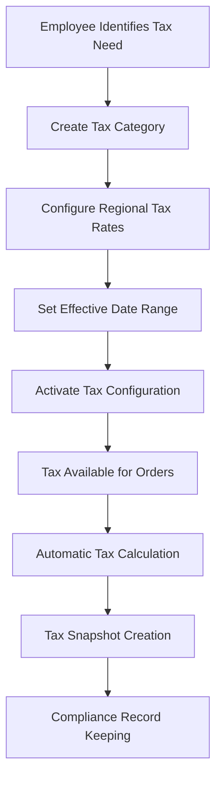
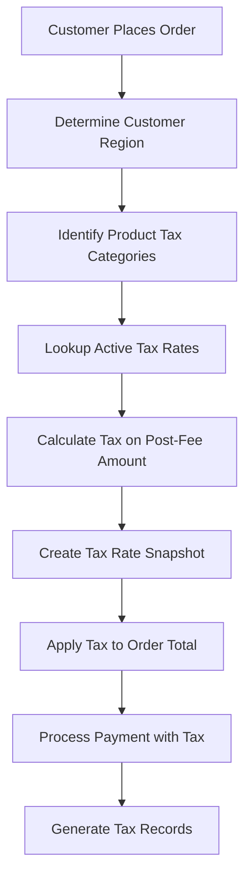
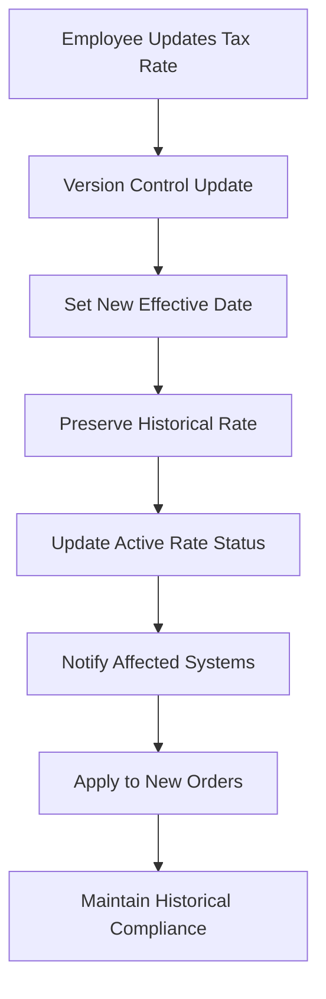
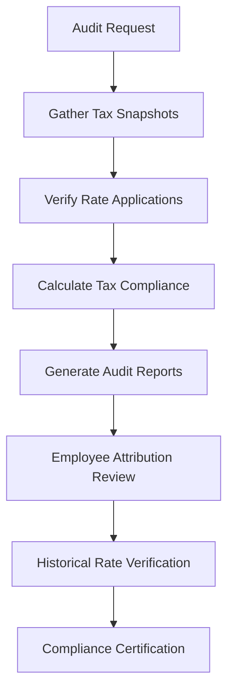

# **🏛️ Organization Tax Management System**

This README explains the comprehensive tax management architecture that enables employee-managed tax compliance, historical rate preservation, and sophisticated tax calculation within the Volmify creator economy platform.

## **🎯 System Overview**

The organization tax management system provides **employee-controlled tax administration** supporting:
- **Employee-managed tax configuration** with administrative authority for tax rate setup and modification
- **Historical tax rate snapshots** preserving point-in-time rates for order compliance and audit trails
- **Regional tax management** with geographic tax zone configuration and multi-jurisdictional compliance
- **Tax category classification** enabling product-specific tax behavior and business rule enforcement
- **Post-platform-fee tax calculations** ensuring accurate creator compensation and organizational compliance
- **Audit compliance framework** with complete tax rate change tracking and employee attribution
- **International tax support** with regional tax variations and cross-border transaction handling

## **🏗️ Core Architecture Principles**

### **1. Employee Authority Model**
```
Tax Management Authority Hierarchy:
Employee Authority (Administrative Operations)
├── Tax category creation and management
├── Tax rate configuration and updates
├── Regional tax zone setup
├── Tax rate snapshot creation for orders
└── Historical tax compliance oversight

Automated System (Transaction Processing)
├── Real-time tax calculation during checkout
├── Tax rate snapshot application to orders
├── Creator compensation tax withholding
└── Financial record integration
```

### **2. Historical Preservation Strategy**
```
Tax Rate Lifecycle Management:
Current Tax Rates (orgTaxRate)
├── Active rates for new transactions
├── Employee-managed rate updates
├── Regional and category-specific configuration
└── Effective date range management

Historical Snapshots (orgTaxRateSnapshot)
├── Point-in-time rate preservation for specific orders
├── Compliance audit trail maintenance
├── Employee attribution for rate changes
└── Immutable historical record keeping
```

### **3. Revenue Attribution Integration**
```
Tax Calculation in Creator Economy:
Customer Payment: $100
├── Gross Revenue: $100
├── Platform Fee (5%): $5
├── Processing Fee (3%): $3
├── Tax Calculation Base: $92 (post-platform fees)
├── Tax Amount (8%): $7.36
└── Net Creator Revenue: $84.64

Tax Withholding Flow:
├── Customer pays tax to organization
├── Organization remits tax to authorities
├── Creator receives post-tax net revenue
└── Tax records maintained for compliance
```

### **4. Regional Tax Architecture**
```
Multi-Jurisdictional Tax Management:
Organization (Global Operations)
├── Region A: Sales Tax (8.5%) + City Tax (1.5%)
├── Region B: VAT (20%) + Digital Services Tax (3%)
├── Region C: GST (10%) + Provincial Tax (7%)
└── Region D: Tax-free zone (0%)

Tax Category Application:
├── Digital Products: Standard digital tax rates
├── Educational Content: Reduced rates or exemptions
├── Physical Products: Standard product tax rates
└── Professional Services: Service-specific tax treatment
```

## **🏛️ Core Tax Entities & Business Purpose**

### **Tax Categories (`orgTaxCategory`)**
**Business Purpose**: Logical tax classification system for grouping products by tax behavior

```javascript
export const orgTaxCategory = table("org_tax_category", {
  id: textCols.idPk(),
  orgId: orgIdFkCol().notNull(), // Multi-tenant tax management
  code: textCols.code().notNull(), // Unique category identifier
  name: varchar("name", { length: 100 }).notNull(),
  description: text("description"),
  isActive: boolean("is_active").default(true),
  // ... audit fields
});
```

**Tax Category Business Applications:**
- **Digital Products**: E-books, software, digital downloads with digital tax rates
- **Educational Content**: Courses, tutorials with potential educational exemptions
- **Physical Products**: Tangible goods requiring standard product tax rates
- **Professional Services**: Consulting, coaching with service-specific tax treatment
- **Subscription Services**: Recurring billing with subscription tax considerations
- **Membership Access**: Community access with membership tax classifications

**Category Code Examples:**
```javascript
// Standardized tax category codes for consistency
"DIGITAL_DOWNLOAD"    // Digital products and downloadable content
"EDUCATIONAL_COURSE"  // Educational content potentially eligible for exemptions
"PHYSICAL_PRODUCT"    // Tangible goods requiring shipping and standard tax
"PROFESSIONAL_SVC"    // Professional services and consulting
"SUBSCRIPTION"        // Recurring subscription services
"MEMBERSHIP"          // Community membership and access
```

### **Tax Category Internationalization (`orgTaxCategoryI18n`)**
**Business Purpose**: Localized tax category names and descriptions for international operations

```javascript
export const orgTaxCategoryI18n = table("org_tax_category_i18n", {
  categoryId: textCols.idFk("category_id").references(() => orgTaxCategory.id).notNull(),
  localeKey: localeKeyFkCol().notNull(),
  name: varchar("name", { length: 100 }).notNull(),
  description: text("description"),
  // ... audit fields
});
```

**International Tax Category Benefits:**
- **Multi-language tax compliance**: Tax categories in local languages for customer clarity
- **Regional business rules**: Culturally appropriate tax category descriptions
- **Compliance documentation**: Tax categories in official local languages for regulatory requirements
- **Customer communication**: Clear tax information in customer's preferred language

### **Tax Rates (`orgTaxRate`)**
**Business Purpose**: Employee-managed tax rate configuration with regional and category specificity

```javascript
export const orgTaxRate = table("org_tax_rate", {
  id: textCols.idPk(),
  orgId: orgIdFkCol().notNull(),
  taxCategoryId: textCols.idFk("tax_category_id").references(() => orgTaxCategory.id).notNull(),
  regionId: textCols.idFk("region_id").references(() => orgRegion.id).notNull(),
  name: varchar("name", { length: 100 }).notNull(),
  type: orgTaxRateTypeEnum("type").notNull(),
  rate: numeric("rate", { precision: 5, scale: 4 }), // Percentage rates (8.5000%)
  amount: numeric("amount", { precision: 12, scale: 4 }), // Fixed amount taxes
  effectiveFrom: timestamp("effective_from").defaultNow(),
  effectiveTo: timestamp("effective_to"),
  isActive: boolean("is_active").default(true),
  managedByEmployeeId: employeeIdFkCol().notNull(), // Employee authority
  // ... audit fields
});
```

**Tax Rate Types & Applications:**
- **`percent`**: Percentage-based tax rates (sales tax, VAT, GST)
  - Example: 8.5% sales tax on digital products
  - Uses `rate` field for percentage calculation
  - Most common tax type for e-commerce transactions

- **`fixed`**: Fixed amount taxes regardless of transaction value
  - Example: $5 environmental fee on physical products
  - Uses `amount` field for fixed tax calculation
  - Used for regulatory fees and surcharges

**Employee Management Benefits:**
- **Administrative control**: Only employees can create and modify tax rates
- **Change attribution**: Every tax rate change tracked to specific employee
- **Approval workflows**: Potential approval processes for tax rate changes
- **Compliance oversight**: Employee responsibility for tax compliance accuracy

### **Tax Rate Snapshots (`orgTaxRateSnapshot`)**
**Business Purpose**: Historical tax rate preservation for order compliance and audit trails

```javascript
export const orgTaxRateSnapshot = table("org_tax_rate_snapshot", {
  id: textCols.idPk(),
  systemChangesVersion: integer("system_changes_version").notNull().default(0),
  modificationVersion: integer("modification_version").notNull().default(1),
  rateId: textCols.idFk("rate_id").references(() => orgTaxRate.id).notNull(),
  orderId: textCols.idFk("order_id").references(() => orgMemberOrder.id).notNull(),
  createdByEmployeeId: employeeIdFkCol().notNull(),
  
  // Snapshot data preservation
  originalTaxCategoryId: textCols.idFk("original_tax_category_id").notNull(),
  originalRegionId: textCols.idFk("original_region_id").notNull(),
  snapshotName: varchar("snapshot_name", { length: 100 }).notNull(),
  snapshotType: orgTaxRateTypeEnum("snapshot_type").notNull(),
  snapshotRate: numeric("snapshot_rate", { precision: 5, scale: 4 }),
  snapshotAmount: numeric("snapshot_amount", { precision: 12, scale: 4 }),
  snapshotEffectiveFrom: timestamp("snapshot_effective_from").notNull(),
  snapshotEffectiveTo: timestamp("snapshot_effective_to"),
  
  calculatedTaxAmount: numeric("calculated_tax_amount", { precision: 12, scale: 4 }).notNull(),
  taxBaseAmount: numeric("tax_base_amount", { precision: 12, scale: 4 }).notNull(),
  // ... audit fields
});
```

**Tax Snapshot Business Logic:**
- **Point-in-time preservation**: Exact tax rates applied to specific orders
- **Compliance audit trails**: Complete tax calculation history for regulatory requirements
- **Change management**: Track tax rate modifications with version control
- **Employee attribution**: Full accountability for tax calculations and rate applications

**Snapshot Versioning Strategy:**
```javascript
// Version control for tax rate changes and system updates
systemChangesVersion: // Platform-wide tax system changes
├── Version 0: Initial tax system implementation
├── Version 1: Enhanced regional tax support
├── Version 2: International VAT compliance
└── Version N: Future tax system enhancements

modificationVersion: // Rate-specific change tracking
├── Version 1: Initial rate creation
├── Version 2: Rate percentage update
├── Version 3: Effective date modification
└── Version N: Subsequent rate changes
```

**Tax Calculation Preservation:**
```javascript
// Complete tax calculation context preserved in snapshot
Tax Calculation Example:
Order Subtotal: $100.00
├── Tax Base Amount: $92.00 (post-platform fees)
├── Tax Rate Applied: 8.5% (snapshot preserved)
├── Calculated Tax Amount: $7.82
└── Total Order Amount: $107.82

Snapshot Records:
├── Original tax rate reference and configuration
├── Exact rate and type applied at order time
├── Calculated amounts for audit verification
└── Employee who managed the tax configuration
```

## **🌍 Regional Tax Integration**

### **Regional Tax Configuration**
Tax rates integrate with regional market configuration for geographic tax compliance:

```javascript
// Regional tax relationship structure
orgRegion (geographic markets) → orgTaxRate (region-specific rates)
├── Region: "California, USA" → Sales Tax: 8.25%
├── Region: "Ontario, Canada" → HST: 13%
├── Region: "Berlin, Germany" → VAT: 19%
└── Region: "Tokyo, Japan" → Consumption Tax: 10%

// Tax category application across regions
Tax Category: "DIGITAL_DOWNLOAD"
├── California: 8.25% sales tax
├── Ontario: 13% HST
├── Berlin: 19% VAT
└── Tokyo: 10% consumption tax
```

### **Multi-Jurisdictional Tax Compliance**
Support for complex tax jurisdictions with multiple tax layers:

```javascript
// Composite tax calculations for complex jurisdictions
United States Example:
Customer Location: "San Francisco, CA"
├── Federal Level: No digital sales tax
├── State Level: California 7.25% base sales tax
├── County Level: San Francisco County 0.25%
└── City Level: San Francisco City 0.75%
Total Tax Rate: 8.25%

European Union Example:
Customer Location: "Munich, Germany"
├── EU Level: VAT compliance requirements
├── National Level: German VAT 19%
├── State Level: Bavaria specific rules
└── Local Level: Munich business tax (B2B only)
```

## **💰 Tax Integration with Creator Economy**

### **Post-Platform-Fee Tax Calculations**
Tax calculations integrate with revenue attribution for accurate creator compensation:

```javascript
// Tax calculation in creator revenue attribution flow
Creator Revenue Attribution with Tax:

Customer Payment: $100.00
├── Platform Fee (5%): $5.00
├── Processing Fee (3%): $3.00
├── Subtotal for Tax: $92.00
├── Tax Calculation (8.5%): $7.82
├── Tax-Inclusive Total: $99.82
└── Net Creator Revenue: $84.18

Tax Attribution Breakdown:
├── Customer pays total: $107.82 (including tax)
├── Organization collects tax: $7.82
├── Organization remits tax to authorities
├── Creator receives: $84.18 (post-fees, post-tax)
└── Platform retains: $8.00 (fees)
```

### **Tax Withholding for Creator Payments**
Tax system supports creator tax withholding for compliance:

```javascript
// Creator tax withholding for 1099 contractors (US example)
Creator Compensation Tax Flow:

Gross Creator Revenue: $1000.00
├── Income Tax Withholding (10%): $100.00
├── Self-Employment Tax Reserve (15.3%): $153.00
├── Net Creator Payment: $747.00
└── Tax Withholding Remittance: $253.00

Tax Compliance Records:
├── Quarterly tax withholding reports
├── Annual 1099 form generation
├── Creator tax liability tracking
└── Tax authority remittance records
```

## **🔄 Key Tax Management Workflows**

### **Tax Rate Configuration Workflow**


### **Order Tax Calculation Workflow**


### **Tax Rate Update Workflow**


### **Tax Compliance Audit Workflow**


## **📊 Integration Points**

### **Product System Integration**
- **Product tax classification**: Products linked to tax categories for appropriate tax treatment
- **Variant tax handling**: Product variants maintain consistent tax category classification
- **Course tax exemptions**: Educational content potential tax exemptions and reduced rates
- **Digital product tax compliance**: Proper tax handling for digital downloads and online courses

### **Order Management Integration**
- **Real-time tax calculation**: Tax calculated during checkout based on customer region and product categories
- **Tax snapshot creation**: Historical tax rate preservation for every order with tax applied
- **Order total calculation**: Tax integrated into order total with proper line item breakdowns
- **Refund tax handling**: Tax refund calculations and compliance when orders are refunded

### **Revenue Attribution Integration**
- **Creator compensation**: Tax calculations impact creator revenue attribution and payments
- **Post-fee tax calculation**: Tax calculated on post-platform-fee amounts for accuracy
- **Tax withholding**: Creator tax withholding integration for compliance requirements
- **Financial reporting**: Tax data integration with financial systems for accounting compliance

### **Regional Market Integration**
- **Geographic tax zones**: Tax rates linked to regional market configuration and customer locations
- **International tax compliance**: Multi-jurisdictional tax handling for global commerce
- **Currency tax calculations**: Tax calculations in local currencies with proper conversion handling
- **Regional tax exemptions**: Support for tax-free zones and regional exemptions

## **🛡️ Security & Compliance Architecture**

### **Employee Authority Controls**
- **Tax rate management**: Only employees can create, modify, and activate tax rates
- **Historical preservation**: Immutable tax snapshots prevent tampering with compliance records
- **Change attribution**: Every tax configuration change tracked to specific employee
- **Approval workflows**: Potential multi-employee approval for significant tax changes

### **Audit Trail Compliance**
- **Complete tax history**: Full audit trail from tax rate creation through order application
- **Regulatory compliance**: Tax records maintained in compliance with regional tax authority requirements
- **Historical preservation**: Tax snapshots preserved indefinitely for audit and compliance purposes
- **Employee accountability**: Clear attribution of tax decisions and configurations to responsible employees

### **Data Integrity Protection**
- **Immutable snapshots**: Tax rate snapshots cannot be modified once created for compliance protection
- **Version control**: Systematic versioning of tax rate changes and system updates
- **Calculation verification**: Tax calculations can be verified against historical snapshots
- **Cross-reference validation**: Tax data cross-referenced with order and payment records

## **🚀 Development Patterns**

### **Tax Configuration Management**
```javascript
// Tax category and rate creation
const createTaxConfiguration = async (orgId, employeeId, categoryData, rateData) => {
  // Create tax category
  const category = await createTaxCategory({
    orgId,
    code: categoryData.code,
    name: categoryData.name,
    description: categoryData.description,
    managedByEmployeeId: employeeId
  });
  
  // Create regional tax rates
  for (const regionRate of rateData.regionalRates) {
    await createTaxRate({
      orgId,
      taxCategoryId: category.id,
      regionId: regionRate.regionId,
      type: regionRate.type,
      rate: regionRate.rate,
      amount: regionRate.amount,
      effectiveFrom: regionRate.effectiveFrom,
      managedByEmployeeId: employeeId
    });
  }
  
  return category;
};

// Tax rate lookup for order processing
const getActiveTaxRates = async (orgId, regionId, taxCategoryIds) => {
  const currentDate = new Date();
  
  return await db.select()
    .from(orgTaxRate)
    .where(and(
      eq(orgTaxRate.orgId, orgId),
      eq(orgTaxRate.regionId, regionId),
      inArray(orgTaxRate.taxCategoryId, taxCategoryIds),
      eq(orgTaxRate.isActive, true),
      lte(orgTaxRate.effectiveFrom, currentDate),
      or(
        isNull(orgTaxRate.effectiveTo),
        gte(orgTaxRate.effectiveTo, currentDate)
      )
    ));
};
```

### **Tax Calculation Engine**
```javascript
// Order tax calculation with snapshot creation
const calculateOrderTax = async (order, customerRegion, employeeId) => {
  const taxCalculations = [];
  
  for (const orderItem of order.items) {
    // Get product tax category
    const product = await getProductWithTaxCategory(orderItem.productId);
    
    // Find applicable tax rate
    const taxRate = await getActiveTaxRate(
      order.orgId, 
      customerRegion.id, 
      product.taxCategoryId
    );
    
    if (taxRate) {
      // Calculate tax on post-platform-fee amount
      const taxBaseAmount = orderItem.lineTotal; // Post-fee amount
      const taxAmount = calculateTaxAmount(taxBaseAmount, taxRate);
      
      // Create tax snapshot for compliance
      const snapshot = await createTaxSnapshot({
        orderId: order.id,
        rateId: taxRate.id,
        createdByEmployeeId: employeeId,
        taxBaseAmount,
        calculatedTaxAmount: taxAmount,
        snapshotData: { ...taxRate } // Preserve current rate configuration
      });
      
      taxCalculations.push({
        orderItemId: orderItem.id,
        taxSnapshotId: snapshot.id,
        taxAmount,
        taxRate: taxRate.rate || taxRate.amount
      });
    }
  }
  
  return taxCalculations;
};

// Tax amount calculation based on rate type
const calculateTaxAmount = (baseAmount, taxRate) => {
  if (taxRate.type === 'percent') {
    return baseAmount * (taxRate.rate / 100);
  } else if (taxRate.type === 'fixed') {
    return taxRate.amount;
  }
  return 0;
};
```

### **Tax Compliance Reporting**
```javascript
// Tax compliance report generation
const generateTaxComplianceReport = async (orgId, startDate, endDate) => {
  // Aggregate tax collections by region and category
  const taxSummary = await db.select({
    regionName: orgRegion.name,
    categoryName: orgTaxCategory.name,
    totalTaxCollected: sum(orgTaxRateSnapshot.calculatedTaxAmount),
    orderCount: count(orgTaxRateSnapshot.orderId),
    averageTaxRate: avg(orgTaxRateSnapshot.snapshotRate)
  })
  .from(orgTaxRateSnapshot)
  .innerJoin(orgMemberOrder, eq(orgMemberOrder.id, orgTaxRateSnapshot.orderId))
  .innerJoin(orgTaxCategory, eq(orgTaxCategory.id, orgTaxRateSnapshot.originalTaxCategoryId))
  .innerJoin(orgRegion, eq(orgRegion.id, orgTaxRateSnapshot.originalRegionId))
  .where(and(
    eq(orgMemberOrder.orgId, orgId),
    between(orgTaxRateSnapshot.createdAt, startDate, endDate)
  ))
  .groupBy(orgRegion.id, orgTaxCategory.id);
  
  return {
    reportPeriod: { startDate, endDate },
    taxSummary,
    totalTaxCollected: taxSummary.reduce((sum, item) => sum + item.totalTaxCollected, 0),
    complianceStatus: 'compliant' // Based on audit checks
  };
};

// Historical tax rate audit
const auditTaxRateHistory = async (taxRateId) => {
  const rateHistory = await db.select()
    .from(orgTaxRateSnapshot)
    .innerJoin(orgEmployee, eq(orgEmployee.id, orgTaxRateSnapshot.createdByEmployeeId))
    .where(eq(orgTaxRateSnapshot.rateId, taxRateId))
    .orderBy(desc(orgTaxRateSnapshot.createdAt));
    
  return rateHistory.map(record => ({
    snapshotDate: record.createdAt,
    employeeName: record.orgEmployee.professionalDisplayName,
    rateApplied: record.snapshotRate || record.snapshotAmount,
    orderId: record.orderId,
    taxAmount: record.calculatedTaxAmount
  }));
};
```

## **📈 Scalability & Future Enhancements**

### **Advanced Tax Compliance**
- **Automated tax reporting**: Integration with tax authority APIs for automated reporting
- **Multi-jurisdictional compliance**: Enhanced support for complex international tax scenarios
- **Tax exemption management**: Sophisticated exemption handling for non-profit and educational organizations
- **Real-time tax validation**: Integration with tax validation services for rate accuracy

### **Enhanced Creator Economy Tax Features**
- **Creator tax withholding**: Automated tax withholding for creator payments based on jurisdiction
- **International creator compliance**: Tax compliance for creators operating across multiple countries
- **Tax-optimized revenue attribution**: Revenue attribution optimization considering tax implications
- **Creator tax reporting**: Automated tax document generation for creator tax compliance

### **Business Intelligence & Analytics**
- **Tax performance analytics**: Advanced analytics on tax collection efficiency and compliance
- **Regional tax optimization**: Data-driven recommendations for tax strategy optimization
- **Compliance risk assessment**: Automated assessment of tax compliance risks and recommendations
- **Tax rate impact analysis**: Analysis of tax rate changes on sales and creator compensation

### **Integration Enhancements**
- **Accounting system integration**: Direct integration with accounting systems for tax record synchronization
- **Payment processor tax handling**: Enhanced integration with payment processors for tax collection
- **ERP system integration**: Integration with enterprise resource planning systems for comprehensive tax management
- **Tax calculation APIs**: External API integration for advanced tax calculation services

## **🎯 Key Architecture Benefits**

### **1. Employee-Controlled Tax Management**
- **Administrative authority**: Clear employee responsibility for tax configuration and compliance
- **Change attribution**: Complete accountability for tax decisions and modifications
- **Approval workflows**: Structured approval processes for tax rate changes and configurations
- **Professional oversight**: Qualified employee management of complex tax requirements

### **2. Comprehensive Audit Compliance**
- **Historical preservation**: Complete tax rate history preserved in immutable snapshots
- **Point-in-time accuracy**: Exact tax calculations preserved for audit verification
- **Regulatory compliance**: Tax records maintained in compliance with audit requirements
- **Change tracking**: Full audit trail of tax rate modifications and applications

### **3. Creator Economy Integration**
- **Post-fee tax calculations**: Accurate tax calculations on creator-relevant revenue amounts
- **Revenue attribution impact**: Tax considerations properly integrated into creator compensation
- **International creator support**: Tax compliance for creators operating across multiple jurisdictions
- **Transparent tax handling**: Clear visibility into tax impact on creator earnings

### **4. Multi-Jurisdictional Support**
- **Regional tax configuration**: Flexible configuration for different geographic tax requirements
- **International commerce**: Support for global commerce with appropriate tax handling
- **Complex jurisdiction support**: Handling of multiple tax layers (federal, state, local)
- **Tax exemption support**: Proper handling of tax exemptions and reduced rates

### **5. Scalable Tax Architecture**
- **Category-based classification**: Flexible product classification enabling appropriate tax treatment
- **Version control**: Systematic versioning supporting tax system evolution
- **Integration readiness**: Architecture supporting integration with external tax services
- **Performance optimization**: Efficient tax calculation and lookup patterns for high-volume commerce

This organization tax management system provides the **essential tax compliance infrastructure** for a **sophisticated creator economy platform** with **employee-managed tax administration**, **comprehensive audit compliance**, **regional tax support**, and **creator revenue integration**.

The architecture enables **accurate tax calculations**, **historical compliance preservation**, **multi-jurisdictional operations**, and **transparent creator compensation** while maintaining **employee accountability** and **audit compliance**, perfectly supporting the Volmify creator economy platform's tax management requirements.
