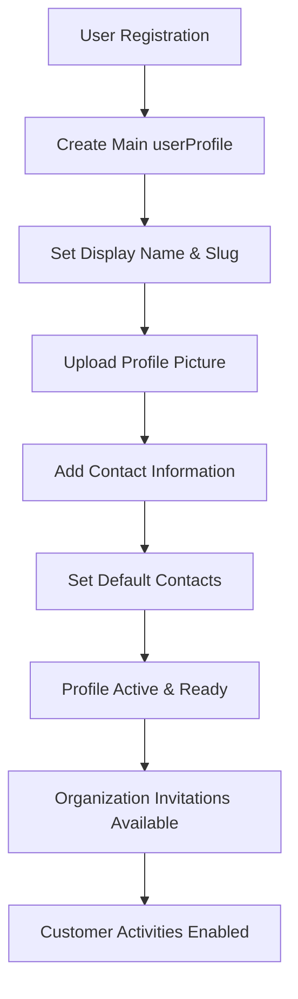
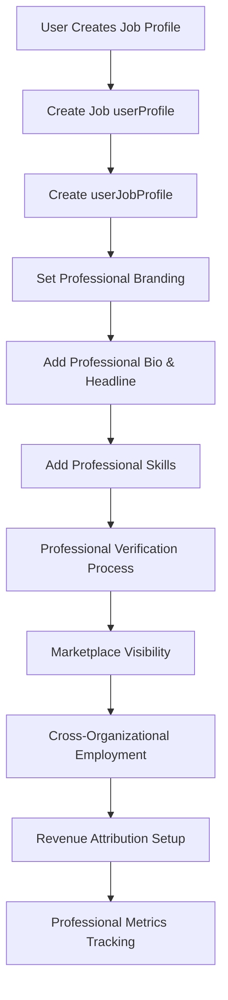
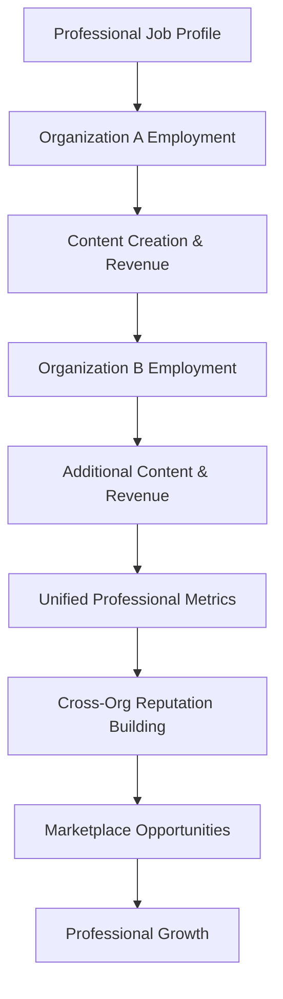
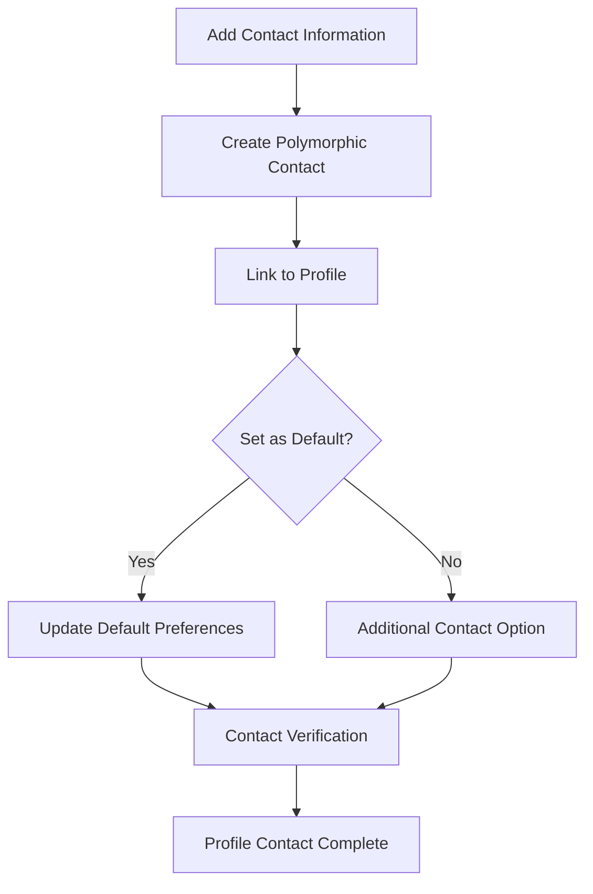

# **👤 User Profile & Professional Identity System**

This README explains the comprehensive user profile and professional identity architecture that enables cross-organizational reputation building and sophisticated creator economy features within the Volmify platform.

## **🎯 System Overview**

The user profile system provides a **multi-faceted identity architecture** supporting:
- **Main customer profiles** for learning and purchasing activities across organizations
- **Professional job profiles** for creator economy participation and cross-organizational reputation
- **Contact information management** with polymorphic contact data and default preferences
- **SEO-optimized professional profiles** for discoverability and marketplace features
- **Organization membership tracking** with flexible affiliation types and connection methods
- **Skills and metrics tracking** for professional development and performance analytics
- **Cross-organizational continuity** enabling users to maintain consistent professional identity

## **🏗️ Core Architecture Principles**

### **1. Multi-Profile Identity Strategy**
```
User (platform-wide identity)
├── userProfile (type="main") → Customer activities across organizations
│   ├── Learning and course enrollment
│   ├── Product purchases and orders
│   ├── Community participation
│   └── Gift card usage
└── userProfile (type="job") → Professional identity spanning organizations
    ├── userJobProfile → Creator economy participation
    ├── Revenue attribution and compensation
    ├── Cross-organizational reputation building
    ├── Professional skills and metrics tracking
    └── Marketplace visibility and networking
```

### **2. Cross-Organizational Professional Continuity**
```
Professional Identity Flow:
userProfile (job) → userJobProfile → Multiple orgEmployee roles
├── Organization A: Course creator (70% revenue share)
├── Organization B: Consultant (80% revenue share)  
├── Organization C: Mentor (60% revenue share)
└── Unified professional reputation across all organizations
```

### **3. Contact Information Architecture**
```
Profile Contact Strategy:
userProfile → userProfileContactInfo → contactInfo (polymorphic)
├── Email contacts with verification status
├── Phone contacts with regional formatting
├── Social media profiles and professional networks
├── Physical addresses with geocoding
└── Default contact preferences per profile type
```

### **4. SEO & Professional Discoverability**
```
Professional SEO Strategy:
userJobProfile → userProfileI18n → seoMetadata
├── Localized professional descriptions
├── SEO-optimized professional titles and specializations
├── Structured data for search engine visibility
├── Professional portfolio discoverability
└── Marketplace search optimization
```

## **👥 Core Entities & Their Business Purpose**

### **User Profiles (`userProfile`)**
**Business Purpose**: Multi-faceted user identity enabling customer and professional activities

```javascript
export const userProfile = table("user_profile", {
  id: textCols.idPk(),
  userId: userIdFkCol().notNull(),
  slug: textCols.slug().notNull(),
  displayName: textCols.displayName().notNull(),
  profilePictureUrl: textCols.url("profile_picture_url"),
  isActive: sharedCols.isActive(),
  type: userProfileTypeEnum("type").default("main"), // "main" | "job"
  // ... audit fields
});
```

**Profile Types & Business Context:**
- **`main`**: Primary customer profile for learning and purchasing
  - **One per user**: Enforced via unique constraint
  - **Customer activities**: Course enrollment, product purchases, community participation
  - **Organization membership**: Can be member/customer across multiple organizations
  - **Financial context**: Order placement, gift card usage, customer transaction history

- **`job`**: Professional creator profile for revenue attribution
  - **Multiple allowed**: Users can have multiple professional identities
  - **Creator activities**: Content creation, professional services, revenue attribution
  - **Cross-organizational**: Professional reputation spanning multiple organizations
  - **Marketplace presence**: Professional discoverability and networking

**Key Capabilities:**
- **Slug-based URLs**: SEO-friendly profile URLs for professional discoverability
- **Flexible display names**: Different professional vs customer identities
- **Profile pictures**: Visual identity for community and professional interactions
- **Active status management**: Profile visibility and availability control

### **Professional Job Profiles (`userJobProfile`)**
**Business Purpose**: Creator economy professional identity with cross-organizational reputation

```javascript
export const userJobProfile = table("user_job_profile", {
  userProfileId: userProfileIdFkCol().notNull(), // Primary key (1:1 with job profile)
  slug: textCols.slug().notNull(),
  verifiedAt: temporalCols.business.verifiedAt(),
  displayName: textCols.displayName().notNull(),
  headline: textCols.tagline("headline").notNull(),
  bio: textCols.shortDescription("bio").notNull(),
  // ... audit fields
});
```

**Professional Identity Features:**
- **Unique professional slug**: Branded professional URL for marketplace presence
- **Verification system**: Professional identity verification for trust and credibility
- **Professional branding**: Specialized headline and bio for creator positioning
- **Cross-organizational continuity**: Maintains professional identity across organizations

**Revenue Attribution Integration:**
```javascript
// Job profile links to employee roles across organizations
userJobProfile → orgEmployee (multiple organizations)
├── Revenue attribution: Post-platform-fee calculations
├── Professional compensation: Transparent creator earnings
├── Performance tracking: Metrics across all organizations
└── Reputation building: Unified professional scoring
```

### **Job Profile Skills (`userJobProfileSkill`)**
**Business Purpose**: Professional skill tracking and marketplace positioning

```javascript
export const userJobProfileSkill = table("user_job_profile_skill", {
  id: textCols.idPk(),
  jobProfileId: userJobProfileIdFkCol().notNull(),
  skillId: textCols.idFk("skill_id").notNull(), // References platform skill taxonomy
  createdAt: temporalCols.audit.createdAt(),
  // ... skill configuration
});
```

**Skill System Benefits:**
- **Platform skill taxonomy**: Consistent skill definitions across organizations
- **Professional positioning**: Skills-based marketplace discovery and matching
- **Revenue correlation**: Skills linked to revenue attribution and performance
- **Career development**: Skill progression tracking across professional activities

### **Job Profile Metrics (`userJobProfileMetrics`)**
**Business Purpose**: Professional performance analytics and reputation scoring

```javascript
export const userJobProfileMetrics = table("user_job_profile_metrics", {
  id: textCols.idPk(),
  jobProfileId: userJobProfileIdFkCol().notNull(),
  
  // Overall metrics
  total: integer("total").default(0),
  ratingTotal: numericCols.ratingTotal("rating_total").default(0),
  ratingCount: numericCols.ratingCount("rating_count").default(0),
  ratingAvg: numericCols.ratingAgg("rating_avg").default("0.00"),
  reviewsCount: integer("reviews_count").default(0),
  revenueGeneratedTotal: numericCols.currency.price("revenue_generated_total").default("0.00"),
  payoutsTotal: numericCols.currency.price("payouts_total").default("0.00"),
  studentsCount: integer("students_count").default(0),
  
  // Course-specific metrics
  coursesTotal: integer("courses_total").default(0),
  coursesRatingAvg: numericCols.ratingAgg("courses_rating_avg").default("0.00"),
  coursesRevenueGeneratedTotal: numericCols.currency.price("courses_revenue_generated_total").default("0.00"),
  // ... additional course metrics
});
```

**Professional Analytics Features:**
- **Cross-organizational aggregation**: Metrics combine performance across all organizations
- **Revenue transparency**: Total earnings and payout tracking for creator compensation
- **Student impact tracking**: Student counts and completion rates across all activities
- **Rating and review aggregation**: Professional reputation scoring from all organizations
- **Course-specific analytics**: Detailed performance metrics for educational content creation

### **Profile Internationalization (`userProfileI18n`)**
**Business Purpose**: Localized professional content for global marketplace presence

```javascript
export const userProfileI18n = table("user_profile_i18n", {
  userProfileId: userProfileIdFkCol().notNull(),
  localeKey: localeKeyFkCol().notNull(),
  bio: text("bio"),
  seoMetadataId: seoMetadataIdFkCol(),
  // ... localized content
});
```

**Localization Benefits:**
- **Global marketplace presence**: Professional profiles in multiple languages
- **SEO optimization**: Localized content for regional search engine visibility
- **Cultural adaptation**: Professional messaging adapted to local markets
- **International creator economy**: Cross-border professional services and content

### **Profile Contact Information (`userProfileContactInfo`)**
**Business Purpose**: Flexible contact management with default preferences

```javascript
export const userProfileContactInfo = table("user_profile_contact_info", {
  id: textCols.idPk(),
  userProfileId: userProfileIdFkCol().notNull(),
  contactInfoId: textCols.idFk("contact_info_id").notNull(), // Polymorphic contact data
  isDefault: boolean("is_default").default(false),
  // ... contact configuration
});
```

**Contact Management Features:**
- **Polymorphic contact data**: Supports email, phone, social media, addresses
- **Default contact preferences**: Primary contact method per profile type
- **Profile-specific contacts**: Different contact info for customer vs professional profiles
- **Contact verification**: Integration with contact verification systems

### **Organization Membership Tracking (`userProfileOrgMembership`)**
**Business Purpose**: Cross-organizational relationship tracking and lifecycle management

```javascript
export const userProfileOrgMembership = table("user_profile_org_membership", {
  id: textCols.idPk(),
  userProfileId: userProfileIdFkCol().notNull(),
  orgMemberId: orgMemberIdFkCol().notNull(),
  joinedAt: temporalCols.activity.joinedAt().defaultNow(),
  approvedAt: timestamp("approved_at"),
  startedAt: timestamp("started_at").defaultNow(),
  endedAt: timestamp("ended_at"),
  affiliationType: userProfileOrgMembershipAffiliationTypeEnum("affiliation_type").notNull(),
  connectionMethod: userProfileOrgMembershipConnectionMethodEnum("connection_method"),
  applicationNotes: text("application_notes"),
  // ... membership tracking
});
```

**Affiliation Types & Business Context:**
- **`owner`**: Organization ownership and equity stake
- **`employee`**: Staff employment with revenue attribution rights
- **`contractor`**: Independent contractor relationship with project-based compensation
- **`guest`**: Temporary access for specific activities or collaborations
- **`partner`**: Business partnership with strategic collaboration
- **`volunteer`**: Community volunteer participation

**Connection Methods:**
- **`email`**: Digital recruitment and invitation process
- **`phone`**: Phone-based recruitment and relationship building
- **`in-person`**: Face-to-face meetings and traditional networking
- **`other`**: Alternative connection methods and referral systems

**Lifecycle Tracking Benefits:**
- **Relationship history**: Complete audit trail of organizational relationships
- **Status transitions**: Tracking from invitation through active participation to conclusion
- **Application context**: Notes and context for relationship initiation and development
- **Approval workflows**: Administrative oversight for sensitive organizational relationships

## **🔄 Key Business Workflows**

### **Customer Profile Creation Workflow**


### **Professional Profile Creation Workflow**


### **Cross-Organizational Professional Flow**


### **Contact Information Management**


## **💰 Creator Economy Integration**

### **Revenue Attribution Through Professional Profiles**
Professional job profiles serve as the foundation for cross-organizational creator compensation:

```javascript
// Professional identity enables revenue attribution across organizations
userJobProfile → orgEmployee (Org A) → productAttribution → revenueShare (70%)
userJobProfile → orgEmployee (Org B) → productAttribution → revenueShare (80%)
userJobProfile → orgEmployee (Org C) → productAttribution → revenueShare (60%)

// Unified metrics aggregate across all organizations
userJobProfileMetrics.revenueGeneratedTotal = Org A + Org B + Org C revenue
```

### **Professional Reputation Building**
Job profiles accumulate reputation across organizational boundaries:

```javascript
// Cross-organizational reputation calculation
Professional Rating = weighted_average([
  orgA_rating * orgA_student_count,
  orgB_rating * orgB_student_count,
  orgC_rating * orgC_student_count
])

// Professional portfolio building
Total Students = orgA_students + orgB_students + orgC_students
Total Revenue = orgA_revenue + orgB_revenue + orgC_revenue
Average Completion Rate = weighted_average([orgA_completion, orgB_completion, orgC_completion])
```

### **Marketplace Positioning**
Professional profiles enable sophisticated marketplace features:

```javascript
// Skill-based matching
jobProfile.skills → marketplace_opportunities
├── Matching creators to organization needs
├── Skills-based pricing recommendations  
├── Professional development path suggestions
└── Cross-organizational collaboration opportunities

// SEO and discoverability
jobProfile.slug → professional_url → marketplace_visibility
├── Search engine optimization for professional services
├── Professional portfolio showcase
├── Social media integration
└── Professional networking opportunities
```

## **🌍 Internationalization & SEO Architecture**

### **Localized Professional Content**
Professional profiles support comprehensive internationalization:

```javascript
// Multi-language professional presence
userProfileI18n entries per locale:
├── English: "Senior Full-Stack Developer & Course Creator"
├── Spanish: "Desarrollador Full-Stack Senior y Creador de Cursos" 
├── French: "Développeur Full-Stack Senior et Créateur de Cours"
└── German: "Senior Full-Stack-Entwickler und Kursersteller"

// Each localization includes:
├── Localized bio and professional description
├── SEO metadata for regional search visibility
├── Cultural adaptation of professional messaging
└── Regional keyword optimization
```

### **Professional SEO Optimization**
SEO metadata enables professional discoverability:

```javascript
// Professional SEO strategy
seoMetadata for job profiles:
├── title: "Sarah Johnson - Senior JavaScript Developer & Course Creator"
├── description: "Expert JavaScript developer with 8+ years experience. Creates comprehensive web development courses."
├── keywords: "javascript, react, node.js, web development, online courses"
├── structuredData: Professional portfolio schema markup
└── openGraph: Social media sharing optimization
```

## **📊 Integration Points**

### **Organization Management Integration**
- **Organization membership**: Profile-based membership tracking across organizations
- **Employee relationships**: Professional profiles linked to employee roles
- **Revenue attribution**: Creator compensation through professional identity
- **Administrative authority**: Professional profiles enable administrative capabilities

### **Product System Integration**
- **Content creation**: Professional profiles enable product creation and management
- **Revenue attribution**: Product sales attributed to professional creators
- **Professional branding**: Creator identity associated with products and courses
- **Course instruction**: Professional profiles linked to educational content delivery

### **Financial System Integration**
- **Creator compensation**: Revenue attribution through professional identity
- **Cross-organizational earnings**: Unified financial tracking across organizations
- **Professional metrics**: Financial performance analytics and reporting
- **Tax compliance**: Professional income tracking for tax reporting requirements

### **Contact Management Integration**
- **Polymorphic contact data**: Flexible contact information for customer and professional profiles
- **Verification systems**: Contact verification for trust and security
- **Communication preferences**: Contact method preferences for different profile types
- **Professional networking**: Contact sharing for professional collaboration

## **🛡️ Security & Privacy Architecture**

### **Profile-Level Security**
- **Profile type isolation**: Clear separation between customer and professional data
- **Contact information protection**: Secure handling of sensitive contact data
- **Professional verification**: Identity verification for professional credibility
- **Cross-organizational privacy**: Secure handling of multi-organizational relationships

### **Professional Identity Protection**
- **Professional reputation integrity**: Protection against manipulation of metrics and ratings
- **Revenue attribution security**: Secure calculation and distribution of creator compensation
- **Skill verification**: Validation of professional skills and capabilities
- **Contact verification**: Security measures for professional contact information

### **Data Privacy Compliance**
- **Profile data ownership**: Clear data ownership and control for users
- **Cross-organizational data handling**: Compliant data sharing across organizational boundaries
- **Contact information privacy**: Secure management of personal contact data
- **Professional portfolio privacy**: Control over professional information visibility

## **🚀 Development Patterns**

### **Profile Management Example**
```javascript
// Create customer profile (main type)
const createCustomerProfile = async (userId, displayName, profileData) => {
  return await db.insert(userProfile).values({
    userId,
    displayName,
    slug: generateUniqueSlug(displayName),
    type: "main",
    isActive: true,
    ...profileData
  });
};

// Create professional profile (job type)
const createProfessionalProfile = async (userId, professionalData) => {
  // Create job-type profile
  const jobProfile = await db.insert(userProfile).values({
    userId,
    displayName: professionalData.displayName,
    slug: generateUniqueSlug(professionalData.displayName),
    type: "job",
    isActive: true
  });
  
  // Create extended job profile
  const userJobProfile = await db.insert(userJobProfile).values({
    userProfileId: jobProfile.id,
    slug: generateProfessionalSlug(professionalData.professionalName),
    displayName: professionalData.professionalName,
    headline: professionalData.headline,
    bio: professionalData.bio
  });
  
  // Initialize metrics
  await db.insert(userJobProfileMetrics).values({
    jobProfileId: jobProfile.id,
    // ... initial metric values
  });
  
  return { jobProfile, userJobProfile };
};
```

### **Contact Information Management**
```javascript
// Add contact information to profile
const addProfileContact = async (userProfileId, contactType, contactData, isDefault = false) => {
  // Create polymorphic contact info
  const contact = await db.insert(contactInfo).values({
    type: contactType,
    data: contactData,
    isVerified: false
  });
  
  // Link to profile
  const profileContact = await db.insert(userProfileContactInfo).values({
    userProfileId,
    contactInfoId: contact.id,
    isDefault
  });
  
  // Update default preferences if needed
  if (isDefault) {
    await db.update(userProfileContactInfo)
      .set({ isDefault: false })
      .where(and(
        eq(userProfileContactInfo.userProfileId, userProfileId),
        ne(userProfileContactInfo.id, profileContact.id)
      ));
  }
  
  return profileContact;
};

// Get profile's default contact
const getDefaultContact = async (userProfileId, contactType) => {
  return await db.select()
    .from(userProfileContactInfo)
    .innerJoin(contactInfo, eq(contactInfo.id, userProfileContactInfo.contactInfoId))
    .where(and(
      eq(userProfileContactInfo.userProfileId, userProfileId),
      eq(userProfileContactInfo.isDefault, true),
      eq(contactInfo.type, contactType)
    ));
};
```

### **Professional Skills Management**
```javascript
// Add skill to professional profile
const addProfessionalSkill = async (jobProfileId, skillId) => {
  return await db.insert(userJobProfileSkill).values({
    jobProfileId,
    skillId,
    createdAt: new Date()
  });
};

// Get professional skills with details
const getProfessionalSkills = async (jobProfileId) => {
  return await db.select({
    skill: skill,
    addedAt: userJobProfileSkill.createdAt
  })
  .from(userJobProfileSkill)
  .innerJoin(skill, eq(skill.id, userJobProfileSkill.skillId))
  .where(eq(userJobProfileSkill.jobProfileId, jobProfileId));
};

// Update professional metrics
const updateProfessionalMetrics = async (jobProfileId, metricsUpdate) => {
  return await db.update(userJobProfileMetrics)
    .set({
      ...metricsUpdate,
      lastUpdatedAt: new Date()
    })
    .where(eq(userJobProfileMetrics.jobProfileId, jobProfileId));
};
```

### **Cross-Organizational Query Patterns**
```javascript
// Get user's professional activities across organizations
const getCrossOrgProfessionalActivity = async (userJobProfileId) => {
  return await db.select({
    organization: org.name,
    employeeRole: orgEmployee.role,
    revenueGenerated: sum(orgEmployeeProductAttributionRevenue.attributedRevenue),
    studentsCount: count(distinct(orgMemberOrder.memberId))
  })
  .from(userJobProfile)
  .innerJoin(orgEmployee, eq(orgEmployee.jobProfileId, userJobProfile.userProfileId))
  .innerJoin(org, eq(org.id, orgEmployee.orgId))
  .leftJoin(orgEmployeeProductAttribution, eq(orgEmployeeProductAttribution.employeeId, orgEmployee.id))
  .leftJoin(orgEmployeeProductAttributionRevenue, eq(orgEmployeeProductAttributionRevenue.attributionId, orgEmployeeProductAttribution.id))
  .where(eq(userJobProfile.userProfileId, userJobProfileId))
  .groupBy(org.id, orgEmployee.id);
};

// Get professional reputation metrics
const getProfessionalReputation = async (userJobProfileId) => {
  const metrics = await db.select()
    .from(userJobProfileMetrics)
    .where(eq(userJobProfileMetrics.jobProfileId, userJobProfileId));
    
  return {
    overallRating: metrics.ratingAvg,
    totalStudents: metrics.studentsCount,
    totalRevenue: metrics.revenueGeneratedTotal,
    totalCourses: metrics.coursesTotal,
    completionRate: metrics.completedByStudentsCount / metrics.studentsCount,
    professionalScore: calculateProfessionalScore(metrics)
  };
};
```

## **📈 Scalability & Future Enhancements**

### **Professional Marketplace Evolution**
- **Skills-based matching**: AI-driven matching between creators and organizational needs
- **Dynamic pricing recommendations**: Market-based pricing suggestions for professional services
- **Professional certification system**: Skill verification and professional credentialing
- **Creator collaboration tools**: Multi-creator project management and revenue sharing

### **Advanced Analytics & Insights**
- **Predictive professional analytics**: Career development and earning potential predictions
- **Market positioning insights**: Competitive analysis and positioning recommendations  
- **Professional development paths**: Personalized skill development and career growth suggestions
- **Cross-organizational performance comparison**: Benchmarking across different organizational contexts

### **Enhanced Contact & Communication**
- **Professional networking features**: LinkedIn-style professional networking and connections
- **Communication preferences**: Sophisticated contact method preferences and availability
- **Professional calendar integration**: Scheduling and availability management for professional services
- **Contact verification automation**: Automated contact verification and trust scoring

### **Global Professional Services**
- **Regional professional certification**: Location-specific professional credentials and compliance
- **Multi-currency professional billing**: International professional service billing and payments
- **Cultural adaptation tools**: Professional content adaptation for different cultural contexts
- **Global marketplace integration**: Cross-border professional service delivery and collaboration

This user profile and professional identity system provides the foundation for a **sophisticated creator economy platform** with **cross-organizational professional continuity**, **transparent revenue attribution**, **comprehensive professional analytics**, and **scalable marketplace features** that enable professional growth and collaboration across organizational boundaries.

The architecture supports **professional reputation building**, **skills-based positioning**, **international marketplace presence**, and **flexible identity management** while maintaining clear separation between customer and professional activities, perfectly aligning with the Volmify creator economy vision for professional development and cross-organizational collaboration.
