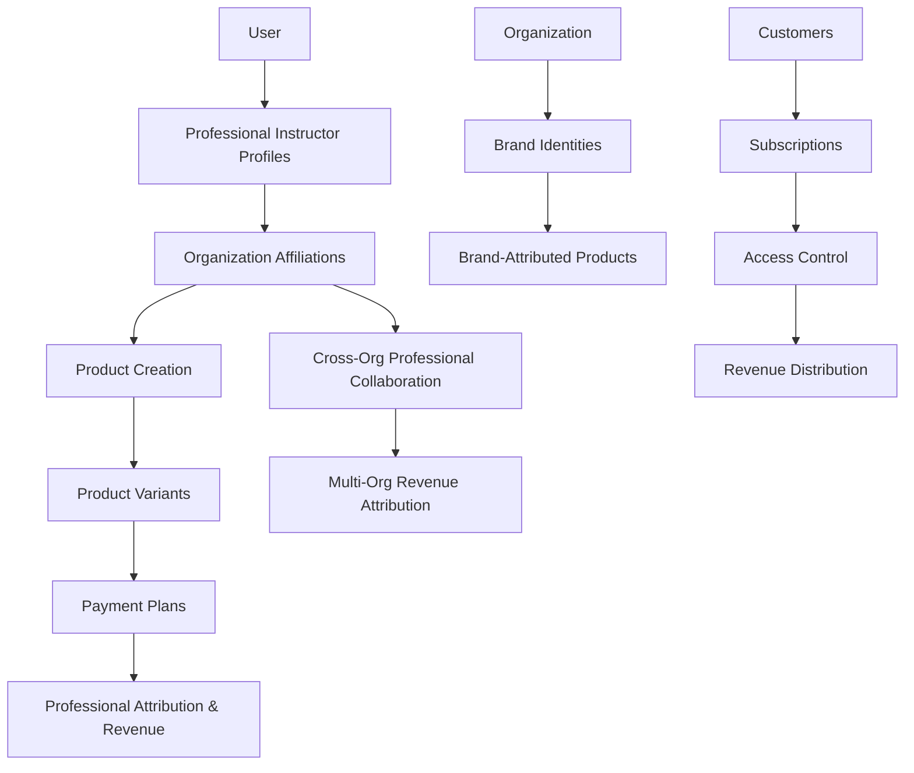
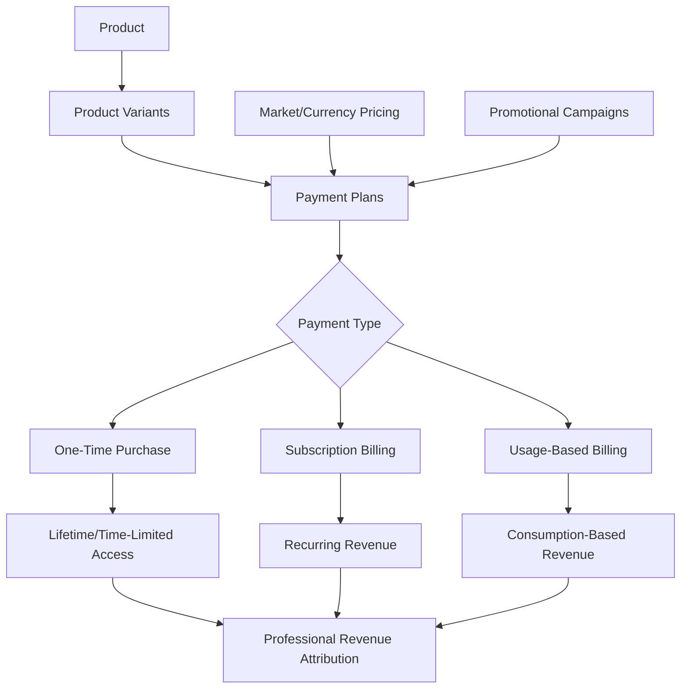

# **📚 Volmify Database Schema Overview**

## **🎓 What Volmify Is**

### **Primary Purpose**
A **multi-tenant B2B SaaS educational content platform** that enables organizations to create, manage, and monetize **diverse product catalogs** including online courses, digital products, physical goods, and services through a sophisticated **creator economy** supporting instructors and organizational brands with cross-organizational professional collaboration.

### **🏢 Multi-Tenant E-commerce Platform Architecture**
- **Organizations** as primary tenants with complete data isolation and independent business models
- **Professional Creator System**: Instructors and content creators with specialized expertise across multiple domains
- **Cross-Organizational Networks**: Professionals can collaborate across organizational boundaries while maintaining identity
- **Organization-Scoped Branding**: Each organization manages its own brand identities for comprehensive product marketing
- **Integrated Payment Strategy**: Sophisticated monetization through variant-level payment plans eliminating pricing redundancy

## **📚 Creator Economy with Professional Attribution**

### **Content Creation Model**
1. **Professional Instructors**: Educational experts creating courses, training materials, and educational services
2. **Content Creators**: Digital content professionals across multiple creative domains
3. **Organization Brands**: Corporate product branding and professional content attribution
4. **Cross-Organizational Collaboration**: Professionals working with multiple organizations while maintaining identity

### **Professional Identity System**
- **Multi-Profile Professionals**: Users can have multiple professional profiles for different specializations
- **Global Professional Identity**: Creators maintain professional reputation across organizational contexts
- **Cross-Organizational Affiliations**: Complex professional collaboration and partnership networks
- **Revenue Attribution Tracking**: Clear professional compensation based on content contribution and attribution

## **🌟 Core Architecture Features**

### **📚 Professional Attribution System**
- **Organization Brand Attribution**: Corporate product content under organization brand identities
- **Professional Creator Attribution**: Individual creator content ownership and professional recognition
- **Multi-Creator Collaboration**: Teams of professionals creating products together across organizations
- **Revenue Sharing Models**: Flexible attribution-based revenue distribution for product sales and subscriptions

### **💰 Creator Economy Monetization with Integrated Payment Plans**
- **Variant-Level Payment Strategies**: Product variants connect directly to sophisticated payment plans (one-time, subscription, usage-based)
- **Integrated Market Pricing**: Multi-currency regional pricing built into payment plans eliminating separate pricing tables
- **Professional Revenue Tracking**: Individual creator earnings across organizations with accurate attribution
- **Cross-Organizational Revenue**: Professionals earning from multiple organizational contexts with clear compensation
- **Attribution-Based Sharing**: Revenue distribution based on professional contribution and content attribution
- **Product-Specific Business Models**: Flexible monetization strategies per product type with promotional campaign integration

### **🛍️ Comprehensive E-commerce Foundation**
- **Multi-Product Support**: Physical products, digital downloads, educational courses, and professional services
- **Variant-Based Commerce**: Product variations with independent payment strategies and feature differentiation
- **Promotional Campaign Integration**: Sophisticated discount and promotional strategies compatible with payment plans
- **International Commerce**: Multi-currency support with regional market optimization and purchasing power parity
- **Subscription Management**: Complete subscription lifecycle with trial periods, access control, and revenue tracking

### **🔐 Multi-Tenant Security & Permissions**
- **Organization Boundaries**: Strict data isolation between organizational tenants with independent business operations
- **Professional Context**: Permissions based on creator roles, affiliations, and cross-organizational collaboration
- **Cross-Organizational Access**: Controlled professional collaboration across organizational boundaries
- **Granular Product Control**: Fine-grained product creation, editing, and monetization permissions

### **🌍 Global Commerce Infrastructure**
- **Multi-Currency Payment Plans**: Global product pricing with integrated regional market configurations
- **Localization Engine**: Multi-language product content, payment plan descriptions, and professional profiles
- **Market Templates**: Pre-configured regional settings for rapid international expansion
- **Cultural Adaptation**: Region-appropriate product presentation and professional content

## **🏗 Database Architecture Patterns**

### **Product-Centric Design with Payment Integration**
- **Multi-Product Foundation**: Base product system supporting physical, digital, course, and service products
- **CTI Product Extensions**: Type-specific product features through specialization tables
- **Organization-Agnostic Professionals**: Creator identity preserved across organizational contexts
- **Professional Attribution Flexibility**: Multiple attribution models for content ownership and revenue sharing
- **Integrated Payment Architecture**: Payment plans attached to product variants eliminating pricing table redundancy
- **Performance Isolation**: Product and payment data optimized for e-commerce and creator economy workflows

### **Key Architectural Decisions**
1. **Multi-Profile Professionals**: Users can maintain multiple creator identities for different specializations
2. **Direct Professional Attribution**: Clear content ownership without generic abstraction
3. **Cross-Organizational Networks**: Professional collaboration beyond organizational boundaries
4. **Organization-Scoped Brands**: Brand identities managed within organizational context for product marketing
5. **Variant-Level Payment Plans**: Sophisticated pricing strategies attached to product variants
6. **Integrated Pricing**: Market/currency pricing built into payment plans eliminating separate pricing tables
7. **CTI Payment Specialization**: One-time, subscription, and usage-based payment models with type-specific features

## **📊 Schema Organization**

### **Core Schema Domains**
```
📂 auth/                         # User authentication and identity foundation
├── schema.js                    # Core user identity and authentication
└── relations.js                 # User relationship foundations

📂 user/
└── profile/
    └── instructor/              # Professional instructor profiles for creator economy
        ├── schema.js            # Instructor identity and teaching capabilities
        └── relations.js         # Cross-organizational instructor relationships

📂 organization/
├── schema.js                   # Organizations + brands + markets + pricing zones
└── relations.js                # Multi-tenant boundaries and professional affiliations

📂 product/
├── schema.js                   # Multi-product foundation + variants + professional attribution
├── relations.js                # Professional and brand attribution relationships
├── payment/
│   ├── schema.js              # Integrated payment plans (CTI: one-time, subscription, usage-based)
│   └── relations.js           # Payment plan relationships and subscription management
├── offers/
│   ├── schema.js              # Discount campaigns and promotional strategies
│   └── relations.js           # Promotional campaign relationships
└── collection/
    ├── schema.js              # Product collections and catalog organization
    └── relations.js           # Collection membership and categorization

📂 contact-info/                # Polymorphic contact management for professionals/organizations
├── schema.js                  # Contact information foundation
└── relations.js               # Contact relationship management

📂 currency-and-market/         # International commerce and regional pricing support
├── schema.js                  # Currency and market configuration
└── relations.js               # Market and currency relationships

📂 seo/                         # Content discovery and search optimization
├── schema.js                  # SEO metadata and optimization
└── relations.js               # SEO relationship management

📂 system/                      # Platform configuration and templates
├── schema.js                  # System-wide configuration
└── relations.js               # System relationship management
```

### **Creator Economy Workflow Architecture**


### **Integrated Payment Architecture**


## **🎯 Target Market & Use Cases**

### **Primary Customers**
- **Enterprise Organizations**: Companies creating internal training, customer education, and product catalogs
- **Educational Institutions**: Universities and schools expanding online course offerings and digital resources
- **Professional Training Companies**: Organizations specializing in skill development and certification programs
- **International Corporations**: Global companies requiring localized content and multi-currency commerce
- **Content Creator Networks**: Platforms supporting diverse creator economies across multiple product types
- **E-commerce Organizations**: Companies requiring sophisticated pricing strategies and creator attribution

### **Product Creation Scenarios**
- **Corporate Universities**: Organizations hiring external instructor experts for specialized content creation
- **Cross-Industry Collaboration**: Professionals collaborating across different organizational contexts
- **Professional Development Networks**: Expert creator referral and collaboration systems
- **Global Product Delivery**: International product sales with localized creator content and regional pricing
- **Multi-Product Creator Economy**: Creators monetizing diverse content types across organizational boundaries
- **Subscription-Based Learning**: Organizations offering subscription access to creator-developed content

## **🚀 Competitive Positioning**

### **Enterprise Creator Economy Platform**
**Volmify** is positioned as an **enterprise-grade creator economy platform** with integrated e-commerce and sophisticated monetization:

- **vs. Teachable/Thinkific**: Enterprise multi-tenancy with professional attribution across organizations and integrated payment strategies
- **vs. LinkedIn Learning**: Organization-controlled with creator economy features and cross-organizational professional collaboration
- **vs. Coursera for Business**: Multi-organizational creator collaboration with integrated payment plans and revenue sharing
- **vs. Corporate LMS**: Creator economy monetization with professional identity and sophisticated e-commerce capabilities
- **vs. Shopify**: Professional attribution system with creator economy revenue sharing and cross-organizational collaboration
- **vs. Gumroad**: Enterprise multi-tenancy with organizational boundaries and integrated payment plan sophistication

### **Unique Value Propositions**
1. **Multi-Organizational Professional Network**: Creators can develop products across multiple organizations while maintaining identity
2. **Cross-Organizational Collaboration**: Professional partnerships beyond organizational boundaries with clear attribution
3. **Attribution-Based Product Economics**: Clear content ownership and revenue attribution for professional creators
4. **Professional Identity Preservation**: Global creator professional identity across organizational contexts
5. **Enterprise-Grade Multi-Tenancy**: True organizational isolation with creator economy features and sophisticated monetization
6. **Integrated Payment Architecture**: Variant-level payment plans eliminating pricing table redundancy with sophisticated monetization
7. **Multi-Product Creator Support**: Professional creators can monetize diverse content types with consistent attribution

## **📈 Future Scalability (Creator Economy Foundation)**

### **Extensible Product Architecture**
The architecture supports current and future product types through CTI pattern and professional attribution:

```javascript
// Current: Multi-product implementation
product → courseProduct (educational content)
product → digitalProduct (downloadable content)
product → physicalProduct (shipped goods)
product → serviceProduct (professional services)

// Future: Extensible to specialized product types
product → eventProduct (scheduled sessions)
product → bundleProduct (product collections)
product → mediaProduct (streaming content)
product → consultationProduct (1-on-1 services)
product → certificationProduct (credential programs)
```

### **Payment Plan Scalability**
```javascript
// Current: CTI payment plan implementation
paymentPlan → oneTimePaymentPlan (traditional purchase)
paymentPlan → subscriptionPaymentPlan (recurring billing)
paymentPlan → usageBasedPaymentPlan (consumption billing)

// Future: Extensible payment strategies
paymentPlan → freemiumPaymentPlan (free tier with upgrades)
paymentPlan → corporatePaymentPlan (enterprise licensing)
paymentPlan → partnershipPaymentPlan (revenue sharing models)
```

### **Creator Economy Benefits**
- **Pattern Consistency**: Professional attribution architecture replicates across all product types
- **Performance Isolation**: Creator and payment data scales independently
- **Business Model Flexibility**: Different monetization strategies for diverse content types
- **Professional Scalability**: Creator system ready for monetizing different product and service types
- **Cross-Organizational Growth**: Professional collaboration patterns scale with platform expansion

## **🎯 Developer Quick Start**

### **Understanding the Creator Economy Architecture**
1. **Start with Organization Schema**: Understand multi-tenant boundaries and brand management
2. **Review Professional Profiles**: See how creator identity works across organizational contexts
3. **Examine Product Attribution**: Understand content ownership and revenue attribution for creators
4. **Study Payment Plan Integration**: See variant-level payment strategies and pricing architecture
5. **Explore Cross-Organizational Features**: Understand professional collaboration patterns

### **Key Development Patterns**
```javascript
// Professional Attribution Pattern
Organization → Brand → Product → Professional Attribution → Revenue Sharing

// Payment Plan Integration Pattern
Product → Variant → Payment Plan → Subscription → Revenue Attribution

// Cross-Organizational Collaboration Pattern
Professional Profile → Multiple Organizations → Attributed Products → Revenue Tracking
```

## **📖 Detailed Documentation**

### **Schema-Specific Documentation**
- 🏢 Organization Schema - Multi-tenant and brand management
- 👤 User Instructor Profile - Professional creator identity system
- 📚 Product Schema - Multi-product catalog and professional attribution
- 💳 Payment Schema - Integrated payment plans and subscription management
- 🎁 Offers Schema - Promotional campaigns and discount strategies
- 💰 Currency & Market - International commerce and regional pricing
- 🔍 SEO Schema - Content discovery and search optimization

### **Architecture Deep Dives**
- 🏗 Multi-Tenant Creator Economy Architecture
- 👥 Professional Attribution System
- 💳 Integrated Payment Plan Architecture
- 🔗 Cross-Organizational Professional Collaboration
- 🌍 International Commerce Architecture
- 🎯 Creator Economy Revenue Models

## **🔧 Development Guidelines**

### **Creator Economy Feature Development**
1. **Follow the Professional Attribution Pattern**: Use instructor schema and content attribution models
2. **Maintain Organization Context**: All products operate within organizational boundaries
3. **Support Cross-Organizational**: Enable professional collaboration across organizations
4. **Professional Attribution Integration**: Connect to creator and brand attribution system
5. **Payment Plan Integration**: Utilize variant-level payment strategies for monetization
6. **Revenue Attribution Accuracy**: Ensure clear professional compensation tracking

### **Schema Evolution Principles**
- **Organization-First**: Every feature respects organizational boundaries and business independence
- **Professional Identity**: Maintain global creator identity across organizational contexts
- **Content Attribution Clarity**: Clear product ownership and revenue tracking for professionals
- **Performance Isolation**: Product and payment data optimized for creator economy workflows
- **Payment Plan Integration**: Utilize integrated pricing to eliminate table redundancy
- **Cross-Organizational Support**: Enable professional collaboration while maintaining boundaries

### **Payment Architecture Guidelines**
1. **Variant-Level Attachment**: Payment plans attach to product variants, not products directly
2. **CTI Pattern Usage**: Extend base payment plans with type-specific specialization tables
3. **Integrated Pricing**: Include market/currency pricing directly in payment plans
4. **Professional Attribution**: Ensure payment revenue integrates with creator attribution
5. **Translation Support**: Provide multi-language support for international markets

---

**Volmify enables organizations to build sophisticated creator economies with multi-organizational professional collaboration, integrated payment plan strategies, clear content attribution models, and enterprise-grade multi-tenant architecture supporting diverse product types and monetization strategies.** 🎓💰✨

The database architecture focuses on creator economy scalability while maintaining organizational boundaries, professional identity preservation, integrated payment sophistication, and clear content attribution for sustainable professional creator growth across diverse product catalogs and international markets.