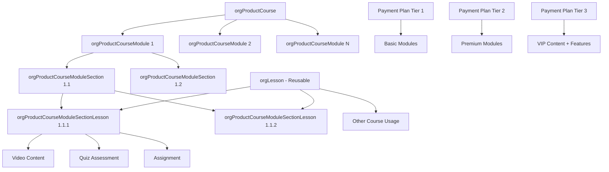
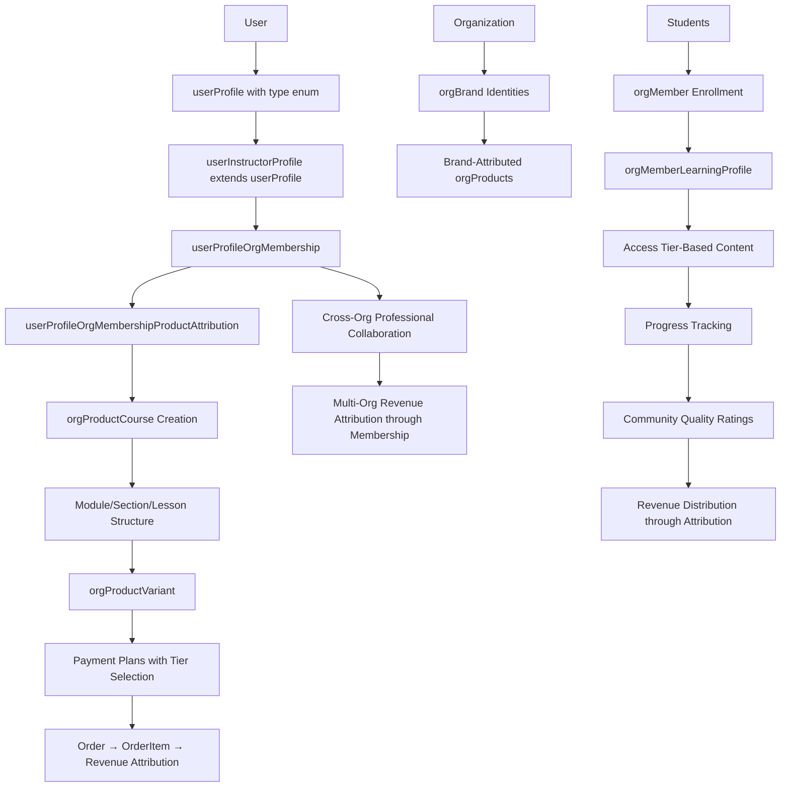
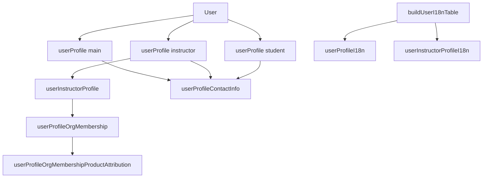
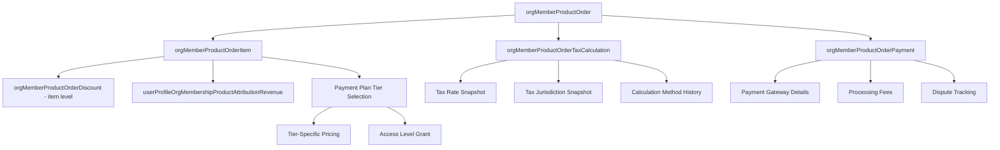
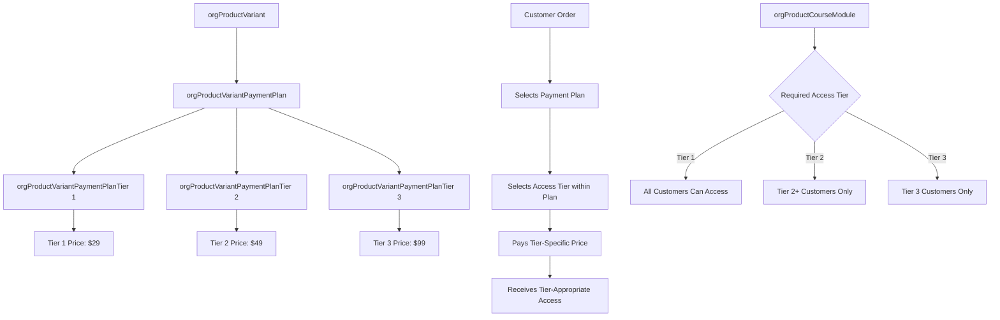
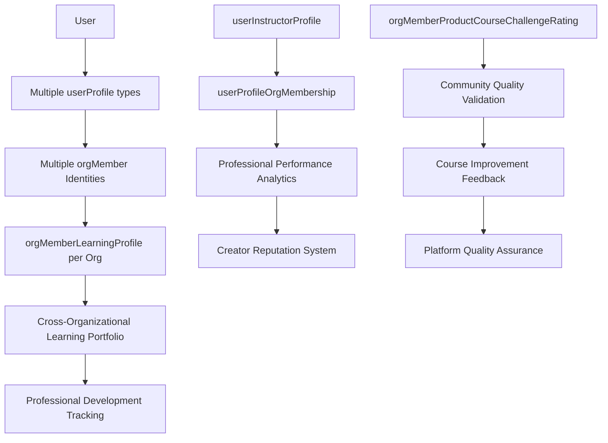

# **📚 Volmify Database Schema Overview - Updated**

## **🎓 What Volmify Is**

### **Primary Purpose**
A **multi-tenant B2B SaaS educational content platform** that enables organizations to create, manage, and monetize **diverse product catalogs** including online courses, digital products, physical goods, and services through a sophisticated **creator economy** supporting instructors and organizational brands with cross-organizational professional collaboration.

### **🏢 Multi-Tenant E-commerce Platform Architecture**
- **Organizations** as primary tenants with complete data isolation and independent business models
- **Professional Creator System**: Instructors and content creators with specialized expertise across multiple domains
- **Cross-Organizational Networks**: Professionals can collaborate across organizational boundaries while maintaining identity
- **Organization-Scoped Branding**: Each organization manages its own brand identities for comprehensive product marketing
- **Variant-Level Payment Strategy**: Sophisticated monetization through payment plans attached to product variants with **tier-based access control**

## **📚 Creator Economy with Professional Attribution**

### **Content Creation Model**
1. **Professional Instructors**: Educational experts creating courses, training materials, and educational services
2. **Content Creators**: Digital content professionals across multiple creative domains
3. **Organization Brands**: Corporate product branding and professional content attribution
4. **Cross-Organizational Collaboration**: Professionals working with multiple organizations while maintaining identity

### **Professional Identity System**
- **Multi-Profile Professionals**: Users can have multiple professional profiles (`main`, `instructor`, `student`) for different specializations
- **Global Professional Identity**: Creators maintain professional reputation across organizational contexts
- **Membership-Based Attribution**: Professional collaboration and revenue attribution through organizational membership
- **Revenue Attribution Tracking**: Clear professional compensation based on membership affiliation and product attribution

## **🌟 Core Architecture Features**

### **📚 Professional Attribution & Compensation System**
- **Organization Brand Attribution**: Corporate product content under organization brand identities
- **Membership-Based Professional Attribution**: Creator attribution and compensation flows through organizational membership
- **Multi-Creator Collaboration**: Teams of professionals creating products together across organizations
- **Advanced Compensation Models**: Revenue share, flat fee, hourly, salary, per-course compensation strategies per membership affiliation
- **Professional Invitation System**: Instructors can be invited by existing users with approval workflows
- **Multi-Organizational Revenue**: Professionals earning from multiple organizations through membership-based attribution

### **💰 Creator Economy Monetization with Access Tier Control**
- **Payment Plan Tier Selection**: Payment plans offer multiple access tiers (1=basic, 2=premium, 3=VIP) with customers selecting their desired tier
- **Tier-Specific Pricing**: Different pricing within same payment plan based on selected access tier
- **Granular Content Gating**: Course modules, sections, and lessons can require specific access tiers for monetization
- **Flexible Payment Strategies**: Multiple payment options (one-time, subscription, usage-based) for same product variant with different access levels
- **Integrated Market Pricing**: Multi-currency regional pricing built into payment plans eliminating separate pricing tables
- **Professional Revenue Tracking**: Individual creator earnings across organizations with accurate membership-based attribution
- **Cross-Organizational Revenue**: Professionals earning from multiple organizational contexts through membership affiliations
- **Attribution-Based Sharing**: Revenue distribution based on membership attribution and product contribution

### **🎓 Advanced Learning Management Architecture**
- **Three-Tier Content Structure**: Course → Module → Section → Lesson hierarchy for maximum instructional flexibility
- **Reusable Lesson Architecture**: Lessons exist independently and can be shared across multiple courses and organizations
- **Dual Complexity Measurement**: Level (qualitative prerequisite knowledge) + Difficulty (quantitative 1-10 complexity rating)
- **Community Quality Validation**: User rating system for course level and difficulty accuracy with instructor feedback loops
- **Cross-Organizational Learning Portfolios**: Members build comprehensive learning profiles across ALL organizations
- **Organization Member Progress Tracking**: Progress tied to organizational membership enabling role-based learning and company analytics
- **Skill Taxonomy Integration**: Platform-wide hierarchical skill management with course attribution for marketplace intelligence and learning pathways
- **Professional Development Analytics**: Comprehensive instructor performance metrics and creator reputation systems

### **🛍️ Comprehensive E-commerce Foundation**
- **Multi-Product Support**: Physical products, digital downloads, educational courses, and professional services
- **Variant-Based Commerce**: Product variations with independent payment strategies and tier-based access control
- **Item-Level Order System**: Complete order management with item-specific pricing, discounts, and revenue attribution
- **Historical Tax Accuracy**: Tax calculation snapshots preserving exact tax details for compliance and audit trails
- **Payment Processing Integration**: Comprehensive payment gateway tracking with fees, disputes, and revenue reconciliation
- **Promotional Campaign Integration**: Sophisticated discount and promotional strategies compatible with payment plans
- **International Commerce**: Multi-currency support with regional market optimization and purchasing power parity
- **Subscription Management**: Complete subscription lifecycle with trial periods, access control, and revenue tracking

### **🌍 Global Market Strategy Architecture**
- **Flexible Regional Definition**: Markets can represent single countries, multi-country regions, linguistic groups, or economic zones
- **Market-Specific Brand Deployment**: Organizations can deploy different brands, domains, and localization strategies per market/region
- **Geographic White-Labeling**: Market-specific domains, branding, and cultural adaptation while maintaining organizational control
- **Regional Business Strategy**: Markets as business strategy units rather than rigid geographic constraints
- **Localization Hierarchy**: Organization locale capabilities → Regional locale selection → Country-specific overrides

### **🔐 Multi-Tenant Security & Permissions**
- **Organization Boundaries**: Strict data isolation between organizational tenants with independent business operations
- **Professional Context**: Permissions based on creator roles, affiliations, and cross-organizational collaboration
- **Cross-Organizational Access**: Controlled professional collaboration across organizational boundaries
- **Granular Content Control**: Access tier-based content gating with payment plan integration
- **Role-Based Access Control**: Sophisticated permission groups and member permission management

### **🌐 Global Commerce Infrastructure**
- **Global Locale Registry**: Centralized locale management with platform-wide standardization
- **Organization Locale Capabilities**: Organizations define their language/content creation capabilities
- **Regional Locale Selection**: Regions choose subset of org locales for specific market strategy
- **Multi-Domain Strategy**: Market-specific domains, subdomains, or unified domain approaches
- **Cultural Adaptation**: Region-appropriate product presentation and professional content

## **🏗 Database Architecture Patterns**

### **Product-Centric Design with Access Tier Integration**
- **Multi-Product Foundation**: Base product system supporting physical, digital, course, and service products
- **CTI Product Extensions**: Type-specific product features through specialization tables
- **Multi-Profile User Architecture**: Users can have multiple specialized profiles (main, instructor, student)
- **Membership-Based Professional Attribution**: Creator attribution and revenue flows through organizational membership
- **Payment Plan Tier Selection**: Customers select access tiers within payment plans with tier-specific pricing
- **Performance Isolation**: Product and payment data optimized for e-commerce and creator economy workflows

### **Key Architectural Decisions**
1. **Org/User Prefixing**: Clear entity ownership with `orgProduct`, `orgProductCourse`, `userSession`, `userProfile` prefixes
2. **Organization → Org Shortening**: Industry-standard abbreviation for improved developer experience
3. **Global Locale Registry**: Centralized `locale` table with `localeKey` as standardized identifier
4. **Organization Locale Capabilities**: `orgLocale` defines what languages organizations can create content in
5. **Regional Locale Selection**: Regions choose subset of org locale capabilities for market strategy
6. **Multi-Profile User System**: Users can maintain multiple specialized profiles through `userProfileType` enum
7. **Membership-Based Attribution**: Professional attribution flows through `userProfileOrgMembership` for clear organizational context
8. **Cross-Organizational Networks**: Professional collaboration beyond organizational boundaries through membership
9. **Organization-Scoped Brands**: Brand identities managed within organizational context for product marketing
10. **Payment Plan Tier Selection**: Access levels and pricing attached to payment plan tiers for flexible monetization
11. **Organization Member Progress**: Learning progress tracked per organizational membership for role-based analytics
12. **Three-Tier Content Structure**: Course → Module → Section → Lesson for maximum instructional design flexibility
13. **Skill Relationship Management**: Hierarchical skill taxonomy with course attribution for marketplace intelligence
14. **Regional Flexibility**: Regions can represent single countries or multi-region business strategies
15. **Reusable Content Architecture**: Lessons abstracted for cross-course and cross-organizational sharing
16. **Cross-Organizational Learning**: Member learning portfolios aggregate across all organizational contexts
17. **Item-Level Order Management**: Order → OrderItem architecture enabling multi-item orders with item-specific attribution
18. **Historical Tax Accuracy**: Tax calculation snapshots preserve exact calculations for compliance
19. **Contact Info Unification**: Single contact management system serves all profile types through `userProfileContactInfo`
20. **Generic I18n System**: Reusable `buildUserI18nTable` helper eliminates code duplication across user entities

## **📊 Schema Organization**

### **Core Schema Domains**
```
📂 general/                    # Platform-wide shared resources
├── locale-currency-market/    # Global standards and market data
│   ├── schema.js              # Global locale, currency, and market registry
│   └── relations.js           # Global standard relationships
├── seo/                       # SEO and content discovery (no locale columns)
│   ├── schema.js              # SEO metadata without redundant locale storage
│   └── relations.js           # SEO relationship management
├── skill/                     # Platform-wide skill taxonomy
│   ├── schema.js              # Hierarchical skill management with org attribution
│   └── relations.js           # Skill relationship and course attribution
└── contact-info/              # Polymorphic contact management
    ├── schema.js              # Contact information foundation
    └── relations.js           # Contact relationship management

📂 user/                       # User domain (global identity)
├── schema.js                  # userProfile with type enum (main/instructor/student)
├── relations.js               # User relationship foundations
└── profile/                   # Specialized user profiles
    ├── schema.js              # userProfile base with type differentiation
    ├── relations.js           # Profile relationship management
    ├── contact-info/           # Profile-based contact management
    │   ├── schema.js           # userProfileContactInfo (unified system)
    │   └── relations.js        # Contact relationship management
    └── instructor/             # Professional instructor profiles for creator economy
        ├── schema.js           # userInstructorProfile extending userProfile
        └── relations.js        # Cross-organizational instructor relationships

📂 org/                        # Organization domain (shortened from organization)
├── schema.js                  # org + orgBrand + orgLocale + orgRegion
├── relations.js               # Multi-tenant boundaries and professional affiliations
├── product/                   # Organization products
│   ├── schema.js              # orgProduct + orgProductVariant with membership-based attribution
│   ├── relations.js           # Product relationships and professional attribution
│   ├── payment/               # Payment plans and subscriptions
│   │   ├── schema.js          # Payment plans with tier selection (CTI: one-time, subscription, usage-based)
│   │   └── relations.js       # Payment plan relationships and subscription management
│   ├── offers/                # Promotional campaigns
│   │   ├── schema.js          # Discount campaigns and promotional strategies
│   │   └── relations.js       # Promotional campaign relationships
│   ├── collection/            # Product catalog organization
│   │   ├── schema.js          # Product collections and catalog organization
│   │   └── relations.js       # Collection membership and categorization
│   ├── orders/                # E-commerce order management
│   │   ├── schema.js          # Order → OrderItem → Tax/Payment/Revenue tracking
│   │   └── relations.js       # Complete order relationship management
│   └── by-type/course/        # Course-specific product extensions
│       ├── schema.js          # Course structure + modules + sections + lessons + progress + quality ratings
│       └── relations.js       # Course content relationships and learning management
├── member/                    # Organization membership
│   ├── schema.js              # orgMember + orgMemberLearningProfile + enrollment management
│   └── relations.js           # Member relationships and learning analytics
├── locale-region/             # Market strategy and localization
│   ├── schema.js              # orgLocale capabilities + orgRegion deployment
│   └── relations.js           # Localization and market relationships
├── tax/                       # Organization tax configuration
│   ├── schema.js              # Tax categories and business tax management with calculation methods
│   └── relations.js           # Tax relationship management
├── funnel/                    # Sales funnel management
│   ├── schema.js              # Sales funnel and conversion tracking
│   └── relations.js           # Funnel relationship management
└── _under_discussion/         # Features in development
    ├── permission/            # Role-based permission system
    └── other-experimental/    # Experimental features
```

### **Course Content Architecture**


### **Creator Economy Workflow Architecture**


### **Multi-Profile User Architecture**


### **Order System Architecture**


### **Access Tier Payment Architecture**


### **Professional Learning Analytics Architecture**


## **🎯 Target Market & Use Cases**

### **Primary Customers**
- **Enterprise Organizations**: Companies creating internal training, customer education, and product catalogs
- **Educational Institutions**: Universities and schools expanding online course offerings and digital resources
- **Professional Training Companies**: Organizations specializing in skill development and certification programs
- **International Corporations**: Global companies requiring localized content and multi-currency commerce
- **Content Creator Networks**: Platforms supporting diverse creator economies across multiple product types
- **E-commerce Organizations**: Companies requiring sophisticated pricing strategies and creator attribution

### **Course Creation Scenarios**
- **Corporate Universities**: Organizations hiring external instructor experts for specialized content creation with membership-based compensation models
- **Tiered Learning Programs**: Companies offering basic, premium, and VIP training experiences with payment plan tier selection
- **Cross-Industry Collaboration**: Professionals collaborating across different organizational contexts with membership-based attribution
- **Professional Development Networks**: Expert creator referral and collaboration systems with invitation workflows
- **Global Course Delivery**: International course sales with localized creator content and regional pricing
- **Multi-Access Learning**: Organizations offering different access levels based on payment plan tier selection
- **Subscription-Based Learning**: Organizations offering subscription access to creator-developed content with tier-based features
- **Regional Market Expansion**: Organizations deploying region-specific brands and localization strategies
- **Reusable Content Libraries**: Organizations sharing lesson content across courses while maintaining creator attribution
- **Community-Driven Quality**: Platforms leveraging student feedback for course improvement and instructor development

## **🚀 Competitive Positioning**

### **Enterprise Creator Economy Platform with Advanced Learning Management**
**Volmify** is positioned as an **enterprise-grade creator economy platform** with sophisticated learning management and market-driven monetization:

- **vs. Teachable/Thinkific**: Enterprise multi-tenancy with three-tier content structure, cross-organizational learning portfolios, and community quality validation
- **vs. LinkedIn Learning**: Organization-controlled with creator economy features, payment plan tier-based content monetization, and membership-based professional attribution across organizations
- **vs. Coursera for Business**: Multi-organizational creator collaboration with granular content gating, hierarchical skill taxonomy integration, and reusable lesson architecture
- **vs. Corporate LMS**: Creator economy monetization with global professional identity, sophisticated access tier control, and cross-organizational learning analytics
- **vs. Udemy Business**: Advanced learning analytics with organization member progress, skill-based learning pathways, and community-driven quality assurance
- **vs. MasterClass**: Membership-based professional attribution system with payment plan tier monetization, cross-organizational collaboration, and advanced instructor compensation models
- **vs. Medusa Commerce**: Superior regional strategy with brand deployment, localization, and creator economy vs. basic regional pricing

### **Unique Value Propositions**
1. **Regional-Driven Strategy**: Flexible regional definition (single country, multi-region, linguistic, economic) with brand deployment
2. **Payment Plan Tier Selection**: Customers select access tiers within payment plans with tier-specific pricing enabling sophisticated course monetization strategies
3. **Three-Tier Content Architecture**: Module → Section → Lesson structure with reusable lesson abstraction for maximum instructional design flexibility
4. **Cross-Organizational Learning**: Member learning portfolios aggregate across all organizational contexts for comprehensive professional development
5. **Hierarchical Skill Taxonomy**: Platform-wide skill management with course attribution for marketplace intelligence and learning pathways
6. **Dual Complexity Measurement**: Level + difficulty rating system with community validation for precise course positioning
7. **Multi-Profile Professional Network**: Users can have multiple specialized profiles (main, instructor, student) with membership-based attribution across organizations
8. **Community Quality Assurance**: User rating system for course accuracy with instructor feedback loops and platform quality management
9. **Global Localization Architecture**: Organization locale capabilities → Regional locale selection → Content delivery
10. **Geographic White-Labeling**: Region-specific domains, brands, and cultural adaptation
11. **Advanced Creator Compensation**: Multiple compensation models (revenue share, flat fee, hourly, salary, per-course) per membership affiliation
12. **Professional Invitation System**: Structured instructor recruitment with approval workflows and connection tracking
13. **Item-Level Order Management**: Complete e-commerce with multi-item orders, item-specific discounts, and revenue attribution
14. **Historical Tax Accuracy**: Tax calculation snapshots preserve exact calculations for audit compliance
15. **Unified Contact Management**: Single contact system serves all profile types through userProfileContactInfo

## **📈 Future Scalability (Creator Economy Foundation)**

### **Extensible Course Architecture**
The course architecture supports current and future educational content types:

```javascript
// Current: Course content implementation
orgProductCourse → orgProductCourseModules → orgProductCourseModuleSections → orgLessons (reusable across courses)

// Future: Extensible content types
orgLesson → liveSessionLesson (scheduled instruction)
orgLesson → projectLesson (multi-step practical work)
orgLesson → discussionLesson (community engagement)
orgLesson → assessmentLesson (certification testing)
orgLesson → workshopLesson (hands-on practice)
```

### **Payment Plan Tier Scalability**
```javascript
// Current: Tier selection implementation
Payment Plan → Multiple Tiers with Different Pricing
Customer → Selects Tier → Pays Tier Price → Receives Tier Access

// Future: Extensible tier models
tierType: "content_access" → Basic content access control
tierType: "feature_access" → Feature availability control
tierType: "support_level" → Support tier differentiation
tierType: "community_access" → Community access levels
```

### **Multi-Profile Architecture Scalability**
```javascript
// Current: Profile type implementation
userProfileType: "main" → Base user profile
userProfileType: "instructor" → Professional profile
userProfileType: "student" → Learning profile

// Future: Extensible profile types
userProfileType: "organization_admin" → Admin profile
userProfileType: "content_moderator" → Moderation profile
userProfileType: "customer_support" → Support profile
```

### **Regional Strategy Scalability**
```javascript
// Current: Regional deployment patterns
orgRegion "US": single_country_strategy
orgRegion "EU": multi_region_strategy  
orgRegion "LATAM": linguistic_strategy

// Future: Advanced regional strategies
orgRegion "ENTERPRISE": b2b_focused_strategy
orgRegion "CONSUMER": b2c_focused_strategy
orgRegion "HYBRID": omnichannel_strategy
```

### **Learning Management Benefits**
- **Progress Tracking Scalability**: Organization member progress supports complex organizational learning analytics
- **Skill Attribution Growth**: Hierarchical skill taxonomy enables sophisticated learning pathway recommendations
- **Content Reusability**: Lesson sharing across courses and organizations with maintained attribution
- **Quality Assurance Evolution**: Community rating system provides data for AI-driven course improvement
- **Access Control Sophistication**: Payment plan tier-based gating supports complex monetization and feature strategies
- **Regional Intelligence**: Track learning performance across different regions and cultural contexts
- **Professional Development**: Cross-organizational learning portfolios enable comprehensive career tracking
- **Creator Analytics**: Advanced instructor performance metrics and reputation management

## **🎯 Developer Quick Start**

### **Understanding the Learning Management Architecture**
1. **Start with orgProductCourse Schema**: Understand three-tier content structure (Course → Module → Section → Lesson)
2. **Review Payment Plan Tier System**: See how customers select access tiers within payment plans with tier-specific pricing
3. **Examine Progress Tracking**: Understand organization member-based learning analytics and cross-organizational portfolios
4. **Study Skill Integration**: See how hierarchical course-skill attribution enables marketplace intelligence
5. **Explore Quality System**: Understand community-driven course validation and improvement
6. **Understand Regional Strategy**: See how organizations deploy different brands and localization per region
7. **Review Creator Economy**: Study membership-based attribution, compensation models, and professional collaboration
8. **Examine Reusable Content**: Understand lesson abstraction and cross-course sharing
9. **Study Multi-Profile Architecture**: Understand how users can have multiple specialized profiles
10. **Review Order System**: Understand Order → OrderItem architecture with item-level revenue attribution

### **Key Development Patterns**
```javascript
// Course Content Organization Pattern
orgProductCourse → orgProductCourseModule → orgProductCourseModuleSection → orgLesson (reusable) → Progress Tracking

// Payment Plan Tier Selection Pattern
Payment Plan → Tier Options → Customer Selection → Tier-Specific Pricing → Access Grant

// Skill Attribution Pattern
orgProductCourse → Hierarchical Skill Mapping → Learning Pathways → Marketplace Intelligence

// Organization Member Learning Pattern
User → orgMember → orgMemberLearningProfile → Cross-Org Learning Portfolio

// Regional Strategy Pattern
Organization → orgLocale Capabilities → orgRegion Selection → Region-Specific Deployment

// Localization Hierarchy Pattern
Global Locale Registry → orgLocale → orgRegion → Content Delivery

// Creator Economy Pattern
userProfile → userInstructorProfile → userProfileOrgMembership → userProfileOrgMembershipProductAttribution → Revenue

// Quality Assurance Pattern
Course Content → Student Experience → Community Ratings → Instructor Feedback → Course Improvement

// Multi-Profile User Pattern
User → userProfile (main/instructor/student) → Profile-Specific Features → Unified Contact Management

// Order Management Pattern
Order → OrderItem → Product/Variant/PaymentPlan/Tier → Discounts/Tax/Revenue Attribution

// Tax Accuracy Pattern
Order → Tax Calculation Snapshot → Historical Rate Preservation → Audit Compliance
```

## **📖 Detailed Documentation**

### **Schema-Specific Documentation**
- 🏢 Org Schema - Multi-tenant and brand management with regional strategy
- 👤 User Profile Schema - Multi-profile user system with type differentiation and unified contact management
- 👨‍🏫 User Instructor Profile - Professional creator identity system with membership-based cross-organizational affiliations
- 📚 Org Product Schema - Multi-product catalog and membership-based professional attribution
- 🎓 Org Course Schema - Three-tier learning management with access control and community quality validation
- 💳 Payment Schema - Payment plan tier selection and subscription management
- 🎁 Offers Schema - Promotional campaigns and discount strategies
- 🛒 Order Schema - Item-level order management with historical tax accuracy and revenue attribution
- 🌍 Regional & Locale - Global regional strategy and localization architecture
- 🔍 SEO Schema - Content discovery without redundant locale storage
- 🧠 Skill Schema - Hierarchical skill taxonomy with course attribution
- 📊 Learning Analytics - Cross-organizational member learning portfolios and progress tracking
- 📞 Contact Info Schema - Unified contact management for all profile types

### **Architecture Deep Dives**
- 🏗 Multi-Tenant Creator Economy Architecture
- 👥 Membership-Based Professional Attribution & Compensation System
- 🎓 Three-Tier Learning Management Architecture with Reusable Content
- 💳 Payment Plan Tier Selection Integration
- 🧠 Hierarchical Skill Taxonomy and Learning Pathway System
- 🔗 Cross-Organizational Professional Collaboration through Membership
- 🌍 Regional-Driven International Commerce Architecture
- 📊 Organization Member Learning Analytics and Cross-Org Portfolios
- 🎨 Geographic White-Labeling and Brand Deployment
- ⭐ Community-Driven Quality Assurance and Course Improvement
- 💰 Advanced Creator Compensation Models and Revenue Attribution
- 👤 Multi-Profile User Architecture with Unified Contact Management
- 🛒 Item-Level Order Management with Historical Tax Accuracy
- 🏷️ Generic I18n System with Reusable Helper Patterns

## **🔧 Development Guidelines**

### **Learning Management Feature Development**
1. **Follow Three-Tier Content Pattern**: Use orgProductCourse → orgProductCourseModule → orgProductCourseModuleSection → orgLesson hierarchy
2. **Implement Payment Plan Tier Control**: Respect customer-selected access tiers within payment plans for content gating
3. **Support Organization Member Progress**: Track learning within organizational context and cross-organizational portfolios
4. **Integrate Hierarchical Skill Attribution**: Connect course content to platform skill taxonomy with proper weighting
5. **Enable Community Quality**: Support user rating and feedback systems for continuous course improvement
6. **Maintain Membership-Based Attribution**: Ensure creator revenue and recognition tracking through organizational membership
7. **Support Reusable Content**: Enable lesson sharing across courses and organizations while maintaining attribution
8. **Implement Quality Feedback Loops**: Build community-driven validation and instructor improvement systems

### **Creator Economy Implementation**
1. **Support Multi-Compensation Models**: Implement revenue share, flat fee, hourly, salary, per-course compensation strategies
2. **Enable Membership-Based Affiliations**: Route all professional attribution through organizational membership
3. **Implement Professional Attribution**: Ensure clear content ownership and revenue tracking through membership
4. **Support Invitation Workflows**: Build instructor recruitment and approval systems
5. **Track Professional Performance**: Implement comprehensive creator analytics and reputation systems
6. **Support Multi-Profile Architecture**: Enable users to have multiple specialized profiles (main, instructor, student)

### **E-commerce Implementation**
1. **Implement Item-Level Orders**: Use Order → OrderItem architecture for multi-item support
2. **Support Payment Plan Tier Selection**: Enable customers to select access tiers within payment plans
3. **Maintain Historical Tax Accuracy**: Preserve tax calculation snapshots for audit compliance
4. **Track Payment Processing Details**: Implement comprehensive payment gateway integration
5. **Enable Item-Level Revenue Attribution**: Support creator compensation at order item level
6. **Support Item-Specific Discounts**: Apply promotions at individual order item level

### **Regional Strategy Implementation**
1. **Design Region-Agnostic Core**: Build features that work across different regional strategies
2. **Implement Region-Specific Adaptation**: Allow regions to customize presentation and business rules
3. **Support Flexible Regional Definition**: Enable single-country, multi-region, linguistic, and economic regional types
4. **Maintain Localization Hierarchy**: Respect organization → region → country locale selection
5. **Enable Brand Deployment**: Support region-specific brand identities and domain strategies

### **Schema Evolution Principles**
- **Organization-First**: Every feature respects organizational boundaries and business independence
- **Multi-Profile Professional Identity**: Support specialized user profiles while maintaining global identity
- **Membership-Based Attribution**: Route professional collaboration through organizational membership
- **Payment Plan Tier Control**: Implement sophisticated tier-based monetization strategies
- **Learning Analytics**: Support organization member-based progress tracking and cross-organizational portfolios
- **Skill Intelligence**: Enable platform-wide hierarchical skill tracking and learning pathway construction
- **Quality Assurance**: Build community-driven validation and improvement systems
- **Regional Flexibility**: Support diverse regional strategies and geographic business models
- **Locale Standardization**: Use global locale registry with organization capabilities and regional selection
- **Reusable Content**: Enable efficient content sharing while maintaining creator attribution
- **Historical Accuracy**: Preserve calculation snapshots for compliance and audit trails
- **Contact Info Unification**: Single contact system serves all profile types
- **Generic I18n Patterns**: Use reusable helpers to eliminate code duplication

### **Naming Conventions**
1. **Entity Prefixing**: Use `org` prefix for organization-owned entities, `user` for user-owned entities
2. **Clear Ownership**: Ensure entity names immediately convey ownership and context
3. **Business Terminology**: Use business-relevant terms over technical abstractions
4. **Consistent Abbreviations**: Use industry-standard abbreviations (org, user, etc.)
5. **Avoid Redundant Locales**: Don't duplicate locale information across related tables
6. **Professional Context**: Use clear naming for creator economy and membership-based attribution entities
7. **Profile Type Differentiation**: Use clear naming for multi-profile user architecture
8. **Order System Clarity**: Use clear naming for Order → OrderItem relationships and item-level features

---

**Volmify enables organizations to build sophisticated creator economies with advanced learning management, payment plan tier-based monetization, regional-driven global expansion, cross-organizational member learning portfolios, hierarchical skill-based learning pathways, community-driven quality assurance, membership-based creator compensation models, multi-profile user architecture, item-level order management with historical tax accuracy, and enterprise-grade multi-tenant architecture supporting comprehensive educational content delivery and professional development tracking across diverse regional markets and cultural contexts.** 🎓💰🌍✨

The database architecture focuses on learning management scalability with reusable content, cross-organizational learning analytics, community-driven quality improvement, membership-based professional attribution and compensation flexibility, multi-profile user support, item-level e-commerce capabilities, while maintaining organizational boundaries, professional identity preservation, regional strategy sophistication, payment plan tier monetization, historical accuracy for compliance, and sustainable educational creator growth across diverse course catalogs and international markets.
