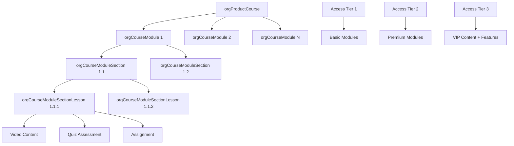
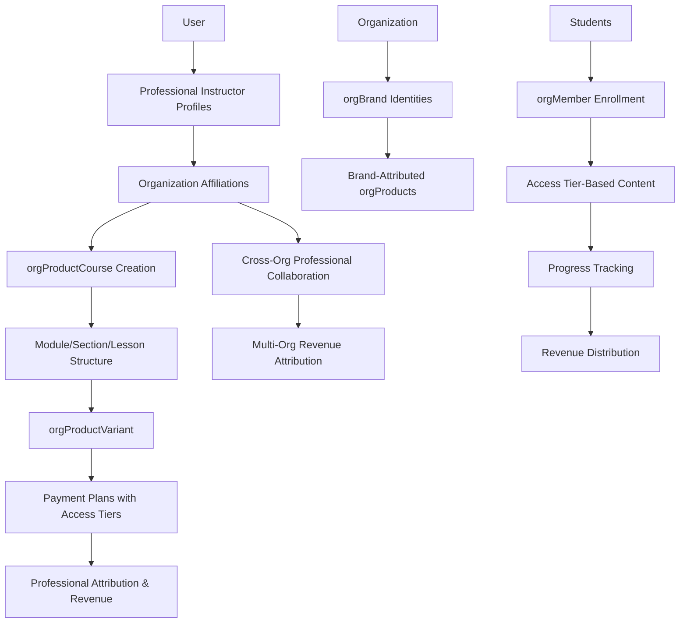
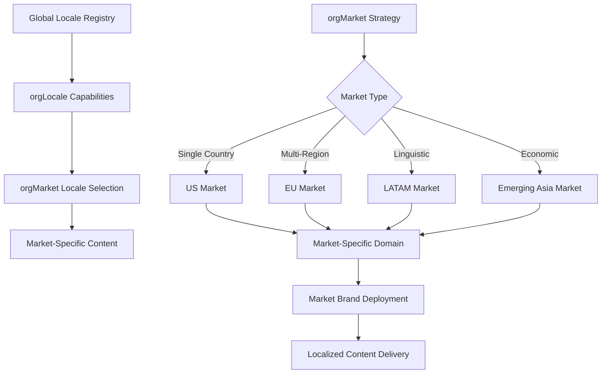
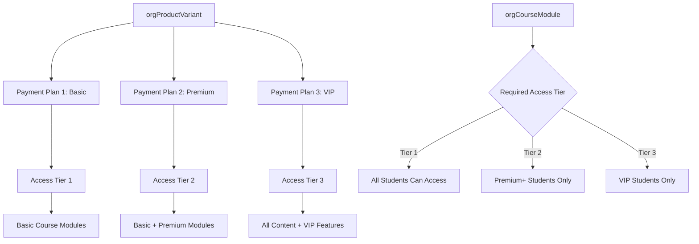

# **📚 Volmify Database Schema Overview - Updated**

## **🎓 What Volmify Is**

### **Primary Purpose**
A **multi-tenant B2B SaaS educational content platform** that enables organizations to create, manage, and monetize **diverse product catalogs** including online courses, digital products, physical goods, and services through a sophisticated **creator economy** supporting instructors and organizational brands with cross-organizational professional collaboration.

### **🏢 Multi-Tenant E-commerce Platform Architecture**
- **Organizations** as primary tenants with complete data isolation and independent business models
- **Professional Creator System**: Instructors and content creators with specialized expertise across multiple domains
- **Cross-Organizational Networks**: Professionals can collaborate across organizational boundaries while maintaining identity
- **Organization-Scoped Branding**: Each organization manages its own brand identities for comprehensive product marketing
- **Variant-Level Payment Strategy**: Sophisticated monetization through payment plans attached to product variants with access tier control

## **📚 Creator Economy with Professional Attribution**

### **Content Creation Model**
1. **Professional Instructors**: Educational experts creating courses, training materials, and educational services
2. **Content Creators**: Digital content professionals across multiple creative domains
3. **Organization Brands**: Corporate product branding and professional content attribution
4. **Cross-Organizational Collaboration**: Professionals working with multiple organizations while maintaining identity

### **Professional Identity System**
- **Multi-Profile Professionals**: Users can have multiple professional profiles for different specializations
- **Global Professional Identity**: Creators maintain professional reputation across organizational contexts
- **Cross-Organizational Affiliations**: Complex professional collaboration and partnership networks
- **Revenue Attribution Tracking**: Clear professional compensation based on content contribution and attribution

## **🌟 Core Architecture Features**

### **📚 Professional Attribution System**
- **Organization Brand Attribution**: Corporate product content under organization brand identities
- **Professional Creator Attribution**: Individual creator content ownership and professional recognition
- **Multi-Creator Collaboration**: Teams of professionals creating products together across organizations
- **Revenue Sharing Models**: Flexible attribution-based revenue distribution for product sales and subscriptions

### **💰 Creator Economy Monetization with Access Tier Control**
- **Payment Plan Access Tiers**: Payment plans define both billing strategy AND content access level (1=basic, 2=premium, 3=VIP)
- **Granular Content Gating**: Course modules, sections, and lessons can require specific access tiers for monetization
- **Flexible Payment Strategies**: Multiple payment options (one-time, subscription, usage-based) for same product variant with different access levels
- **Integrated Market Pricing**: Multi-currency regional pricing built into payment plans eliminating separate pricing tables
- **Professional Revenue Tracking**: Individual creator earnings across organizations with accurate attribution
- **Cross-Organizational Revenue**: Professionals earning from multiple organizational contexts with clear compensation
- **Attribution-Based Sharing**: Revenue distribution based on professional contribution and content attribution

### **🎓 Advanced Learning Management Architecture**
- **Three-Tier Content Structure**: Course → Module → Section → Lesson hierarchy for maximum instructional flexibility
- **Dual Complexity Measurement**: Level (qualitative prerequisite knowledge) + Difficulty (quantitative 1-10 complexity rating)
- **Community Quality Validation**: User rating system for course level and difficulty accuracy with instructor feedback
- **Organization Member Progress Tracking**: Progress tied to organizational membership enabling role-based learning and company analytics
- **Skill Taxonomy Integration**: Platform-wide skill management with course attribution for marketplace intelligence and learning pathways
- **Reusable Lesson Content**: Lessons can be shared across courses and organizations while maintaining creator attribution

### **🛍️ Comprehensive E-commerce Foundation**
- **Multi-Product Support**: Physical products, digital downloads, educational courses, and professional services
- **Variant-Based Commerce**: Product variations with independent payment strategies and access tier differentiation
- **Promotional Campaign Integration**: Sophisticated discount and promotional strategies compatible with payment plans
- **International Commerce**: Multi-currency support with regional market optimization and purchasing power parity
- **Subscription Management**: Complete subscription lifecycle with trial periods, access control, and revenue tracking

### **🌍 Global Market Strategy Architecture**
- **Flexible Market Definition**: Markets can represent single countries, multi-country regions, linguistic groups, or economic zones
- **Market-Specific Brand Deployment**: Organizations can deploy different brands, domains, and localization strategies per market
- **Geographic White-Labeling**: Market-specific domains, branding, and cultural adaptation while maintaining organizational control
- **Regional Business Strategy**: Markets as business strategy units rather than rigid geographic constraints
- **Localization Hierarchy**: Organization locale capabilities → Market locale selection → Country-specific overrides

### **🔐 Multi-Tenant Security & Permissions**
- **Organization Boundaries**: Strict data isolation between organizational tenants with independent business operations
- **Professional Context**: Permissions based on creator roles, affiliations, and cross-organizational collaboration
- **Cross-Organizational Access**: Controlled professional collaboration across organizational boundaries
- **Granular Content Control**: Access tier-based content gating with payment plan integration

### **🌐 Global Commerce Infrastructure**
- **Global Locale Registry**: Centralized locale management with platform-wide standardization
- **Organization Locale Capabilities**: Organizations define their language/content creation capabilities
- **Market Locale Selection**: Markets choose subset of org locales for specific regional strategy
- **Multi-Domain Strategy**: Market-specific domains, subdomains, or unified domain approaches
- **Cultural Adaptation**: Region-appropriate product presentation and professional content

## **🏗 Database Architecture Patterns**

### **Product-Centric Design with Access Tier Integration**
- **Multi-Product Foundation**: Base product system supporting physical, digital, course, and service products
- **CTI Product Extensions**: Type-specific product features through specialization tables
- **Organization-Agnostic Professionals**: Creator identity preserved across organizational contexts
- **Professional Attribution Flexibility**: Multiple attribution models for content ownership and revenue sharing
- **Access Tier Payment Architecture**: Payment plans define content access levels enabling sophisticated content monetization
- **Performance Isolation**: Product and payment data optimized for e-commerce and creator economy workflows

### **Key Architectural Decisions**
1. **Org/User Prefixing**: Clear entity ownership with `orgProduct`, `orgProductCourse`, `userSession`, `userProfile` prefixes
2. **Organization → Org Shortening**: Industry-standard abbreviation for improved developer experience
3. **Global Locale Registry**: Centralized `locale` table with `localeKey` as standardized identifier
4. **Organization Locale Capabilities**: `orgLocale` defines what languages organizations can create content in
5. **Market Locale Selection**: Markets choose subset of org locale capabilities for regional strategy
6. **Multi-Profile Professionals**: Users can maintain multiple creator identities for different specializations
7. **Direct Professional Attribution**: Clear content ownership without generic abstraction
8. **Cross-Organizational Networks**: Professional collaboration beyond organizational boundaries
9. **Organization-Scoped Brands**: Brand identities managed within organizational context for product marketing
10. **Payment Plan Access Tiers**: Access levels attached to payment plans (not variants) for flexible monetization
11. **Organization Member Progress**: Learning progress tracked per organizational membership for role-based analytics
12. **Three-Tier Content Structure**: Course → Module → Section → Lesson for maximum instructional design flexibility
13. **Skill Relationship Management**: Structured skill taxonomy with course attribution for marketplace intelligence
14. **Market Flexibility**: Markets can represent single countries or multi-region business strategies

## **📊 Schema Organization**

### **Core Schema Domains**
```
📂 core/                        # Platform foundation
├── locale/                     # Global locale registry and management
│   ├── schema.js              # Global locale table with localeKey standardization
│   └── relations.js           # Locale relationship management
├── user/                      # Global user identity
│   ├── schema.js              # userProfile, userSession, userLearningProfile
│   └── relations.js           # User relationship foundations
└── system/                    # Platform configuration and templates
    ├── schema.js              # System-wide configuration
    └── relations.js           # System relationship management

📂 org/                        # Organization domain (shortened from organization)
├── schema.js                  # org + orgMember + orgBrand + orgLocale + orgMarket
├── relations.js               # Multi-tenant boundaries and professional affiliations
├── product/                   # Organization products
│   ├── schema.js              # orgProduct + orgProductVariant + orgProductCourse
│   ├── relations.js           # Product relationships and professional attribution
│   ├── payment/               # Payment plans and subscriptions
│   │   ├── schema.js          # Payment plans with access tiers (CTI: one-time, subscription, usage-based)
│   │   └── relations.js       # Payment plan relationships and subscription management
│   ├── offers/                # Promotional campaigns
│   │   ├── schema.js          # Discount campaigns and promotional strategies
│   │   └── relations.js       # Promotional campaign relationships
│   └── collection/            # Product catalog organization
│       ├── schema.js          # Product collections and catalog organization
│       └── relations.js       # Collection membership and categorization
└── content/                   # Organization content
    └── course/                # Course structure and learning
        ├── schema.js          # Course structure + modules + sections + lessons + progress
        └── relations.js       # Course content relationships and learning management

📂 user/                       # User domain
├── profile/
│   └── instructor/            # Professional instructor profiles for creator economy
│       ├── schema.js          # Instructor identity and teaching capabilities
│       └── relations.js       # Cross-organizational instructor relationships
└── progress/                  # Learning progress and achievements
    ├── schema.js              # User learning progress across organizations
    └── relations.js           # Progress relationship management

📂 platform/                   # Platform-wide features
├── seo/                       # SEO and content discovery (no locale columns)
│   ├── schema.js              # SEO metadata without redundant locale storage
│   └── relations.js           # SEO relationship management
├── analytics/                 # Business intelligence
│   ├── schema.js              # Platform analytics and business intelligence
│   └── relations.js           # Analytics relationship management
├── marketplace/               # Cross-org marketplace features
│   ├── schema.js              # Platform marketplace and cross-org commerce
│   └── relations.js           # Marketplace relationship management
└── contact-info/              # Polymorphic contact management
    ├── schema.js              # Contact information foundation
    └── relations.js           # Contact relationship management
```

### **Course Content Architecture**


### **Creator Economy Workflow Architecture**


### **Market Localization Architecture**


### **Access Tier Payment Architecture**


## **🎯 Target Market & Use Cases**

### **Primary Customers**
- **Enterprise Organizations**: Companies creating internal training, customer education, and product catalogs
- **Educational Institutions**: Universities and schools expanding online course offerings and digital resources
- **Professional Training Companies**: Organizations specializing in skill development and certification programs
- **International Corporations**: Global companies requiring localized content and multi-currency commerce
- **Content Creator Networks**: Platforms supporting diverse creator economies across multiple product types
- **E-commerce Organizations**: Companies requiring sophisticated pricing strategies and creator attribution

### **Course Creation Scenarios**
- **Corporate Universities**: Organizations hiring external instructor experts for specialized content creation
- **Tiered Learning Programs**: Companies offering basic, premium, and VIP training experiences
- **Cross-Industry Collaboration**: Professionals collaborating across different organizational contexts
- **Professional Development Networks**: Expert creator referral and collaboration systems
- **Global Course Delivery**: International course sales with localized creator content and regional pricing
- **Multi-Access Learning**: Organizations offering different access levels based on payment commitment
- **Subscription-Based Learning**: Organizations offering subscription access to creator-developed content with tier-based features
- **Regional Market Expansion**: Organizations deploying market-specific brands and localization strategies

## **🚀 Competitive Positioning**

### **Enterprise Creator Economy Platform with Advanced Learning Management**
**Volmify** is positioned as an **enterprise-grade creator economy platform** with sophisticated learning management and market-driven monetization:

- **vs. Teachable/Thinkific**: Enterprise multi-tenancy with three-tier content structure and organization member progress tracking
- **vs. LinkedIn Learning**: Organization-controlled with creator economy features and access tier-based content monetization
- **vs. Coursera for Business**: Multi-organizational creator collaboration with granular content gating and skill taxonomy integration
- **vs. Corporate LMS**: Creator economy monetization with professional identity and sophisticated access tier control
- **vs. Udemy Business**: Advanced learning analytics with organization member progress and skill-based learning pathways
- **vs. MasterClass**: Professional attribution system with access tier monetization and cross-organizational collaboration
- **vs. Medusa Commerce**: Superior market strategy with brand deployment, localization, and creator economy vs. basic regional pricing

### **Unique Value Propositions**
1. **Market-Driven Strategy**: Flexible market definition (single country, multi-region, linguistic, economic) with brand deployment
2. **Access Tier Monetization**: Payment plans define content access levels enabling sophisticated course monetization strategies
3. **Three-Tier Content Architecture**: Module → Section → Lesson structure for maximum instructional design flexibility
4. **Organization Member Learning**: Progress tracking tied to organizational membership for role-based analytics and training
5. **Skill Taxonomy Integration**: Platform-wide skill management with course attribution for marketplace intelligence
6. **Dual Complexity Measurement**: Level + difficulty rating system with community validation for precise course positioning
7. **Multi-Organizational Professional Network**: Creators can develop courses across multiple organizations while maintaining identity
8. **Community Quality Assurance**: User rating system for course accuracy with instructor feedback loops
9. **Global Localization Architecture**: Organization locale capabilities → Market locale selection → Content delivery
10. **Geographic White-Labeling**: Market-specific domains, brands, and cultural adaptation

## **📈 Future Scalability (Creator Economy Foundation)**

### **Extensible Course Architecture**
The course architecture supports current and future educational content types:

```javascript
// Current: Course content implementation
orgProductCourse → orgCourseModules → orgCourseModuleSections → lessons (video, text, quiz, assignment, interactive)

// Future: Extensible content types
lesson → liveSessionLesson (scheduled instruction)
lesson → projectLesson (multi-step practical work)
lesson → discussionLesson (community engagement)
lesson → assessmentLesson (certification testing)
lesson → workshopLesson (hands-on practice)
```

### **Access Tier Scalability**
```javascript
// Current: Tiered access implementation
accessTier: 1 → Basic content access
accessTier: 2 → Premium content + features
accessTier: 3 → VIP content + exclusive features

// Future: Extensible access models
accessTier: 4 → Enterprise features (team management)
accessTier: 5 → Partner access (content collaboration)
accessTier: 6 → Instructor access (content creation)
```

### **Market Strategy Scalability**
```javascript
// Current: Market deployment patterns
orgMarket "US": single_country_strategy
orgMarket "EU": multi_region_strategy  
orgMarket "LATAM": linguistic_strategy

// Future: Advanced market strategies
orgMarket "ENTERPRISE": b2b_focused_strategy
orgMarket "CONSUMER": b2c_focused_strategy
orgMarket "HYBRID": omnichannel_strategy
```

### **Learning Management Benefits**
- **Progress Tracking Scalability**: Organization member progress supports complex organizational learning analytics
- **Skill Attribution Growth**: Skill taxonomy enables sophisticated learning pathway recommendations
- **Content Reusability**: Lesson sharing across courses and organizations with maintained attribution
- **Quality Assurance Evolution**: Community rating system provides data for AI-driven course improvement
- **Access Control Sophistication**: Tier-based gating supports complex monetization and feature strategies
- **Market Intelligence**: Track learning performance across different markets and cultural contexts

## **🎯 Developer Quick Start**

### **Understanding the Learning Management Architecture**
1. **Start with orgProductCourse Schema**: Understand three-tier content structure (Course → Module → Section → Lesson)
2. **Review Access Tier System**: See how payment plans control content access and feature availability
3. **Examine Progress Tracking**: Understand organization member-based learning analytics
4. **Study Skill Integration**: See how course-skill attribution enables marketplace intelligence
5. **Explore Quality System**: Understand community-driven course validation and improvement
6. **Understand Market Strategy**: See how organizations deploy different brands and localization per market

### **Key Development Patterns**
```javascript
// Course Content Organization Pattern
orgProductCourse → orgCourseModule → orgCourseModuleSection → Lesson → Progress Tracking

// Access Tier Control Pattern
Payment Plan → Access Tier → Content Gating → Feature Access

// Skill Attribution Pattern
orgProductCourse → Skill Mapping → Learning Pathways → Marketplace Intelligence

// Organization Member Learning Pattern
User → orgMember → orgCourseEnrollment → Role-Based Progress

// Market Strategy Pattern
Organization → orgLocale Capabilities → orgMarket Selection → Market-Specific Deployment

// Localization Hierarchy Pattern
Global Locale Registry → orgLocale → orgMarket → Content Delivery
```

## **📖 Detailed Documentation**

### **Schema-Specific Documentation**
- 🏢 Org Schema - Multi-tenant and brand management with market strategy
- 👤 User Instructor Profile - Professional creator identity system
- 📚 Org Product Schema - Multi-product catalog and professional attribution
- 🎓 Org Course Schema - Three-tier learning management with access control
- 💳 Payment Schema - Access tier payment plans and subscription management
- 🎁 Offers Schema - Promotional campaigns and discount strategies
- 🌍 Market & Locale - Global market strategy and localization architecture
- 🔍 SEO Schema - Content discovery without redundant locale storage

### **Architecture Deep Dives**
- 🏗 Multi-Tenant Creator Economy Architecture
- 👥 Professional Attribution System
- 🎓 Three-Tier Learning Management Architecture
- 💳 Access Tier Payment Plan Integration
- 🧠 Skill Taxonomy and Learning Pathway System
- 🔗 Cross-Organizational Professional Collaboration
- 🌍 Market-Driven International Commerce Architecture
- 📊 Organization Member Learning Analytics
- 🎨 Geographic White-Labeling and Brand Deployment

## **🔧 Development Guidelines**

### **Learning Management Feature Development**
1. **Follow Three-Tier Content Pattern**: Use orgProductCourse → orgCourseModule → orgCourseModuleSection → Lesson hierarchy
2. **Implement Access Tier Control**: Respect payment plan access levels for content gating
3. **Support Organization Member Progress**: Track learning within organizational context
4. **Integrate Skill Attribution**: Connect course content to platform skill taxonomy
5. **Enable Community Quality**: Support user rating and feedback systems
6. **Maintain Professional Attribution**: Ensure creator revenue and recognition tracking

### **Market Strategy Implementation**
1. **Design Market-Agnostic Core**: Build features that work across different market strategies
2. **Implement Market-Specific Adaptation**: Allow markets to customize presentation and business rules
3. **Support Flexible Market Definition**: Enable single-country, multi-region, linguistic, and economic market types
4. **Maintain Localization Hierarchy**: Respect organization → market → country locale selection
5. **Enable Brand Deployment**: Support market-specific brand identities and domain strategies

### **Schema Evolution Principles**
- **Organization-First**: Every feature respects organizational boundaries and business independence
- **Professional Identity**: Maintain global creator identity across organizational contexts
- **Content Access Control**: Implement sophisticated access tier-based monetization strategies
- **Learning Analytics**: Support organization member-based progress tracking and reporting
- **Skill Intelligence**: Enable platform-wide skill tracking and learning pathway construction
- **Quality Assurance**: Build community-driven validation and improvement systems
- **Market Flexibility**: Support diverse market strategies and geographic business models
- **Locale Standardization**: Use global locale registry with organization capabilities and market selection

### **Naming Conventions**
1. **Entity Prefixing**: Use `org` prefix for organization-owned entities, `user` for user-owned entities
2. **Clear Ownership**: Ensure entity names immediately convey ownership and context
3. **Business Terminology**: Use business-relevant terms over technical abstractions
4. **Consistent Abbreviations**: Use industry-standard abbreviations (org, user, etc.)
5. **Avoid Redundant Locales**: Don't duplicate locale information across related tables

---

**Volmify enables organizations to build sophisticated creator economies with advanced learning management, access tier-based monetization, market-driven global expansion, organization member analytics, skill-based learning pathways, and enterprise-grade multi-tenant architecture supporting comprehensive educational content delivery and professional development tracking across diverse markets and cultural contexts.** 🎓💰🌍✨

The database architecture focuses on learning management scalability while maintaining organizational boundaries, professional identity preservation, market strategy flexibility, access tier sophistication, and community-driven quality assurance for sustainable educational creator growth across diverse course catalogs and international markets.
