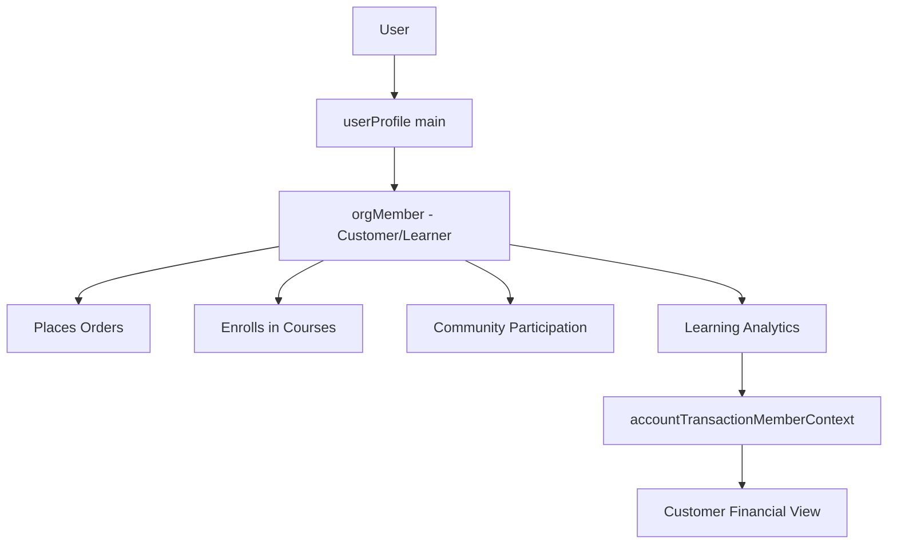
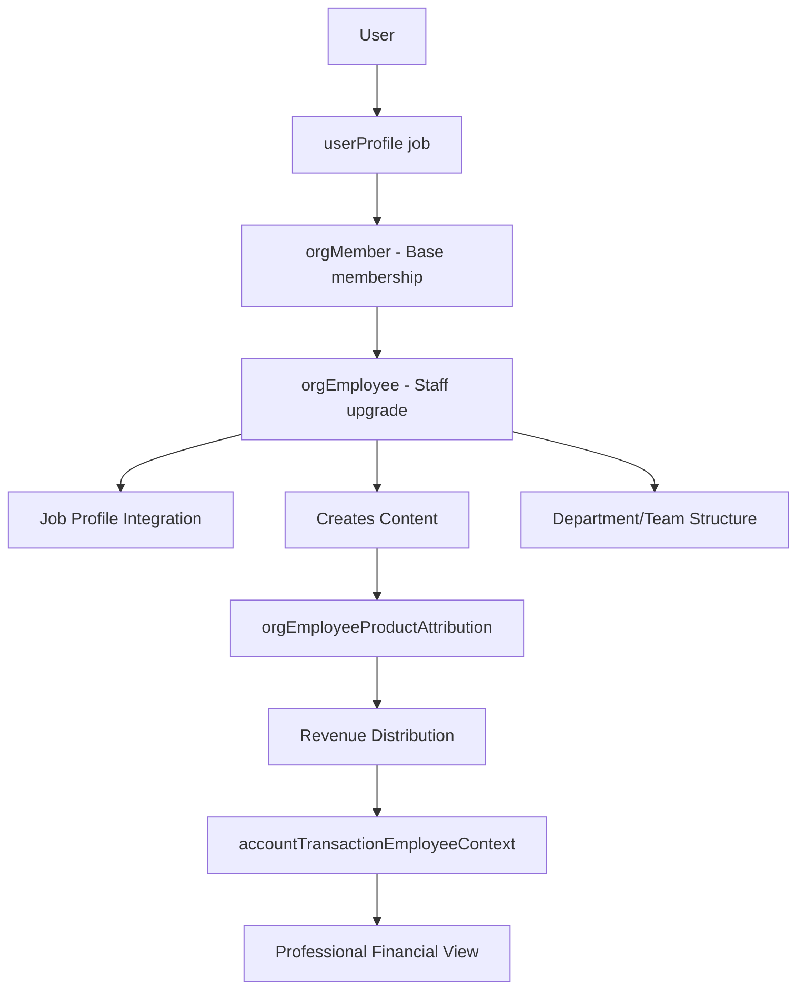
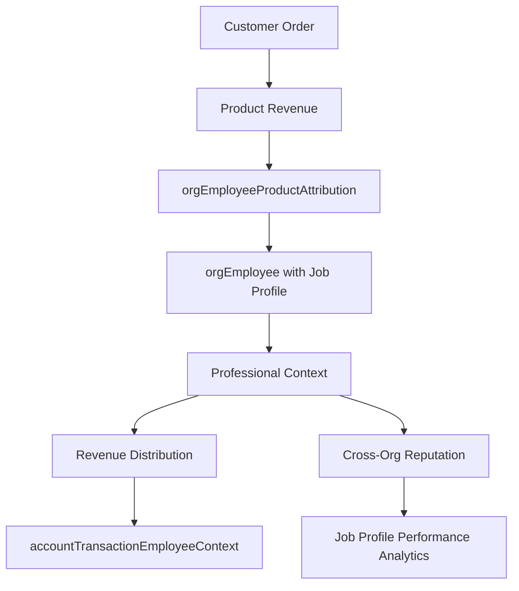
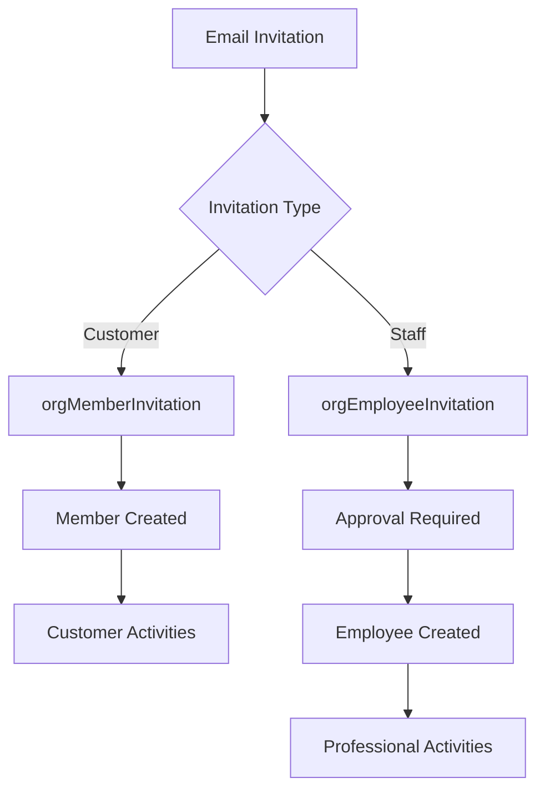

# **📚 Volmify Database Schema Overview**

## **🎓 What Volmify Is**

### **Primary Purpose**
Volmify is a comprehensive **creator economy platform** that combines learning management, e-commerce, and professional marketplace capabilities. It enables organizations to create, sell, and manage educational content while providing sophisticated employee management and revenue attribution systems.

### **Core Capabilities**
- **Learning Management System (LMS)**: Course creation, enrollment, progress tracking
- **E-commerce Platform**: Product sales, subscriptions, gift cards, payment processing  
- **Creator Economy**: Revenue attribution, professional profiles, compensation management
- **Employee Management**: Staff onboarding, department organization, approval workflows
- **Professional Marketplace**: Cross-organizational job profiles, skill attribution, reputation systems
- **Advanced Financial System**: Double-entry accounting with multi-context CTI access for marketplace-scale performance

## **🏗 Core Architecture Principles**

### **Multi-Tenant Foundation**
Every entity in Volmify is scoped to an organization (`orgId`), ensuring complete data isolation and supporting multiple independent tenants on the same platform.

### **User Identity Hierarchy**
```
User (platform identity)
├── userProfile (main) - base customer profile  
├── userProfile (job) - professional profiles
└── userLocale - language preferences with proficiency levels

orgMember (tenant-scoped customer/learner)
└── orgEmployee (enhanced staff role with optional job profile link)
```

### **Role Separation**
- **Members**: Customers and learners who place orders, enroll in courses, participate in community
- **Employees**: Staff and creators who create content, receive revenue attribution, manage operations
- **Same user can be both**: Member (customer) AND employee (creator) within the same organization

### **Class Table Inheritance (CTI)**
Financial transactions use CTI for multi-context access, enabling O(1) performance for user transaction queries regardless of organizational complexity.

### **Multi-Context Access**
Single transactions are accessible through multiple entity contexts (user, employee, member, organization) with appropriate permission scoping.

## **👤 User Management System**

### **Platform Identity**
- **`user`**: Universal identity across the entire platform - cross-tenant, login-capable, globally unique
- **`userProfile`**: User's contextual profiles - one main profile (customer identity) and multiple job profiles (professional identities)
- **`userJobProfile`**: Professional profiles that work across organizations, enabling reputation and skill tracking

### **Localization & Preferences**
- **`userLocale`**: User language preferences with proficiency levels
- **`userLocaleProficiency`**: Skill levels (native, fluent, conversational, basic)
- **Multi-Language Support**: Platform-wide internationalization framework

### **Tenant-Scoped Identity**
- **`orgMember`**: User's presence within a specific organization as customer/learner
- **`orgEmployee`**: Optional upgrade to staff role with organizational duties and professional attribution
- **`orgMemberInvitation`**: Customer onboarding workflow
- **`orgEmployeeInvitation`**: Staff recruitment with approval processes

## **🏢 Organization Management**

### **Organizational Structure**
- **`org`**: Core organization entity with settings, branding, and configuration
- **`orgDepartment`**: Organizational divisions for employee structure
- **`orgTeam`**: Project-based teams for collaboration
- **`orgEmployeeDepartmentMembership`**: Employee assignment to departments
- **`orgEmployeeTeamMembership`**: Employee participation in teams

### **Learning Community Structure**
- **`orgMemberLearningGroup`**: Study groups and learning communities
- **`orgMemberCohort`**: Learning cohorts and class sections

## **📚 Content & Learning Management**

### **Course Structure**
- **`orgProduct`**: Core products including courses, with pricing and metadata
- **`orgProductCourse`**: Course-specific configuration, duration, difficulty
- **`orgProductCourseSection`**: Course sections and modules
- **`orgProductCourseLesson`**: Individual lessons with content and media
- **`orgProductCourseChallenge`**: Interactive challenges and assessments

### **Content Management**
- **`systemContentVersion`**: Version control for all content types
- **`orgContentApprovalChain`**: Content approval workflows
- **`systemContentTranslation`**: Multi-language content support

### **Learning Experience**
- **`orgMemberProductCourseEnrollment`**: Student enrollment and progress tracking
- **`orgMemberLearningProfile`**: Personalized learning analytics and preferences
- **`orgMemberProductCourseChallengeRating`**: Student feedback and ratings

## **💰 E-commerce & Financial System**

### **Product Catalog**
- **`orgProductVariant`**: Product variations (pricing tiers, access levels)
- **`orgProductOffer`**: Time-limited promotions and discounts
- **`orgPriceBook`**: Tiered pricing strategies for different markets
- **`orgProductBundle`**: Package deals and course collections

### **Order Management**
- **`orgMemberOrder`**: Customer purchase orders
- **`orgMemberOrderItem`**: Individual items within orders
- **`orgMemberProductVariantPaymentPlanSubscription`**: Subscription management

### **Advanced Financial Operations - CTI SYSTEM**
- **`account`**: Chart of accounts for double-entry bookkeeping
- **`accountTransaction`**: Transaction headers with business entity references
- **`accountTransactionLine`**: Double-entry accounting lines (debits/credits)

### **Multi-Context Transaction Access (CTI Pattern)**
- **`accountTransactionContext`**: Base context metadata for multi-role access
- **`accountTransactionUserContext`**: Cross-organizational user transaction access (O(1) lookup)
- **`accountTransactionEmployeeContext`**: Professional employee transaction access
- **`accountTransactionMemberContext`**: Customer member transaction access  
- **`accountTransactionOrgContext`**: Administrative organization transaction access

### **Business Entity Integration**
- **Business Entity References**: `businessEntityType` + `businessEntityId` link transactions to orders, payouts, refunds
- **Reference System**: Human-readable transaction references for audit trails
- **Multi-Context Visibility**: Same transaction accessible from user, employee, member, and org contexts

### **Payment Processing**
- **`orgGiftCard`**: Gift card issuance and redemption
- **`orgMemberGiftCardUsage`**: Gift card transaction tracking

### **Tax & Compliance**
- **`orgTaxRate`**: Tax rate configuration with historical tracking
- **`orgTaxRateSnapshot`**: Point-in-time tax rate preservation with employee attribution for compliance

### **Financial System Scalability**
The CTI (Class Table Inheritance) transaction system enables:
- **O(1) Performance**: Direct indexed lookups regardless of user's role complexity
- **Multi-Context Access**: Same transaction visible from user, employee, member, org perspectives
- **Cross-Organizational Finance**: Users can view transactions across all organizations
- **Creator Economy Scale**: Supports marketplace scenarios with complex attribution
- **Enterprise Compliance**: Comprehensive audit trails with context-specific access controls

## **🎯 Creator Economy & Revenue Attribution**

### **Professional Attribution**
- **`orgEmployeeProductAttribution`**: Links employees to products they create or manage
- **`orgEmployeeProductAttributionRevenue`**: Revenue distribution to creators
- **`orgProductRevenuePool`**: Revenue allocation tracking and 100% limit enforcement

### **Compensation Models**
- **Revenue Share**: Percentage-based commission from product sales
- **Flat Fee**: Fixed payment per product or milestone
- **Hourly Rate**: Time-based compensation
- **Salary**: Fixed organizational compensation separate from product revenue
- **Zero Attribution**: Volunteer roles or salary-only positions

### **Professional Context**
- **Employee-Job Profile Link**: Optional connection to professional identity for attribution
- **Cross-Organizational Reputation**: Job profiles track professional work across multiple organizations
- **Skill Attribution**: Clear connection between professional work and skills/expertise

## **🔐 Security & Compliance**

### **Data Governance**
- **`systemDataRetentionPolicy`**: GDPR/SOX compliant data retention
- **`systemAuditLog`**: Comprehensive audit trails for compliance
- **`systemApiRateLimit`**: API protection and throttling

### **Access Control**
- **Row-Level Security**: All queries automatically scoped to tenant
- **Role-Based Permissions**: Different access levels for members vs employees
- **Feature Flags**: `orgFeatureFlag` for tenant-specific capability control

## **🌍 Internationalization & Localization**

### **Multi-Language Support**
- **`systemContentTranslation`**: Professional translation workflows
- **`systemLanguage`** & **`systemCountry`**: Regional configuration
- **Tax Jurisdiction Support**: Location-based tax calculation

### **Cultural Adaptation**
- **Currency Support**: Multi-currency pricing and transactions
- **Regional Compliance**: Jurisdiction-specific data handling

## **📊 Analytics & Business Intelligence**

### **Dimensional Analytics**
- **`dimDate`**: Time dimension for analytics queries
- **`dimJobProfile`**: Job profile dimension with slowly changing attributes
- **`factJobProfilePerformance`**: Performance metrics and KPIs

### **Real-Time Insights**
- **Learning Analytics**: Student progress and engagement tracking
- **Revenue Analytics**: Creator compensation and product performance
- **Organizational Analytics**: Employee productivity and department metrics

## **🔄 Workflow Management**

### **Business Process Automation**
- **`systemWorkflowDefinition`**: Configurable workflow templates
- **`systemWorkflowInstance`**: Active workflow executions
- **Content Approval**: Multi-step review and approval processes
- **Employee Onboarding**: Structured recruitment and setup workflows

### **State Management**
- **Order Lifecycle**: From cart to fulfillment
- **Content Lifecycle**: From draft to published
- **Employee Lifecycle**: From invitation to active employment

## **🚀 Future Extensibility**

### **Marketplace Vision**
The architecture supports evolution into a comprehensive marketplace:
- **Job Marketplace**: Professional profiles enable freelance and contract work
- **Service Attribution**: Beyond courses to consulting, coaching, and services
- **Cross-Organizational Collaboration**: Job profiles work across multiple organizations
- **Reputation Systems**: Professional track record follows creators

### **Employee Management Platform**
- **HR Workflows**: Complete employee lifecycle management
- **Performance Management**: Goal setting, reviews, and professional development
- **Compensation Management**: Complex salary and commission structures
- **Organizational Design**: Flexible department and team structures

### **Advanced Creator Economy**
- **Multi-Revenue Streams**: Courses, consulting, coaching, digital products
- **Creator Partnerships**: Revenue sharing between multiple creators
- **Professional Development**: Skill tracking and certification programs
- **Creator Analytics**: Comprehensive performance and earning insights

## **📋 Key Design Patterns**

### **Event Sourcing**
Financial transactions use event sourcing for audit compliance and state reconstruction.

### **Snapshot Pattern**
Tax rates and pricing use snapshots for historical accuracy and legal compliance.

### **Soft Deletes**
Critical business data uses soft deletes with audit trails rather than hard deletion.

### **Tenant Isolation**
Every table includes `orgId` for complete multi-tenant data separation.

### **Professional Attribution Chain**
Clear traceability: `Product → Employee → Job Profile → Revenue Distribution`

## **📊 Schema Organization**

### **Core Schema Domains**
```
📂 general/                    # Platform-wide shared resources
├── locale-currency-market/    # Global standards and market data
├── seo/                       # SEO and content discovery
├── skill/                     # Platform-wide skill taxonomy
└── contact-info/              # Polymorphic contact management

📂 user/                       # User domain (global identity)
├── schema.js                  # User base identity
├── relations.js               # User relationship foundations
├── locale/                    # User localization preferences
│   ├── schema.js              # userLocale with proficiency tracking
│   └── relations.js           # Locale relationship management
└── profile/                   # Specialized user profiles
    ├── schema.js              # userProfile base with type differentiation
    ├── relations.js           # Profile relationship management
    ├── contact-info/           # Profile-based contact management
    └── job/                   # Professional job profiles for creator economy
        ├── schema.js          # userJobProfile extending userProfile
        └── relations.js       # Cross-organizational job relationships

📂 org/                        # Organization domain
├── schema.js                  # org + orgBrand + orgLocale + orgRegion
├── relations.js               # Multi-tenant boundaries and professional affiliations
├── product/                   # Organization products
│   ├── schema.js              # orgProduct + orgProductVariant
│   ├── relations.js           # Product relationships and attribution
│   ├── payment/               # Payment plans and subscriptions
│   ├── offers/                # Promotional campaigns
│   ├── collection/            # Product catalog organization
│   ├── orders/                # E-commerce order management
│   └── by-type/course/        # Course-specific product extensions
├── member/                    # Organization membership (customers/learners)
│   ├── schema.js              # orgMember + orgMemberLearningProfile + enrollment
│   ├── relations.js           # Member relationships and learning analytics
│   └── employee/              # Employee management (staff/creators)
│       ├── schema.js          # orgEmployee with job profile integration
│       └── relations.js       # Employee relationships and professional workflows
├── department/                # Organizational structure
│   ├── schema.js              # orgDepartment
│   ├── relations.js           # Department relationships
│   └── membership/            # Employee department assignments
│       ├── schema.js          # orgEmployeeDepartmentMembership
│       └── relations.js       # Department membership relationships
├── team/                      # Team structure
│   ├── schema.js              # orgTeam
│   ├── relations.js           # Team relationships
│   └── membership/            # Employee team assignments
│       ├── schema.js          # orgEmployeeTeamMembership
│       └── relations.js       # Team membership relationships
├── locale-region/             # Market strategy and localization
├── tax/                       # Organization tax configuration
└── funnel/                    # Sales funnel management

📂 account/                    # Financial system (CTI ARCHITECTURE)
├── schema.js                  # account + accountTransaction + accountTransactionLine
├── relations.js               # Double-entry and CTI context relationships
├── cti-helpers.js             # Multi-context transaction creation utilities
└── context/                   # CTI multi-context access system
    ├── schema.js              # accountTransactionContext + all CTI context tables
    └── relations.js           # Context-specific relationship management
```

### **Updated Architecture Flows**

#### **Customer Journey (Member-Level)**


#### **Creator Journey (Employee-Level)**


#### **CTI Financial Access Flow**
```mermaid
graph TD
    A[Single Transaction] --> B[accountTransaction]
    B --> C[accountTransactionContext]
    C --> D[accountTransactionUserContext - Cross-org view]
    C --> E[accountTransactionEmployeeContext - Professional view]
    C --> F[accountTransactionMemberContext - Customer view]
    C --> G[accountTransactionOrgContext - Admin view]
    D --> H[O(1) User Query Performance]
    E --> I[O(1) Employee Query Performance]
    F --> J[O(1) Member Query Performance]
    G --> K[O(1) Org Query Performance]
```

#### **Professional Attribution Flow**


#### **Invitation Workflows**


## **🎯 Key Architectural Benefits**

### **1. Clean Business Logic Separation**
- **Members** handle customer activities (purchases, learning)
- **Employees** handle professional activities (creation, attribution)
- **Same user** can be both member AND employee in same org

### **2. Professional Context Integration**
- **Employees** optionally link to **job profiles** for professional identity
- **Cross-organizational reputation** through job profiles
- **Clear attribution path**: Product → Employee → Job Profile

### **3. CTI Financial Performance**
- **O(1) query performance** regardless of user's role complexity across organizations
- **Multi-context access** to same financial data from different business perspectives
- **Marketplace-scale performance** for complex creator economy scenarios

### **4. Scalable Invitation Workflows**
- **Member invitations** for customer onboarding
- **Employee invitations** for staff recruitment with approval
- **Different permission flows** for different roles

### **5. Organizational Structure Clarity**
- **Department/Team membership** at employee level (work structure)
- **Learning groups/cohorts** at member level (community structure)
- **Clear separation** of professional vs. learning organization

## **🚀 Migration from Current Schema**

### **Critical Changes Required**

#### **Revenue Attribution Migration**
```javascript
// ❌ OLD: Generic member attribution
orgMemberProductAttribution → orgEmployeeProductAttribution
orgMemberProductAttributionRevenue → orgEmployeeProductAttributionRevenue

// ✅ NEW: Employee-based professional attribution
// Links products to employees (who have job profiles)
// Clear separation: customers vs. creators
```

#### **Financial Operations Migration**
```javascript
// ❌ OLD: Member-level financial operations
orgTaxRateSnapshot.byMemberId → byEmployeeId
orgAccountingTransaction.postedByMemberId → postedByEmployeeId

// ✅ NEW: Employee-level professional operations
// Only staff should manage tax rates and post transactions
```

#### **CTI Financial System Migration**
```javascript
// NEW: Multi-context transaction access system
accountTransaction → Enhanced with businessEntityType/businessEntityId
accountTransactionContext → Base context metadata
accountTransactionUserContext → Cross-org user access
accountTransactionEmployeeContext → Professional creator access
accountTransactionMemberContext → Customer purchase access
accountTransactionOrgContext → Administrative oversight access

// PERFORMANCE: O(1) user transaction queries vs complex polymorphic queries
// SCALABILITY: Supports marketplace-scale user activity across multiple organizations
```

#### **Organizational Structure Migration**
```javascript
// ❌ OLD: Generic member structure
orgDepartmentMembership.memberId → orgEmployeeDepartmentMembership.employeeId
orgTeamMembership.memberId → orgEmployeeTeamMembership.employeeId

// ✅ NEW: Employee-level professional structure
// Departments and teams are work organization for staff
```

#### **Administrative Operations Migration**
```javascript
// ❌ OLD: Generic member operations
orgMemberInvitation.approvedByMemberId → approvedByEmployeeId
orgProductRevenuePool.lastAllocationBy → lastAllocationByEmployeeId

// ✅ NEW: Employee-level administrative duties
// Only staff should approve invitations and manage revenue pools
```

### **Implementation Priority**
1. **Revenue Attribution** (Critical) - Fix core business logic
2. **CTI Financial System** (Critical) - Enable marketplace-scale performance
3. **Financial Operations** (Critical) - Ensure compliance
4. **Organizational Structure** (High) - Professional hierarchy
5. **Administrative Operations** (Medium) - Staff workflow clarity
6. **Invitation Systems** (Medium) - Proper onboarding separation

## **🎯 Developer Quick Start**

### **Understanding the Updated Architecture**
1. **Member vs Employee Distinction**: Members are customers/learners, employees are staff/creators
2. **Professional Attribution**: Revenue flows to employees (with job profiles), not generic members
3. **CTI Financial System**: Multi-context access with O(1) performance for any entity type
4. **Organizational Structure**: Departments/teams for employees, learning groups for members
5. **Invitation Workflows**: Separate flows for customer onboarding vs staff recruitment
6. **Financial Operations**: Only employees handle tax management and accounting operations

### **Key Development Patterns**
```javascript
// Customer Activities (Member-level)
orgMemberOrder → Customer purchases
orgMemberProductCourseEnrollment → Learning participation
orgMemberLearningProfile → Learning analytics
accountTransactionMemberContext → Customer financial view

// Professional Activities (Employee-level)
orgEmployeeProductAttribution → Content creation
orgEmployeeProductAttributionRevenue → Creator compensation
orgEmployeeDepartmentMembership → Work organization
orgEmployeeInvitation → Staff recruitment
accountTransactionEmployeeContext → Professional financial view

// Cross-Organizational User View
accountTransactionUserContext → All transactions across organizations (O(1) performance)

// Financial Operations (CTI Multi-Context)
accountTransaction → Double-entry transaction header
accountTransactionLine → Accounting debits/credits
accountTransactionUserContext → Cross-org user financial view
accountTransactionEmployeeContext → Professional creator earnings
accountTransactionMemberContext → Customer purchase history
accountTransactionOrgContext → Administrative financial oversight

// Performance-Optimized Queries
getUserTransactionsCTI(userId) → O(1) lookup across all organizations
getEmployeeTransactionsCTI(employeeId) → Direct professional earnings access
getMemberTransactionsCTI(memberId) → Customer transaction history
getOrgTransactionsCTI(orgId) → Administrative financial oversight

// Clear Attribution Flow
Customer (orgMember) → Places Order → Product Revenue → 
Employee Attribution (orgEmployee) → Job Profile Context → Revenue Distribution →
CTI Context Creation → Multi-perspective Financial Access
```

This architecture transforms Volmify from a generic LMS to a professional creator economy platform with clear customer/creator separation, cross-organizational professional identity, sophisticated employee management capabilities, and marketplace-scale financial performance through the CTI system that aligns perfectly with your platform vision.