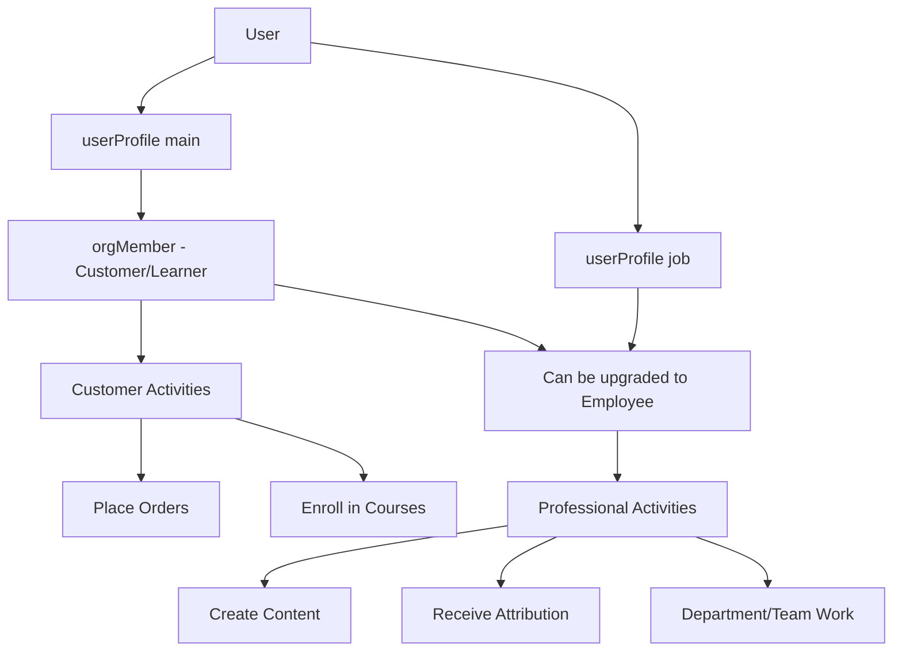
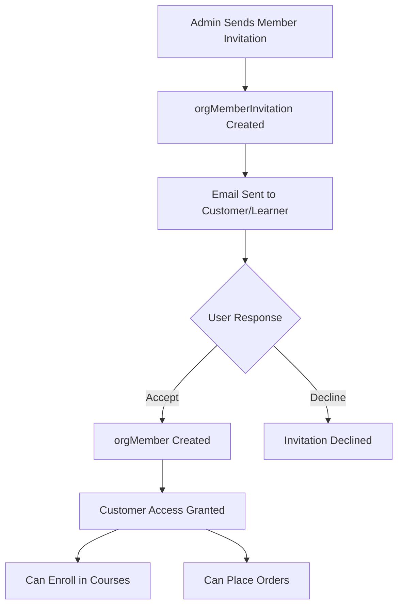
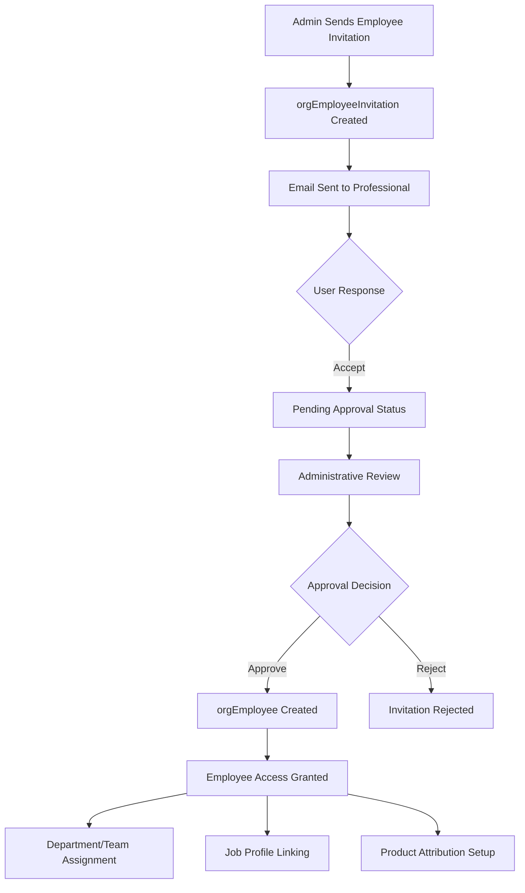
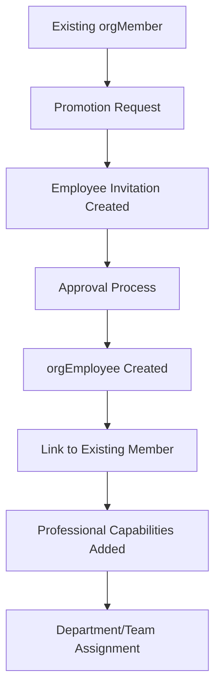

# **🏢 Organization Member & Employee Management System**

This README explains how the organization member and employee management system works and how it should be implemented in the dashboard and system interactions.

## **🎯 System Overview**

The member and employee management system provides a comprehensive organizational structure supporting:
- **Member lifecycle management** (invitation → active → suspended/left) for customers/learners
- **Employee management system** (invitation → approval → hiring → active) for staff/creators
- **Hierarchical departments** with nested structures for employees
- **Flexible team collaboration** across departments for employees
- **Professional attribution** through job profile integration
- **Dual invitation workflows** for customers vs staff onboarding

## **👥 Core Entities & Their Purpose**

### **1. Organization Members (`orgMember`)**
**Purpose**: Customer/learner identity within an organization context

**Key Features**:
- **Multi-tenant user identity**: Same user can be member of multiple organizations
- **Customer role**: Primary focus on learning, purchasing, and community participation
- **Status lifecycle**: `invited` → `active` → `suspended`/`left`/`removed`
- **Display customization**: Custom display name per organization
- **Learning profile integration**: Connected to learning analytics and progress tracking

### **2. Organization Employees (`orgEmployee`)**
**Purpose**: Staff/creator identity with professional responsibilities and attribution

**Key Features**:
- **Professional upgrade**: Optional enhancement from member to employee status
- **Job profile integration**: Links to cross-organizational professional identity
- **Employment lifecycle**: `pending` → `approved` → `active` → `terminated`
- **Revenue attribution**: Product creation and compensation tracking
- **Organizational duties**: Department/team assignments, administrative responsibilities
- **Compensation management**: Salary tracking separate from product attribution

### **3. Member Invitations (`orgMemberInvitation`)**
**Purpose**: Customer/learner onboarding workflow

**Key Features**:
- **Email-based invitations** for customer access
- **Learning-focused**: Course access grants and learning community participation
- **Community integration**: Study groups, learning cohorts, forum access
- **Simple approval**: Direct acceptance without complex approval workflows

### **4. Employee Invitations (`orgEmployeeInvitation`)**
**Purpose**: Staff recruitment and professional onboarding workflow

**Key Features**:
- **Professional recruitment**: Staff roles with job profile context
- **Approval workflow**: Administrative review and approval required
- **Employment details**: Proposed salary, start date, department assignment
- **Role specification**: Professional roles (instructor, admin, manager, creator)
- **Job profile linking**: Optional connection to professional identity

### **5. Departments (`orgDepartment`)**
**Purpose**: Professional organizational structure for employees

**Key Features**:
- **Employee-focused**: Work organization and reporting structure
- **Nested hierarchy**: Parent-child department relationships
- **Department types**: `department`, `division`, `business_unit`, `office`, `region`
- **Professional context**: Linked to job profiles and career development
- **Budget authority**: Financial responsibility and autonomy levels

### **6. Teams (`orgTeam`)**
**Purpose**: Employee collaboration units for project-based work

**Key Features**:
- **Cross-functional teams**: Employees from multiple departments
- **Project-based**: Temporary or permanent collaboration units
- **Team types**: `departmental`, `cross_functional`, `project`, `permanent`
- **Professional collaboration**: Work-focused team structure

### **7. Employee Department Memberships (`orgEmployeeDepartmentMembership`)**
**Purpose**: Employee assignment to departments with professional context

**Key Features**:
- **Professional assignment**: Work-based department structure
- **Job profile context**: Connected to professional identity
- **Career development**: Department-based professional growth

### **8. Employee Team Memberships (`orgEmployeeTeamMembership`)**
**Purpose**: Employee participation in teams with work roles

**Key Features**:
- **Team-scoped roles**: `admin` (team management) vs `member`
- **Professional collaboration**: Work-focused team participation
- **Project assignments**: Temporary or permanent team assignments

## **🔄 Architecture Separation: Members vs Employees**

### **Member Activities (Customer/Learner Focus)**
```javascript
// Customer/Learning Activities
orgMemberOrder                           // Purchase products/courses
orgMemberProductCourseEnrollment        // Learn and take courses
orgMemberLearningProfile                // Learning analytics and progress
orgMemberGiftCardUsage                  // Customer benefits and rewards
orgMemberProductCourseChallengeRating   // Course feedback and ratings
```

### **Employee Activities (Professional/Work Focus)**
```javascript
// Professional/Work Activities
orgEmployeeProductAttribution           // Content creation and professional work
orgEmployeeProductAttributionRevenue    // Creator compensation and revenue sharing
orgEmployeeDepartmentMembership         // Professional organizational structure
orgEmployeeTeamMembership               // Work-based team collaboration
orgEmployeeInvitation                   // Staff recruitment and onboarding
orgTaxRateSnapshot.byEmployeeId         // Administrative and financial operations
orgAccountingTransaction.postedByEmployeeId // Professional accounting duties
```

### **Workflow Separation**


## **🖥️ Dashboard Implementation Guide**

### **📋 Member Management Dashboard**

#### **Member List View**
```javascript
// Dashboard: /org/members
const MemberListView = {
  displayColumns: [
    'displayName',
    'user.email',
    'status',
    'joinedAt',
    'enrollments',       // Active course enrollments
    'isEmployee',        // Indicator if also an employee
    'actions'
  ],
  
  filterOptions: [
    'status',           // active, invited, suspended
    'enrollmentStatus', // Course enrollment status
    'customerType',     // Regular, premium, enterprise
    'isEmployee'        // Show members who are also employees
  ],
  
  quickActions: [
    'inviteMember',
    'suspendMember',
    'promoteToEmployee',  // Upgrade to employee status
    'grantCourseAccess'
  ]
}
```

#### **Member Profile View**
```javascript
// Dashboard: /org/members/:memberId
const MemberProfileView = {
  sections: [
    'basicInfo',        // Name, email, status
    'learningProfile',  // Learning analytics and progress
    'enrollments',      // Course enrollments and progress
    'orders',          // Purchase history
    'employeeStatus',   // If also an employee, link to employee profile
    'activity',        // Recent learning activity
    'auditLog'         // Status changes, enrollment history
  ],
  
  editableFields: [
    'displayName',     // Org-specific display name
    'status',         // Change status (active/suspended)
    'learningPreferences' // Learning customization
  ]
}
```

### **👔 Employee Management Dashboard**

#### **Employee List View**
```javascript
// Dashboard: /org/employees
const EmployeeListView = {
  displayColumns: [
    'professionalDisplayName',
    'jobProfile.title',      // Professional title from job profile
    'role',                  // Employee role (instructor, admin, manager)
    'departments',           // Department assignments
    'teams',                // Team memberships
    'isSalaried',           // Salary vs commission indicator
    'hiredAt',
    'status',
    'actions'
  ],
  
  filterOptions: [
    'role',               // instructor, admin, manager, creator
    'status',             // pending, approved, active, terminated
    'department',         // Filter by department
    'team',              // Filter by team
    'compensationType',   // salaried, commission, mixed
    'jobProfile'         // Filter by job profile type
  ],
  
  quickActions: [
    'inviteEmployee',
    'approveEmployee',
    'assignToDepartment',
    'assignToTeam',
    'manageCompensation',
    'linkJobProfile'
  ]
}
```

#### **Employee Profile View**
```javascript
// Dashboard: /org/employees/:employeeId
const EmployeeProfileView = {
  sections: [
    'basicInfo',           // Name, role, status, hire date
    'jobProfile',          // Linked professional identity
    'memberProfile',       // Link to member profile (if applicable)
    'departments',         // Department assignments
    'teams',              // Team memberships with roles
    'compensation',        // Salary and commission tracking
    'productAttribution',  // Products created/attributed
    'revenueAttribution',  // Revenue earned from attributions
    'professionalActivity', // Work-related activity log
    'auditLog'            // Employment changes, approvals
  ],
  
  editableFields: [
    'professionalDisplayName', // Professional name
    'role',                   // Employee role
    'jobProfileId',           // Link to job profile
    'isSalaried',            // Compensation type
    'salary',                // Salary amount
    'status'                 // Employment status
  ]
}
```

### **🏢 Department Management Dashboard** (Employee-Focused)

#### **Department Hierarchy View**
```javascript
// Dashboard: /org/departments
const DepartmentHierarchyView = {
  displayType: 'tree',
  
  nodeData: [
    'name',
    'departmentType',
    'employeeCount',       // Number of employees (not members)
    'teamCount',
    'budgetAuthority',
    'avgJobProfileLevel'   // Professional level indicator
  ],
  
  actions: [
    'createDepartment',
    'editDepartment',
    'assignEmployees',     // Assign employees to department
    'manageBudget',
    'createTeam'
  ]
}
```

### **👥 Team Management Dashboard** (Employee-Focused)

#### **Team List View**
```javascript
// Dashboard: /org/teams
const TeamListView = {
  displayColumns: [
    'name',
    'type',
    'employeeCount',           // Number of employees (not members)
    'departmentCount',
    'projectStatus',           // If project-based team
    'leadEmployee',            // Team lead
    'createdAt',
    'actions'
  ],
  
  filterOptions: [
    'type',                   // Team type filter
    'department',             // Teams associated with department
    'projectStatus',          // Active, completed, planned
    'jobProfileType'          // Teams by professional skill type
  ]
}
```

## **🔄 Updated User Workflows & Interactions**

### **👤 Member Onboarding Workflow** (Customer/Learner)



### **👔 Employee Recruitment Workflow** (Staff/Creator)



### **🔄 Member to Employee Promotion Workflow**



## **📊 Updated System Interactions & API Patterns**

### **Member Management APIs** (Customer/Learner Focus)

```javascript
// Member CRUD Operations
GET    /api/org/:orgId/members                    // List customers/learners
GET    /api/org/:orgId/members/:memberId          // Get member details
PUT    /api/org/:orgId/members/:memberId          // Update member
DELETE /api/org/:orgId/members/:memberId          // Remove member

// Member Invitation Management (Customer Onboarding)
POST   /api/org/:orgId/member-invitations         // Send customer invitation
GET    /api/org/:orgId/member-invitations         // List member invitations
PUT    /api/org/:orgId/member-invitations/:inviteId/accept // Accept invitation

// Learning Activities
GET    /api/org/:orgId/members/:memberId/enrollments     // Course enrollments
POST   /api/org/:orgId/members/:memberId/enroll          // Enroll in course
GET    /api/org/:orgId/members/:memberId/learning-groups // Learning groups
```

### **Employee Management APIs** (Staff/Creator Focus)

```javascript
// Employee CRUD Operations
GET    /api/org/:orgId/employees                  // List employees
GET    /api/org/:orgId/employees/:employeeId      // Get employee details
PUT    /api/org/:orgId/employees/:employeeId      // Update employee
DELETE /api/org/:orgId/employees/:employeeId      // Terminate employee

// Employee Invitation Management (Staff Recruitment)
POST   /api/org/:orgId/employee-invitations       // Send staff invitation
GET    /api/org/:orgId/employee-invitations       // List employee invitations
PUT    /api/org/:orgId/employee-invitations/:inviteId/approve // Approve invitation
PUT    /api/org/:orgId/employee-invitations/:inviteId/accept  // Accept invitation

// Professional Activities
GET    /api/org/:orgId/employees/:employeeId/attributions     // Product attributions
POST   /api/org/:orgId/employees/:employeeId/attributions     // Create attribution
GET    /api/org/:orgId/employees/:employeeId/revenue          // Revenue tracking
PUT    /api/org/:orgId/employees/:employeeId/job-profile      // Link job profile

// Department/Team Management
GET    /api/org/:orgId/employees/:employeeId/departments      // Department assignments
POST   /api/org/:orgId/employees/:employeeId/departments      // Assign to department
GET    /api/org/:orgId/employees/:employeeId/teams            // Team memberships
POST   /api/org/:orgId/employees/:employeeId/teams            // Add to team
```

### **Department Management APIs** (Employee-Focused)

```javascript
// Department CRUD (Employee Context)
GET    /api/org/:orgId/departments                      // List departments
POST   /api/org/:orgId/departments                      // Create department
PUT    /api/org/:orgId/departments/:deptId               // Update department

// Employee Department Management
GET    /api/org/:orgId/departments/:deptId/employees     // Get department employees
POST   /api/org/:orgId/departments/:deptId/employees     // Assign employee
DELETE /api/org/:orgId/departments/:deptId/employees/:employeeId // Remove assignment

// Professional Context
GET    /api/org/:orgId/departments/:deptId/job-profiles  // Job profiles in department
GET    /api/org/:orgId/departments/:deptId/attributions  // Product attributions by dept
```

### **Team Management APIs** (Employee-Focused)

```javascript
// Team CRUD (Employee Context)
GET    /api/org/:orgId/teams                       // List teams
POST   /api/org/:orgId/teams                       // Create team
PUT    /api/org/:orgId/teams/:teamId                // Update team

// Employee Team Management
GET    /api/org/:orgId/teams/:teamId/employees      // List team employees
POST   /api/org/:orgId/teams/:teamId/employees      // Add employee to team
PUT    /api/org/:orgId/teams/:teamId/employees/:employeeId // Update team role
DELETE /api/org/:orgId/teams/:teamId/employees/:employeeId // Remove from team
```

## **🎨 Updated UI/UX Recommendations**

### **Dual Dashboard Approach**
- **Member Dashboard**: Customer/learner focused with learning analytics, course progress, community features
- **Employee Dashboard**: Professional/work focused with attribution tracking, department structure, team collaboration

### **Visual Separation Indicators**
- **Member Status**: Blue badges for customer/learner activities
- **Employee Status**: Green badges for professional/work activities
- **Dual Role Indicator**: Purple badges for users who are both member AND employee
- **Job Profile Integration**: Professional title and skills displayed for employees

### **Professional Context Integration**
- **Job Profile Links**: Click to view cross-organizational professional identity
- **Attribution Tracking**: Visual indicators of product creation and revenue sharing
- **Department Hierarchy**: Professional org chart with employee positioning
- **Skill Mapping**: Professional skills connected to job profiles

## **🔒 Updated Security & Permissions**

### **Separated Access Control**
- **Member Permissions**: Customer/learner activities (courses, orders)
- **Employee Permissions**: Professional activities (content creation, attribution, administration)
- **Dual Role Management**: Users with both member and employee status get combined permissions
- **Department-Scoped Access**: Employee permissions can be scoped to department level

### **Professional Attribution Security**
- **Revenue Attribution**: Only employees can be attributed to products and receive revenue
- **Job Profile Privacy**: Professional identity managed separately from customer identity
- **Cross-Org Professional Data**: Job profiles maintain privacy across organizations

## **📈 Updated Future Enhancements**

### **Phase 2: Advanced Professional Features**
- **Cross-Organizational Collaboration**: Employees working across multiple organizations
- **Professional Reputation System**: Job profile-based reputation and ratings
- **Skill-Based Assignment**: Automatic team/department assignment based on job profile skills
- **Advanced Compensation Models**: Complex revenue sharing and commission structures

### **Phase 3: Marketplace Integration**
- **Freelance Marketplace**: Job profiles enable freelance work opportunities
- **Professional Services**: Beyond courses to consulting, coaching, and services
- **Creator Partnerships**: Multi-creator product attribution and revenue sharing
- **Professional Development Tracking**: Career progression and skill development

---

This updated member and employee management system provides **clear separation** between customer/learner activities (members) and professional/work activities (employees) while supporting **dual roles** where users can be both. The architecture enables **professional attribution**, **cross-organizational identity**, and **sophisticated employee management** that aligns with your marketplace vision.