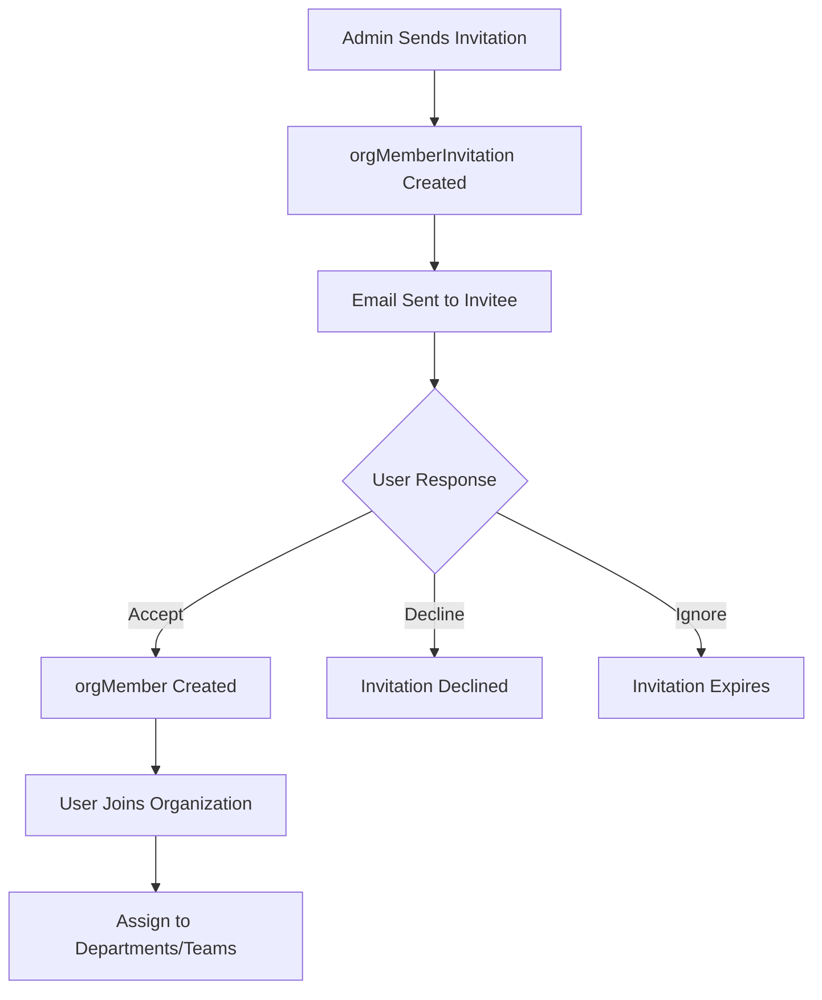
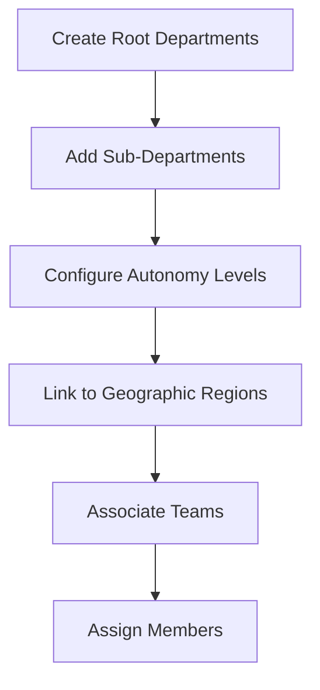
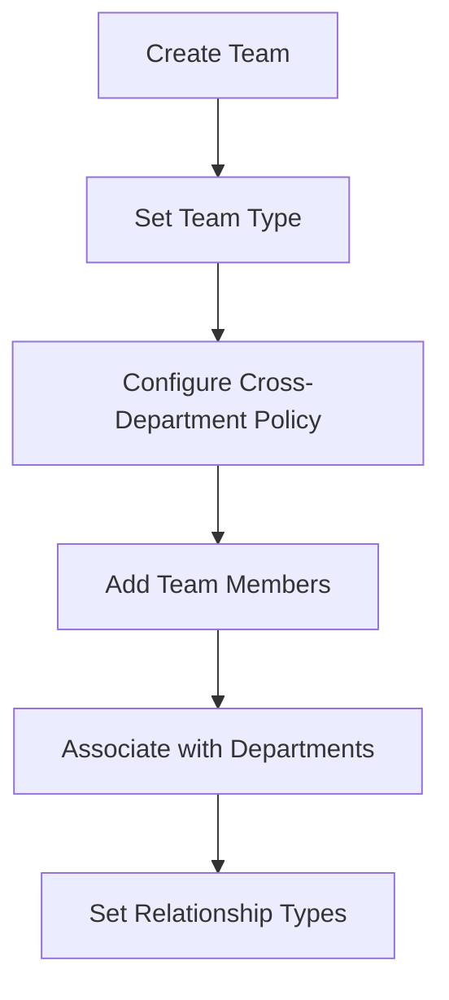

# **🏢 Organization Member Management System**

This README explains how the organization member management system works and how it should be implemented in the dashboard and system interactions.

## **🎯 System Overview**

The member management system provides a comprehensive organizational structure supporting:
- **Member lifecycle management** (invitation → active → suspended/left)
- **Hierarchical departments** with nested structures
- **Flexible team collaboration** across departments
- **Matrix organization support** through team-department relationships

## **👥 Core Entities & Their Purpose**

### **1. Organization Members (`orgMember`)**
**Purpose**: Central identity of users within an organization context

**Key Features**:
- **Multi-tenant user identity**: Same user can be member of multiple organizations
- **Role-based access**: `owner`, `admin`, `member` base roles
- **Status lifecycle**: `invited` → `active` → `suspended`/`left`/`removed`
- **Display customization**: Custom display name per organization

### **2. Member Invitations (`orgMemberInvitation`)**
**Purpose**: Structured invitation and onboarding workflow

**Key Features**:
- **Email-based invitations** with expiration dates
- **Invitation tracking**: Who invited, when, current status
- **Role pre-assignment**: Assign role before acceptance
- **Audit trail**: Complete invitation lifecycle history

### **3. Departments (`orgDepartment`)**
**Purpose**: Traditional hierarchical organizational structure

**Key Features**:
- **Nested hierarchy**: Parent-child department relationships
- **Department types**: `department`, `division`, `business_unit`, `office`, `region`
- **Autonomy levels**: Semi-independent operations and budget authority
- **Geographic context**: Link to regional operations

### **4. Teams (`orgTeam`)**
**Purpose**: Flexible collaboration units for project-based work

**Key Features**:
- **Cross-functional teams**: Members from multiple departments
- **Project-based**: Temporary or permanent collaboration units
- **Team types**: `departmental`, `cross_functional`, `project`, `permanent`
- **Dynamic membership**: Easy join/leave workflow

### **5. Team Memberships (`orgTeamMembership`)**
**Purpose**: Member participation in teams with roles

**Key Features**:
- **Team-scoped roles**: `admin` (team management) vs `member`
- **Membership status**: `pending`, `active`, `suspended`, `left`
- **Flexible assignment**: Members can join multiple teams

### **6. Team-Department Relationships (`orgTeamDepartment`)**
**Purpose**: Matrix organization support

**Key Features**:
- **Relationship types**: `lead`, `collaboration`, `support`
- **Cross-domain bridging**: Teams working with multiple departments
- **Permission inheritance**: Teams inherit department permissions

## **🖥️ Dashboard Implementation Guide**

### **📋 Member Management Dashboard**

#### **Member List View**
```javascript
// Dashboard: /org/members
const MemberListView = {
  displayColumns: [
    'displayName',
    'user.email',
    'role',
    'status',
    'joinedAt',
    'departments', // Show primary department
    'teams',       // Show active teams
    'actions'
  ],
  
  filterOptions: [
    'status',      // active, invited, suspended
    'role',        // owner, admin, member
    'department',  // Filter by department
    'team',        // Filter by team
    'joinDate'     // Date range filter
  ],
  
  quickActions: [
    'inviteMember',
    'suspendMember',
    'changeRole',
    'assignToTeam',
    'assignToDepartment'
  ]
}
```

#### **Member Profile View**
```javascript
// Dashboard: /org/members/:memberId
const MemberProfileView = {
  sections: [
    'basicInfo',        // Name, email, role, status
    'organizationInfo', // Join date, invited by, display name
    'departments',      // Department assignments
    'teams',           // Team memberships with roles
    'permissions',     // (Future: when ABAC is implemented)
    'activity',        // Recent activity log
    'auditLog'         // Status changes, role changes
  ],
  
  editableFields: [
    'displayName',     // Org-specific display name
    'role',           // Change base role (owner/admin/member)
    'status'          // Change status (active/suspended)
  ]
}
```

### **🏢 Department Management Dashboard**

#### **Department Hierarchy View**
```javascript
// Dashboard: /org/departments
const DepartmentHierarchyView = {
  displayType: 'tree', // Tree view with expand/collapse
  
  nodeData: [
    'name',
    'departmentType',
    'memberCount',     // Number of members
    'teamCount',       // Number of associated teams
    'isAutonomous',    // Autonomy indicator
    'budgetAuthority'  // Budget authority indicator
  ],
  
  actions: [
    'createDepartment',
    'editDepartment',
    'deleteDepartment',
    'moveDepartment',    // Change parent
    'assignMembers',     // (Future: when membership implemented)
    'assignTeams'
  ]
}
```

#### **Department Detail View**
```javascript
// Dashboard: /org/departments/:departmentId
const DepartmentDetailView = {
  sections: [
    'basicInfo',       // Name, type, description
    'hierarchy',       // Parent and children departments
    'autonomy',        // Autonomy level and budget authority
    'members',         // (Future: Department members)
    'teams',          // Associated teams with relationship types
    'geography',      // Regional connections
    'metadata'        // Additional configuration
  ],
  
  teamRelationships: {
    'lead': 'Teams led by this department',
    'collaboration': 'Teams collaborating with this department',
    'support': 'Teams supported by this department'
  }
}
```

### **👥 Team Management Dashboard**

#### **Team List View**
```javascript
// Dashboard: /org/teams
const TeamListView = {
  displayColumns: [
    'name',
    'type',                    // cross_functional, project, etc.
    'memberCount',
    'departmentCount',         // Associated departments
    'allowsCrossDepartmentMembers',
    'createdBy',
    'createdAt',
    'actions'
  ],
  
  filterOptions: [
    'type',                    // Team type filter
    'department',              // Teams associated with department
    'crossDepartmental',       // Cross-department teams only
    'createdBy',              // Teams created by specific user
    'membershipStatus'         // Active, project-based, etc.
  ]
}
```

#### **Team Detail View**
```javascript
// Dashboard: /org/teams/:teamId
const TeamDetailView = {
  sections: [
    'basicInfo',       // Name, description, type
    'members',         // Team members with roles and status
    'departments',     // Associated departments with relationship types
    'projects',        // (Future: Project associations)
    'permissions',     // (Future: Team-specific permissions)
    'activity'         // Team activity log
  ],
  
  memberManagement: {
    addMember: 'Invite organization members to team',
    changeRole: 'Change member role (admin/member)',
    changeStatus: 'Manage membership status',
    removeMember: 'Remove from team'
  }
}
```

## **🔄 User Workflows & Interactions**

### **👤 Member Onboarding Workflow**



#### **Implementation Steps**:
1. **Send Invitation**: Admin selects role, enters email, optional message
2. **Track Status**: Dashboard shows invitation status and expiration
3. **User Acceptance**: User receives email, clicks link, joins organization
4. **Post-Onboarding**: Assign to departments and teams as needed

### **🏢 Department Structure Management**



#### **Implementation Steps**:
1. **Create Hierarchy**: Build department tree structure
2. **Set Autonomy**: Configure budget authority and independence levels
3. **Geographic Linking**: Connect departments to regional operations
4. **Team Association**: Link teams to departments with relationship types

### **👥 Team Collaboration Setup**



#### **Implementation Steps**:
1. **Team Creation**: Define name, type, and cross-department policy
2. **Member Addition**: Invite organization members to team
3. **Department Linking**: Associate team with relevant departments
4. **Role Assignment**: Set member roles within team context

## **📊 System Interactions & API Patterns**

### **Member Management APIs**

```javascript
// Member CRUD Operations
GET    /api/org/:orgId/members                    // List members
GET    /api/org/:orgId/members/:memberId          // Get member details
PUT    /api/org/:orgId/members/:memberId          // Update member
DELETE /api/org/:orgId/members/:memberId          // Remove member

// Invitation Management
POST   /api/org/:orgId/invitations                // Send invitation
GET    /api/org/:orgId/invitations                // List invitations
PUT    /api/org/:orgId/invitations/:inviteId      // Update invitation
POST   /api/org/:orgId/invitations/:inviteId/accept // Accept invitation

// Status Management
PUT    /api/org/:orgId/members/:memberId/status   // Change status
PUT    /api/org/:orgId/members/:memberId/role     // Change role
PUT    /api/org/:orgId/members/:memberId/suspend  // Suspend member
```

### **Department Management APIs**

```javascript
// Department CRUD
GET    /api/org/:orgId/departments                // List departments (tree)
POST   /api/org/:orgId/departments                // Create department
PUT    /api/org/:orgId/departments/:deptId        // Update department
DELETE /api/org/:orgId/departments/:deptId        // Delete department

// Hierarchy Management
PUT    /api/org/:orgId/departments/:deptId/parent // Change parent
GET    /api/org/:orgId/departments/:deptId/children // Get children
GET    /api/org/:orgId/departments/tree           // Full hierarchy tree

// Team Associations
GET    /api/org/:orgId/departments/:deptId/teams  // Get associated teams
POST   /api/org/:orgId/departments/:deptId/teams  // Associate team
DELETE /api/org/:orgId/departments/:deptId/teams/:teamId // Remove association
```

### **Team Management APIs**

```javascript
// Team CRUD
GET    /api/org/:orgId/teams                      // List teams
POST   /api/org/:orgId/teams                      // Create team
PUT    /api/org/:orgId/teams/:teamId               // Update team
DELETE /api/org/:orgId/teams/:teamId               // Delete team

// Membership Management
GET    /api/org/:orgId/teams/:teamId/members       // List team members
POST   /api/org/:orgId/teams/:teamId/members       // Add member to team
PUT    /api/org/:orgId/teams/:teamId/members/:memberId // Update membership
DELETE /api/org/:orgId/teams/:teamId/members/:memberId // Remove from team

// Department Relationships
GET    /api/org/:orgId/teams/:teamId/departments   // Get department relationships
POST   /api/org/:orgId/teams/:teamId/departments   // Add department relationship
PUT    /api/org/:orgId/teams/:teamId/departments/:deptId // Update relationship type
```

## **🎨 UI/UX Recommendations**

### **Visual Hierarchy Indicators**
- **Department Tree**: Indented tree view with expand/collapse
- **Member Status**: Color-coded badges (green=active, yellow=invited, red=suspended)
- **Team Types**: Icons for different team types (project, permanent, cross-functional)
- **Autonomy Levels**: Visual indicators for department autonomy and budget authority

### **Interactive Elements**
- **Drag & Drop**: Move departments in hierarchy, assign members to teams
- **Quick Actions**: Context menus for common operations
- **Bulk Operations**: Multi-select for batch operations
- **Search & Filter**: Advanced filtering for large organizations

### **Notification System**
- **Invitation Status**: Real-time updates on invitation responses
- **Membership Changes**: Notify relevant users of team/department changes
- **Expiration Alerts**: Warning before invitations expire
- **Status Changes**: Audit trail of member status changes

## **🔒 Security & Permissions**

### **Access Control Patterns**
- **Organization Isolation**: Members can only see their organization's data
- **Role-Based Access**: Different capabilities based on member role
- **Department Boundaries**: (Future) Department-scoped permissions
- **Team-Scoped Actions**: Team admins can manage their team members

### **Audit Requirements**
- **Member Activity**: Track all member status and role changes
- **Invitation Audit**: Complete invitation lifecycle tracking
- **Department Changes**: Log hierarchy modifications
- **Team Membership**: Track team join/leave events

## **📈 Future Enhancements**

### **Phase 2: Permission System Integration**
- Connect to ABAC policy system in `_under_discussion`
- Department-scoped permissions and inheritance
- Team-specific access controls
- Advanced role templates

### **Phase 3: Advanced Features**
- Department membership implementation
- Automated role assignment based on department/team
- Advanced reporting and analytics
- Integration with learning management system

---

This member management system provides a **solid foundation** for organizational structure while maintaining **flexibility** for different organizational models (traditional hierarchy, matrix, agile teams). The design supports **gradual implementation** with clear upgrade paths for advanced features.
