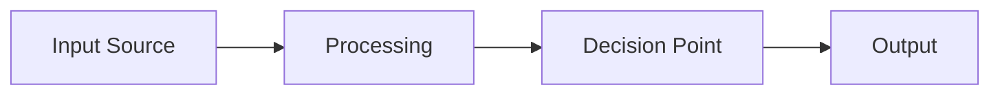

# **📚 Schema Documentation Design Guidelines**

## **🎯 Documentation Philosophy**

### **Core Principles**

- **Architecture Over Implementation**: Focus on design decisions, not code restatement
- **Business Context First**: Explain WHY before WHAT
- **Developer Acceleration**: Minimize time-to-understanding for new team members
- **Cognitive Efficiency**: Avoid redundant explanations of self-evident code

### **ABAC System Focus**

Given our Attribute-Based Access Control implementation, documentation should emphasize:

- **Context-Aware Design**: How attributes work within organizational boundaries
- **Cross-Schema Integration**: How permission attributes flow through the application
- **Security Architecture**: ABAC principles and authorization paths

## **📁 Documentation Structure**

### **Simplified Folder Pattern**

```
📂 schema-folder/
├── README.md              # 🎯 High-level overview and quick start
├── schema.js              # 💾 Database schema with JSDoc
├── relations.js           # 🔗 Relationships with JSDoc
└── docs/                  # 📖 Deep-dive documentation (optional)
    ├── architecture.md     # 🏗 Design decisions and patterns
    ├── integration.md      # 🔗 Cross-system integration points
    └── examples.md         # 💡 Complex usage scenarios
```

## **📝 JSDoc Standards for Schema Files**

### **File-Level Documentation**

```javascript
/**
 * @fileoverview [Schema Name] - [Primary Purpose]
 * 
 * @architecture [Pattern Type] (e.g., ABAC, Registry, Event Sourcing)
 * Brief explanation of the architectural pattern and why it was chosen.
 * 
 * @designPattern [Specific Pattern]
 * How this schema implements the pattern and integrates with the broader system.
 * 
 * @integrationPoints
 * - Key system integration points
 * - Authorization flow participation
 * - Cross-schema dependencies
 * 
 * @businessValue
 * Why this schema exists and what business problems it solves.
 */
```

### **Table-Level Documentation**

```javascript
/**
 * [Table Purpose in Business Terms]
 * 
 * @abacRole [ABAC Context] (for permission-related tables)
 * How this table participates in attribute-based access control.
 * 
 * @businessLogic
 * Key business rules and constraints that drive the design.
 * 
 * @architecturalDecision
 * Why this design was chosen over alternatives.
 * 
 * @integrationContext
 * How this table connects to the broader application workflow.
 */
```

### **Field-Level Documentation** (Only When Not Self-Evident)

```javascript
/**
 * @businessRule [Important constraint or naming convention]
 * @abacContext [How this field participates in access control]
 * @immutable [Why this field shouldn't change after creation]
 * @performanceCritical [High-frequency usage in authorization/queries]
 */
```

## **📋 README.md Template**

```markdown
# **📂 [Schema Name] Schema**

## **🎯 Architecture**
**Pattern**: [ABAC/Registry/Event Sourcing/etc.]
**Purpose**: [1-2 sentence business purpose]

## **🏗 Core Design**
- **[Key Design Decision 1]**: Brief explanation of why
- **[Key Design Decision 2]**: Brief explanation of why

## **🔗 System Integration**
- **Authorization Flow**: How this participates in ABAC decisions
- **Cross-Schema**: Key relationships with other schema domains
- **API Layer**: Primary integration points with application logic

## **📊 Schema Overview**
- **Tables**: X core tables
- **Key Relationships**: Most important relationships
- **Performance Considerations**: Critical indexes or caching needs

## **🚀 Quick Start**
```javascript
// Most common/important usage pattern
const example = await db.query.mainTable.findFirst({
  // Show typical relationship loading
  with: { relatedTable: true }
});
```

## **📖 Deep Dive**

- [🏗 Architecture](./docs/architecture.md) - Design patterns and decisions
- [🔗 Integration](./docs/integration.md) - Cross-system workflows  
- [💡 Examples](./docs/examples.md) - Complex implementation scenarios

```

## **📖 Deep Documentation (docs/ folder)**

### **docs/architecture.md**
```markdown
# **🏗 [Schema] Architecture**

## **🎯 Design Pattern**
### [Pattern Name] Implementation
- **Why chosen**: Business/technical reasoning
- **Trade-offs**: What we gained/sacrificed
- **Alternatives considered**: What we didn't do and why

## **🔄 Data Flow**


## **🚨 Critical Constraints**

- **[Constraint 1]**: Business rule it enforces
- **[Constraint 2]**: Technical limitation it addresses

## **⚡ Performance Architecture**

- **Hot Path**: Critical queries and their optimization
- **Caching Strategy**: What should be cached and why
- **Scaling Considerations**: Future growth implications

```

### **docs/integration.md**
```markdown
# **🔗 [Schema] Integration Points**

## **🌐 Cross-Schema Workflows**
### [Workflow Name]
```javascript
// Show how this schema participates in broader workflows
// Focus on the integration logic, not basic CRUD
```

## **🔐 Authorization Integration** (for ABAC-related schemas)

### Permission Evaluation Flow

```javascript
// How permissions flow through the system
// Subject + Context + Action + Resource → Decision
```

## **📡 API Integration**

### Critical Endpoints

- **[Endpoint]**: How schema data is exposed
- **[Another Endpoint]**: Integration with frontend/services

```

### **docs/examples.md**
```markdown
# **💡 [Schema] Implementation Examples**

## **🎯 Complex Scenarios**
### [Scenario Name]
**Business Context**: Why this scenario is important

```javascript
// Complete, working implementation
// Focus on the business logic and integration points
// Include error handling for critical paths
```

**Key Design Points**:

- Why this approach was chosen
- What edge cases are handled
- Performance considerations

```

## **✅ Documentation Quality Standards**

### **What TO Include**
- **Architectural reasoning**: Why we chose this design
- **Business context**: What problem this solves
- **Integration points**: How it connects to the broader system
- **Performance implications**: Critical path optimizations
- **ABAC context**: How permissions/attributes flow through the system
- **Complex scenarios**: Multi-step workflows and edge cases

### **What NOT to Include**
- **Self-evident code**: Field types, basic constraints, obvious relationships
- **Basic CRUD examples**: Simple insert/select/update patterns
- **Repetitive explanations**: Information available from code inspection
- **Low-level implementation**: Details that belong in code comments

### **JSDoc Focus Areas**
- **File level**: Architecture pattern and system integration
- **Table level**: Business purpose and design decisions
- **Field level**: Only when business rules or performance implications exist
- **Relationship level**: Cross-schema integration and ABAC flows

## **🚀 Implementation Priority**

### **Phase 1: Core Architecture Documentation**
1. **System schema**: ABAC foundation and permission flows
2. **Organization schema**: Multi-tenant architecture and context boundaries
3. **User schema**: Subject definition and authentication integration

### **Phase 2: Domain Documentation**
1. **Product/Course schemas**: Content management architecture
2. **Currency/Market schemas**: Internationalization design
3. **SEO schema**: Translation and optimization patterns

### **Phase 3: Supporting Documentation**
1. **Integration workflows**: Cross-schema business processes
2. **Performance guidelines**: Query optimization and caching
3. **Migration strategies**: Schema evolution patterns

## **📏 Success Metrics**

### **Developer Onboarding**
- **Time to first meaningful contribution**: < 2 days
- **Architecture comprehension**: Understanding ABAC flow within 1 day
- **Integration confidence**: Ability to modify cross-schema workflows

### **Documentation Effectiveness**
- **Self-service capability**: Developers find answers without asking teammates
- **Consistency**: Similar patterns documented similarly across schemas
- **Maintenance burden**: Documentation updates are part of normal development flow

**Focus on accelerating developer understanding of system design and business logic, not restating what the code already expresses clearly.** 🎯
