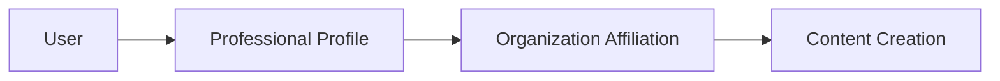

# **📚 Schema Documentation Design Guidelines**

## **🎯 Documentation Philosophy**

### **Core Principles**
- **Architecture Over Implementation**: Focus on design decisions, not code restatement
- **Business Context First**: Explain WHY before WHAT
- **Developer Acceleration**: Minimize time-to-understanding for new team members
- **Cognitive Efficiency**: Avoid redundant explanations of self-evident code

### **Multi-Tenant Creator Platform Focus**
Given our multi-tenant educational content platform with creator economy, documentation should emphasize:
- **Organization-Centric Design**: How all features operate within organizational boundaries
- **Creator Economy Integration**: How brand and professional attribution systems work together
- **Professional Scalability**: How the architecture supports multiple profession types
- **Cross-Schema Integration**: How professional profiles interact across organizational contexts

## **📁 Documentation Structure**

### **Current Folder Pattern**
```
📂 schema-folder/
├── README.md              # 🎯 High-level overview and quick start
├── schema.js              # 💾 Database schema with JSDoc
├── relations.js           # 🔗 Relationships with JSDoc
└── docs/                  # 📖 Deep-dive documentation (optional)
    ├── architecture.md     # 🏗 Design decisions and patterns
    ├── integration.md      # 🔗 Cross-system integration points
    └── examples.md         # 💡 Complex usage scenarios
```

### **Multi-Schema Organization Pattern**
```
📂 user/
├── profile/
│   └── instructor/
│       ├── schema.js      # Professional profile tables
│       └── relations.js   # Professional relationships
└── auth/
    ├── schema.js          # Authentication tables
    └── relations.js       # Auth relationships

📂 organization/
├── schema.js              # Organization + brand + affiliations
└── relations.js           # Cross-organizational relationships

📂 product/
├── schema.js              # Core product system
├── relations.js           # Product relationships
└── by-type/
    └── course/
        └── schema.js      # Course-specific extensions
```

## **📝 JSDoc Standards for Schema Files**

### **File-Level Documentation**
```javascript
/**
 * @fileoverview [Schema Name] - [Primary Purpose]
 * 
 * @architecture [Pattern Type] (e.g., Multi-Tenant, Professional Attribution, Cross-Organization)
 * Brief explanation of the architectural pattern and why it was chosen.
 * 
 * @designPattern [Specific Pattern]
 * How this schema implements the pattern and integrates with the broader system.
 * 
 * @integrationPoints
 * - Key system integration points
 * - Professional attribution workflows
 * - Cross-organizational collaboration patterns
 * 
 * @businessValue
 * Why this schema exists and what business problems it solves.
 * 
 * @scalingDesign
 * How this design supports multiple professions and organizational growth.
 */
```

### **Table-Level Documentation**
```javascript
/**
 * [Table Purpose in Business Terms]
 * 
 * @professionalContext [Professional Role] (for profession-related tables)
 * How this table supports professional identity and cross-organization collaboration.
 * 
 * @businessLogic
 * Key business rules and constraints that drive the design.
 * 
 * @architecturalDecision
 * Why this design was chosen over alternatives.
 * 
 * @integrationContext
 * How this table connects to the broader application workflow.
 * 
 * @scalabilityNote
 * How this design supports adding new professions or scaling existing ones.
 */
```

### **Field-Level Documentation** (Only When Not Self-Evident)
```javascript
/**
 * @businessRule [Important constraint or naming convention]
 * @professionalContext [How this field supports professional identity/workflow]
 * @organizationScope [How this field respects organizational boundaries]
 * @performanceCritical [High-frequency usage in queries]
 * @scalabilityNote [How this field supports adding new professions]
 */
```

## **🔄 Schema File Update Instructions**

### **⚠️ Critical Requirements**
- **NEVER CREATE NEW FILES** - Always update existing schema and relations files in-place
- **PRESERVE EXISTING COMMENTS** - Keep all existing inline comments and code structure
- **JSDoc ENHANCEMENT ONLY** - Add JSDoc documentation without modifying existing code logic
- **MAINTAIN IMPORTS/EXPORTS** - Preserve all existing import statements and export declarations

### **📝 Update Process for Schema Files**

#### **1. Schema File Updates (`schema.js`)**
```javascript
// filepath: [keep exact original path]

// ...existing imports... (PRESERVE ALL)

/**
 * @fileoverview [Schema Name] - [Primary Purpose]
 * 
 * @architecture [Architectural Pattern]
 * [Architecture explanation focusing on multi-tenant and professional attribution]
 * 
 * @designPattern [Design Pattern Details]
 * [Pattern implementation details emphasizing scalability for professions]
 * 
 * @integrationPoints
 * - [Professional attribution workflows]
 * - [Cross-organizational collaboration]
 * - [Organization boundary enforcement]
 * 
 * @businessValue
 * [Business value explanation focusing on creator economy]
 * 
 * @scalingDesign
 * [How this supports multiple professions and organizational growth]
 */

// ...existing enums and constants... (PRESERVE ALL)

/**
 * [Table Business Purpose]
 * 
 * @businessLogic
 * [Key business rules focusing on professional workflows and organizational context]
 * 
 * @architecturalDecision
 * [Why this design was chosen, emphasizing scalability for professions]
 * 
 * @integrationContext
 * [How this connects to broader creator economy and organizational workflows]
 * 
 * @scalabilityNote
 * [How this design pattern can be replicated for new professions]
 */
export const tableName = table(
    "table_name",
    {
        // ...existing fields... (PRESERVE ALL)
        /**
         * @businessRule [Only when field has special business significance]
         * @professionalContext [Only for profession-specific fields]
         * @organizationScope [Only for organization boundary fields]
         * @performanceCritical [Only for high-frequency access fields]
         */
        specialField: fieldDefinition,
        
        // ...rest of existing fields... (PRESERVE ALL)
    },
    (table) => [
        // ...existing indexes and constraints... (PRESERVE ALL)
        /**
         * @businessConstraint [Only for complex business rule constraints]
         * @performanceCritical [Only for critical performance indexes]
         * @scalabilityNote [Only for indexes that support profession scalability]
         */
        uniqueIndex("constraint_name").on(table.field1, table.field2),
    ],
);

// ...all other existing tables and exports... (PRESERVE ALL)
```

#### **2. Relations File Updates (`relations.js`)**
```javascript
// filepath: [keep exact original path]

// ...existing imports... (PRESERVE ALL)

/**
 * @fileoverview [Schema] Relations - [Integration Purpose]
 * 
 * @integrationPattern [Pattern Description]
 * [How relations enable cross-schema integration, focusing on professional attribution]
 * 
 * @businessContext
 * [Business workflows enabled by these relations in creator economy context]
 * 
 * @scalabilityContext
 * [How these relation patterns support multiple professions]
 */

/**
 * [Entity] Relations ([Role in System])
 * 
 * @integrationRole [How this entity integrates with broader system]
 * [Description of entity's role in creator economy and organizational context]
 * 
 * @businessRelationships
 * [Key business relationships focusing on professional collaboration]
 * 
 * @scalabilityPattern
 * [How this relation pattern can be replicated for new professions]
 */
export const entityNameRelations = relations(entityName, ({ one, many }) => ({
    /**
     * @businessContext [Only for complex/important relationships]
     * @professionalWorkflow [Only for profession-related relationships]
     * @organizationBoundary [Only for cross-organizational relationships]
     * @performanceCritical [Only for high-frequency relationships]
     */
    relationshipName: one/many(relatedEntity, {
        // ...existing relationship definition... (PRESERVE ALL)
    }),
    
    // ...all existing relationships... (PRESERVE ALL)
}));

// ...all other existing relations... (PRESERVE ALL)
```

### **🚫 What NOT to Change**
- **Import/Export Statements**: Keep all existing imports and exports
- **Table Definitions**: Don't modify field definitions, types, or constraints
- **Relationship Definitions**: Don't change existing relation configurations
- **Index Definitions**: Don't modify existing indexes or constraints
- **Existing Comments**: Preserve all existing inline comments
- **Code Structure**: Maintain existing code organization and spacing

### **✅ What TO Add**
- **File-level JSDoc**: Add comprehensive @fileoverview with architecture context
- **Table-level JSDoc**: Add business purpose and integration context
- **Field-level JSDoc**: Only for fields with special business rules or performance implications
- **Relationship JSDoc**: Only for complex relationships with business significance
- **Constraint JSDoc**: Only for constraints that implement complex business rules
- **Scalability JSDoc**: How patterns support adding new professions

## **📋 README.md Template**

```markdown
# **📂 [Schema Name] Schema**

## **🎯 Architecture**
**Pattern**: [Multi-Tenant/Professional Attribution/Cross-Organization/etc.]
**Purpose**: [1-2 sentence business purpose in creator economy context]

## **🏗 Core Design**
- **[Key Design Decision 1]**: Brief explanation focusing on professional scalability
- **[Key Design Decision 2]**: Brief explanation focusing on organizational boundaries

## **🔗 System Integration**
- **Professional Attribution**: How this participates in creator economy workflows
- **Cross-Schema**: Key relationships with other professional/organizational domains
- **API Layer**: Primary integration points with application logic

## **📊 Schema Overview**
- **Tables**: X core tables (organization-scoped/profession-agnostic)
- **Key Relationships**: Most important relationships for professional workflows
- **Performance Considerations**: Critical indexes for professional queries

## **🚀 Quick Start**
```javascript
// Most common professional workflow pattern
const example = await db.query.mainTable.findFirst({
  where: eq(mainTable.organizationId, orgId), // Organization boundary
  with: { 
    professionalProfile: true,
    organizationContext: true
  }
});
```

## **🎯 Professional Scalability**
This schema supports:
- **Multiple Professions**: [List current and planned professions]
- **Cross-Organization**: Professional collaboration across organizational boundaries
- **Attribution Models**: Clear content creation and revenue attribution

## **📖 Deep Dive**
- [🏗 Architecture](./docs/architecture.md) - Design patterns and professional scalability
- [🔗 Integration](./docs/integration.md) - Cross-organizational workflows  
- [💡 Examples](./docs/examples.md) - Multi-professional collaboration scenarios
```

## **📖 Deep Documentation (docs/ folder)**

### **docs/architecture.md**
```markdown
# **🏗 [Schema] Architecture**

## **🎯 Design Pattern**
### [Pattern Name] Implementation
- **Why chosen**: Business/technical reasoning for creator economy
- **Trade-offs**: What we gained/sacrificed for professional scalability
- **Alternatives considered**: What we didn't do and why

## **🔄 Professional Workflow**


## **🚨 Critical Constraints**
- **[Constraint 1]**: Business rule for professional attribution
- **[Constraint 2]**: Organizational boundary enforcement

## **⚡ Performance Architecture**
- **Hot Path**: Critical queries for professional workflows
- **Caching Strategy**: What should be cached for professional data
- **Scaling Considerations**: How this handles multiple professions

## **🎯 Profession Scalability**
### Adding New Professions
- **Pattern Replication**: How to add new profession types
- **Integration Points**: What needs to be connected
- **Performance Considerations**: Index and query implications
```

### **docs/integration.md**
```markdown
# **🔗 [Schema] Integration Points**

## **🌐 Cross-Schema Workflows**
### Professional Attribution Workflow
```javascript
// Show how professional attribution flows through the system
// Focus on organization boundaries and professional identity
```

## **🏢 Multi-Tenant Integration**
### Organization Boundary Enforcement
```javascript
// How organizational context is maintained across professional workflows
// Subject + Organization + Professional Role + Resource → Decision
```

## **📡 API Integration**
### Critical Endpoints
- **[Professional Endpoint]**: How professional data is exposed
- **[Attribution Endpoint]**: How content attribution is managed
```

### **docs/examples.md**
```markdown
# **💡 [Schema] Implementation Examples**

## **🎯 Complex Professional Scenarios**
### Cross-Organizational Instructor Collaboration
**Business Context**: Instructor working across multiple organizations

```javascript
// Complete, working implementation showing:
// - Professional identity maintenance
// - Organization boundary respect
// - Revenue attribution across organizations
// Include error handling for critical paths
```

**Key Design Points**:
- How professional identity is preserved across organizations
- How revenue attribution works in multi-organizational context
- What edge cases are handled for professional workflows

### Multi-Professional Content Creation
**Business Context**: Team of different professionals creating content

```javascript
// Show how multiple professions collaborate on single product
// Focus on attribution, revenue sharing, and organizational context
```
```

## **✅ Documentation Quality Standards**

### **What TO Include**
- **Professional workflow reasoning**: Why we chose this professional attribution design
- **Creator economy context**: What business problems this solves for professionals
- **Cross-organizational integration**: How professionals work across organizational boundaries
- **Scalability implications**: How this supports multiple profession types
- **Performance considerations**: Critical path optimizations for professional queries
- **Attribution workflows**: How content creation and revenue attribution works

### **What NOT to Include**
- **Self-evident code**: Field types, basic constraints, obvious relationships
- **Basic CRUD examples**: Simple insert/select/update patterns
- **Repetitive explanations**: Information available from code inspection
- **Low-level implementation**: Details that belong in code comments

### **JSDoc Focus Areas**
- **File level**: Architecture pattern and professional scalability
- **Table level**: Business purpose and professional workflow integration
- **Field level**: Only when business rules or professional attribution exists
- **Relationship level**: Cross-organizational collaboration and professional identity

## **🚀 Implementation Priority**

### **Phase 1: Core Professional Architecture Documentation**
1. **User instructor profile schema**: Professional identity and multi-profile system
2. **Organization schema**: Multi-tenant boundaries and brand attribution
3. **Product attribution schemas**: Professional content creation workflows

### **Phase 2: Creator Economy Documentation**
1. **Revenue attribution**: How professionals earn from content
2. **Cross-organizational collaboration**: Instructor affiliation networks
3. **Brand attribution**: Organization brand identity and content attribution

### **Phase 3: Scalability Documentation**
1. **New profession patterns**: How to add consultants, designers, lawyers, etc.
2. **Performance optimization**: Query patterns for professional workflows
3. **Integration workflows**: API patterns for professional data

## **📏 Success Metrics**

### **Developer Onboarding**
- **Time to first meaningful contribution**: < 2 days
- **Professional workflow comprehension**: Understanding attribution flows within 1 day
- **Integration confidence**: Ability to add new profession types

### **Documentation Effectiveness**
- **Self-service capability**: Developers find answers without asking teammates
- **Consistency**: Similar professional patterns documented similarly
- **Maintenance burden**: Documentation updates are part of normal development flow

## **🎯 Key Reminder**

**JSDoc comments are meant to enhance the onboarding experience by helping developers understand the creator economy architecture, professional attribution systems, and multi-tenant organizational boundaries—not to overwhelm them with unnecessary details.**

**Always update existing files in-place, never create new files. Preserve all existing code structure, comments, and logic while adding JSDoc documentation to enhance architectural understanding.**

**Focus on accelerating developer understanding of professional workflows, creator economy systems, and multi-tenant organizational design, not restating what the code already expresses clearly.** 🎯

## **🌟 Creator Economy Focus Areas**

### **Professional Identity Management**
- How users maintain multiple professional profiles
- Cross-organizational professional identity preservation
- Professional verification and credentialing workflows

### **Content Attribution Systems**
- Brand attribution for organizational content
- Professional attribution for individual creators
- Multi-professional collaboration on content projects

### **Revenue and Recognition Models**
- Professional revenue sharing and attribution
- Cross-organizational revenue tracking
- Professional performance and reputation systems

### **Organizational Boundary Management**
- How professionals operate within organizational contexts
- Cross-organizational collaboration workflows
- Professional affiliation and membership systems

This documentation approach ensures developers understand both the technical architecture and the business context of your sophisticated creator economy platform! 🚀