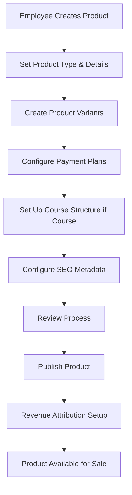
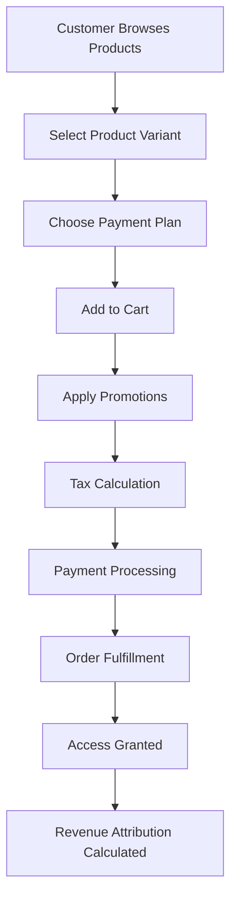
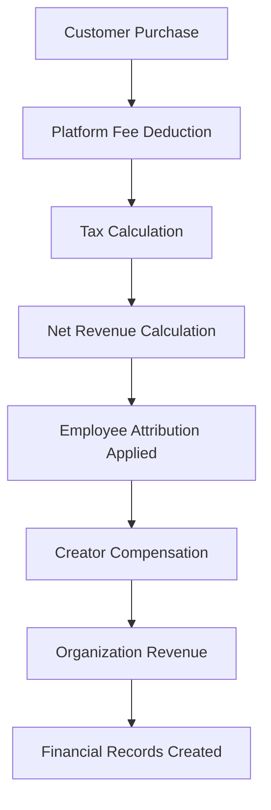

# **📦 Product Catalog & E-commerce Architecture**

## **🎯 Product System Overview**

The Volmify product system is the **heart of the creator economy e-commerce platform**, enabling organizations to create, manage, and monetize diverse content types through a sophisticated product variant and payment plan architecture. This system transforms traditional LMS limitations into a comprehensive creator marketplace with enterprise-grade financial management.

### **Core Business Purpose**
- **Multi-Product Foundation**: Support courses, digital downloads, services, and physical products within unified catalog
- **Creator Attribution**: Revenue flows to employees (creators/staff) based on contribution with post-platform-fee calculations
- **Pricing Flexibility**: Product variants eliminate pricing table redundancy while maintaining sophisticated monetization
- **Payment Sophistication**: Integrated payment plans (one-time, subscription, usage-based) with international commerce support
- **Organization Boundaries**: Complete multi-tenant isolation while enabling cross-organizational professional collaboration

## **🏗️ Architecture Principles**

### **1. Product-Variant-Payment Plan Hierarchy**
```
Product (marketing container)
├── Product Variants (pricing configurations)
│   └── Payment Plans (monetization strategies)
│       ├── One-Time Payment
│       ├── Subscription Billing
│       └── Usage-Based Pricing
```

### **2. Creator Economy Integration**
- **Employee Attribution**: Products linked to creators for revenue sharing
- **Professional Reputation**: Cross-organizational creator recognition via job profiles
- **Brand Attribution**: Organizational brand identity across product catalogs
- **Revenue Distribution**: Post-platform-fee calculations ensure accurate creator compensation

### **3. Content Type Extensibility**
- **Course Products**: Hierarchical learning content (modules → sections → lessons)
- **Digital Downloads**: Downloadable assets and resources
- **Professional Services**: Consulting, coaching, and custom work
- **Physical Products**: Tangible goods requiring shipping and inventory

### **4. International Commerce**
- **Multi-Currency Support**: Pricing in organization's preferred currencies
- **Regional Market Configuration**: Geographic pricing zones and tax compliance
- **SEO Integration**: Comprehensive metadata for content discoverability
- **Localization Ready**: I18n support for global market expansion

## **📊 Core Product Architecture**

### **Product Foundation (`orgProduct`)**
Central product catalog serving as marketing and content foundation:

```javascript
export const orgProduct = table("org_product", {
  id: textCols.idPk(),
  orgId: orgIdFkCol().notNull(),              // Multi-tenant boundary
  seoMetadataId: seoMetadataIdFkCol().notNull(), // Content discoverability
  name: varchar("name", { length: 200 }).notNull(),
  description: text("description"),
  type: orgProductTypeEnum("type").notNull(),  // Course, digital, service, physical
  status: orgProductStatusEnum("status").default("draft"),
  slug: varchar("slug", { length: 100 }).notNull(),
  thumbnailUrl: varchar("thumbnail_url", { length: 500 }),
  // ... audit fields
});
```

**Product Types & Business Context:**
- **`course`**: Educational content with structured learning paths, progress tracking, and certification
- **`digital_download`**: Downloadable assets (ebooks, templates, software) with instant delivery
- **`service`**: Professional services (consulting, coaching) with custom pricing and scheduling
- **`physical`**: Tangible products requiring inventory management and shipping coordination

**Product Statuses & Workflow:**
- **`draft`**: Content creation phase, invisible to customers
- **`review`**: Employee review process for quality assurance
- **`published`**: Live and available for purchase
- **`archived`**: Historical products, no longer available but data preserved

### **Product Variants (`orgProductVariant`)**
Pricing and access configuration layer eliminating pricing table redundancy:

```javascript
export const orgProductVariant = table("org_product_variant", {
  id: textCols.idPk(),
  productId: textCols.idFk("product_id").references(() => orgProduct.id).notNull(),
  name: varchar("name", { length: 100 }).notNull(),
  description: text("description"),
  basePrice: numeric("base_price", { precision: 12, scale: 4 }),
  accessTier: numericCols.accessTier("access_tier"), // Content access level
  isActive: boolean("is_active").default(true),
  sortOrder: integer("sort_order").default(0),
  // ... variant configuration
});
```

**Variant Strategy Benefits:**
- **Pricing Flexibility**: Multiple price points without duplicate product data
- **Access Tiers**: Different content access levels (basic, premium, VIP)
- **Market Segmentation**: Student vs professional pricing within same product
- **Feature Bundling**: Different feature sets for same core product

**Real-World Examples:**
```javascript
// Course Product: "Advanced JavaScript Mastery"
// Variant 1: "Student Edition" - $99, basic access tier
// Variant 2: "Professional Edition" - $299, premium access + 1:1 sessions
// Variant 3: "Enterprise License" - $999, full access + team features
```

## **💳 Payment Plan Architecture**

### **Payment Plan Foundation (`orgProductVariantPaymentPlan`)**
Monetization strategy layer supporting diverse business models:

```javascript
export const orgProductVariantPaymentPlan = table("org_product_variant_payment_plan", {
  id: textCols.idPk(),
  variantId: textCols.idFk("variant_id").references(() => orgProductVariant.id).notNull(),
  type: orgProductVariantPaymentTypeEnum("type").notNull(),
  name: varchar("name", { length: 100 }).notNull(),
  description: text("description"),
  isActive: boolean("is_active").default(true),
  isDefault: boolean("is_default").default(false),
  sortOrder: integer("sort_order").default(0),
  // ... payment plan configuration
});
```

### **One-Time Payment Plans (`orgProductVariantPaymentPlanOneTime`)**
Traditional purchase model with immediate access:

```javascript
export const orgProductVariantPaymentPlanOneTime = table("org_product_variant_payment_plan_one_time", {
  planId: textCols.idFk("plan_id").references(() => orgProductVariantPaymentPlan.id).primaryKey(),
  price: numeric("price", { precision: 12, scale: 4 }).notNull(),
  allowGiftCards: boolean("allow_gift_cards").default(true),
  maxQuantity: integer("max_quantity"), // Inventory control
  // ... one-time configuration
});
```

**Business Applications:**
- **Course Sales**: Complete course access with lifetime availability
- **Digital Products**: Immediate download after payment
- **Professional Services**: Upfront payment for consulting packages
- **Physical Products**: Traditional e-commerce purchase model

### **Subscription Payment Plans (`orgProductVariantPaymentPlanSubscription`)**
Recurring billing model with sophisticated lifecycle management:

```javascript
export const orgProductVariantPaymentPlanSubscription = table("org_product_variant_payment_plan_subscription", {
  planId: textCols.idFk("plan_id").references(() => orgProductVariantPaymentPlan.id).primaryKey(),
  basePrice: numeric("base_price", { precision: 12, scale: 4 }).notNull(),
  interval: orgSubscriptionIntervalEnum("interval").notNull(), // daily, weekly, monthly, yearly
  intervalCount: integer("interval_count").default(1),
  trialPeriodDays: integer("trial_period_days"),
  gracePeriodDays: integer("grace_period_days").default(3),
  maxBillingCycles: integer("max_billing_cycles"), // Limited subscriptions
  // ... subscription configuration
});
```

**Subscription Business Models:**
- **Course Memberships**: Monthly access to course library with new content
- **Professional Services**: Ongoing coaching or consulting relationships
- **Software Access**: SaaS-style access to digital tools and platforms
- **Content Subscriptions**: Regular delivery of new educational materials

**Subscription Intervals & Use Cases:**
- **`daily`**: High-frequency content or intensive coaching programs
- **`weekly`**: Regular coaching sessions or skill-building programs
- **`monthly`**: Standard membership and course access model
- **`yearly`**: Annual commitments with significant discounts

### **Usage-Based Payment Plans (`orgProductVariantPaymentPlanUsageBased`)**
Pay-per-consumption model for variable usage scenarios:

```javascript
export const orgProductVariantPaymentPlanUsageBased = table("org_product_variant_payment_plan_usage_based", {
  planId: textCols.idFk("plan_id").references(() => orgProductVariantPaymentPlan.id).primaryKey(),
  basePrice: numeric("base_price", { precision: 12, scale: 4 }), // Monthly minimum
  usageUnit: varchar("usage_unit", { length: 50 }).notNull(), // hours, API calls, downloads
  pricePerUnit: numeric("price_per_unit", { precision: 12, scale: 4 }).notNull(),
  includedUnits: integer("included_units").default(0),
  billingInterval: orgSubscriptionIntervalEnum("billing_interval").default("monthly"),
  // ... usage-based configuration
});
```

**Usage-Based Applications:**
- **Consulting Services**: Hourly billing with monthly reconciliation
- **API Access**: Pay-per-call pricing for developer tools
- **Content Downloads**: Per-download pricing for large asset libraries
- **Custom Services**: Variable pricing based on actual consumption

**Usage Unit Examples:**
```javascript
// Consulting: "hours" - $150 per hour, 2 hours included monthly
// API Service: "api_calls" - $0.01 per call, 1000 calls included
// Download Library: "downloads" - $5 per download, 0 included
```

## **📚 Course Product Architecture**

### **Course Configuration (`orgProductCourse`)**
Educational content specialization with learning management features:

```javascript
export const orgProductCourse = table("org_product_course", {
  productId: textCols.idFk("product_id").references(() => orgProduct.id).primaryKey(),
  duration: integer("duration"), // Total course minutes
  difficulty: orgCourseDifficultyEnum("difficulty"), // beginner, intermediate, advanced
  prerequisites: jsonb("prerequisites"), // Required skills or previous courses
  certificateTemplateId: textCols.idFk("certificate_template_id"),
  completionCriteria: jsonb("completion_criteria"), // Completion requirements
  // ... course-specific configuration
});
```

### **Course Module Hierarchy**
Hierarchical content organization supporting complex learning paths:

#### **Modules (`orgProductCourseModule`)**
Top-level course organization units:

```javascript
export const orgProductCourseModule = table("org_product_course_module", {
  id: textCols.idPk(),
  courseProductId: textCols.idFk("course_product_id").references(() => orgProductCourse.productId).notNull(),
  title: varchar("title", { length: 200 }).notNull(),
  description: text("description"),
  sortOrder: integer("sort_order").notNull(),
  estimatedDuration: integer("estimated_duration"), // Module minutes
  isOptional: boolean("is_optional").default(false),
  // ... module configuration
});
```

#### **Sections (`orgProductCourseModuleSection`)**
Chapter-level organization within modules:

```javascript
export const orgProductCourseModuleSection = table("org_product_course_module_section", {
  id: textCols.idPk(),
  moduleId: textCols.idFk("module_id").references(() => orgProductCourseModule.id).notNull(),
  title: varchar("title", { length: 200 }).notNull(),
  description: text("description"),
  sortOrder: integer("sort_order").notNull(),
  estimatedDuration: integer("estimated_duration"), // Section minutes
  requiredAccessTier: numericCols.accessTier("required_access_tier"),
  // ... section configuration
});
```

#### **Lessons (`orgProductCourseModuleSectionLesson`)**
Individual learning units with access control:

```javascript
export const orgProductCourseModuleSectionLesson = table("org_product_course_module_section_lesson", {
  id: textCols.idPk(),
  sectionId: textCols.idFk("section_id").references(() => orgProductCourseModuleSection.id).notNull(),
  lessonId: textCols.idFk("lesson_id").references(() => orgLesson.id).notNull(),
  sortOrder: integer("sort_order").notNull(),
  requiredAccessTier: numericCols.accessTier("required_access_tier"),
  prerequisites: jsonb("prerequisites"), // Required previous lessons
  // ... lesson configuration
});
```

**Course Hierarchy Benefits:**
- **Progressive Disclosure**: Students access content based on progress and access tier
- **Flexible Organization**: Instructors organize content in logical learning sequences
- **Access Control**: Premium content gated behind higher access tiers
- **Progress Tracking**: Granular completion tracking at lesson level

**Example Course Structure:**
```
Course: "Full-Stack Web Development Mastery"
├── Module 1: "Frontend Fundamentals" (Basic Access Tier)
│   ├── Section 1.1: "HTML & CSS Foundations"
│   │   ├── Lesson: "HTML Semantics" (Basic)
│   │   └── Lesson: "CSS Grid Mastery" (Basic)
│   └── Section 1.2: "JavaScript Essentials"
│       ├── Lesson: "ES6 Features" (Basic)
│       └── Lesson: "DOM Manipulation" (Basic)
├── Module 2: "Backend Development" (Premium Access Tier)
│   ├── Section 2.1: "Node.js Fundamentals"
│   │   ├── Lesson: "Express.js Setup" (Premium)
│   │   └── Lesson: "Database Integration" (Premium)
│   └── Section 2.2: "API Development"
│       ├── Lesson: "RESTful APIs" (Premium)
│       └── Lesson: "Authentication" (VIP)
└── Module 3: "Deployment & DevOps" (VIP Access Tier)
    └── Section 3.1: "Production Deployment"
        ├── Lesson: "Docker Containerization" (VIP)
        └── Lesson: "CI/CD Pipelines" (VIP)
```

## **🛍️ Product Collections & Organization**

### **Product Collections (`orgProductCollection`)**
Curated product groupings for marketing and discovery:

```javascript
export const orgProductCollection = table("org_product_collection", {
  id: textCols.idPk(),
  orgId: orgIdFkCol().notNull(),
  seoMetadataId: seoMetadataIdFkCol().notNull(),
  name: varchar("name", { length: 200 }).notNull(),
  description: text("description"),
  type: orgProductCollectionTypeEnum("type").notNull(),
  isActive: boolean("is_active").default(true),
  isFeatured: boolean("is_featured").default(false),
  // ... collection configuration
});
```

**Collection Types & Business Purpose:**
- **`category`**: Subject-based grouping (Web Development, Digital Marketing, Design)
- **`bundle`**: Curated product packages with potential discounts
- **`featured`**: Promotional collections for homepage and marketing
- **`pathway`**: Sequential learning journeys across multiple products

### **Collection Membership (`orgProductCollectionMembership`)**
Flexible product-to-collection relationships:

```javascript
export const orgProductCollectionMembership = table("org_product_collection_membership", {
  id: textCols.idPk(),
  collectionId: textCols.idFk("collection_id").references(() => orgProductCollection.id).notNull(),
  productId: textCols.idFk("product_id").references(() => orgProduct.id).notNull(),
  sortOrder: integer("sort_order").default(0),
  isPromoted: boolean("is_promoted").default(false),
  // ... membership configuration
});
```

## **🎯 Product Offers & Promotions**

### **Promotional Campaigns (`orgProductOffer`)**
Marketing campaigns with sophisticated discount strategies:

```javascript
export const orgProductOffer = table("org_product_offer", {
  id: textCols.idPk(),
  orgId: orgIdFkCol().notNull(),
  name: varchar("name", { length: 200 }).notNull(),
  description: text("description"),
  type: orgProductOfferTypeEnum("type").notNull(),
  discountType: orgProductOfferDiscountTypeEnum("discount_type").notNull(),
  discountValue: numeric("discount_value", { precision: 12, scale: 4 }).notNull(),
  validFrom: timestamp("valid_from").notNull(),
  validTo: timestamp("valid_to"),
  maxUses: integer("max_uses"),
  currentUses: integer("current_uses").default(0),
  isActive: boolean("is_active").default(true),
  // ... promotional configuration
});
```

**Offer Types & Applications:**
- **`product_specific`**: Discounts on specific products or variants
- **`collection_wide`**: Discounts across entire product collections
- **`site_wide`**: Organization-wide promotional campaigns
- **`first_purchase`**: New customer acquisition incentives

**Discount Types:**
- **`percentage`**: Percentage-based discounts (20% off)
- **`fixed_amount`**: Fixed dollar discounts ($50 off)
- **`buy_x_get_y`**: Bundle promotions (buy 2 get 1 free)

### **Offer Eligibility (`orgProductOfferEligibility`)**
Fine-grained promotion targeting:

```javascript
export const orgProductOfferEligibility = table("org_product_offer_eligibility", {
  id: textCols.idPk(),
  offerId: textCols.idFk("offer_id").references(() => orgProductOffer.id).notNull(),
  targetType: orgProductOfferTargetTypeEnum("target_type").notNull(),
  targetId: textCols.id("target_id").notNull(),
  // ... eligibility configuration
});
```

**Target Types for Precise Marketing:**
- **`product`**: Specific product discounts
- **`variant`**: Variant-level promotions
- **`collection`**: Collection-wide campaigns
- **`member_tier`**: Member tier-based offers

## **💰 Order Management System**

### **Customer Orders (`orgMemberOrder`)**
Comprehensive order lifecycle management:

```javascript
export const orgMemberOrder = table("org_member_order", {
  id: textCols.idPk(),
  orgId: orgIdFkCol().notNull(),
  memberId: memberIdFkCol().notNull(),
  orderNumber: varchar("order_number", { length: 20 }).unique().notNull(),
  status: orgOrderStatusEnum("status").default("pending"),
  subtotalAmount: numeric("subtotal_amount", { precision: 12, scale: 4 }).notNull(),
  discountAmount: numeric("discount_amount", { precision: 12, scale: 4 }).default("0.00"),
  taxAmount: numeric("tax_amount", { precision: 12, scale: 4 }).default("0.00"),
  totalAmount: numeric("total_amount", { precision: 12, scale: 4 }).notNull(),
  currencyCode: currencyCodeFkCol().notNull(),
  // ... order management
});
```

**Order Status Workflow:**
- **`pending`**: Order created, awaiting payment processing
- **`payment_processing`**: Payment gateway processing
- **`paid`**: Payment successful, preparing fulfillment
- **`fulfilled`**: Order completed, access granted or items shipped
- **`cancelled`**: Order cancelled by customer or system
- **`refunded`**: Order refunded, access revoked

### **Order Items (`orgMemberOrderItem`)**
Individual product purchase details with pricing preservation:

```javascript
export const orgMemberOrderItem = table("org_member_order_item", {
  id: textCols.idPk(),
  orderId: textCols.idFk("order_id").references(() => orgMemberOrder.id).notNull(),
  variantId: textCols.idFk("variant_id").references(() => orgProductVariant.id).notNull(),
  paymentPlanId: textCols.idFk("payment_plan_id").references(() => orgProductVariantPaymentPlan.id).notNull(),
  quantity: integer("quantity").default(1),
  unitPrice: numeric("unit_price", { precision: 12, scale: 4 }).notNull(),
  discountAmount: numeric("discount_amount", { precision: 12, scale: 4 }).default("0.00"),
  lineTotal: numeric("line_total", { precision: 12, scale: 4 }).notNull(),
  // ... item configuration
});
```

**Order Item Benefits:**
- **Price Preservation**: Historical pricing maintained for accounting compliance
- **Promotion Tracking**: Individual discount amounts per item
- **Payment Plan Linkage**: Direct connection to chosen payment strategy
- **Revenue Attribution**: Foundation for creator compensation calculations

## **💼 Creator Economy Integration**

### **Employee Product Attribution**
Revenue sharing system linking creators to their products:

```javascript
export const orgEmployeeProductAttribution = table("org_employee_product_attribution", {
  id: textCols.idPk(),
  orgId: orgIdFkCol().notNull(),
  employeeId: employeeIdFkCol().notNull(),
  productId: textCols.idFk("product_id").references(() => orgProduct.id).notNull(),
  revenueSharePercentage: numeric("revenue_share_percentage", { precision: 5, scale: 2 }).notNull(),
  attributionType: orgAttributionTypeEnum("attribution_type").notNull(),
  effectiveFrom: timestamp("effective_from").defaultNow(),
  effectiveTo: timestamp("effective_to"),
  // ... attribution configuration
});
```

**Attribution Types & Revenue Impact:**
- **`creator`**: Primary content creator (highest revenue share %)
- **`collaborator`**: Contributing team member (moderate revenue share)
- **`manager`**: Project manager or supervisor (management fee %)
- **`reviewer`**: Quality assurance and review (review fee %)

### **Revenue Calculation Flow**
Post-platform-fee revenue distribution ensuring accurate creator compensation:

```javascript
// Revenue Attribution Calculation Example:
Customer Payment: $100
├── Platform Fee (5%): $5
├── Processing Fee (3%): $3  
├── Tax (8%): $8
└── Net Revenue: $84

Creator Attribution (70% of $84): $58.80 → Employee
Organization Retention (30% of $84): $25.20 → Organization
```

### **Professional Job Profile Integration**
Cross-organizational professional reputation:

```javascript
// Employee can link optional job profile for:
// - Cross-organizational professional reputation
// - Portfolio building across multiple organizations
// - Professional development tracking
// - Marketplace-style creator recognition

orgEmployee.jobProfileId → userJobProfile (optional)
// Enables professional identity beyond single organization
```

## **🌍 International Commerce Support**

### **Multi-Currency Architecture**
Currency flexibility for global organizations:

```javascript
// Product pricing supports multiple currencies via:
// 1. Base pricing in product variants
// 2. Currency conversion at order time
// 3. Regional pricing zones (future enhancement)

// Example: Course priced in USD but sold globally
Product Variant Base Price: $99 USD
├── US Customer: $99 USD
├── EU Customer: €89 EUR (converted)
├── UK Customer: £79 GBP (converted)
└── Regional Pricing: Custom pricing per market
```

### **SEO & Content Discovery**
Comprehensive metadata for product discoverability:

```javascript
// Every product includes SEO metadata for:
seoMetadata: {
  title: "Advanced JavaScript Mastery - Learn Modern JS",
  description: "Master advanced JavaScript concepts with hands-on projects",
  keywords: "javascript, programming, web development, coding",
  openGraph: { /* social media sharing */ },
  structuredData: { /* rich snippets */ }
}
```

## **🔄 Key Business Workflows**

### **Product Creation Workflow**


### **Customer Purchase Workflow**


### **Revenue Attribution Workflow**


## **🎯 Integration Points**

### **Cross-Schema Dependencies**
- **Organization Management**: Products scoped to organizations for multi-tenant isolation
- **Member Management**: Orders linked to organization members for customer tracking
- **Employee Management**: Product attribution connects to employees for revenue sharing
- **SEO System**: Product discoverability through comprehensive metadata management
- **Tax System**: Order tax calculation based on regional configuration
- **Locale System**: International commerce and content localization support

### **External System Integration**
- **Payment Gateways**: Stripe, PayPal integration for payment processing
- **Content Delivery**: CDN integration for course videos and digital downloads
- **Email Marketing**: Customer communication for course updates and promotions
- **Analytics**: Product performance tracking and creator revenue analytics
- **Accounting Systems**: Financial data export for accounting compliance

## **📈 Scalability Patterns**

### **Product Type Extensibility**
Architecture supports adding new product types without schema changes:

```javascript
// Current: course, digital_download, service, physical
// Future: membership, coaching, certification, live_event
// Extension: Add new product type enum value and type-specific configuration table
```

### **Payment Plan Flexibility**
New monetization strategies easily added:

```javascript
// Current: one_time, subscription, usage_based
// Future: tiered_pricing, dynamic_pricing, auction_based
// Extension: Add new payment plan type and corresponding configuration table
```

### **Creator Economy Growth**
Support for complex creator partnerships:

```javascript
// Current: Individual creator attribution
// Future: Multi-creator collaborations, creator collectives, revenue pools
// Extension: Enhanced attribution with multiple creators per product
```

### **International Expansion**
Built for global commerce:

```javascript
// Current: Multi-currency support, SEO metadata
// Future: Regional pricing zones, local payment methods, compliance frameworks
// Extension: Enhanced regional configuration and pricing strategies
```

## **🚀 Development Quick Start**

### **Creating a New Product**
```javascript
// 1. Create base product
const product = await createProduct({
  orgId: "org_123",
  name: "Advanced React Masterclass",
  type: "course",
  status: "draft"
});

// 2. Create product variants
const basicVariant = await createProductVariant({
  productId: product.id,
  name: "Basic Access",
  basePrice: 99.00,
  accessTier: 1
});

const premiumVariant = await createProductVariant({
  productId: product.id,
  name: "Premium Access",
  basePrice: 299.00,
  accessTier: 2
});

// 3. Configure payment plans
await createOneTimePaymentPlan({
  variantId: basicVariant.id,
  price: 99.00,
  allowGiftCards: true
});

await createSubscriptionPaymentPlan({
  variantId: premiumVariant.id,
  basePrice: 29.00,
  interval: "monthly",
  trialPeriodDays: 7
});

// 4. Set up course structure (if course type)
const module = await createCourseModule({
  courseProductId: product.id,
  title: "React Fundamentals",
  sortOrder: 1
});

const section = await createCourseSection({
  moduleId: module.id,
  title: "Component Architecture",
  sortOrder: 1
});

// 5. Configure creator attribution
await createEmployeeProductAttribution({
  employeeId: "emp_456",
  productId: product.id,
  revenueSharePercentage: 70.00,
  attributionType: "creator"
});
```

### **Common Query Patterns**
```javascript
// Get product with variants and payment plans
const productDetails = await db
  .select()
  .from(orgProduct)
  .where(eq(orgProduct.id, productId))
  .leftJoin(orgProductVariant, eq(orgProductVariant.productId, orgProduct.id))
  .leftJoin(orgProductVariantPaymentPlan, eq(orgProductVariantPaymentPlan.variantId, orgProductVariant.id));

// Get course structure
const courseStructure = await db
  .select()
  .from(orgProductCourse)
  .where(eq(orgProductCourse.productId, productId))
  .leftJoin(orgProductCourseModule, eq(orgProductCourseModule.courseProductId, orgProductCourse.productId))
  .leftJoin(orgProductCourseModuleSection, eq(orgProductCourseModuleSection.moduleId, orgProductCourseModule.id));

// Get creator attribution
const creators = await db
  .select()
  .from(orgEmployeeProductAttribution)
  .where(eq(orgEmployeeProductAttribution.productId, productId))
  .leftJoin(orgEmployee, eq(orgEmployee.id, orgEmployeeProductAttribution.employeeId));
```

## **🔒 Security & Permissions**

### **Multi-Tenant Security**
- **Organization Isolation**: All product queries filtered by `orgId`
- **Employee Authorization**: Only employees can create/modify products
- **Member Access Control**: Product access based on purchase and access tiers
- **Revenue Protection**: Attribution calculations secured with employee permissions

### **Content Access Control**
- **Access Tiers**: Hierarchical content access based on purchase level
- **Prerequisite Enforcement**: Lesson prerequisites validated before access
- **Subscription Status**: Ongoing access validation for subscription products
- **Geographic Restrictions**: Regional availability control (future enhancement)

## **🎯 Key Architecture Benefits**

### **1. Creator Economy Foundation**
- **Revenue Attribution**: Transparent creator compensation with audit trails
- **Professional Growth**: Cross-organizational reputation building
- **Flexible Monetization**: Multiple revenue streams per creator
- **Brand Integration**: Organization brand identity across product catalogs

### **2. E-commerce Sophistication**
- **Pricing Flexibility**: Variants eliminate pricing table redundancy
- **Payment Diversity**: One-time, subscription, and usage-based models
- **International Ready**: Multi-currency and regional market support
- **Promotional Power**: Sophisticated discount and campaign management

### **3. Content Management Excellence**
- **Type Flexibility**: Courses, downloads, services, and physical products
- **Hierarchical Organization**: Structured learning paths with progress tracking
- **Access Control**: Granular content access based on purchase level
- **SEO Optimization**: Comprehensive metadata for content discoverability

### **4. Business Scalability**
- **Multi-Tenant Architecture**: Complete organizational isolation
- **Creator Collaboration**: Support for complex attribution models
- **Market Expansion**: International commerce and localization ready
- **Platform Growth**: Easy addition of new product types and payment models

This product architecture transforms Volmify from a basic LMS into a **comprehensive creator economy e-commerce platform** with enterprise-grade financial management, sophisticated revenue attribution, and scalable multi-tenant architecture that supports growth from individual creators to large marketplace operations.

The system enables organizations to build diverse digital businesses while providing creators with transparent revenue sharing, professional reputation building, and flexible monetization strategies that scale across the platform's growing ecosystem.
