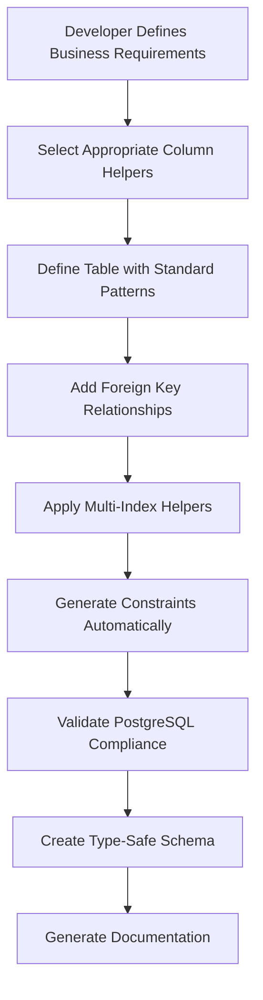
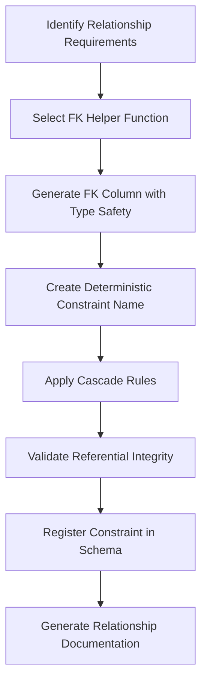
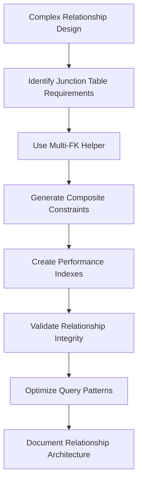
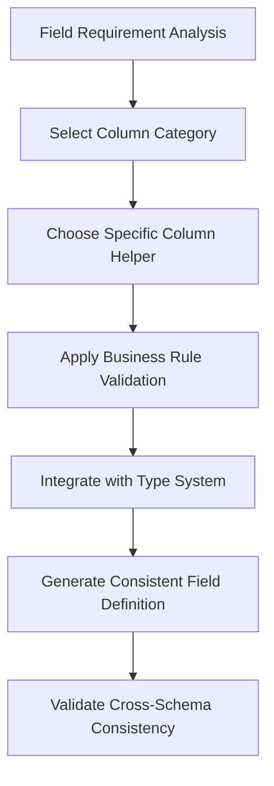

# **🛠️ Schema Utilities & Helper System**

This README explains the comprehensive schema utility architecture that enables consistent database schema construction, automated constraint management, and developer productivity optimization within the Volmify creator economy platform.

## **🎯 System Overview**

The schema utilities system provides **developer-focused schema construction tools** supporting:
- **Automated foreign key management** with consistent constraint naming and relationship validation
- **Column type standardization** ensuring consistent field definitions across all schema domains
- **Constraint naming automation** with PostgreSQL 63-character limit compliance and collision prevention
- **Multi-relationship helpers** simplifying complex constraint and index creation patterns
- **Developer productivity optimization** through reusable schema construction patterns
- **Schema consistency enforcement** preventing data fragmentation and relationship inconsistencies
- **Type safety enhancement** with TypeScript integration and compile-time validation

## **🏗️ Core Architecture Principles**

### **1. Automated Constraint Management**
```
Constraint Automation Strategy:
Developer Writes Simple Schema:
├── Table definition with column helpers
├── Basic foreign key column declarations
├── Index requirements specification
└── Business constraint definitions

System Generates Complex Infrastructure:
├── Deterministic constraint names (PostgreSQL compliant)
├── Foreign key relationships with proper cascade rules
├── Multi-column indexes with performance optimization
├── Unique constraints with collision-free naming
└── Check constraints with business rule enforcement
```

### **2. Column Type Standardization**
```
Column Consistency Framework:
Standardized Column Categories:
├── Text Columns: IDs, slugs, names, descriptions with consistent validation
├── Numeric Columns: Prices, ratings, counts with precision standards
├── Temporal Columns: Audit trails, business dates with timezone handling
├── E-commerce Columns: Product attributes, pricing, inventory management
├── LMS Columns: Educational content, progress tracking, certification
└── Shared Columns: Common patterns across all domains

Developer Benefits:
├── Consistent field behavior across schema domains
├── Automatic validation and constraint application
├── Type safety with TypeScript integration
├── Reduced boilerplate and development time
└── Schema-wide consistency enforcement
```

### **3. Foreign Key Automation**
```
FK Relationship Management:
Manual FK Definition Challenges:
├── Inconsistent constraint naming across developers
├── Missing cascade rules and referential integrity
├── PostgreSQL character limit constraint violations
├── Relationship documentation and maintenance overhead
└── Type safety gaps between schema and application code

Automated FK Solution:
├── Deterministic constraint naming with abbreviation system
├── Automatic cascade rule application based on relationship type
├── PostgreSQL 63-character limit compliance
├── Type-safe column generation with proper references
└── Comprehensive relationship documentation and validation
```

### **4. Multi-Index & Multi-FK Patterns**
```
Complex Relationship Simplification:
Common Schema Patterns:
├── Tables with multiple foreign key relationships
├── Composite indexes for performance optimization
├── Multi-column unique constraints for business rules
├── Cross-table relationship validation and referential integrity
└── Performance-critical query pattern optimization

Helper System Benefits:
├── Simplified definition of complex relationship patterns
├── Consistent index naming and performance characteristics
├── Automated constraint validation and error prevention
├── Developer-friendly API for complex schema construction
└── Maintainable and scalable relationship management
```

## **🔧 Core Utility Categories & Business Purpose**

### **Foreign Key Utilities (`build-fk-utils.js`)**
**Business Purpose**: Automated foreign key relationship management with consistent constraint naming and referential integrity

**Key Capabilities:**
- **Deterministic constraint naming**: Collision-free constraint names within PostgreSQL limits
- **Automatic cascade rule application**: Proper referential integrity based on relationship semantics
- **Type-safe column generation**: TypeScript-integrated foreign key columns with proper references
- **Relationship validation**: Compile-time and runtime validation of foreign key relationships

**FK Utility Functions:**
```javascript
// Automated FK column creation with constraint management
createFKColumn(tableName, referencedTable, options) → {
  // Generates type-safe foreign key column
  // Creates deterministic constraint name
  // Applies appropriate cascade rules
  // Ensures PostgreSQL character limit compliance
}

// Multi-FK helper for complex relationship tables
createMultiFKConstraints(tableConfig) → {
  // Handles multiple foreign key relationships in single table
  // Manages constraint naming conflicts and collisions
  // Applies relationship-specific cascade rules
  // Optimizes constraint creation order for dependency resolution
}
```

**Business Integration Examples:**
- **Creator Attribution**: `orgEmployeeProductAttribution` linking employees to products with revenue tracking
- **Order Management**: `orgMemberOrderItem` connecting orders to product variants with inventory management
- **Professional Identity**: `userJobProfile` linking professional profiles to organizational employment
- **Content Creation**: `orgProduct` attribution to creators with brand and professional identity integration

### **Column Type Libraries (`cols/`)**
**Business Purpose**: Standardized column definitions ensuring consistent data types and validation across all schema domains

#### **Text Columns (`cols/text.js`)**
**Standardized Text Field Management:**
- **ID Management**: Consistent primary key and foreign key field patterns
- **Slug Generation**: URL-friendly identifier fields with uniqueness constraints
- **Name Fields**: Display names, professional names, product names with length validation
- **Description Fields**: Short descriptions, full descriptions, marketing copy with content limits
- **Code Fields**: Business codes, SKUs, category codes with format validation

**Text Column Categories:**
```javascript
// Identity and reference fields
textCols.idPk() → Primary key ID field with UUID format
textCols.idFk(name) → Foreign key ID field with reference validation
textCols.slug() → URL-friendly slug field with uniqueness constraints

// Business content fields
textCols.displayName() → User-facing name fields with length limits
textCols.code() → Business identifier codes with format validation
textCols.description() → Content description fields with length categories
textCols.tagline() → Marketing tagline fields with character optimization
```

#### **Numeric Columns (`cols/numeric.js`)**
**Financial and Measurement Field Standardization:**
- **Currency Fields**: Price fields, revenue amounts, financial calculations with precision standards
- **Rating Systems**: Star ratings, performance scores, quality metrics with validation ranges
- **Count Fields**: Inventory counts, student counts, usage metrics with non-negative constraints
- **Percentage Fields**: Revenue attribution, completion rates, performance percentages

**Numeric Column Categories:**
```javascript
// Financial and currency fields
numericCols.currency.price() → Product pricing with decimal precision
numericCols.currency.revenue() → Revenue attribution with financial accuracy
numericCols.currency.cost() → Cost tracking with expense management

// Rating and performance fields
numericCols.rating() → 1-5 star rating system with validation
numericCols.percentage() → 0-100% fields with range validation
numericCols.count() → Non-negative count fields with integer constraints
```

#### **Temporal Columns (`cols/temporal.js`)**
**Date and Time Management with Business Context:**
- **Audit Trails**: Created/updated timestamps with employee attribution
- **Business Dates**: Effective dates, expiration dates, promotional periods
- **Activity Tracking**: Last accessed, completed dates, engagement timestamps
- **Timezone Management**: UTC storage with local display preferences

**Temporal Column Categories:**
```javascript
// Audit and compliance timestamps
temporalCols.audit.createdAt() → Record creation with timezone handling
temporalCols.audit.lastUpdatedAt() → Modification tracking with employee attribution
temporalCols.audit.deletedAt() → Soft delete timestamps with recovery capability

// Business activity timestamps
temporalCols.business.effectiveDate() → Business rule activation dates
temporalCols.business.expirationDate() → Validity period management
temporalCols.activity.lastAccessed() → User engagement tracking
```

#### **E-commerce Columns (`cols/ecommerce.js`)**
**E-commerce Specific Field Standardization:**
- **Product Management**: SKUs, variant codes, inventory tracking, product categorization
- **Pricing Fields**: Base prices, discounted prices, promotional pricing with currency handling
- **Inventory Management**: Stock levels, reservation tracking, availability status
- **Order Processing**: Order numbers, fulfillment status, shipping tracking

**E-commerce Column Categories:**
```javascript
// Product identification and management
ecommerceCols.sku() → Product SKU with format validation
ecommerceCols.variantCode() → Product variant identification
ecommerceCols.inventory() → Stock level tracking with non-negative constraints

// Pricing and financial fields
ecommerceCols.basePrice() → Product base pricing with currency precision
ecommerceCols.discountAmount() → Discount calculations with validation
ecommerceCols.orderTotal() → Order total calculations with tax integration
```

#### **LMS Columns (`cols/lms.js`)**
**Learning Management System Field Standardization:**
- **Course Management**: Course codes, lesson identifiers, module tracking
- **Progress Tracking**: Completion percentages, quiz scores, certification status
- **Educational Content**: Difficulty levels, duration estimates, prerequisite tracking
- **Student Analytics**: Engagement metrics, performance tracking, learning outcomes

**LMS Column Categories:**
```javascript
// Course and content identification
lmsCols.courseCode() → Course identification with format standards
lmsCols.lessonSequence() → Lesson ordering with progression logic
lmsCols.moduleIdentifier() → Module tracking with completion status

// Progress and performance tracking
lmsCols.completionPercentage() → Learning progress with validation
lmsCols.quizScore() → Assessment scoring with grade calculations
lmsCols.difficultyLevel() → Content difficulty with progression mapping
```

### **Shared Column Utilities (`cols/shared/`)**
**Business Purpose**: Cross-domain column patterns and foreign key standardization

#### **Common Patterns (`cols/shared/index.js`)**
**Platform-Wide Column Standardization:**
- **Status Fields**: Active/inactive status, publication status, availability flags
- **Visibility Controls**: Public/private flags, access level management, content visibility
- **Order Fields**: Sequence numbers, sort orders, priority rankings
- **Flag Fields**: Boolean indicators for business rules and feature toggles

#### **Foreign Key Helpers (`cols/shared/foreign-keys/`)**
**Standardized FK Column Creation:**
- **User References**: User ID, profile ID, employee ID with proper cascade rules
- **Organization References**: Organization ID, member ID with tenant isolation
- **Content References**: Product ID, order ID, content ID with relationship validation
- **General References**: Locale keys, currency codes, metadata IDs with global consistency

**FK Helper Categories:**
```javascript
// User and identity foreign keys
fkCols.userId() → User ID with cascade delete protection
fkCols.employeeId() → Employee ID with organizational boundary enforcement
fkCols.profileId() → Profile ID with multi-profile relationship handling

// Organizational foreign keys
fkCols.orgId() → Organization ID with tenant isolation
fkCols.memberId() → Member ID with customer relationship management
fkCols.orderId() → Order ID with e-commerce relationship validation

// Content and metadata foreign keys
fkCols.productId() → Product ID with catalog relationship management
fkCols.localeKey() → Locale key with internationalization support
fkCols.currencyCode() → Currency code with financial system integration
```

### **Multi-Relationship Helpers (`helpers.js`)**
**Business Purpose**: Simplified creation of complex table relationships and constraint patterns

**Multi-Index Management:**
```javascript
// Simplified multi-index creation for performance optimization
multiIndexHelper(tableName, indexGroups) → {
  // Creates multiple single-column indexes with consistent naming
  // Optimizes index creation order for query performance
  // Generates deterministic index names within PostgreSQL limits
  // Provides index documentation and maintenance guidance
}

// Common index patterns for creator economy and e-commerce
createPerformanceIndexes(table, columns) → {
  // User activity indexes: userId, createdAt, lastAccessed
  // Product discovery indexes: orgId, isActive, categoryId
  // Revenue attribution indexes: employeeId, productId, createdAt
  // Financial reporting indexes: currencyCode, transactionDate, amount
}
```

**Multi-Foreign-Key Management:**
```javascript
// Complex relationship table FK management
multiFKHelper(tableName, relationshipGroups) → {
  // Handles multiple FK relationships with proper cascade rules
  // Manages constraint naming conflicts in complex junction tables
  // Applies relationship-specific referential integrity rules
  // Optimizes FK creation order for dependency resolution
}

// Creator economy relationship patterns
createCreatorAttributionFKs(table) → {
  // Employee → Product attribution with revenue tracking
  // Organization boundary enforcement with tenant isolation
  // Professional identity integration with job profile linking
  // Performance optimization for revenue calculation queries
}
```

### **Custom Field Builders (`custom-fields.js`)**
**Business Purpose**: Domain-specific field patterns and business rule enforcement

**Business Rule Field Patterns:**
```javascript
// Creator economy specific field patterns
creatorEconomyFields.revenueAttribution() → {
  // Revenue percentage fields with 0-100% validation
  // Post-platform-fee calculation integration
  // Employee attribution with audit trail requirements
  // Multi-currency revenue tracking with conversion support
}

// E-commerce specific field patterns
ecommerceFields.productVariant() → {
  // Variant identification with uniqueness across product
  // Inventory tracking with non-negative constraints
  // Pricing integration with multi-currency support
  // Availability status with business rule enforcement
}

// Professional identity field patterns
professionalFields.jobProfile() → {
  // Professional slug generation with uniqueness validation
  // Cross-organizational identity with conflict resolution
  // Skill attribution with platform taxonomy integration
  // Verification status with compliance tracking
}
```

### **Table Utilities (`tables.js`)**
**Business Purpose**: Standardized table creation patterns with consistent structure and constraints

**Table Creation Patterns:**
```javascript
// Standard table creation with audit fields and constraints
createStandardTable(tableName, columns, options) → {
  // Automatic audit field addition (createdAt, lastUpdatedAt, etc.)
  // Consistent constraint naming with PostgreSQL compliance
  // Multi-tenant isolation with organization boundary enforcement
  // Index optimization for common query patterns
}

// Junction table creation for many-to-many relationships
createJunctionTable(table1, table2, additionalColumns) → {
  // Composite primary key with both foreign key references
  // Proper cascade rules for relationship maintenance
  // Index optimization for bidirectional lookups
  // Constraint naming with collision prevention
}

// Polymorphic table creation for flexible relationships
createPolymorphicTable(tableName, discriminatorOptions) → {
  // Type discriminator column with validation constraints
  // Flexible data storage with type-specific validation
  // Index optimization for type-based queries
  // Referential integrity with polymorphic relationship handling
}
```

## **🔄 Key Development Workflows**

### **Schema Creation Workflow**


### **Foreign Key Creation Workflow**


### **Multi-Table Relationship Workflow**


### **Column Standardization Workflow**


## **📊 Integration with Business Domains**

### **Creator Economy Integration**
Schema utilities enable sophisticated creator economy features:

```javascript
// Creator attribution table creation
createCreatorAttributionTable() → {
  // Employee FK with organizational boundary enforcement
  // Product FK with catalog relationship validation
  // Revenue percentage with 0-100% validation and precision
  // Audit trail with employee modification tracking
  // Performance indexes for revenue calculation queries
}

// Professional identity schema patterns
createProfessionalProfileSchema() → {
  // Multi-profile support with type discrimination
  // Cross-organizational identity with conflict resolution
  // Skill attribution with platform taxonomy integration
  // SEO optimization with professional discoverability
}
```

### **E-commerce System Integration**
Utilities support sophisticated e-commerce patterns:

```javascript
// Product variant table creation
createProductVariantSchema() → {
  // Product FK with catalog hierarchy validation
  // Variant identification with product-scope uniqueness
  // Pricing integration with multi-currency support
  // Inventory tracking with non-negative constraints
  // Performance indexes for product discovery queries
}

// Order management schema patterns
createOrderManagementSchema() → {
  // Member FK with customer relationship management
  // Product variant FKs with inventory validation
  // Payment integration with multi-currency processing
  // Fulfillment tracking with status progression validation
}
```

### **Organization Management Integration**
Multi-tenant architecture support through utilities:

```javascript
// Organization boundary enforcement
createOrganizationBoundarySchema() → {
  // Tenant isolation with organization FK requirements
  // Cross-organizational collaboration with professional identity
  // Brand attribution with organizational identity integration
  // Access control with employee/member role separation
}

// Multi-tenant relationship patterns
createMultiTenantRelationships() → {
  // Organization-scoped foreign key relationships
  // Cross-organizational professional identity linking
  // Tenant-isolated data access with security constraints
  // Performance optimization for organization-scoped queries
}
```

### **Financial System Integration**
Financial accuracy and compliance through standardized utilities:

```javascript
// Financial table creation patterns
createFinancialSchema() → {
  // Multi-currency field support with precision standards
  // Audit trail requirements with employee attribution
  // Revenue attribution with post-platform-fee calculations
  // Tax integration with regional compliance requirements
}

// Double-entry accounting support
createAccountingSchema() → {
  // Account type validation with business rule enforcement
  // Transaction integrity with debit/credit balance validation
  // Multi-currency support with conversion tracking
  // Audit compliance with complete transaction history
}
```

## **🛡️ Quality Assurance & Validation**

### **PostgreSQL Compliance**
- **Constraint name limits**: Automatic abbreviation and collision prevention for 63-character limit
- **Index optimization**: Query pattern analysis and index recommendation for performance
- **Referential integrity**: Comprehensive foreign key validation and cascade rule management
- **Type safety**: PostgreSQL type compatibility with TypeScript integration

### **Schema Consistency Enforcement**
- **Column standardization**: Consistent field types and validation across all domains
- **Naming conventions**: Deterministic naming patterns preventing conflicts and confusion
- **Relationship validation**: Foreign key relationship validation and referential integrity
- **Business rule enforcement**: Constraint-based business rule validation and compliance

### **Developer Experience Optimization**
- **Type safety**: Full TypeScript integration with compile-time validation
- **Documentation generation**: Automatic documentation creation for schema relationships
- **Error prevention**: Compile-time detection of common schema definition errors
- **Productivity tools**: Simplified APIs for complex schema construction patterns

## **🚀 Development Patterns**

### **Basic Schema Creation**
```javascript
// Standard table creation with utilities
const createBusinessTable = () => {
  // Select appropriate column helpers based on business requirements
  // Apply foreign key helpers for relationship management
  // Use multi-index helpers for performance optimization
  // Generate constraints automatically with PostgreSQL compliance
  // Validate type safety with TypeScript integration
};

// Column helper selection guide
const selectColumnHelpers = (fieldRequirements) => {
  // Text fields: IDs, names, descriptions → textCols helpers
  // Numeric fields: prices, counts, ratings → numericCols helpers
  // Date fields: audit trails, business dates → temporalCols helpers
  // E-commerce fields: SKUs, inventory, pricing → ecommerceCols helpers
  // LMS fields: courses, progress, assessments → lmsCols helpers
};
```

### **Foreign Key Management**
```javascript
// Automated FK relationship creation
const createFKRelationships = (tableConfig) => {
  // Identify relationship types and cascade requirements
  // Generate FK columns with type safety and constraint naming
  // Apply appropriate cascade rules based on business semantics
  // Validate referential integrity and relationship consistency
  // Optimize FK indexes for query performance
};

// Multi-FK table creation for complex relationships
const createComplexRelationshipTable = (relationshipConfig) => {
  // Use multi-FK helpers for junction tables and attribution
  // Generate composite constraints for business rule enforcement
  // Create performance indexes for bidirectional lookups
  // Validate relationship integrity across organizational boundaries
};
```

### **Performance Optimization**
```javascript
// Index strategy implementation
const optimizeTablePerformance = (tableUsagePatterns) => {
  // Analyze common query patterns for index requirements
  // Create single-column indexes for high-frequency filters
  // Generate composite indexes for complex query optimization
  // Balance index creation with storage and maintenance costs
  // Monitor index usage and optimization opportunities
};

// Query pattern optimization
const optimizeQueryPatterns = (businessWorkflows) => {
  // Identify performance-critical business workflows
  // Create specialized indexes for creator economy queries
  // Optimize e-commerce product discovery and order processing
  // Enhance financial reporting and revenue attribution performance
};
```

## **📈 Scalability & Future Enhancements**

### **Advanced Schema Utilities**
- **Dynamic schema generation**: Runtime schema creation for configurable business rules
- **Schema migration utilities**: Automated migration generation for schema evolution
- **Performance monitoring integration**: Index usage analysis and optimization recommendations
- **Cross-database compatibility**: Schema utility adaptation for multiple database systems

### **Enhanced Developer Experience**
- **Visual schema builder**: Graphical interface for complex schema relationship design
- **Schema validation tools**: Comprehensive validation of schema consistency and best practices
- **Code generation**: Automatic TypeScript type generation and query helper creation
- **Documentation automation**: Enhanced documentation generation with business context integration

### **Business Rule Automation**
- **Constraint generation**: Automated business rule constraint creation from requirements
- **Validation integration**: Runtime validation generation from schema constraints
- **Business logic helpers**: Domain-specific utilities for complex business rule implementation
- **Compliance automation**: Automated compliance validation and audit trail generation

### **Platform Integration**
- **ORM integration**: Enhanced integration with Drizzle ORM and query builders
- **API generation**: Automatic API endpoint generation from schema definitions
- **Testing utilities**: Schema-based test data generation and validation utilities
- **Monitoring integration**: Schema performance monitoring and optimization recommendations

## **🎯 Key Architecture Benefits**

### **1. Developer Productivity Excellence**
- **Simplified schema creation**: Complex relationships and constraints created with simple helper functions
- **Consistent patterns**: Standardized column types and relationship patterns across all domains
- **Type safety**: Full TypeScript integration with compile-time validation and error prevention
- **Reduced boilerplate**: Automated generation of repetitive schema construction code

### **2. PostgreSQL Optimization & Compliance**
- **Constraint naming automation**: Deterministic constraint names within PostgreSQL 63-character limits
- **Index optimization**: Performance-optimized index creation for common query patterns
- **Referential integrity**: Comprehensive foreign key validation and cascade rule management
- **Database best practices**: Automated application of PostgreSQL best practices and optimization

### **3. Schema Consistency & Maintenance**
- **Cross-domain standardization**: Consistent field types and validation across all business domains
- **Relationship validation**: Comprehensive validation of foreign key relationships and referential integrity
- **Business rule enforcement**: Constraint-based validation of business rules and data integrity
- **Evolution support**: Schema evolution support with migration-friendly patterns

### **4. Creator Economy & E-commerce Enablement**
- **Revenue attribution support**: Specialized utilities for creator compensation and revenue tracking
- **Multi-tenant architecture**: Organization boundary enforcement with cross-organizational collaboration
- **Professional identity**: Cross-organizational professional profile support with identity validation
- **International commerce**: Multi-currency and internationalization support with regional compliance

### **5. Quality Assurance & Error Prevention**
- **Compile-time validation**: TypeScript integration preventing common schema definition errors
- **Automated testing**: Schema validation and relationship integrity testing automation
- **Documentation generation**: Automatic documentation creation with business context integration
- **Best practice enforcement**: Automated application of database and schema design best practices

This schema utilities system provides the **essential development infrastructure** for a **sophisticated creator economy platform** with **enterprise-grade schema management**, **developer productivity optimization**, **PostgreSQL compliance**, and **comprehensive relationship validation**.

The architecture enables **rapid schema development**, **consistent data structures**, **performance optimization**, and **maintainable relationship management** while supporting **complex creator economy workflows**, **international e-commerce operations**, and **multi-tenant organizational boundaries**, perfectly supporting the Volmify platform's technical infrastructure requirements.
