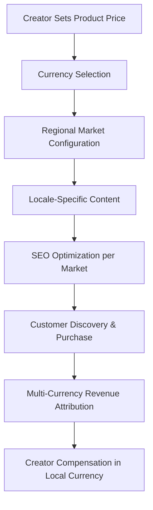
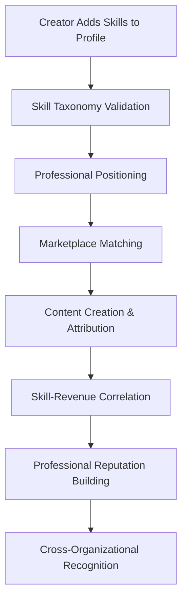
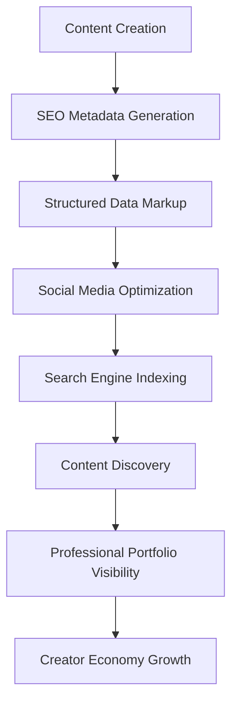
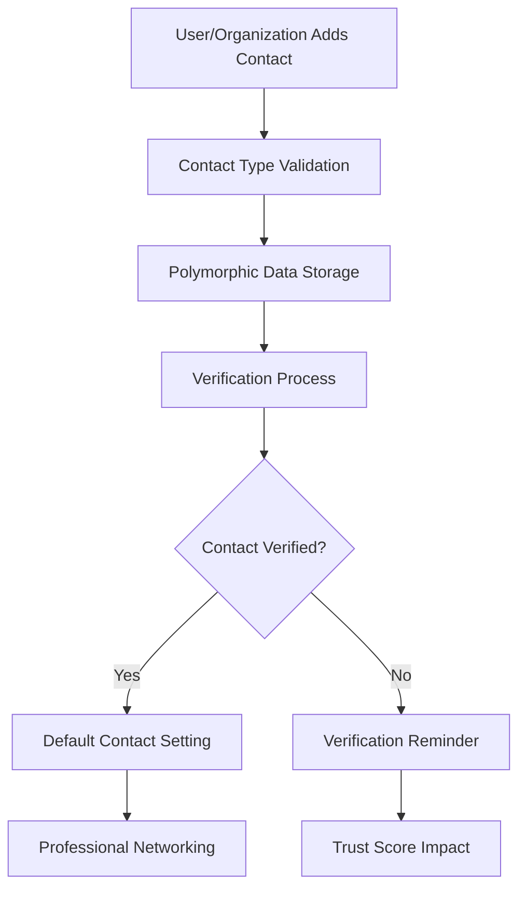

# **🌍 Platform Foundation & Global Infrastructure**

This README explains the comprehensive platform-wide foundation systems that enable international commerce, professional discoverability, skill-based attribution, and flexible contact management across the Volmify creator economy platform.

## **🎯 System Overview**

The general schema domain provides **platform-wide foundational services** supporting:
- **International commerce infrastructure** with multi-currency support and regional market configuration
- **Professional skill taxonomy** for creator positioning, marketplace matching, and revenue attribution
- **Comprehensive SEO system** for content discoverability and professional portfolio optimization
- **Polymorphic contact management** supporting diverse contact types across user profiles and organizations
- **Global localization framework** enabling creators and organizations to serve international markets
- **Platform-wide standardization** ensuring consistent data structures across all organizational boundaries

## **🏗️ Core Architecture Principles**

### **1. Platform-Wide Standardization**
```
Global Foundation Layer:
├── Skill Taxonomy (consistent across all organizations)
├── Currency Framework (international commerce enablement)
├── Locale System (global market support)
├── SEO Infrastructure (universal content discoverability)
└── Contact Framework (flexible communication management)

Organization-Specific Usage:
├── orgLocale → locale (organization language preferences)
├── orgRegion → currency (regional pricing configuration)
├── userJobProfileSkill → skill (professional positioning)
├── orgProduct → seoMetadata (content discoverability)
└── userProfile → contactInfo (professional networking)
```

### **2. International Commerce Enablement**
```
Global Commerce Infrastructure:
Currency Management
├── Multi-currency product pricing
├── Real-time conversion support
├── Regional market configuration
└── Cross-border transaction handling

Locale Framework
├── Content localization support
├── Regional business rules
├── Cultural adaptation capabilities
└── Language-specific SEO optimization
```

### **3. Professional Ecosystem Foundation**
```
Creator Economy Infrastructure:
Skill Taxonomy
├── Consistent skill definitions across organizations
├── Professional positioning and marketplace matching
├── Revenue attribution correlation with skills
└── Cross-organizational professional reputation

SEO & Discoverability
├── Professional portfolio optimization
├── Content search engine visibility
├── Marketplace discovery enhancement
└── Social media integration support
```

### **4. Flexible Communication Architecture**
```
Contact Management Strategy:
Polymorphic Contact Info
├── Email (with verification status)
├── Phone (with regional formatting)
├── Social Media (professional networking)
├── Physical Address (with geocoding)
└── Custom Contact Types (extensible framework)

Profile Integration
├── User profiles (personal and professional)
├── Organization contact management
├── Default contact preferences
└── Verification and trust systems
```

## **🌍 International Commerce Infrastructure**

### **Currency Management (`currency`)**
**Business Purpose**: Multi-currency commerce foundation for global creator economy

```javascript
export const currency = table("currency", {
  code: varchar("code", { length: 3 }).primaryKey(), // ISO 4217 currency codes
  name: varchar("name", { length: 50 }).notNull(),
  symbol: varchar("symbol", { length: 5 }).notNull(),
  decimalPlaces: integer("decimal_places").default(2),
  isActive: boolean("is_active").default(true),
  // ... audit fields
});
```

**Global Commerce Capabilities:**
- **ISO 4217 compliance**: Standard three-letter currency codes (USD, EUR, GBP, JPY)
- **Symbol management**: Proper currency symbol display for user interfaces
- **Decimal precision**: Currency-specific decimal place handling (JPY=0, USD=2, BHD=3)
- **Active status control**: Enable/disable currencies for platform commerce
- **International pricing**: Foundation for global product pricing and revenue attribution

**Integration Points:**
```javascript
// Product pricing in multiple currencies
orgProductVariant.basePrice + orgRegion.currencyCode → Multi-currency pricing
orgMemberOrder.currencyCode → Transaction currency preservation
orgGiftCard.currencyCode → Multi-currency gift card system
orgEmployeeProductAttributionRevenue → Creator compensation in local currency
```

### **Locale Framework (`locale`)**
**Business Purpose**: Comprehensive localization support for global market expansion

```javascript
export const locale = table("locale", {
  key: varchar("key", { length: 10 }).primaryKey(), // Language-Country format (en-US, fr-FR)
  name: varchar("name", { length: 100 }).notNull(),
  nativeName: varchar("native_name", { length: 100 }).notNull(),
  languageCode: varchar("language_code", { length: 2 }).notNull(), // ISO 639-1
  countryCode: varchar("country_code", { length: 2 }), // ISO 3166-1 alpha-2
  isActive: boolean("is_active").default(true),
  // ... audit fields
});
```

**Localization Features:**
- **Language-Country specificity**: Supports regional language variations (en-US vs en-GB)
- **Native name display**: Proper language names in their native scripts
- **ISO standard compliance**: Standard language and country codes
- **Cultural adaptation**: Foundation for culturally-adapted content and business rules
- **Creator market expansion**: Enables creators to serve multiple language markets

**Global Market Integration:**
```javascript
// Multi-language professional content
userProfileI18n.localeKey → locale → Localized professional profiles
orgLocale.localeKey → locale → Organization language preferences
userLocale.localeKey → locale → User language proficiency tracking
seoMetadata per locale → Global SEO optimization
```

## **🎯 Professional Skill Ecosystem**

### **Platform Skill Taxonomy (`skill`)**
**Business Purpose**: Standardized skill framework for professional positioning and revenue attribution

```javascript
export const skill = table("skill", {
  id: textCols.idPk(),
  slug: textCols.slug().notNull().unique(),
  name: varchar("name", { length: 100 }).notNull(),
  description: text("description"),
  category: skillCategoryEnum("category").notNull(),
  level: skillLevelEnum("level").default("intermediate"),
  isActive: boolean("is_active").default(true),
  // ... audit fields
});
```

**Skill Categorization System:**
- **Technical Skills**: Programming languages, frameworks, tools, methodologies
- **Creative Skills**: Design, content creation, multimedia production, artistic abilities
- **Business Skills**: Marketing, sales, project management, entrepreneurship
- **Communication Skills**: Language proficiency, presentation, writing, interpersonal
- **Industry Skills**: Domain-specific knowledge, compliance, specialized expertise

**Skill Levels:**
- **`beginner`**: Foundational knowledge and basic competency
- **`intermediate`**: Practical experience and solid understanding
- **`advanced`**: Expert-level proficiency and leadership capability
- **`expert`**: Industry-recognized expertise and thought leadership

### **Professional Skill Attribution**
Platform-wide skill system enables sophisticated professional features:

```javascript
// Creator skill-based positioning
userJobProfile + userJobProfileSkill → Professional skill portfolio
skill.category + skill.level → Marketplace positioning and matching
orgEmployeeProductAttribution + skills → Revenue correlation with expertise

// Skill-based marketplace features
findCreatorsBySkills(skillIds, level, category) → Creator discovery
calculateSkillBasedPricing(skills, experience) → Market rate recommendations  
trackSkillPerformance(skillId, revenueGenerated) → Skill value analytics
```

**Cross-Organizational Benefits:**
- **Consistent skill definitions**: Same skill means same thing across all organizations
- **Professional reputation**: Skills validated across multiple organizational contexts
- **Marketplace matching**: Algorithm-driven creator-opportunity matching
- **Revenue optimization**: Skill-based pricing and attribution recommendations

## **🔍 SEO & Content Discoverability System**

### **SEO Metadata Foundation (`seoMetadata`)**
**Business Purpose**: Comprehensive SEO framework for content discoverability and professional portfolio optimization

```javascript
export const seoMetadata = table("seo_metadata", {
  id: textCols.idPk(),
  title: varchar("title", { length: 60 }), // Google title limit
  description: varchar("description", { length: 160 }), // Meta description limit
  keywords: varchar("keywords", { length: 255 }),
  canonicalUrl: varchar("canonical_url", { length: 255 }),
  robotsDirective: varchar("robots_directive", { length: 50 }).default("index,follow"),
  // ... audit fields
});
```

### **Social Media Optimization (`seoMetadataOpenGraph`)**
**Business Purpose**: Social media sharing optimization for viral content marketing

```javascript
export const seoMetadataOpenGraph = table("seo_metadata_open_graph", {
  seoMetadataId: textCols.idFk("seo_metadata_id").references(() => seoMetadata.id).primaryKey(),
  title: varchar("title", { length: 95 }), // Facebook title limit
  description: varchar("description", { length: 300 }), // Facebook description limit
  imageUrl: varchar("image_url", { length: 255 }),
  imageAlt: varchar("image_alt", { length: 125 }),
  type: varchar("type", { length: 20 }).default("website"),
  // ... social optimization
});
```

### **Twitter Card Integration (`seoMetadataTwitterCard`)**
**Business Purpose**: Twitter-specific optimization for professional content sharing

```javascript
export const seoMetadataTwitterCard = table("seo_metadata_twitter_card", {
  seoMetadataId: textCols.idFk("seo_metadata_id").references(() => seoMetadata.id).primaryKey(),
  card: varchar("card", { length: 20 }).default("summary_large_image"),
  title: varchar("title", { length: 70 }), // Twitter title limit
  description: varchar("description", { length: 200 }), // Twitter description limit
  imageUrl: varchar("image_url", { length: 255 }),
  creatorHandle: varchar("creator_handle", { length: 16 }),
  // ... Twitter optimization
});
```

### **Structured Data Support (`seoMetadataStructuredData`)**
**Business Purpose**: Rich snippets and search engine structured data for enhanced discoverability

```javascript
export const seoMetadataStructuredData = table("seo_metadata_structured_data", {
  id: textCols.idPk(),
  seoMetadataId: textCols.idFk("seo_metadata_id").references(() => seoMetadata.id).notNull(),
  type: structuredDataTypeEnum("type").notNull(),
  jsonData: jsonb("json_data").notNull(),
  // ... structured data configuration
});
```

**Structured Data Types:**
- **`course`**: Educational content schema markup for course discoverability
- **`person`**: Professional profile schema for creator recognition
- **`organization`**: Business entity schema for organizational presence
- **`product`**: E-commerce product schema for marketplace optimization
- **`review`**: Review and rating schema for social proof

### **SEO Integration Across Platform**
Comprehensive SEO coverage for all discoverable content:

```javascript
// Content SEO optimization
orgProduct.seoMetadataId → Product discoverability and marketplace presence
userProfileI18n.seoMetadataId → Professional portfolio SEO optimization
orgProductCollection.seoMetadataId → Category and collection discovery

// Professional SEO strategy
Professional profiles → Person schema → Google Knowledge Panel eligibility
Course content → Course schema → Google Course rich snippets
Organization pages → Organization schema → Business entity recognition
```

## **📞 Contact Management Framework**

### **Polymorphic Contact Information (`contactInfo`)**
**Business Purpose**: Flexible contact management supporting diverse communication needs

```javascript
export const contactInfo = table("contact_info", {
  id: textCols.idPk(),
  type: contactInfoTypeEnum("type").notNull(),
  data: jsonb("data").notNull(), // Polymorphic contact data
  isVerified: boolean("is_verified").default(false),
  verifiedAt: timestamp("verified_at"),
  metadata: jsonb("metadata"), // Additional contact-specific data
  // ... audit fields
});
```

**Contact Types & Data Structures:**
- **`email`**: Email addresses with verification status and communication preferences
- **`phone`**: Phone numbers with country codes, regional formatting, and SMS capabilities
- **`social_media`**: Social media profiles (LinkedIn, Twitter, GitHub) for professional networking
- **`address`**: Physical addresses with geocoding and regional delivery information
- **`website`**: Professional websites and portfolio URLs
- **`messaging`**: Modern messaging platforms (Discord, Slack, WhatsApp)

### **Contact Data Polymorphism Examples**
```javascript
// Email contact structure
{
  type: "email",
  data: {
    address: "creator@example.com",
    isPrimary: true,
    communicationPreferences: ["marketing", "product_updates", "security"]
  },
  isVerified: true
}

// Phone contact structure  
{
  type: "phone",
  data: {
    number: "+1-555-123-4567",
    countryCode: "US",
    type: "mobile",
    smsEnabled: true,
    preferredTimeZone: "America/New_York"
  }
}

// Social media contact structure
{
  type: "social_media",
  data: {
    platform: "linkedin",
    handle: "professional-creator",
    url: "https://linkedin.com/in/professional-creator",
    isPublic: true,
    isProfessional: true
  }
}
```

### **Contact Integration Patterns**
Contact information integrates across user profiles and organizations:

```javascript
// User profile contact management
userProfile → userProfileContactInfo → contactInfo (flexible contact association)
Default contact preferences per profile type (main vs job profiles)
Contact verification workflows for trust and security

// Organization contact management  
org → orgContactInfo → contactInfo (business contact information)
Support contact, billing contact, professional networking contacts
Regional office contact information and customer service
```

## **🔄 Key Integration Workflows**

### **International Commerce Workflow**


### **Professional Skill Attribution Workflow**


### **SEO & Discoverability Workflow**


### **Contact Management Workflow**


## **🌐 Cross-Schema Integration Points**

### **User Domain Integration**
- **User Localization**: User language preferences and proficiency tracking
- **Professional Skills**: Creator skill portfolios and marketplace positioning  
- **Profile SEO**: Professional portfolio discoverability optimization
- **Contact Management**: User profile contact information and verification

### **Organization Domain Integration**
- **Regional Configuration**: Organization locale and currency preferences
- **Professional Networking**: Organization contact information and business communication
- **Brand SEO**: Organizational content discoverability and search presence
- **International Markets**: Multi-locale organization operations and customer service

### **Product Domain Integration**
- **Multi-Currency Pricing**: Product pricing in different currencies and markets
- **SEO Optimization**: Product and course content discoverability
- **Skill-Based Attribution**: Creator skills correlated with product revenue
- **International Commerce**: Global product delivery and customer support

### **Financial System Integration**
- **Currency Conversion**: Real-time currency conversion for international transactions
- **Revenue Attribution**: Multi-currency creator compensation calculations
- **Tax Compliance**: International tax handling with currency conversion
- **Financial Reporting**: Multi-currency financial analytics and reporting

## **🛡️ Security & Data Integrity**

### **Global Data Standards**
- **ISO Compliance**: Currency codes (ISO 4217) and locale codes (ISO 639-1, ISO 3166-1)
- **Contact Verification**: Systematic verification of contact information for trust
- **SEO Best Practices**: Search engine guideline compliance and structured data validation
- **Data Consistency**: Platform-wide standardization preventing data fragmentation

### **Privacy & Trust Management**
- **Contact Privacy**: User control over contact information visibility and sharing
- **Professional Verification**: Skill and contact verification for professional credibility
- **Cross-Border Compliance**: International data protection regulation compliance
- **Verification Audit Trails**: Complete verification history for trust and security

## **🚀 Development Patterns**

### **Currency & Locale Operations**
```javascript
// Multi-currency price conversion
const convertPrice = (amount, fromCurrency, toCurrency, conversionRates) => {
  if (fromCurrency === toCurrency) return amount;
  return amount * conversionRates[`${fromCurrency}_${toCurrency}`];
};

// Locale-aware content formatting  
const formatCurrency = (amount, currencyCode, localeKey) => {
  return new Intl.NumberFormat(localeKey, {
    style: 'currency',
    currency: currencyCode
  }).format(amount);
};

// Regional market configuration
const getMarketConfig = async (orgId, regionCode) => {
  return await db.select()
    .from(orgRegion)
    .innerJoin(currency, eq(currency.code, orgRegion.currencyCode))
    .innerJoin(locale, eq(locale.countryCode, orgRegion.countryCode))
    .where(and(eq(orgRegion.orgId, orgId), eq(orgRegion.countryCode, regionCode)));
};
```

### **Skill Management Operations**
```javascript
// Professional skill portfolio management
const addProfessionalSkill = async (jobProfileId, skillSlug, proficiencyLevel) => {
  const skill = await db.select().from(skill)
    .where(and(eq(skill.slug, skillSlug), eq(skill.isActive, true)));
    
  return await db.insert(userJobProfileSkill).values({
    jobProfileId,
    skillId: skill.id,
    proficiencyLevel,
    createdAt: new Date()
  });
};

// Skill-based marketplace matching
const findCreatorsBySkills = async (requiredSkills, minLevel = 'intermediate') => {
  return await db.select({
    creator: userJobProfile,
    skills: arrayAgg(skill.name),
    avgLevel: avg(skillLevelToNumber(userJobProfileSkill.proficiencyLevel))
  })
  .from(userJobProfile)
  .innerJoin(userJobProfileSkill, eq(userJobProfileSkill.jobProfileId, userJobProfile.userProfileId))
  .innerJoin(skill, eq(skill.id, userJobProfileSkill.skillId))
  .where(and(
    inArray(skill.slug, requiredSkills),
    gte(userJobProfileSkill.proficiencyLevel, minLevel)
  ))
  .groupBy(userJobProfile.userProfileId)
  .having(gte(count(skill.id), requiredSkills.length));
};
```

### **SEO & Contact Management**
```javascript
// Comprehensive SEO metadata creation
const createSEOMetadata = async (title, description, keywords, additionalData = {}) => {
  const seoData = await db.insert(seoMetadata).values({
    title: title.substring(0, 60),
    description: description.substring(0, 160),
    keywords,
    robotsDirective: "index,follow"
  }).returning();
  
  // Add Open Graph data
  if (additionalData.openGraph) {
    await db.insert(seoMetadataOpenGraph).values({
      seoMetadataId: seoData.id,
      ...additionalData.openGraph
    });
  }
  
  // Add structured data
  if (additionalData.structuredData) {
    await db.insert(seoMetadataStructuredData).values({
      seoMetadataId: seoData.id,
      type: additionalData.structuredData.type,
      jsonData: additionalData.structuredData.data
    });
  }
  
  return seoData;
};

// Polymorphic contact management
const addContact = async (entityType, entityId, contactType, contactData) => {
  const contact = await db.insert(contactInfo).values({
    type: contactType,
    data: contactData,
    isVerified: false
  }).returning();
  
  // Link to appropriate entity (user, organization, etc.)
  await linkContactToEntity(entityType, entityId, contact.id);
  
  // Trigger verification workflow
  await initiateContactVerification(contact.id, contactType);
  
  return contact;
};
```

## **📈 Scalability & Future Enhancements**

### **International Market Expansion**
- **Regional Payment Methods**: Integration with local payment providers and banking systems
- **Cultural Localization**: Advanced cultural adaptation beyond language translation
- **Regulatory Compliance**: Automated compliance with regional business and content regulations
- **Local Partnership Integration**: Framework for regional business partnerships and affiliations

### **Advanced Professional Ecosystem**
- **AI-Powered Skill Matching**: Machine learning algorithms for creator-opportunity matching
- **Dynamic Skill Pricing**: Market-driven skill value calculation and pricing recommendations
- **Professional Certification**: Integration with external certification and credentialing systems
- **Skill Development Pathways**: Personalized professional development recommendations

### **Enhanced Discoverability**
- **AI SEO Optimization**: Automated SEO optimization based on content analysis and market trends
- **Voice Search Optimization**: Content optimization for voice search and smart assistants
- **Video SEO Integration**: Comprehensive video content SEO and structured data markup
- **Professional Portfolio Analytics**: Advanced analytics for professional content performance

### **Communication Evolution**
- **Real-Time Communication**: Integration with modern messaging and video communication platforms
- **AI-Powered Contact Verification**: Automated contact verification using AI and external data sources
- **Professional Networking Features**: LinkedIn-style professional networking and connection features
- **Multi-Channel Communication**: Unified communication across email, SMS, social media, and messaging platforms

## **🎯 Key Architecture Benefits**

### **1. Global Commerce Foundation**
- **Multi-Currency Commerce**: Seamless international transactions with proper currency handling
- **Cultural Adaptation**: Locale-aware content and business rule adaptation
- **Regional Market Support**: Flexible regional configuration for global market expansion
- **International SEO**: Multi-language and multi-market content discoverability

### **2. Professional Ecosystem Excellence**
- **Standardized Skills**: Consistent skill definitions enabling cross-organizational reputation
- **Creator Positioning**: Skill-based marketplace positioning and opportunity matching
- **Professional Discoverability**: SEO-optimized professional portfolios and content
- **Cross-Organizational Continuity**: Professional identity that spans organizational boundaries

### **3. Flexible Communication Architecture**
- **Polymorphic Contact Management**: Support for diverse contact types with extensible framework
- **Verification Systems**: Trust and credibility through systematic contact verification
- **Professional Networking**: Contact sharing and professional relationship management
- **Communication Preferences**: User control over contact methods and communication preferences

### **4. Platform Standardization**
- **Consistent Data Structures**: Platform-wide standardization preventing data fragmentation
- **ISO Compliance**: International standards compliance for currency, language, and regional codes
- **Extensible Framework**: Easy addition of new contact types, currencies, locales, and skills
- **Performance Optimization**: Efficient query patterns for global data access and filtering

This general schema foundation provides the **essential infrastructure** for a **sophisticated international creator economy platform** with **comprehensive SEO capabilities**, **flexible contact management**, **standardized professional skills**, and **multi-currency commerce support**.

The architecture enables **global market expansion**, **professional reputation building**, **content discoverability optimization**, and **flexible communication management** while maintaining **platform-wide consistency** and **extensible frameworks** that support the growing Volmify creator economy ecosystem.